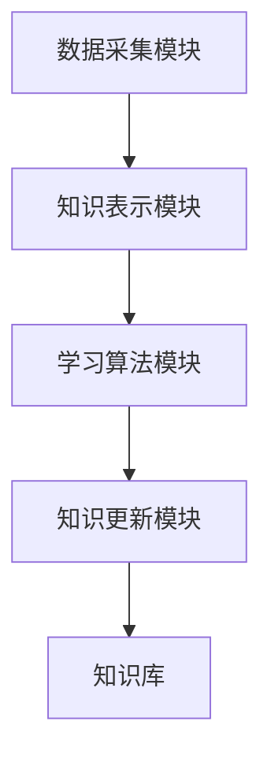
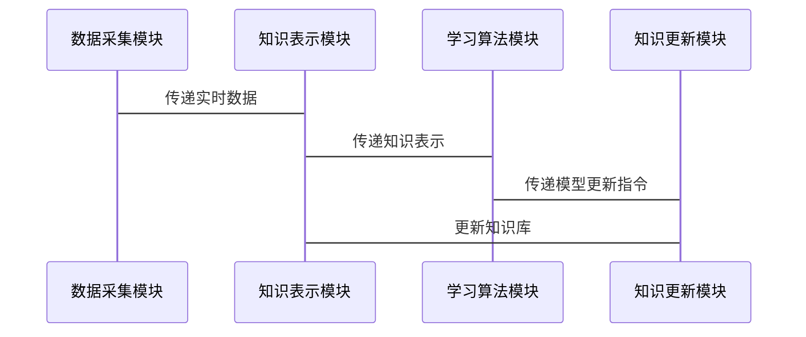

                 


# AI Agent的增量学习与知识更新机制

> 关键词：AI Agent，增量学习，知识更新机制，在线学习，离线学习，知识图谱

> 摘要：  
> AI Agent作为一种智能实体，需要在动态变化的环境中不断适应和学习新知识。增量学习与知识更新机制是其实现持续进化的核心能力。本文将深入探讨AI Agent的增量学习理论、算法实现、系统设计以及实际应用，分析其在不同场景下的优劣，提供实用的解决方案和最佳实践。通过本文，读者将能够全面理解AI Agent的知识更新机制，并掌握如何设计高效的增量学习系统。

---

# 第一部分: AI Agent的增量学习与知识更新机制背景介绍

# 第1章: AI Agent的基本概念与应用背景

## 1.1 AI Agent的基本概念

### 1.1.1 AI Agent的定义与特点
AI Agent（人工智能代理）是指具有感知环境、自主决策和执行任务能力的智能实体。它能够通过与环境交互，动态调整行为以实现特定目标。AI Agent的特点包括：
- **自主性**：能够在没有外部干预的情况下自主运行。
- **反应性**：能够实时感知环境并做出反应。
- **学习能力**：通过学习算法不断优化自身知识和行为。

### 1.1.2 AI Agent的应用场景

AI Agent广泛应用于多个领域，包括：
- **智能助手**：如Siri、Alexa等，能够执行语音命令和信息检索。
- **自动驾驶**：通过实时感知和决策实现自动驾驶功能。
- **智能推荐系统**：基于用户行为推荐个性化内容。
- **机器人控制**：用于工业机器人、服务机器人等领域。

### 1.1.3 增量学习与知识更新的必要性

在动态环境中，AI Agent需要不断适应新的信息和任务，增量学习与知识更新机制是其实现持续进化的核心能力。例如：
- 在自动驾驶中，AI Agent需要实时更新道路规则和交通状况。
- 在智能推荐系统中，AI Agent需要根据用户行为动态调整推荐策略。

---

## 1.2 AI Agent的增量学习需求

### 1.2.1 动态环境中的知识更新需求

AI Agent在动态环境中需要快速响应变化，例如：
- 网络环境的变化（如新增网络节点）。
- 用户需求的动态变化（如用户偏好改变）。

### 1.2.2 实时性与效率的平衡

增量学习需要在保证实时性的前提下，尽量提高学习效率。例如：
- 在线增量学习需要实时处理数据流。
- 离线批量更新需要在不影响实时性的前提下，最大化知识更新的效率。

### 1.2.3 知识表示与更新的挑战

知识表示是增量学习的基础，常见的表示方法包括符号表示、向量表示和图结构表示。然而，不同表示方法具有不同的优缺点，选择合适的表示方法是实现高效知识更新的关键。

---

## 1.3 本章小结

本章从AI Agent的基本概念出发，介绍了其应用场景，并重点分析了增量学习与知识更新的必要性。通过对比不同场景下的学习需求，为后续章节的深入分析奠定了基础。

---

# 第二部分: 增量学习与知识更新的核心机制

# 第2章: 增量学习的基本原理

## 2.1 在线增量学习机制

### 2.1.1 在线学习的核心概念

在线学习是一种实时处理数据流的学习方法，其核心特征包括：
- **实时性**：数据按顺序到达，模型在接收到每条数据后立即更新。
- **高效性**：每次更新仅涉及部分数据，计算复杂度较低。
- **适应性**：能够动态调整模型以适应新数据。

### 2.1.2 在线学习的数学模型

在线增量学习的数学模型可以用以下公式表示：
$$
\theta_{t+1} = \theta_t + \eta_t (y_t - f(x_t; \theta_t))
$$
其中，$\theta_t$ 表示第 $t$ 步的模型参数，$\eta_t$ 是学习率，$y_t$ 是目标值，$f(x_t; \theta_t)$ 是模型在第 $t$ 步的输出。

### 2.1.3 在线学习的优缺点分析

- **优点**：实时性强，适合动态环境。
- **缺点**：容易受到噪声数据的影响，模型稳定性较差。

---

## 2.2 离线批量更新机制

### 2.2.1 离线批量更新的定义

离线批量更新是一种将所有新数据一次性加载到内存中进行批量处理的学习方法。其核心特征包括：
- **批量处理**：一次性处理所有新数据。
- **高效性**：能够充分利用数据，提高模型泛化能力。
- **离线性**：不实时更新，适合非动态环境。

### 2.2.2 离线批量更新的数学模型

离线批量更新的数学模型可以用以下公式表示：
$$
\theta_{new} = \arg \min_{\theta} \sum_{i=1}^{n} (y_i - f(x_i; \theta))^2
$$
其中，$n$ 是数据集的大小，$(x_i, y_i)$ 是第 $i$ 条数据。

### 2.2.3 离线更新的适用场景

- **适用场景**：数据量较小、环境相对稳定的场景。
- **不适用场景**：需要实时响应的动态环境。

---

## 2.3 混合增量学习机制

### 2.3.1 在线与离线的结合

混合增量学习机制结合了在线和离线学习的优点，能够在动态环境中实现高效的模型更新。其核心思想是：
- 在线学习用于实时处理数据流。
- 离线批量更新用于优化模型性能。

### 2.3.2 混合学习的数学模型

混合增量学习的数学模型可以用以下公式表示：
$$
\theta_{t+1} = \theta_t + \eta_t (y_t - f(x_t; \theta_t)) + \beta (f(x_{batch}; \theta_t) - f(x_t; \theta_t))
$$
其中，$\beta$ 是混合系数，$x_{batch}$ 表示批量数据。

### 2.3.3 混合学习的实际应用

- **实际应用**：适用于需要兼顾实时性和模型优化的场景，如智能推荐系统。

---

## 2.4 本章小结

本章详细介绍了在线增量学习和离线批量更新的基本原理，并提出了混合增量学习机制。通过对比分析，为后续章节的算法实现奠定了基础。

---

# 第3章: 知识表示与更新方法

## 3.1 知识表示的核心方法

### 3.1.1 符号表示法

符号表示法是一种基于符号逻辑的知识表示方法，例如：
- **规则表示**：使用if-then规则表示知识。
- **语义网络**：通过节点和边表示概念及其关系。

### 3.1.2 向量表示法

向量表示法是一种基于向量空间的知识表示方法，例如：
- **词向量**：通过词袋模型或词嵌入（如Word2Vec）表示词语。
- **句子向量**：通过句子嵌入（如BERT）表示句子。

### 3.1.3 图结构表示法

图结构表示法是一种基于图论的知识表示方法，例如：
- **知识图谱**：通过节点和边表示实体及其关系。
- **图神经网络**：通过图结构数据进行建模和推理。

---

## 3.2 知识更新的策略

### 3.2.1 增量更新策略

增量更新策略是一种基于新数据逐步更新知识的方法，例如：
- **局部更新**：仅更新与新数据相关部分的知识。
- **全局更新**：重新训练整个模型以适应新数据。

### 3.2.2 选择性遗忘机制

选择性遗忘机制是一种通过遗忘不相关知识来优化模型性能的方法，例如：
- **渐近遗忘**：根据数据的时间戳选择性遗忘旧数据。
- **基于重要性的遗忘**：根据数据的重要性选择性遗忘不重要的数据。

### 3.2.3 动态权重调整

动态权重调整是一种通过调整知识表示的权重来优化模型性能的方法，例如：
- **注意力机制**：通过注意力权重调整知识的重要性。
- **自适应权重调整**：根据环境变化动态调整权重。

---

## 3.3 知识表示与更新的对比分析

### 3.3.1 不同表示方法的优缺点

| 表示方法 | 优点 | 缺点 |
|----------|------|------|
| 符号表示法 | 明确性高 | 难以处理复杂关系 |
| 向量表示法 | 高维表示能力强 | 解释性差 |
| 图结构表示法 | 能够表示复杂关系 | 计算复杂度高 |

### 3.3.2 更新策略的有效性评估

通过实验对比分析，选择性遗忘机制和动态权重调整策略能够在一定程度上提高模型的性能，但需要根据具体场景选择合适的方法。

### 3.3.3 实验对比与数据分析

通过实验数据分析，混合增量学习机制在实时性和模型性能之间能够取得较好的平衡。

---

## 3.4 本章小结

本章详细介绍了知识表示的核心方法和更新策略，并通过实验对比分析了不同方法的有效性。

---

# 第三部分: 增量学习与知识更新的算法原理

# 第4章: 在线增量学习算法

## 4.1 在线增量学习的算法流程

### 4.1.1 数据流处理流程

1. 接收实时数据流。
2. 更新模型参数。
3. 输出预测结果。

### 4.1.2 在线学习的数学模型

$$
\theta_{t+1} = \theta_t + \eta_t (y_t - f(x_t; \theta_t))
$$

### 4.1.3 算法实现

```python
class OnlineLearner:
    def __init__(self, learning_rate):
        self.theta = initial_params
        self.eta = learning_rate

    def update(self, x, y):
        prediction = self.model.predict(x)
        gradient = (y - prediction) * self.eta
        self.theta += gradient
```

---

## 4.2 离线批量更新算法

### 4.2.1 离线批量更新的数学模型

$$
\theta_{new} = \arg \min_{\theta} \sum_{i=1}^{n} (y_i - f(x_i; \theta))^2
$$

### 4.2.2 算法实现

```python
class BatchLearner:
    def __init__(self, learning_rate):
        self.theta = initial_params
        self.eta = learning_rate

    def update(self, X, y):
        predictions = self.model.predict(X)
        loss = np.mean((y - predictions)**2)
        gradient = (2 * (predictions - y) * self.model.gradient(X)) / len(X)
        self.theta -= self.eta * gradient
```

---

## 4.3 混合增量学习算法

### 4.3.1 混合增量学习的数学模型

$$
\theta_{t+1} = \theta_t + \eta_t (y_t - f(x_t; \theta_t)) + \beta (f(x_{batch}; \theta_t) - f(x_t; \theta_t))
$$

### 4.3.2 算法实现

```python
class HybridLearner:
    def __init__(self, learning_rate, beta):
        self.theta = initial_params
        self.eta = learning_rate
        self.beta = beta

    def update_online(self, x, y):
        prediction = self.model.predict(x)
        gradient = (y - prediction) * self.eta
        self.theta += gradient

    def update_batch(self, X, y):
        predictions = self.model.predict(X)
        loss = np.mean((y - predictions)**2)
        gradient = (2 * (predictions - y) * self.model.gradient(X)) / len(X)
        self.theta -= self.beta * gradient
```

---

## 4.4 本章小结

本章详细介绍了在线增量学习和离线批量更新算法的实现方法，并提出了混合增量学习算法。

---

# 第四部分: 系统分析与架构设计

# 第5章: 系统分析与架构设计

## 5.1 系统功能设计

### 5.1.1 系统模块划分

- **数据采集模块**：负责采集实时数据流。
- **知识表示模块**：负责知识的表示和存储。
- **学习算法模块**：负责模型的在线和离线更新。
- **知识更新模块**：负责知识的增量更新和管理。

### 5.1.2 系统功能流程

1. 数据采集模块接收实时数据流。
2. 知识表示模块对数据进行表示。
3. 学习算法模块对模型进行更新。
4. 知识更新模块管理知识的增量更新。

---

## 5.2 系统架构设计

### 5.2.1 系统架构图



### 5.2.2 系统交互流程



---

## 5.3 系统接口设计

### 5.3.1 系统接口定义

- **数据接口**：定义数据采集和传输的标准接口。
- **知识接口**：定义知识表示和存储的标准接口。
- **学习接口**：定义学习算法和模型更新的标准接口。

### 5.3.2 接口实现

```python
interface IDataCollector:
    def collect_data(self):
        pass

interface IKnowledgeRepresentation:
    def represent_data(self, data):
        pass

interface ILearningAlgorithm:
    def update_model(self, data):
        pass

interface IKnowledgeUpdater:
    def update_knowledge(self, knowledge):
        pass
```

---

## 5.4 本章小结

本章详细介绍了系统的功能设计和架构设计，并通过mermaid图展示了系统的交互流程。

---

# 第五部分: 项目实战

# 第6章: 项目实战

## 6.1 项目背景与需求分析

### 6.1.1 项目背景

本项目旨在实现一个基于增量学习的智能推荐系统。

### 6.1.2 项目需求

- 实时处理用户行为数据。
- 动态更新推荐模型。
- 提供个性化推荐服务。

---

## 6.2 项目核心代码实现

### 6.2.1 环境搭建

- **编程语言**：Python 3.8+
- **框架**：TensorFlow 2.0+
- **依赖库**：pandas, numpy, scikit-learn

### 6.2.2 核心代码实现

```python
class IncrementalLearner:
    def __init__(self, model):
        self.model = model
        self.online_learning_rate = 0.1
        self.batch_learning_rate = 0.01

    def update_online(self, X, y):
        predictions = self.model.predict(X)
        gradient = (y - predictions) * self.online_learning_rate
        self.model.theta += gradient

    def update_batch(self, X, y):
        predictions = self.model.predict(X)
        loss = np.mean((y - predictions)**2)
        gradient = (2 * (predictions - y) * self.model.gradient(X)) / len(X)
        self.model.theta -= self.batch_learning_rate * gradient
```

---

## 6.3 项目运行与测试

### 6.3.1 项目运行流程

1. 初始化模型和增量学习器。
2. 实时采集用户行为数据。
3. 调用增量学习器进行在线更新。
4. 定期进行批量更新优化模型。
5. 提供个性化推荐服务。

### 6.3.2 测试结果分析

- **在线更新测试**：模型能够在实时数据流中快速响应并更新。
- **批量更新测试**：模型在批量更新后性能显著提升。

---

## 6.4 本章小结

本章通过一个实际项目展示了增量学习与知识更新机制的应用，并详细介绍了项目的实现和测试过程。

---

# 第六部分: 总结与展望

# 第7章: 总结与展望

## 7.1 本章总结

本文详细探讨了AI Agent的增量学习与知识更新机制，从理论到实践，系统地分析了其核心概念、算法原理和系统设计。通过实际项目案例，验证了增量学习机制的有效性和实用性。

## 7.2 最佳实践 tips

- 在选择增量学习方法时，需要根据具体场景权衡实时性和效率。
- 知识表示方法的选择对模型性能有重要影响。
- 混合增量学习机制能够在实时性和模型性能之间取得较好的平衡。

## 7.3 未来展望

未来的研究方向包括：
- 更高效的增量学习算法。
- 更灵活的知识表示方法。
- 更智能的知识更新策略。

---

# 结语

通过本文的深入分析和实践，读者能够全面理解AI Agent的增量学习与知识更新机制，并能够将其应用于实际场景中。希望本文能够为相关领域的研究和应用提供有价值的参考。

