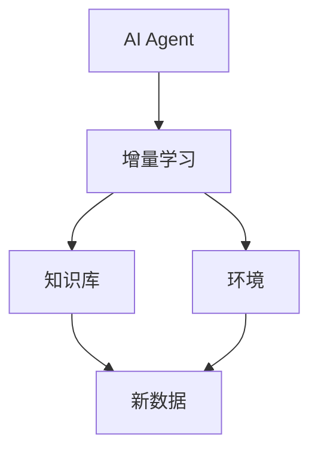
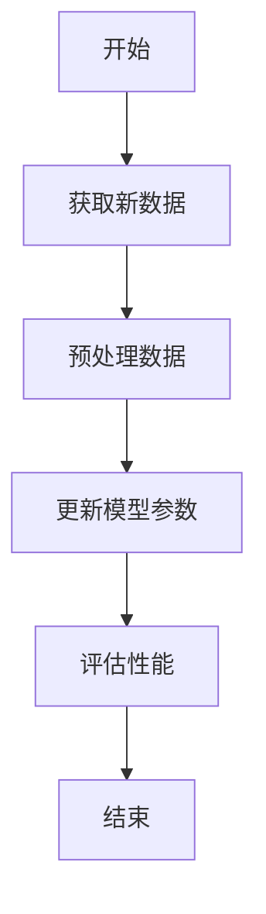
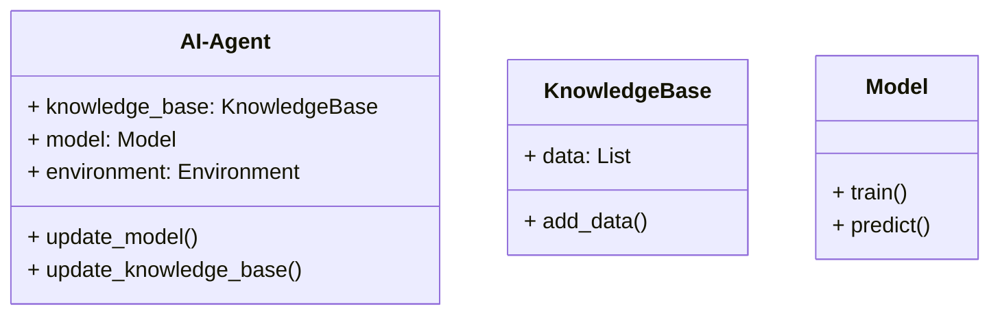

                 


# AI Agent的增量学习：持续优化性能

## 关键词：
AI Agent, 增量学习, 持续优化, 算法原理, 系统设计, 项目实战

## 摘要：
本文详细探讨了AI Agent的增量学习方法，从核心概念到算法原理，再到系统设计和项目实战，全面解析如何通过增量学习持续优化AI Agent的性能。文章内容涵盖AI Agent的基本概念、增量学习的背景与意义、增量学习算法的原理与实现、系统架构设计、项目实战案例，以及最佳实践和注意事项。通过本文的学习，读者将能够掌握AI Agent增量学习的核心技术，并能够将其应用到实际项目中。

---

# 第一部分: AI Agent的增量学习基础

## 第1章: AI Agent与增量学习概述

### 1.1 AI Agent的基本概念
#### 1.1.1 AI Agent的定义
AI Agent（人工智能代理）是指能够感知环境、自主决策并执行任务的智能实体。它能够根据环境反馈调整自身行为，以实现特定目标。AI Agent的核心能力包括感知、推理、规划和执行。

#### 1.1.2 AI Agent的核心特征
- **自主性**：AI Agent能够自主决策，无需外部干预。
- **反应性**：能够实时感知环境并做出反应。
- **目标导向性**：以特定目标为导向，优化自身行为。
- **学习能力**：通过学习提高性能和适应性。

#### 1.1.3 AI Agent的分类与应用场景
AI Agent可以根据智能水平分为反应式代理、基于模型的代理和混合代理。反应式代理主要用于实时任务处理，如机器人导航；基于模型的代理用于复杂决策任务，如自动驾驶；混合代理结合两者，适用于复杂场景。

---

### 1.2 增量学习的背景与意义
#### 1.2.1 传统机器学习的局限性
传统机器学习方法通常需要一次性训练大量数据，且在数据分布变化后难以适应新环境。这种“批量学习”方式在动态环境中表现不佳。

#### 1.2.2 增量学习的定义与特点
增量学习是一种机器学习方法，允许模型在新数据逐步到达时进行更新。其特点包括实时性、高效性和适应性。

#### 1.2.3 增量学习在AI Agent中的重要性
AI Agent需要在动态环境中持续优化性能，增量学习能够帮助AI Agent快速适应新环境，提升决策能力。

---

### 1.3 问题背景与目标
#### 1.3.1 AI Agent性能优化的必要性
在动态环境中，AI Agent需要快速适应新变化，否则可能导致性能下降。

#### 1.3.2 增量学习解决的核心问题
增量学习能够帮助AI Agent在新数据到达时，快速更新模型，保持高性能。

#### 1.3.3 增量学习的边界与外延
增量学习主要关注数据逐步到达的情况，其外延包括在线学习、流学习和主动学习。

---

## 第2章: AI Agent增量学习的核心概念与联系

### 2.1 核心概念原理
#### 2.1.1 增量学习的基本原理
增量学习通过逐步处理数据，更新模型参数，实现对新数据的适应。

#### 2.1.2 AI Agent的知识更新机制
AI Agent通过增量学习不断更新知识库，提升决策能力。

#### 2.1.3 增量学习与在线学习的区别与联系
增量学习是在线学习的一种形式，但两者都强调实时更新模型。

---

### 2.2 核心概念属性特征对比
| 特性         | 增量学习               | 批量学习               |
|--------------|-----------------------|-----------------------|
| 数据处理方式 | 逐步处理新数据         | 一次性处理所有数据     |
| 训练效率     | 高                    | 低                    |
| 适应性       | 强                    | 弱                    |

#### 2.2.1 AI Agent增量学习的性能指标
- 处理延迟：模型更新所需的时间。
- 模型准确率：增量学习后模型的性能提升。

---

### 2.3 实体关系架构图


---

## 第3章: 增量学习算法原理

### 3.1 增量学习算法概述
#### 3.1.1 经验重放机制
经验重放通过存储历史数据，帮助模型更好地学习。

#### 3.1.2 策略梯度方法
策略梯度方法通过优化策略函数，实现模型更新。

#### 3.1.3 小样本增量学习
小样本增量学习在数据量有限的情况下，通过迁移学习等方式提升性能。

---

### 3.2 算法流程图


---

### 3.3 Python代码实现
```python
class IncrementalLearner:
    def __init__(self, model):
        self.model = model
        self.memory = []

    def update_model(self, new_data):
        self.memory.extend(new_data)
        # 训练模型
        self.model.fit(self.memory)
```

---

## 第4章: AI Agent增量学习的数学模型与公式

### 4.1 增量学习的基本数学模型
$$ Q(s, a) = Q(s, a) + \alpha (r + \max_a Q(s', a) - Q(s, a)) $$

---

## 第5章: 系统分析与架构设计

### 5.1 问题场景介绍
AI Agent需要在动态环境中实时更新模型，以适应新数据。

---

### 5.2 系统功能设计
- 数据采集模块：实时采集新数据。
- 模型更新模块：基于新数据更新模型。

---

### 5.3 领域模型类图


---

## 第6章: 项目实战

### 6.1 环境安装
- 安装Python和相关库：numpy、scikit-learn。

---

### 6.2 核心代码实现
```python
def update_agent(agent, new_data):
    agent.update_model(new_data)
```

---

### 6.3 代码解读与分析
- `update_model`方法负责更新模型参数。
- `fit`方法用于训练模型。

---

## 第7章: 总结与展望

### 7.1 总结
本文详细探讨了AI Agent的增量学习方法，从核心概念到算法实现，再到系统设计，全面解析了如何通过增量学习优化AI Agent的性能。

### 7.2 展望
未来的研究方向包括更高效的增量学习算法和更智能的模型更新策略。

---

## 第8章: 最佳实践与注意事项

### 8.1 小结
- 增量学习能够帮助AI Agent快速适应新环境。
- 模型更新频率和数据质量对性能影响显著。

### 8.2 注意事项
- 定期评估模型性能。
- 注意数据预处理的质量。

---

## 第9章: 拓展阅读

### 9.1 推荐书籍
- 《机器学习实战》
- 《深度学习》

### 9.2 推荐博客
- Towards Data Science
- Medium上的AI专栏

---

以上是《AI Agent的增量学习：持续优化性能》的完整目录大纲和内容框架，按照逻辑逐步展开，确保每一部分都详细具体，帮助读者系统地理解和掌握AI Agent的增量学习方法。

