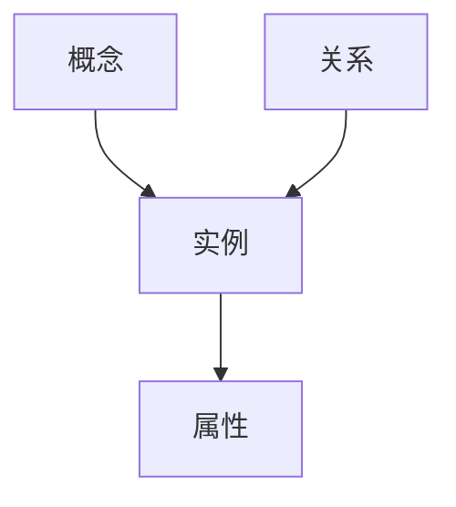
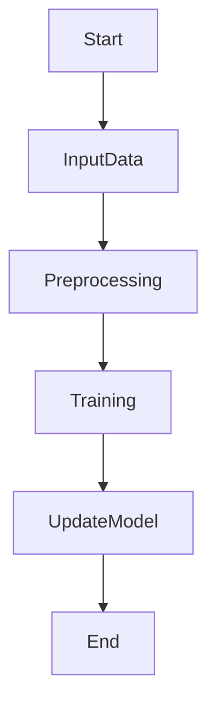
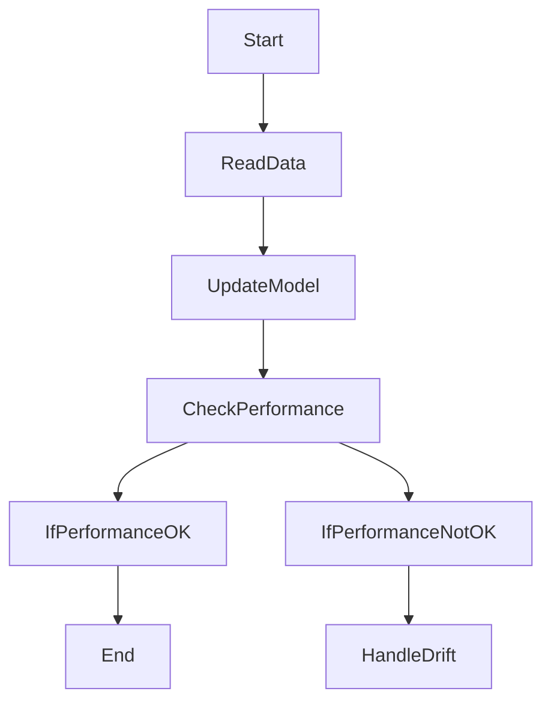
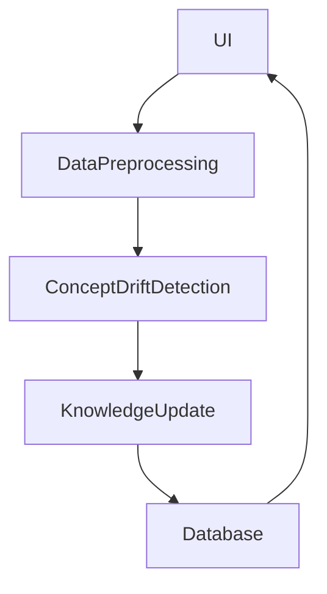
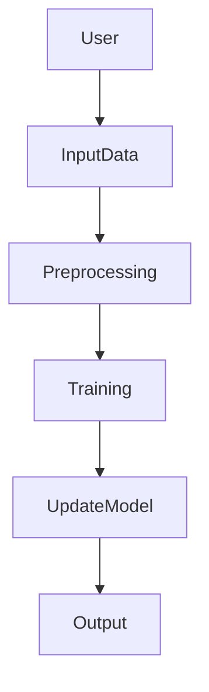

                 


# AI Agent的增量式概念学习与知识更新

## 关键词：AI Agent, 增量式学习, 知识更新, 概念漂移, 深度学习, 知识图谱, 动态知识库

## 摘要：  
本文详细探讨了AI Agent在增量式概念学习与知识更新领域的核心原理、算法实现和系统设计。从背景介绍到项目实战，系统性地分析了AI Agent在动态环境中的学习机制，重点讲解了概念漂移检测、增量学习算法和知识更新策略，并通过具体案例展示了如何实现高效的增量式概念学习系统。本文旨在为AI Agent的研究者和开发者提供理论与实践相结合的深度指导。

---

## 第一部分: AI Agent的增量式概念学习与知识更新基础

## 第1章: AI Agent与增量式学习概述

### 1.1 AI Agent的基本概念
#### 1.1.1 AI Agent的定义与分类
AI Agent（人工智能代理）是指能够感知环境、自主决策并执行任务的智能实体。根据智能水平和应用场景，AI Agent可以分为以下几类：
1. **反应式AI Agent**：基于当前感知做出实时反应，适用于动态环境。
2. **认知式AI Agent**：具备推理、规划和学习能力，适用于复杂任务。
3. **协作式AI Agent**：能够与其他Agent或人类协同完成任务。

#### 1.1.2 增量式学习的基本概念
增量式学习是一种机器学习范式，AI Agent在接收到新的数据样本时，逐步更新模型，而非一次性批量训练。其核心在于实时适应数据的变化，适用于动态环境。

#### 1.1.3 知识更新的背景与意义
在动态环境中，数据分布会发生变化（概念漂移），传统批量学习方法难以应对。知识更新通过持续优化模型，确保AI Agent在变化的环境中保持性能。

### 1.2 增量式概念学习的背景与必要性
#### 1.2.1 数据驱动学习的局限性
- 数据驱动学习依赖于历史数据，难以适应新数据的变化。
- 在动态环境中，数据分布的变化可能导致模型失效。

#### 1.2.2 动态环境中的知识更新需求
- 动态环境中数据分布的变化（概念漂移）要求AI Agent能够实时更新知识。
- 知识更新是AI Agent在复杂环境中保持性能的关键。

#### 1.2.3 增量式学习的核心价值
- 实时性：快速响应新数据。
- 灵活性：适应环境变化。
- 效率性：避免重复训练。

### 1.3 知识更新的重要性
#### 1.3.1 知识更新的定义与特点
知识更新是指AI Agent在接收到新信息后，对知识库进行优化和扩展的过程。

#### 1.3.2 动态知识库的构建与维护
动态知识库需要具备以下特点：
- 实时性：快速更新知识。
- 可扩展性：支持新增知识。
- 可维护性：便于管理和优化。

#### 1.3.3 知识更新对AI Agent性能的影响
- 提高准确性：适应数据分布变化。
- 增强鲁棒性：应对复杂环境。
- 降低维护成本：优化知识库结构。

## 第2章: 增量式概念学习的核心概念与联系

### 2.1 核心概念原理
#### 2.1.1 概念漂移的定义与分类
概念漂移是指数据分布的变化导致模型预测性能下降的现象。常见的概念漂移类型包括：
1. **突然漂移**：数据分布突然变化。
2. **渐进漂移**：数据分布缓慢变化。
3. **周期性漂移**：数据分布周期性变化。

#### 2.1.2 增量式学习中的概念变化检测
概念变化检测是增量式学习的关键步骤，用于判断数据分布是否发生变化。

#### 2.1.3 知识更新的数学模型
知识更新的数学模型可以表示为：
$$
f_{new} = f_{old} + \Delta f
$$
其中，$\Delta f$ 表示更新量。

### 2.2 核心概念对比分析
#### 2.2.1 增量式学习与传统批量学习的对比
| 对比维度 | 增量式学习 | 传统批量学习 |
|----------|------------|---------------|
| 数据处理 | 实时处理 | 批量处理 |
| 计算资源 | 较低 | 较高 |
| 适应性 | 高 | 低 |

#### 2.2.2 知识更新与知识保持的对比
| 对比维度 | 知识更新 | 知识保持 |
|----------|----------|-----------|
| 目标 | 更新知识 | 保持知识 |
| 方法 | 动态优化 | 静态存储 |

#### 2.2.3 概念漂移检测与概念预测的对比
| 对比维度 | 概念漂移检测 | 概念预测 |
|----------|-------------|-----------|
| 目标 | 检测漂移 | 预测漂移 |
| 方法 | 统计分析 | 时间序列分析 |

### 2.3 实体关系图与流程图
#### 2.3.1 实体关系图（ER图）


#### 2.3.2 增量式学习流程图


## 第3章: 增量式概念学习的算法原理

### 3.1 增量式学习算法
#### 3.1.1 概念漂移检测算法
```mermaid
graph TD
Start --> CheckDrift
CheckDrift --> IfDriftDetected --> HandleDrift
CheckDrift --> IfNoDrift -
```

#### 3.1.2 增量学习算法


### 3.2 知识更新算法
#### 3.2.1 知识更新的数学模型
知识更新的数学模型可以表示为：
$$
f_{new} = f_{old} + \Delta f
$$
其中，$\Delta f$ 表示更新量。

#### 3.2.2 知识更新的实现步骤
1. 读取新数据。
2. 更新知识库。
3. 检测概念漂移。
4. 处理概念漂移。

### 3.3 算法实现代码
```python
def incremental_learning(data_stream):
    model = initialize_model()
    for batch in data_stream:
        preprocess_batch(batch)
        update_model(model, batch)
        check_drift(model, batch)
        if drift_detected:
            handle_drift(model)
    return model
```

---

## 第二部分: 系统分析与架构设计方案

### 第4章: 系统分析与架构设计

#### 4.1 问题场景介绍
动态环境中的数据分布变化要求AI Agent能够实时更新知识。

#### 4.2 系统功能设计
系统功能模块包括：
1. 数据预处理模块。
2. 概念漂移检测模块。
3. 知识更新模块。

#### 4.3 系统架构设计


#### 4.4 系统接口设计
系统接口包括：
1. 数据输入接口。
2. 模型更新接口。
3. 知识查询接口。

#### 4.5 系统交互流程图


---

## 第三部分: 项目实战

### 第5章: 项目实战

#### 5.1 环境安装
- 安装Python。
- 安装机器学习库（如scikit-learn）。

#### 5.2 系统核心实现
```python
import numpy as np
from sklearn.linear_model import SGDClassifier

def incremental_learning(data_stream):
    model = SGDClassifier()
    for X, y in data_stream:
        model.partial_fit(X, y)
        if check_drift(model, X, y):
            model = retrain_model(model, X, y)
    return model
```

#### 5.3 代码应用解读与分析
- `incremental_learning`函数实现增量式学习。
- `check_drift`函数检测概念漂移。
- `retrain_model`函数重新训练模型。

#### 5.4 实际案例分析
案例：在线广告点击率预测。

#### 5.5 项目小结
项目实现了增量式概念学习，能够实时更新模型，适应数据分布变化。

---

## 第四部分: 最佳实践

### 第6章: 最佳实践

#### 6.1 小结
本文详细讲解了AI Agent的增量式概念学习与知识更新的原理和实现。

#### 6.2 注意事项
- 定期检查概念漂移。
- 优化知识更新算法。
- 处理数据异质性。

#### 6.3 拓展阅读
- 建议阅读《Incremental Learning: A Survey》。

---

## 总结

本文系统性地探讨了AI Agent的增量式概念学习与知识更新的原理、算法和系统设计。通过具体案例展示了增量式学习的实现过程，为AI Agent的研究和应用提供了理论与实践相结合的深度指导。

