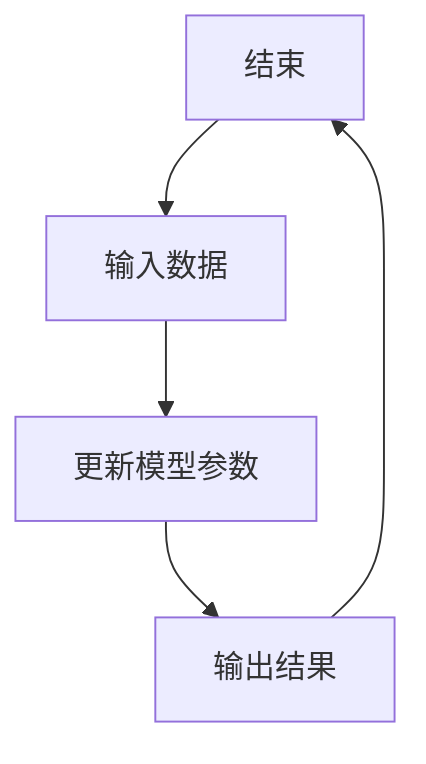
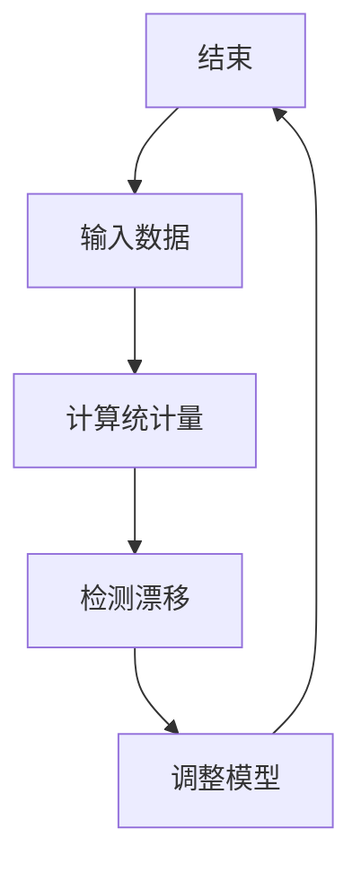
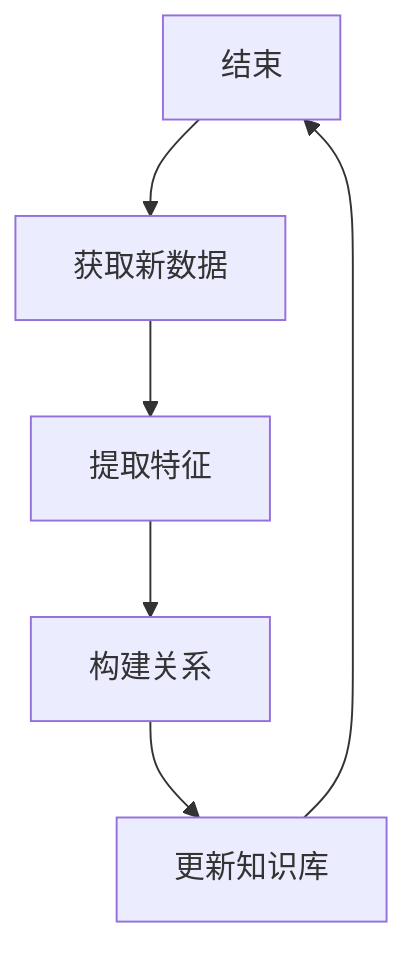
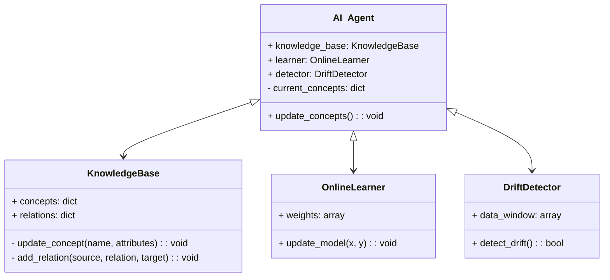
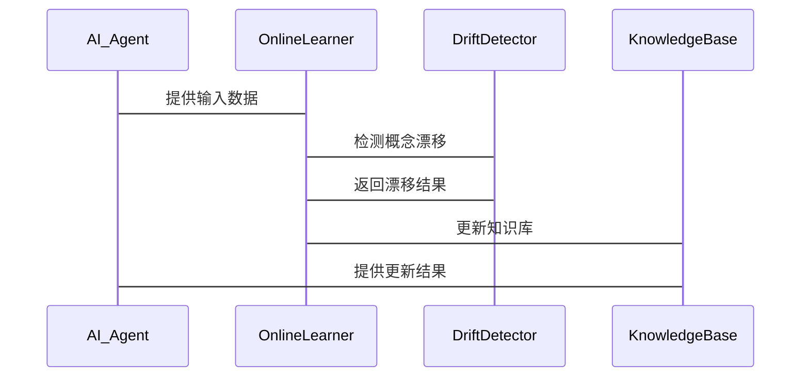

                 


# AI Agent的增量式概念形成与知识重构

> **关键词**: AI Agent, 增量式概念形成, 知识重构, 在线学习, 概念漂移, 知识图谱

> **摘要**: 本文探讨AI Agent如何通过增量式概念形成与知识重构技术实现动态适应环境变化。从基础原理到实际应用，系统介绍相关算法、系统架构及项目实现，重点分析在线学习、概念漂移检测和知识图谱构建等关键技术，并通过案例展示其实际应用效果。

---

# 第1章: AI Agent与增量式概念形成概述

## 1.1 问题背景与问题描述

### 1.1.1 传统AI概念形成方式的局限性
传统的AI概念形成方法通常基于静态数据集进行训练，这种方法在面对动态变化的环境时显得力不从心。例如，在自然语言处理中，随着时间推移，语言的使用方式和含义会发生变化，传统的静态模型难以捕捉这些变化，导致模型性能下降。

### 1.1.2 增量式概念形成的必要性
增量式概念形成允许AI Agent在运行时逐步学习和更新其知识库，这使得AI能够实时适应环境的变化。例如，在实时监控系统中，新的数据流不断输入，AI Agent需要动态调整其检测模型以识别新的模式或异常。

### 1.1.3 知识重构的核心问题
知识重构是指在增量式学习过程中，对现有知识进行更新、扩展和优化的过程。核心问题在于如何在保持已有知识准确性的同时，高效地吸收新知识并更新知识表示。

## 1.2 问题解决与边界定义

### 1.2.1 增量式学习的基本原理
增量式学习允许模型在接收到新的数据时逐步更新其参数或知识表示。与批量学习不同，增量式学习具有更高的灵活性和实时性，适用于数据流环境。

### 1.2.2 知识重构的边界与外延
知识重构的边界包括数据输入、知识表示和更新规则。外延则涉及从简单概念到复杂概念的逐步构建过程。

### 1.2.3 核心概念与要素组成
核心概念包括增量式学习、知识表示、概念漂移检测和知识更新。要素组成包括数据流、知识库、更新规则和性能指标。

## 1.3 本章小结
本章介绍了AI Agent增量式概念形成的基本概念和必要性，分析了其核心问题和边界条件，为后续章节的深入探讨奠定了基础。

---

# 第2章: 增量式概念形成的核心概念与联系

## 2.1 核心概念原理

### 2.1.1 增量式学习的基本原理
增量式学习通过逐步处理数据样本，更新模型参数。与批量学习相比，增量式学习具有更低的内存需求和更高的实时性。

### 2.1.2 知识图谱的构建与更新
知识图谱是增量式概念形成的重要工具。通过构建和更新知识图谱，AI Agent能够表示和推理复杂的知识关系。

### 2.1.3 概念漂移的检测与适应
概念漂移是指数据分布随时间发生变化的现象。增量式学习需要能够检测并适应概念漂移，以保持模型性能。

## 2.2 概念属性特征对比表格

| 概念属性 | 特征描述 |
|----------|----------|
| 增量性   | 持续更新 |
| 动态性   | 实时调整 |
| 可解释性 | 明确性   |
| 稳定性   | 长期有效 |

## 2.3 ER实体关系图
```mermaid
er
  actor: AI Agent
  knowledge_base: 知识库
  relation: 概念关系
  attribute: 概念属性
  actor --> knowledge_base: 读取/更新知识
  knowledge_base --> relation: 建立关系
  knowledge_base --> attribute: 描述属性
```

## 2.4 本章小结
本章详细阐述了增量式概念形成的核心概念及其相互关系，并通过表格和图表展示了概念属性和实体关系。

---

# 第3章: 增量式概念形成的算法原理

## 3.1 在线学习算法

### 3.1.1 算法流程


### 3.1.2 代码实现
```python
class OnlineLearner:
    def __init__(self, learning_rate=0.1):
        self.lr = learning_rate
        self.weights = np.zeros((n_features, 1))
    
    def update_model(self, x, y):
        prediction = np.dot(x, self.weights)
        error = y - prediction
        self.weights += self.lr * error * x
```

### 3.1.3 数学模型
增量式学习的基本模型可以表示为：
$$ \theta_{t+1} = \theta_t + \eta (y_t - \hat{y}_t) x_t $$
其中，$\theta$ 是模型参数，$\eta$ 是学习率，$x$ 是输入，$y$ 是真实值，$\hat{y}$ 是预测值。

## 3.2 概念漂移检测算法

### 3.2.1 算法流程


### 3.2.2 代码实现
```python
def detect_drift(data_window, threshold=0.05):
    window_size = len(data_window)
    # 计算统计量
    statistic = calculate_statistic(data_window)
    # 检测漂移
    if statistic > threshold:
        return True
    else:
        return False
```

### 3.2.3 数学模型
概念漂移检测可以通过统计检验方法实现，例如：
$$ p = \frac{\chi^2}{\chi^2_{\alpha}} $$
其中，$\chi^2$ 是卡方统计量，$\chi^2_{\alpha}$ 是卡方分布的分位数。

## 3.3 知识图谱构建算法

### 3.3.1 算法流程


### 3.3.2 代码实现
```python
class KnowledgeGraph:
    def __init__(self):
        self.graph = {}
    
    def add_entity(self, entity, attributes):
        self.graph[entity] = attributes
    
    def add_relation(self, entity1, relation, entity2):
        if entity1 not in self.graph:
            self.add_entity(entity1, {})
        if entity2 not in self.graph:
            self.add_entity(entity2, {})
        self.graph[entity1][relation] = entity2
```

### 3.3.3 数学模型
知识图谱的构建可以基于图嵌入模型，例如：
$$ E(e_1, r, e_2) = \sigma(e_1 \cdot W_r + e_2 \cdot U_r) $$
其中，$e_1$ 和 $e_2$ 是实体嵌入，$W_r$ 和 $U_r$ 是关系嵌入权重，$\sigma$ 是sigmoid函数。

## 3.4 本章小结
本章详细讲解了增量式概念形成中的关键算法，包括在线学习、概念漂移检测和知识图谱构建，并通过代码和数学模型展示了其实现方式。

---

# 第4章: 系统分析与架构设计

## 4.1 问题场景介绍
AI Agent需要在动态环境中实时处理数据，不断更新其知识库，并适应新的概念变化。

## 4.2 系统功能设计

### 4.2.1 领域模型类图


### 4.2.2 系统架构图


### 4.2.3 接口设计
主要接口包括：
- `update_concepts()`: 更新知识库
- `detect_drift()`: 检测概念漂移
- `update_model()`: 更新学习模型

### 4.2.4 交互序列图


## 4.3 本章小结
本章分析了AI Agent系统的功能需求，设计了系统的领域模型和架构，并展示了系统间的交互流程。

---

# 第5章: 项目实战

## 5.1 环境安装
需要安装Python、numpy、scikit-learn等依赖库。

## 5.2 核心代码实现

### 5.2.1 知识库管理
```python
class SimpleKnowledgeBase:
    def __init__(self):
        self.concepts = {}
    
    def add_concept(self, name, attributes):
        self.concepts[name] = attributes
    
    def update_concept(self, name, attributes):
        self.concepts[name] = attributes
```

### 5.2.2 在线学习器
```python
class SimpleOnlineLearner:
    def __init__(self, lr=0.1):
        self.lr = lr
        self.weights = np.zeros((n_features, 1))
    
    def update_model(self, x, y):
        prediction = np.dot(x, self.weights)
        error = y - prediction
        self.weights += self.lr * error * x
```

### 5.2.3 概念漂移检测器
```python
class SimpleDriftDetector:
    def __init__(self, window_size=100):
        self.window_size = window_size
        self.data_window = []
    
    def add_data(self, x, y):
        self.data_window.append((x, y))
        if len(self.data_window) > self.window_size:
            self.data_window.pop(0)
    
    def detect_drift(self):
        # 简单的均值变化检测
        current_mean = np.mean([x.dot(self.weights) for (x, y) in self.data_window])
        initial_mean = np.mean([x.dot(self.weights_initial) for (x, y) in self.data_window])
        return abs(current_mean - initial_mean) > 0.1
```

## 5.3 案例分析与代码解读
通过一个简单的实时分类任务，展示增量式概念形成的实际应用。

## 5.4 本章小结
本章通过实际项目展示了如何实现增量式概念形成，帮助读者理解理论与实践的结合。

---

# 第6章: 最佳实践与总结

## 6.1 最佳实践 Tips

### 6.1.1 系统设计建议
- 采用分层架构，确保系统的可扩展性
- 定期监控概念漂移，及时更新模型
- 使用高效的存储结构，优化知识库的更新效率

### 6.1.2 代码实现建议
- 采用面向接口的设计，便于模块替换
- 使用缓存机制，减少重复计算
- 定期进行模型评估，确保性能达标

## 6.2 小结
本文系统介绍了AI Agent的增量式概念形成与知识重构技术，从理论到实践，全面阐述了其实现方法和应用案例。

## 6.3 注意事项
- 确保数据质量，避免噪声干扰
- 定期备份知识库，防止数据丢失
- 监控系统性能，及时优化

## 6.4 拓展阅读
建议阅读相关领域的最新论文和书籍，了解增量式学习的前沿技术。

---

# 附录

## 附录 A: 公式汇总
$$ E(e_1, r, e_2) = \sigma(e_1 \cdot W_r + e_2 \cdot U_r) $$

## 附录 B: 图表汇总
包含各章中的Mermaid图表和代码示例。

---

# 结束语

感谢您的阅读，希望本文对您理解AI Agent的增量式概念形成与知识重构有所帮助。如需进一步探讨，欢迎随时联系。

