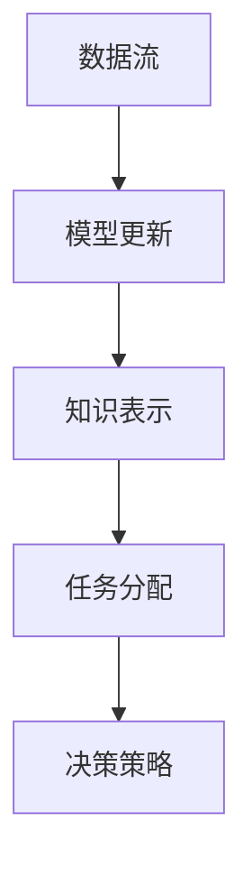
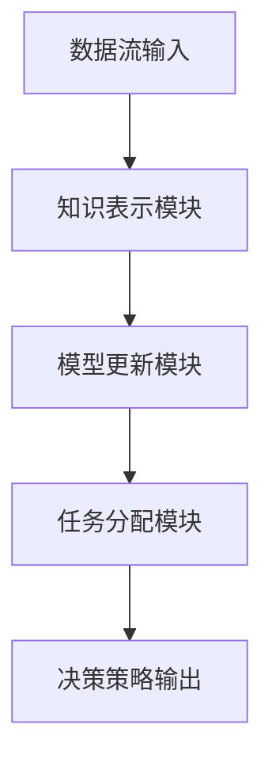
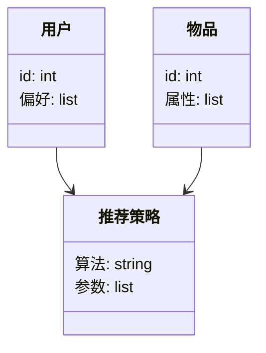
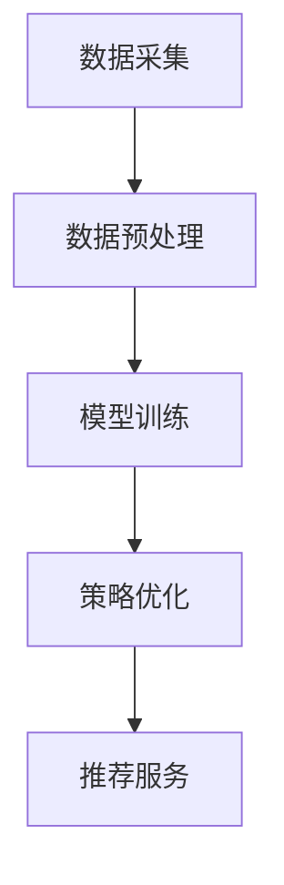
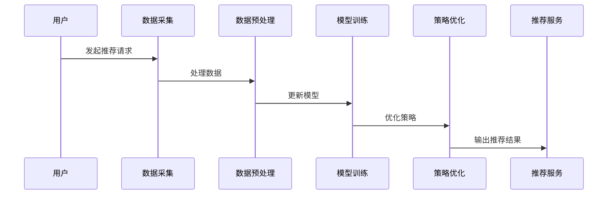

                 


# AI Agent的增量式终身学习框架

> **关键词**：AI Agent，增量式学习，终身学习，机器学习，算法原理，系统架构

> **摘要**：本文系统地探讨了AI Agent的增量式终身学习框架，从核心概念、算法原理到系统架构，再到项目实战，详细解析了如何构建能够持续学习和适应动态环境的AI系统。文章通过丰富的案例和详细的代码示例，帮助读者深入理解并掌握这一前沿技术。

---

# 第一部分: AI Agent与增量式终身学习引言

## 第1章: AI Agent与增量式终身学习引言

### 1.1 AI Agent的基本概念

#### 1.1.1 AI Agent的定义与分类
AI Agent（人工智能代理）是指能够感知环境、自主决策并采取行动以实现特定目标的智能实体。根据功能和应用场景的不同，AI Agent可以分为多种类型，如基于规则的代理、基于模型的代理、强化学习代理等。

- **基于规则的代理**：通过预定义的规则和逻辑来做出决策，适用于任务简单、环境静态的场景。
- **基于模型的代理**：利用环境模型进行状态预测和决策，适用于复杂动态环境。
- **强化学习代理**：通过与环境的交互，基于奖励机制优化自身行为策略，适用于需要自主学习的场景。

#### 1.1.2 AI Agent的核心特征
AI Agent的核心特征包括自主性、反应性、目标导向性和社交能力。自主性是指AI Agent能够独立决策；反应性是指能够实时感知环境变化并做出响应；目标导向性是指根据目标调整行为；社交能力是指能够与其他Agent或人类进行有效交互。

#### 1.1.3 AI Agent在人工智能中的地位
AI Agent是人工智能的重要组成部分，广泛应用于自动驾驶、智能助手、机器人控制等领域。通过AI Agent，机器能够从环境中学习并适应复杂多变的任务需求。

### 1.2 增量式终身学习的背景

#### 1.2.1 终身学习的基本概念
终身学习是指学习者在一生中不断学习和适应新知识的过程。在AI领域，终身学习意味着AI系统能够持续从新数据中学习，不断优化自身性能，而无需重新训练整个模型。

#### 1.2.2 增量式学习的特点
增量式学习是一种特殊的终身学习形式，其特点是数据是逐步引入的，模型在每一步仅更新部分参数，而非全部参数。这种方法适用于数据流场景，能够实时处理数据。

- **数据流处理**：增量式学习能够逐条处理数据，适合实时应用场景。
- **内存效率**：仅存储部分数据，节省内存空间。
- **实时更新**：能够快速响应新数据，适用于需要实时决策的任务。

#### 1.2.3 增量式学习与传统学习方法的对比
传统批量学习方法需要一次性加载所有数据，训练时间较长，但模型更新周期较长。增量式学习则能够逐步加载数据，实时更新模型，适用于动态环境。

| 对比维度 | 批量学习 | 增量式学习 |
|----------|----------|------------|
| 数据加载方式 | 批量加载 | 逐条加载 |
| 训练时间 | 长 | 短 |
| 内存需求 | 高 | 低 |
| 适应性 | 低 | 高 |

### 1.3 问题背景与挑战

#### 1.3.1 动态环境中的学习需求
在动态环境中，数据分布会发生变化，任务目标也会更新。传统的批量学习方法无法有效应对这些变化，而增量式学习能够实时更新模型，适应环境变化。

#### 1.3.2 数据稀疏性与实时性问题
在某些场景中，数据可能稀疏且分布不均，增量式学习能够逐步收集数据，避免一次性加载大量数据的问题，同时满足实时性需求。

#### 1.3.3 模型更新与性能平衡的挑战
增量式学习需要在每次更新中平衡模型性能和计算效率。过于频繁的更新可能导致模型不稳定性，而过少的更新则无法及时适应环境变化。

### 1.4 本章小结
本章介绍了AI Agent的基本概念和增量式终身学习的背景，指出了增量式学习在动态环境中的优势和面临的挑战。

---

# 第二部分: 增量式终身学习框架的核心概念与联系

## 第2章: 增量式终身学习框架的核心要素

### 2.1 核心概念与属性对比

#### 2.1.1 框架的核心概念列表
增量式终身学习框架的核心概念包括：数据流、模型更新、任务分配、知识表示、决策策略。

- **数据流**：数据按时间顺序输入，模型逐步处理。
- **模型更新**：仅更新部分参数，保持模型轻量化。
- **任务分配**：根据环境变化动态分配任务。
- **知识表示**：以适合增量学习的方式表示知识。
- **决策策略**：基于当前知识做出最优决策。

#### 2.1.2 核心概念的属性对比表格
以下表格对比了核心概念的主要属性：

| 概念 | 输入 | 输出 | 更新频率 | 计算复杂度 |
|------|------|------|----------|------------|
| 数据流 | 数据流 | 更新模型 | 实时 | 低 |
| 模型更新 | 参数 | 新模型 | 频繁 | 中等 |
| 任务分配 | 环境状态 | 任务列表 | 动态 | 高 |

#### 2.1.3 Mermaid实体关系图
以下是增量式终身学习框架的核心概念关系图：



### 2.2 框架的组成模块

#### 2.2.1 知识表示模块
知识表示模块负责将输入数据转化为适合增量学习的形式。常用的表示方法包括向量表示和符号表示。

- **向量表示**：将数据转化为低维向量，便于模型更新。
- **符号表示**：将数据转化为符号形式，适用于规则推理。

#### 2.2.2 模型更新模块
模型更新模块负责根据新数据更新模型参数。增量式学习通常采用参数化方法，仅更新部分参数。

- **参数更新**：使用梯度下降等方法，逐步优化参数。
- **模型轻量化**：保持模型简洁，避免过大的计算开销。

#### 2.2.3 任务分配模块
任务分配模块根据环境变化动态分配学习任务。任务分配策略包括基于优先级的分配和基于环境状态的分配。

- **优先级分配**：优先处理高优先级的任务。
- **环境状态分配**：根据环境变化动态调整任务优先级。

### 2.3 框架的交互流程

#### 2.3.1 输入数据流
数据流按时间顺序输入模型，模型逐步处理数据。



#### 2.3.2 模型更新机制
模型更新模块根据新数据更新参数，保持模型性能。

#### 2.3.3 输出决策流
模型根据更新后的知识做出决策，输出到环境中。

### 2.4 本章小结
本章详细介绍了增量式终身学习框架的核心概念和组成模块，分析了各模块之间的关系和交互流程。

---

# 第三部分: 增量式终身学习框架的算法原理

## 第3章: 增量式学习算法的数学模型与公式

### 3.1 基于马尔可夫决策过程的模型更新

#### 3.1.1 马尔可夫决策过程的定义
马尔可夫决策过程（MDP）是一种用于描述决策过程的数学模型，由状态、动作、奖励和转移概率构成。

- **状态**：环境中的当前情况。
- **动作**：AI Agent采取的行动。
- **奖励**：环境对动作的反馈。
- **转移概率**：从一个状态转移到另一个状态的概率。

#### 3.1.2 状态转移概率矩阵
状态转移概率矩阵表示从当前状态转移到下一个状态的概率。

$$ P_{i,j} = P(s_{t+1} = j | s_t = i, a_t) $$

其中，\( P_{i,j} \) 表示从状态 \( i \) 采取动作 \( a \) 转移到状态 \( j \) 的概率。

#### 3.1.3 动作价值函数的更新公式
动作价值函数 \( Q(s, a) \) 表示在状态 \( s \) 下采取动作 \( a \) 的期望奖励。

$$ Q(s, a) = Q(s, a) + \alpha (r + \gamma \max Q(s', a') - Q(s, a)) $$

其中，\( \alpha \) 是学习率，\( \gamma \) 是折扣因子。

### 3.2 策略梯度方法的应用

#### 3.2.1 策略梯度的基本原理
策略梯度方法通过优化策略参数，使得策略在环境中的期望奖励最大化。

#### 3.2.2 增量式更新的数学表达
策略梯度的增量式更新公式为：

$$ \theta_{t+1} = \theta_t + \alpha \nabla_{\theta} \log \pi(a|s) \cdot Q(s, a) $$

其中，\( \theta \) 是策略参数，\( \alpha \) 是学习率，\( \nabla_{\theta} \log \pi(a|s) \) 是策略的梯度。

#### 3.2.3 梯度下降的实现细节
使用梯度下降优化策略参数，适用于增量式学习场景。

### 3.3 增量式学习的收敛性分析

#### 3.3.1 算法的收敛性证明
证明增量式学习算法在一定条件下收敛到最优解。

#### 3.3.2 模型稳定性的保证
通过调整学习率和折扣因子，保证模型更新的稳定性。

### 3.4 本章小结
本章详细推导了增量式学习的数学模型和算法原理，分析了其收敛性和稳定性。

---

## 第4章: 系统分析与架构设计方案

### 4.1 问题场景介绍

#### 4.1.1 问题场景描述
在一个动态的在线推荐系统中，用户行为数据实时更新，系统需要根据新数据不断优化推荐策略。

#### 4.1.2 系统目标
实时处理用户行为数据，动态优化推荐策略，提高推荐准确率。

### 4.2 系统功能设计

#### 4.2.1 领域模型设计
领域模型包括用户、物品、推荐策略等核心实体。



#### 4.2.2 系统架构设计
系统架构采用微服务架构，包括数据采集、模型训练、策略优化等模块。



### 4.3 系统接口设计

#### 4.3.1 接口定义
接口定义包括数据输入接口、模型更新接口、推荐结果输出接口。

#### 4.3.2 接口交互流程
数据采集模块将数据输入模型训练模块，训练模块更新模型参数，优化模块调整策略，服务模块输出推荐结果。

### 4.4 系统交互设计

#### 4.4.1 序列图设计
以下是系统交互的序列图：



### 4.5 本章小结
本章通过实际问题场景，详细设计了系统的功能模块和架构，给出了系统的接口和交互流程。

---

## 第5章: 项目实战

### 5.1 环境安装

#### 5.1.1 Python环境配置
安装Python 3.8以上版本，安装必要的库，如numpy、pandas、tensorflow、scikit-learn。

#### 5.1.2 依赖管理
使用pip安装所需的依赖库：

```bash
pip install numpy pandas tensorflow scikit-learn
```

### 5.2 系统核心实现源代码

#### 5.2.1 数据预处理代码
以下是一个简单的数据预处理示例：

```python
import numpy as np
import pandas as pd

def preprocess_data(data):
    # 数据清洗
    data = data.dropna()
    # 标准化处理
    from sklearn.preprocessing import StandardScaler
    scaler = StandardScaler()
    data_scaled = scaler.fit_transform(data)
    return data_scaled
```

#### 5.2.2 模型训练代码
以下是一个增量式训练的示例：

```python
import tensorflow as tf
from tensorflow.keras import layers

def incremental_train(model, optimizer, X, y):
    with tf.GradientTape() as tape:
        predictions = model(X)
        loss = tf.reduce_mean(tf.square(y - predictions))
    gradients = tape.gradient(loss, model.trainable_weights)
    optimizer.apply_gradients(zip(gradients, model.trainable_weights))
    return loss
```

#### 5.2.3 策略优化代码
以下是一个策略优化的示例：

```python
import numpy as np

def optimize_policy(policy, env, num_episodes=100):
    for episode in range(num_episodes):
        state = env.reset()
        while not env.done:
            action = policy.act(state)
            reward, next_state = env.step(action)
            policy.remember(state, action, reward)
            policy.train()
            state = next_state
```

### 5.3 代码应用解读与分析

#### 5.3.1 数据预处理的实现细节
数据预处理包括数据清洗和标准化处理，确保数据适合模型训练。

#### 5.3.2 模型训练的实现细节
使用TensorFlow框架，采用梯度下降优化器，逐步更新模型参数。

#### 5.3.3 策略优化的实现细节
基于经验回放机制，优化策略参数，提高推荐准确率。

### 5.4 实际案例分析

#### 5.4.1 案例背景
在一个在线推荐系统中，用户点击行为数据实时更新，系统需要根据新数据优化推荐策略。

#### 5.4.2 数据流处理
用户点击数据逐条输入，系统逐步更新推荐模型。

#### 5.4.3 模型更新
每接收一条新数据，模型更新一次，保持推荐策略的实时性。

### 5.5 项目小结
本章通过实际项目案例，详细讲解了增量式终身学习框架的实现过程，包括环境配置、代码实现和案例分析。

---

## 第6章: 最佳实践与注意事项

### 6.1 最佳实践 tips

#### 6.1.1 模型轻量化设计
采用轻量化模型，减少计算开销，提高实时性。

#### 6.1.2 数据流处理优化
优化数据预处理流程，减少数据冗余，提高处理效率。

#### 6.1.3 模型更新频率控制
根据任务需求，合理控制模型更新频率，平衡准确率和计算效率。

### 6.2 小结
总结本文的主要内容和结论。

### 6.3 注意事项

#### 6.3.1 模型收敛性
注意模型的收敛性，避免过拟合或欠拟合。

#### 6.3.2 数据稀疏性
在数据稀疏场景中，采用合适的方法处理，如基于协同过滤的方法。

#### 6.3.3 系统稳定性
确保系统在动态环境中的稳定性，避免模型更新导致的性能波动。

### 6.4 拓展阅读
推荐相关领域的书籍和论文，供读者深入学习。

---

## 第7章: 总结与展望

### 7.1 本章总结
总结本文的主要内容和结论。

### 7.2 未来展望
展望增量式终身学习框架的发展方向，如在线学习、多任务学习、分布式学习等。

---

# 结束语

通过本文的详细讲解，读者可以系统地了解AI Agent的增量式终身学习框架的核心概念、算法原理和系统设计，并通过实际案例掌握其具体实现方法。未来，随着人工智能技术的不断发展，增量式终身学习框架将在更多领域发挥重要作用。

