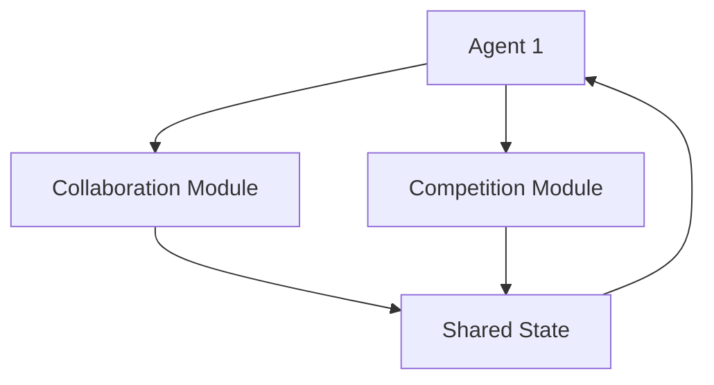

                 


# AI Agent的多Agent协作与竞争学习系统

> 关键词：AI Agent, 多Agent系统, 协作学习, 竞争学习, 博弈论, 强化学习

> 摘要：本文详细探讨了AI Agent在多Agent协作与竞争学习系统中的核心原理和应用。通过分析协作与竞争的机制，结合实际案例，揭示了多Agent系统在现代技术中的重要性，并为未来研究提供了方向。

---

## 第一部分：AI Agent的多Agent系统背景与概念

### 第1章：AI Agent的基本概念

#### 1.1 AI Agent的定义与特点
- **AI Agent**：具备感知环境、自主决策、执行任务的智能实体。
- **特点**：智能性、自主性、反应性、社交能力。

#### 1.2 多Agent系统的特点
- **分布式计算**：多个Agent协作完成任务。
- **自主决策**：每个Agent独立决策，无需中央控制。
- **动态环境**：适应环境变化，实时调整策略。

#### 1.3 应用场景
- **自动驾驶**：多个车辆协作避免碰撞。
- **智能客服**：多个虚拟助手竞争提供最佳解决方案。

---

### 第2章：协作与竞争的基本概念

#### 2.1 协作与竞争的定义
- **协作**：多个Agent共同完成任务，实现共赢。
- **竞争**：多个Agent争夺资源，实现单赢。

#### 2.2 协作与竞争的关系
- **动态平衡**：根据环境切换协作或竞争模式。
- **博弈论基础**：用纳什均衡分析策略选择。

#### 2.3 协作与竞争的数学模型
协作：
$$ \text{收益} = \sum_{i=1}^{n} r_i $$
竞争：
$$ \text{收益} = \max_{i=1}^{n} r_i $$

---

## 第二部分：多Agent协作与竞争的核心概念与联系

### 第3章：协作学习的算法原理

#### 3.1 基于博弈论的协作学习
- **纳什均衡**：每个Agent策略无法单方面改变以提高收益。
- **实现步骤**：
  1. 确定策略空间。
  2. 计算收益矩阵。
  3. 找到纳什均衡点。

#### 3.2 分布式协作学习
- **分布式梯度下降**：Agent间共享梯度信息，同步更新模型参数。
- **代码示例**：
  ```python
  import numpy as np

  agents = 4
  parameters = np.random.rand(agents, 10)

  for _ in range(100):
      gradients = [agent.compute_gradient() for agent in agents]
      updated_parameters = [params + np.mean(gradients) for params in parameters]
  ```

#### 3.3 多Agent强化学习
- **目标**：通过协作最大化总奖励。
- **算法**：使用分布式Actor-Critic网络。

---

### 第4章：竞争学习的算法原理

#### 4.1 基于博弈论的竞争学习
- **实现步骤**：
  1. 确定竞争规则。
  2. 计算每个Agent的竞争策略。
  3. 更新策略以最大化收益。

#### 4.2 对抗训练方法
- **生成器与判别器**：如GAN模型。
- **代码示例**：
  ```python
  import torch

  G = Generator()
  D = Discriminator()

  for _ in range(1000):
      z = torch.randn(1, 100)
      g_out = G(z)
      d_out_real = D(real_data)
      d_out_fake = D(g_out)
      D_loss = torch.mean(torch.log(d_out_real) + torch.log(1 - d_out_fake))
      G_loss = torch.mean(-torch.log(d_out_fake))
      D_optimizer.zero_grad()
      D_loss.backward()
      D_optimizer.step()
      G_optimizer.zero_grad()
      G_loss.backward()
      G_optimizer.step()
  ```

---

## 第三部分：系统分析与架构设计

### 第5章：系统架构设计

#### 5.1 问题场景
- **智能交通系统**：多辆自动驾驶汽车协作与竞争。

#### 5.2 系统功能设计
- **协作模块**：避免碰撞，协调行驶。
- **竞争模块**：争夺最优路径。

#### 5.3 系统架构图


#### 5.4 接口设计
- **输入接口**：接收环境感知数据。
- **输出接口**：发送决策指令。

---

## 第四部分：项目实战

### 第6章：智能交通系统案例

#### 6.1 环境安装
- **工具**：Python、TensorFlow、NumPy。
- **安装步骤**：
  ```bash
  pip install numpy tensorflow matplotlib
  ```

#### 6.2 核心代码实现
- **协作模块**：
  ```python
  def avoid_collision(agents):
      for agent in agents:
          agent.check_collision()
          agent.plan newPath()
  ```

- **竞争模块**：
  ```python
  def find_optimal_route(agents):
      for agent in agents:
          agent.compute_route_cost()
          agent.select_optimal_path()
  ```

#### 6.3 实际案例分析
- **场景**：两辆汽车竞争同一车道。
- **结果**：一辆车让行，另一辆车通过，减少拥堵。

---

## 第五部分：总结与展望

### 第7章：总结与未来研究方向

#### 7.1 总结
- **协作与竞争**：动态平衡是关键。
- **算法优化**：博弈论与强化学习结合。

#### 7.2 未来研究方向
- **混合机制**：结合协作与竞争。
- **复杂环境适应**：提高系统鲁棒性。

#### 7.3 学习建议
- **理论基础**：博弈论、强化学习。
- **实践项目**：从简单场景开始，逐步复杂化。

#### 7.4 注意事项
- **数据隐私**：多Agent系统需注意数据安全。
- **计算资源**：大规模系统需要高性能计算。

#### 7.5 拓展阅读
- 推荐书籍：《Multi-Agent Systems》、《Reinforcement Learning》。
- 推荐论文：相关领域的最新研究成果。

---

通过本文，我们系统地探讨了AI Agent的多Agent协作与竞争学习系统的核心概念、算法原理和实际应用。希望读者能从中获得深入的理解，并在实际项目中灵活应用这些知识。

