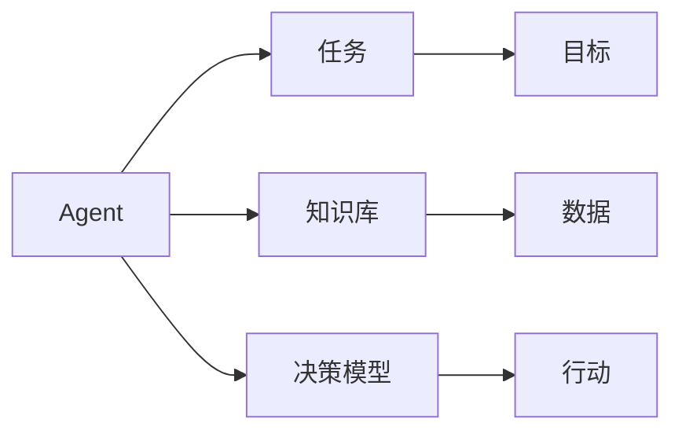
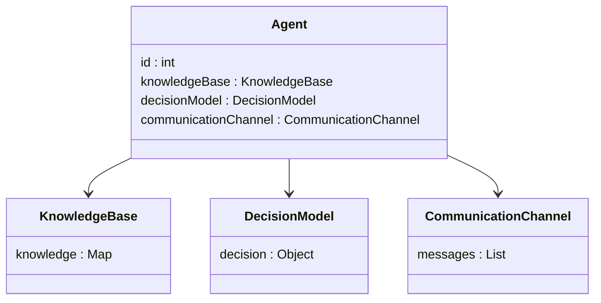
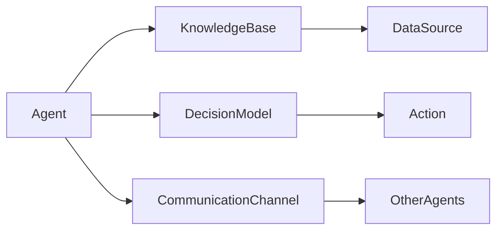

                 


# AI Agent的多Agent协同推理与决策

> 关键词：AI Agent, 多Agent系统, 协同推理, 多智能体强化学习, 知识表示

> 摘要：本文探讨了AI Agent的多Agent协同推理与决策问题，重点分析了多Agent系统的基本概念、协同推理与决策的核心算法、系统架构设计以及实际项目实现。通过详细分析，提出了基于分布式推理和强化学习的解决方案，为实际应用提供了理论基础和实践指导。

---

## 第一章: AI Agent与多Agent系统概述

### 1.1 AI Agent的基本概念
AI Agent（智能体）是指能够感知环境、自主决策并执行任务的实体。AI Agent可以是软件程序、机器人或其他智能系统，其核心特征包括自主性、反应性、目标导向性和学习能力。例如，一个智能音箱（如Alexa）就是一个典型的AI Agent，它能够响应用户的指令、执行任务并提供反馈。

#### 1.1.1 AI Agent的定义与特征
- **自主性**：AI Agent能够自主决策，无需外部干预。
- **反应性**：能够实时感知环境并做出反应。
- **目标导向性**：基于目标进行推理和决策。
- **学习能力**：通过经验改进性能。

#### 1.1.2 多Agent系统的概念
多Agent系统是由多个智能体组成的系统，这些智能体能够通过通信和协作完成复杂任务。例如，自动驾驶汽车中的多个子系统（路径规划、障碍检测、决策控制）可以看作是一个多Agent系统。

#### 1.1.3 多Agent系统的应用领域
- **分布式计算**：任务分解和并行处理。
- **机器人协作**：多机器人团队合作完成任务。
- **分布式推荐系统**：多个推荐引擎协同工作。

### 1.2 多Agent协同推理与决策的背景
随着AI技术的快速发展，多Agent系统在各个领域的应用越来越广泛。然而，多Agent系统的设计和实现面临诸多挑战，如如何实现高效的知识共享、如何解决冲突和协调问题、如何处理动态环境下的实时决策等。

#### 1.2.1 当前AI技术的发展趋势
- **分布式AI**：从单一智能体向多智能体系统发展。
- **边缘计算**：智能体分布在边缘设备中，减少延迟。
- **人机协作**：人与智能体协同工作。

#### 1.2.2 多Agent系统在AI中的重要性
多Agent系统能够利用多个智能体的协同优势，解决单一智能体无法完成的复杂任务。例如，在智能城市中，交通管理、能源调度和环境监测可以由多个智能体协同完成。

#### 1.2.3 协同推理与决策的现实需求
现实世界中的许多问题需要多个智能体协同解决，例如：
- **智能交通系统**：多个车辆、交通灯和路障需要协同工作。
- **智能家居**：多个设备（如空调、电视、灯光）需要协同控制。

### 1.3 问题背景与问题描述
多Agent协同推理与决策的核心问题是如何实现多个智能体之间的高效通信、知识共享和协作决策。

#### 1.3.1 多Agent协同中的问题分析
- **通信开销**：智能体之间的通信可能导致资源消耗过大。
- **知识共享**：如何确保智能体之间共享必要的知识而不泄露隐私。
- **动态环境**：环境中的变化可能导致决策需要频繁更新。

#### 1.3.2 协同推理与决策的核心问题
- **分布式推理**：如何在分布式环境中进行推理。
- **决策一致性**：如何确保多个智能体的决策一致。
- **实时性**：如何在动态环境中实时决策。

#### 1.3.3 问题的边界与外延
- **边界**：限定在特定任务和环境内，例如智能交通系统中的车辆路径规划。
- **外延**：扩展到其他领域，例如智能医疗、智能教育等。

## 第二章: 多Agent协同推理与决策的核心概念

### 2.1 多Agent系统的基本原理
多Agent系统由多个智能体组成，这些智能体通过通信和协作完成任务。每个智能体都有自己的目标和功能，能够独立工作，同时与其他智能体协同。

#### 2.1.1 Agent的结构与行为
- **结构**：包括感知、推理、决策和执行模块。
- **行为**：根据感知到的信息做出决策并执行动作。

#### 2.1.2 多Agent系统中的通信与协作
- **通信**：智能体之间通过消息传递共享信息。
- **协作**：通过分工合作完成共同目标。

#### 2.1.3 协同推理的基本机制
- **分布式推理**：每个智能体独立推理，然后共享结果。
- **集中式推理**：由一个中央智能体进行推理，其他智能体提供数据。

### 2.2 协同推理与决策的关键要素
协同推理与决策需要多个智能体之间的高效协作，关键要素包括知识表示、逻辑推理和决策模型。

#### 2.2.1 知识表示与共享
- **知识表示**：使用符号逻辑、本体论或图结构表示知识。
- **知识共享**：通过通信协议共享知识，例如使用RDFS或OWL格式。

#### 2.2.2 逻辑推理与决策模型
- **逻辑推理**：基于知识库进行逻辑推理，例如使用一阶逻辑或描述逻辑。
- **决策模型**：基于推理结果制定决策，例如使用马尔可夫决策过程（MDP）。

#### 2.2.3 协同环境中的动态变化
- **动态环境**：环境中的变化需要智能体实时调整推理和决策。
- **不确定性处理**：通过概率推理或贝叶斯网络处理不确定性。

### 2.3 多Agent系统的概念属性对比
以下是多Agent系统中不同概念的对比表：

| 概念         | 特性                     |
|--------------|--------------------------|
| 单一智能体    | 独立运行，无协作          |
| 多智能体      | 协作完成任务             |
| 分布式推理    | 每个智能体独立推理       |
| 集中式推理    | 由中央智能体统一推理     |

### 2.4 ER实体关系图
以下是多Agent系统的ER实体关系图：



### 2.5 本章小结
本章介绍了AI Agent和多Agent系统的基本概念，分析了多Agent系统的核心要素，包括知识表示、逻辑推理和决策模型。同时，通过对比表和ER图展示了多Agent系统的关键概念和结构。

---

## 第三章: 多Agent协同推理与决策的算法原理

### 3.1 分布式推理算法
分布式推理算法是一种基于多智能体协同推理的算法，每个智能体独立推理，然后共享结果。

#### 3.1.1 分布式推理的基本原理
- 每个智能体基于本地知识进行推理。
- 智能体通过通信共享推理结果。
- 全局推理结果由所有智能体的推理结果综合得到。

#### 3.1.2 分布式推理的实现步骤
1. 每个智能体初始化本地知识库。
2. 智能体基于本地知识进行推理。
3. 智能体通过通信共享推理结果。
4. 全局推理结果由所有智能体的推理结果综合得到。

#### 3.1.3 分布式推理算法的优缺点
- **优点**：提高系统的可扩展性和容错性。
- **缺点**：通信开销大，推理结果可能不一致。

### 3.2 多智能体强化学习
多智能体强化学习是一种通过多个智能体协作学习的算法，适用于动态和复杂的环境。

#### 3.2.1 多智能体强化学习的基本原理
- 多个智能体在环境中协作学习。
- 每个智能体通过与环境和其他智能体的交互获得奖励。
- 智能体通过策略优化实现协作。

#### 3.2.2 多智能体强化学习的实现步骤
1. 初始化多个智能体。
2. 智能体与环境和其他智能体交互。
3. 智能体通过策略优化获得奖励。
4. 智能体更新策略并共享经验。

#### 3.2.3 多智能体强化学习的优缺点
- **优点**：适用于动态和复杂环境。
- **缺点**：协作过程复杂，容易出现竞争和冲突。

### 3.3 多Agent决策过程的数学模型
以下是多Agent决策过程的数学模型：

$$
\text{目标函数} = \sum_{i=1}^{n} w_i x_i
$$

其中，\( w_i \) 是权重，\( x_i \) 是决策变量。

### 3.4 本章小结
本章介绍了分布式推理和多智能体强化学习两种算法，分析了它们的实现步骤和优缺点。同时，通过数学模型展示了多Agent决策过程。

---

## 第四章: 多Agent协同推理与决策的系统分析

### 4.1 系统分析与设计
系统分析与设计是多Agent协同推理与决策的关键步骤。

#### 4.1.1 系统分析
- **问题场景**：识别需要解决的问题。
- **功能需求**：确定系统需要实现的功能。
- **性能需求**：确定系统的性能指标。

#### 4.1.2 系统设计
- **领域模型**：通过类图展示系统结构。
- **系统架构**：通过架构图展示系统设计。
- **接口设计**：通过接口图展示系统接口。

### 4.2 系统架构设计
系统架构设计是多Agent协同推理与决策的核心部分。

#### 4.2.1 领域模型
以下是领域模型的类图：



#### 4.2.2 系统架构
以下是系统架构的架构图：



### 4.3 本章小结
本章通过系统分析与设计，展示了多Agent协同推理与决策的系统架构设计。通过类图和架构图展示了系统的结构和功能。

---

## 第五章: 多Agent协同推理与决策的项目实战

### 5.1 项目实战
项目实战是多Agent协同推理与决策的重要部分。

#### 5.1.1 环境安装
- **Python**：安装Python 3.x。
- **依赖库**：安装numpy、pandas、scikit-learn等。

#### 5.1.2 核心代码实现
以下是核心代码实现：

```python
class Agent:
    def __init__(self, id):
        self.id = id
        self.knowledge = {}
        self.decision = None

    def perceive(self, environment):
        self.knowledge = self.update_knowledge(environment)

    def reason(self):
        self.decision = self.make_decision(self.knowledge)

    def act(self):
        self.execute_action(self.decision)

def main():
    agents = [Agent(1), Agent(2)]
    environment = {'temperature': 25, 'time': 'day'}
    for agent in agents:
        agent.perceive(environment)
        agent.reason()
        agent.act()

if __name__ == "__main__":
    main()
```

#### 5.1.3 代码解读与分析
- **Agent类**：表示智能体，包含感知、推理和执行方法。
- **main函数**：初始化多个智能体，运行它们的感知、推理和执行过程。

### 5.2 实际案例分析
实际案例分析是多Agent协同推理与决策的重要部分。

#### 5.2.1 案例背景
例如，智能交通系统中的车辆路径规划问题。

#### 5.2.2 案例实现
以下是案例实现：

```python
class VehicleAgent:
    def __init__(self, id):
        self.id = id
        self.position = (0, 0)
        self.destination = (10, 10)

    def perceive(self, environment):
        self.update_position(environment)

    def decide(self):
        self.plan_route()

    def move(self):
        self.execute_move()

def main():
    vehicle = VehicleAgent(1)
    environment = {'road': 'free'}
    vehicle.perceive(environment)
    vehicle.decide()
    vehicle.move()

if __name__ == "__main__":
    main()
```

### 5.3 本章小结
本章通过项目实战，展示了多Agent协同推理与决策的实现过程。通过具体案例分析，帮助读者理解理论知识。

---

## 第六章: 多Agent协同推理与决策的最佳实践

### 6.1 最佳实践
最佳实践是多Agent协同推理与决策的重要部分。

#### 6.1.1 小结
- **系统设计**：注重系统的可扩展性和可维护性。
- **算法选择**：根据具体场景选择合适的算法。
- **通信机制**：设计高效的通信机制，减少通信开销。

#### 6.1.2 注意事项
- **通信开销**：通信过多可能导致系统性能下降。
- **知识共享**：知识共享需要考虑隐私和安全。
- **动态环境**：系统需要能够适应环境的变化。

#### 6.1.3 未来展望
- **边缘计算**：智能体分布在边缘设备中，减少延迟。
- **人机协作**：人与智能体协同工作，提高效率。
- **自适应算法**：智能体能够自适应环境变化。

### 6.2 本章小结
本章总结了多Agent协同推理与决策的最佳实践，提出了小结、注意事项和未来展望。

---

## 总结

本文详细探讨了AI Agent的多Agent协同推理与决策问题，分析了多Agent系统的基本概念、协同推理与决策的核心算法、系统架构设计以及实际项目实现。通过详细分析，提出了基于分布式推理和强化学习的解决方案，为实际应用提供了理论基础和实践指导。

--- 

如果需要进一步扩展或调整，请随时告诉我！

