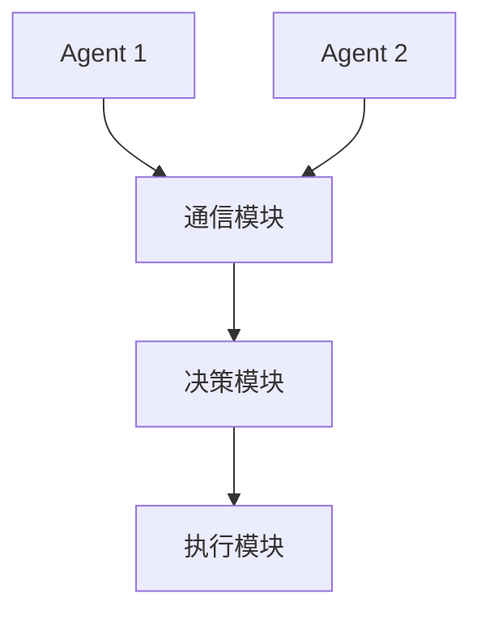
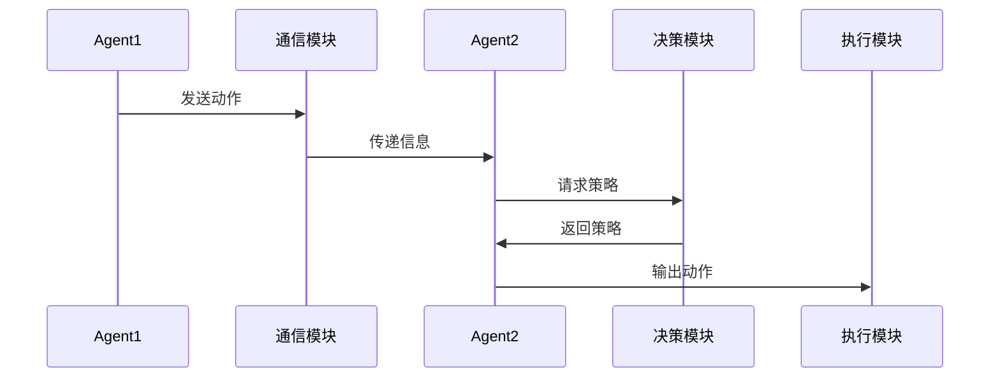

                 


# AI Agent的多Agent博弈与策略学习

## 关键词：AI Agent, 多Agent博弈, 策略学习, 强化学习, Q-learning, 多Agent系统

## 摘要：  
本文深入探讨AI Agent在多Agent博弈中的策略学习，从基本概念到算法实现，再到系统设计与项目实战，全面解析多Agent博弈的核心原理与应用场景。文章通过丰富的案例分析和详细的代码实现，帮助读者理解如何在复杂环境中设计和优化AI Agent的策略，掌握多Agent博弈中的关键技术和最佳实践。

---

## 第1章 AI Agent与多Agent系统概述

### 1.1 AI Agent的基本概念
#### 1.1.1 AI Agent的定义
AI Agent（人工智能代理）是指能够感知环境、自主决策并采取行动的智能实体。它可以是一个软件程序、机器人或其他智能系统，核心目标是通过与环境交互实现特定任务。

#### 1.1.2 AI Agent的核心特征
- **自主性**：能够独立决策和行动。
- **反应性**：能够实时感知环境并做出响应。
- **目标导向性**：基于目标驱动行为。
- **学习能力**：能够通过经验改进性能。

#### 1.1.3 AI Agent与传统AI的区别
| 特性         | 传统AI                     | AI Agent                  |
|--------------|---------------------------|---------------------------|
| 行为方式     | 离线计算，无自主行动       | 实时交互，自主决策         |
| 环境适应性   | 固定场景，缺乏灵活性       | 适应动态环境，灵活调整     |
| 学习能力     | 依赖人工编程               | 具备自主学习能力           |

---

### 1.2 多Agent系统的基本概念
#### 1.2.1 多Agent系统的定义
多Agent系统是由多个相互作用的AI Agent组成的分布式系统，这些Agent通过协作或竞争完成复杂的任务。

#### 1.2.2 多Agent系统的分类
- **独立式多Agent系统**：Agent之间无共享目标，各自独立完成任务。
- **协作式多Agent系统**：Agent之间通过协作完成共同目标。
- **对抗式多Agent系统**：Agent之间存在竞争关系，如博弈场景。

#### 1.2.3 多Agent系统的特点与优势
- **分布式计算**：任务分解到多个Agent，提高系统效率。
- **动态适应性**：Agent能够根据环境变化调整行为。
- **容错性**：单个Agent故障不影响整体系统运行。

---

### 1.3 多Agent博弈的基本概念
#### 1.3.1 博弈论基础
博弈论是研究理性决策者在策略互动中的行为科学，核心概念包括参与者、策略、收益等。

#### 1.3.2 多Agent博弈的定义
多Agent博弈是指多个Agent在共享环境中竞争或合作，通过选择策略最大化自身收益的过程。

#### 1.3.3 多Agent博弈的应用场景
- **游戏AI**：如MOBA游戏中的英雄协作。
- **自动驾驶**：车辆间实时博弈以避免碰撞。
- **金融交易**：高频交易算法之间的博弈。

---

### 1.4 策略学习的基本概念
#### 1.4.1 策略学习的定义
策略学习是指AI Agent通过经验或训练，学习如何在特定环境下选择最优策略以实现目标。

#### 1.4.2 策略学习的核心方法
- **强化学习**：通过试错和奖励机制优化策略。
- **监督学习**：基于历史数据训练策略模型。
- **无监督学习**：从数据中发现隐含模式。

#### 1.4.3 策略学习的应用领域
- **游戏开发**：训练AI Agent在复杂环境中做出决策。
- **机器人控制**：优化机器人的动作策略。
- **金融投资**：制定股票交易策略。

---

## 第2章 多Agent博弈的核心原理

### 2.1 多Agent博弈的模型与框架
#### 2.1.1 博弈模型的构建
博弈模型包括参与者、策略空间、收益矩阵和博弈规则。

#### 2.1.2 多Agent博弈的框架
- **Agent角色分配**：明确每个Agent的职责。
- **信息交换机制**：定义Agent之间的通信方式。
- **决策机制**：制定策略选择和行动规则。

#### 2.1.3 博弈树与博弈图的构建
博弈树展示所有可能的决策路径，博弈图则用于描述持续的博弈过程。

---

### 2.2 多Agent博弈中的角色与交互
#### 2.2.1 Agent的角色定义
- **主导者**：负责制定战略。
- **执行者**：具体执行任务。
- **监督者**：监控全局状态。

#### 2.2.2 Agent之间的交互规则
- **通信协议**：定义信息传递格式。
- **协作规则**：规定合作方式和目标。
- **冲突解决机制**：处理利益冲突。

---

### 2.3 多Agent博弈中的策略与决策
#### 2.3.1 策略的定义与分类
- **静态策略**：固定策略，不随环境变化。
- **动态策略**：根据环境调整的策略。

#### 2.3.2 策略的选择与优化
- **贪心算法**：每一步选择局部最优。
- **动态规划**：全局优化，考虑长期收益。

#### 2.3.3 策略的动态调整与更新
通过强化学习等方法，实时更新策略以适应环境变化。

---

### 2.4 多Agent博弈中的冲突与合作
#### 2.4.1 冲突的定义与解决方法
- **冲突识别**：检测潜在冲突。
- **利益平衡**：寻找折中方案。
- **协调机制**：通过协商解决冲突。

#### 2.4.2 合作的定义与实现机制
- **合作协议**：明确合作目标和规则。
- **信任机制**：建立Agent之间的信任关系。

#### 2.4.3 冲突与合作的平衡策略
通过博弈论模型，找到最优平衡点。

---

## 第3章 基于强化学习的策略学习

### 3.1 强化学习的基本原理
#### 3.1.1 强化学习的定义
强化学习是一种通过试错和奖励机制优化决策过程的学习方法。

#### 3.1.2 强化学习的核心要素
- **状态（State）**：当前环境的描述。
- **动作（Action）**：Agent的决策。
- **奖励（Reward）**：对决策的反馈。
- **策略（Policy）**：决策规则。

#### 3.1.3 强化学习的数学模型
策略函数可表示为：  
$$ \pi(a|s) = P(\text{选择动作 }a | \text{状态 }s) $$

---

### 3.2 Q-learning算法在多Agent博弈中的应用
#### 3.2.1 Q-learning算法的原理
Q-learning通过更新Q值表，学习最优策略。  
Q值更新公式：  
$$ Q(s, a) = Q(s, a) + \alpha [r + \max_{a'} Q(s', a') - Q(s, a)] $$

#### 3.2.2 Q-learning算法在多Agent博弈中的实现
使用Python实现一个多Agent Q-learning算法：

```python
class Agent:
    def __init__(self, state_space, action_space):
        self.state_space = state_space
        self.action_space = action_space
        self.q_table = np.zeros((state_space, action_space))
    
    def choose_action(self, state):
        if np.random.random() < 0.5:
            return np.random.choice(self.action_space)
        else:
            return np.argmax(self.q_table[state])
    
    def update_q_table(self, current_state, action, reward, next_state):
        self.q_table[current_state, action] += 0.1 * (reward + np.max(self.q_table[next_state]) - self.q_table[current_state, action])
```

#### 3.2.3 Q-learning算法的优缺点
- **优点**：简单易实现，适合离线学习。
- **缺点**：难以处理动态博弈环境，收敛速度慢。

---

## 第4章 多Agent博弈系统分析与架构设计

### 4.1 问题场景介绍
考虑一个多Agent博弈系统，如自动驾驶车辆在交通中的博弈。

### 4.2 系统功能设计
- **感知模块**：获取环境信息。
- **决策模块**：制定策略。
- **执行模块**：输出动作。

### 4.3 系统架构设计
使用Mermaid图展示系统架构：



### 4.4 系统接口设计
- **通信接口**：定义Agent之间的信息传递格式。
- **决策接口**：定义策略选择的规则。
- **执行接口**：定义动作输出的格式。

### 4.5 系统交互流程
使用Mermaid序列图展示交互流程：



---

## 第5章 项目实战与最佳实践

### 5.1 环境安装
安装必要的库，如`numpy`、`matplotlib`等。

### 5.2 核心实现
实现一个多Agent Q-learning算法，用于解决交通博弈问题。

### 5.3 案例分析
分析一个具体的多Agent博弈案例，如自动驾驶车辆的路径规划。

### 5.4 最佳实践 tips
- **系统设计**：明确Agent的角色和交互规则。
- **算法选择**：根据场景选择合适的策略学习方法。
- **性能优化**：通过并行计算加速训练过程。

---

## 第6章 总结与展望

### 6.1 本章小结
本文详细介绍了AI Agent在多Agent博弈中的策略学习，从基础概念到算法实现，再到系统设计，全面解析了多Agent博弈的核心技术。

### 6.2 展望
未来，随着AI技术的发展，多Agent博弈将在更多领域得到应用，如智慧城市、智能交通等。

---

## 参考文献
- 略

