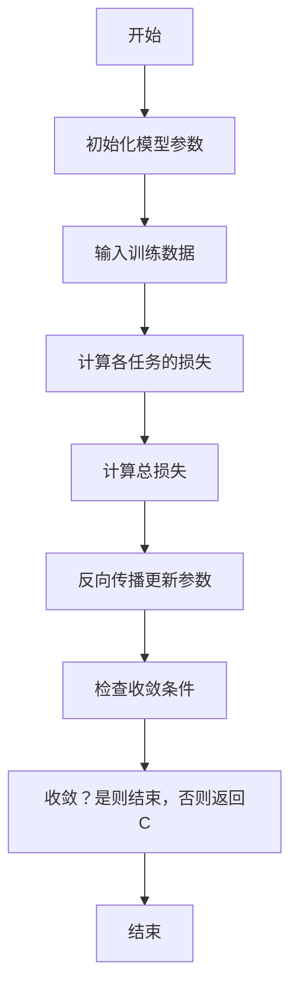
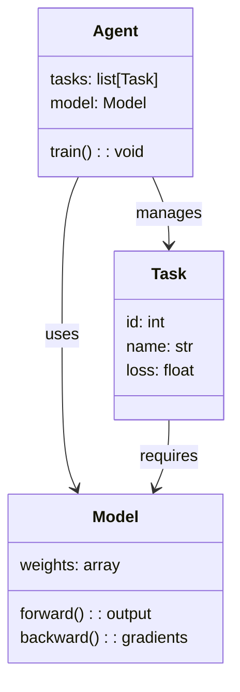
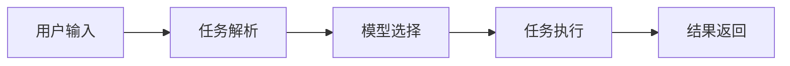

                 


# AI Agent的多任务学习：构建通用智能助手

> 关键词：AI Agent，多任务学习，通用智能助手，机器学习，任务建模

> 摘要：本文深入探讨AI Agent的多任务学习方法，详细阐述构建通用智能助手的核心技术与实现方案。通过分析多任务学习的原理、算法、数学模型以及系统架构，结合实际案例，提供全面的技术指导，帮助读者理解并应用AI Agent多任务学习技术。

---

# 第一部分: AI Agent与多任务学习概述

## 第1章: AI Agent的基本概念

### 1.1 AI Agent的定义与特征

- **定义**：AI Agent（智能体）是指能够感知环境、自主决策并执行任务的智能系统。  
- **特征**：  
  - 感知能力：通过传感器或接口获取环境信息。  
  - 决策能力：基于感知信息做出最优决策。  
  - 执行能力：通过执行机构或算法实现任务。  
  - 学习能力：通过经验改进性能。  

### 1.2 多任务学习的背景与意义

- **背景**：传统AI系统通常专注于单一任务，但在实际应用中，智能助手需要处理多种任务，如自然语言理解、推理、规划等。  
- **意义**：多任务学习（Multi-Task Learning, MTL）通过共享任务间的知识，提升模型的通用性和效率，降低训练数据的需求。  

### 1.3 AI Agent多任务学习的目标

- **目标**：构建一个能够同时处理多种任务的AI Agent，使其具备更强的通用性和灵活性。  
- **愿景**：实现类似人类的通用智能，能够自然地处理复杂场景中的多种任务。  

---

# 第二部分: 多任务学习的核心概念与原理

## 第2章: 多任务学习的核心概念

### 2.1 多任务学习的基本原理

- **任务之间的关系**：  
  - 相关任务：任务之间存在知识共享的可能性（如自然语言处理和文本分类）。  
  - 不相关任务：任务之间没有明显的关联（如图像识别和语音识别）。  

- **模型共享机制**：  
  - 参数共享：多个任务共享部分网络参数，降低模型复杂度。  
  - 模块共享：任务共享特定功能模块（如编码器或解码器）。  

### 2.2 多任务学习的关键属性

- **任务相关性分析**：通过分析任务之间的关联性，决定共享的深度和广度。  
- **模型共享策略**：根据任务需求选择共享方式，如权重共享、模块共享等。  
- **任务权重的动态调整**：根据任务的重要性动态调整学习权重，避免某些任务主导整体训练过程。  

### 2.3 多任务学习的挑战与解决方案

- **任务间干扰的问题**：某些任务可能相互抑制，影响整体性能。  
  - 解决方案：任务分解、任务权重动态调整。  
- **模型容量的优化**：避免过度共享导致模型性能下降。  
  - 解决方案：分层共享、模块化设计。  

---

# 第三部分: 多任务学习的算法原理

## 第3章: 多任务学习的算法原理

### 3.1 基于权重共享的多任务学习

- **基本思想**：通过共享部分权重参数，降低模型参数数量，提升学习效率。  
- **损失函数的设计**：  
  $$ L = \lambda_1 L_1 + \lambda_2 L_2 + \dots + \lambda_n L_n $$  
  其中，$\lambda_i$为任务权重，$L_i$为任务$i$的损失函数。  

- **参数更新策略**：在反向传播过程中，同时更新所有任务的共享参数和专用参数。  

### 3.2 基于任务分解的多任务学习

- **任务分解的方法**：将复杂的多任务分解为多个子任务，分别优化。  
- **分层模型的构建**：通过分层网络结构，实现任务间的模块化共享。  

### 3.3 基于任务相关性的多任务学习

- **任务相关性的度量**：使用相似度或相关系数衡量任务之间的关联性。  
- **关联权重的动态调整**：根据任务相关性动态调整共享权重，优化模型性能。  

### 3.4 算法流程图



---

# 第四部分: 多任务学习的数学模型与公式

## 第4章: 多任务学习的数学模型

### 4.1 多任务学习的损失函数

- **公式**：  
  $$ L = \sum_{i=1}^n \lambda_i L_i $$  
  其中，$\lambda_i$为任务$i$的权重，$L_i$为任务$i$的损失函数。  

- **权重调整策略**：  
  $$ \lambda_i = \frac{1}{1 + e^{-\alpha t_i}} $$  
  其中，$\alpha$为超参数，$t_i$为任务$i$的训练时间。  

### 4.2 权重共享机制

- **共享权重的表达式**：  
  $$ W_{\text{shared}} \in \mathbb{R}^{d \times k} $$  
  其中，$d$为输入维度，$k$为共享权重的维度。  

- **专用权重的表达式**：  
  $$ W_{\text{task-specific}} \in \mathbb{R}^{k \times m} $$  
  其中，$m$为输出维度。  

---

# 第五部分: 系统分析与架构设计方案

## 第5章: 系统分析与架构设计

### 5.1 项目背景与目标

- **背景**：构建一个通用智能助手，支持多种任务，如自然语言理解、推理、规划等。  
- **目标**：实现多任务学习，提升智能助手的通用性和效率。  

### 5.2 系统功能设计

- **领域模型（Mermaid类图）**：



### 5.3 系统架构设计

- **架构图（Mermaid架构图）**：



---

# 第六部分: 项目实战与应用

## 第6章: 项目实战

### 6.1 环境安装与配置

- **Python环境**：安装Python 3.8以上版本。  
- **依赖库**：安装TensorFlow、Keras、numpy等。  

### 6.2 核心代码实现

- **多任务学习模型实现**：

```python
import tensorflow as tf
from tensorflow import keras

# 定义多任务模型
def multi_task_model(input_shape, num_tasks):
    inputs = keras.Input(shape=input_shape)
    shared_layer = keras.layers.Dense(64, activation='relu')(inputs)
    outputs = []
    for _ in range(num_tasks):
        task_layer = keras.layers.Dense(32, activation='relu')(shared_layer)
        outputs.append(keras.layers.Dense(1, name=f'task_{_}')(task_layer))
    model = keras.Model(inputs=inputs, outputs=outputs)
    return model

# 编译模型
model = multi_task_model((input_dim,), num_tasks)
model.compile(optimizer='adam', loss={'task_0': 'mse', 'task_1': 'mse'})
```

### 6.3 代码解读与分析

- **模型结构**：通过共享层实现任务之间的参数共享。  
- **损失函数**：每个任务使用均方误差损失函数。  
- **优化器**：使用Adam优化器，学习率为默认值。  

### 6.4 实际案例分析

- **案例背景**：构建一个多任务模型，同时处理文本分类和情感分析任务。  
- **数据准备**：分别准备两个任务的数据集。  
- **训练过程**：通过联合训练，模型在两个任务之间共享知识，提升整体性能。  

---

# 第七部分: 最佳实践与总结

## 第7章: 最佳实践

### 7.1 小结

- 多任务学习通过共享知识，显著提升了AI Agent的通用性和效率。  
- 在实际应用中，需要根据任务需求选择合适的共享策略和模型架构。  

### 7.2 注意事项

- **任务相关性分析**：避免无关任务的干扰。  
- **任务权重调整**：动态调整任务权重，确保各任务均衡发展。  
- **模型评估**：分别评估各任务的性能，确保多任务学习的有效性。  

### 7.3 拓展阅读

- 《Multi-Task Learning》（周志华）  
- 《Deep Learning for Multi-Task Mobile Computing》（李航）  

---

# 结语

通过本文的详细讲解，读者可以深入了解AI Agent的多任务学习方法，掌握构建通用智能助手的核心技术。希望本文能为相关领域的研究和实践提供有价值的参考。

