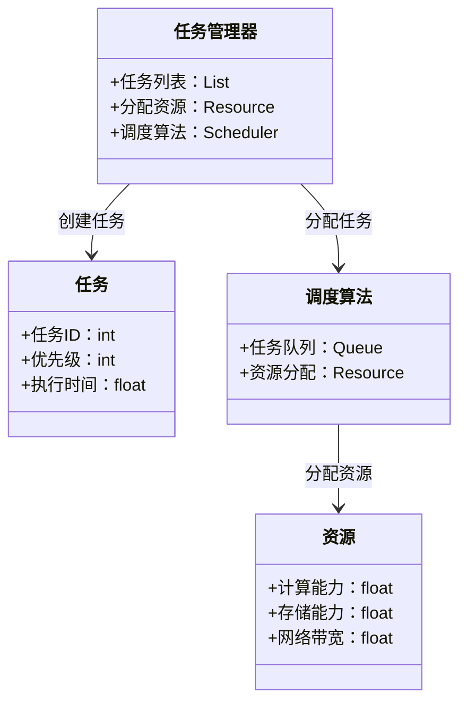
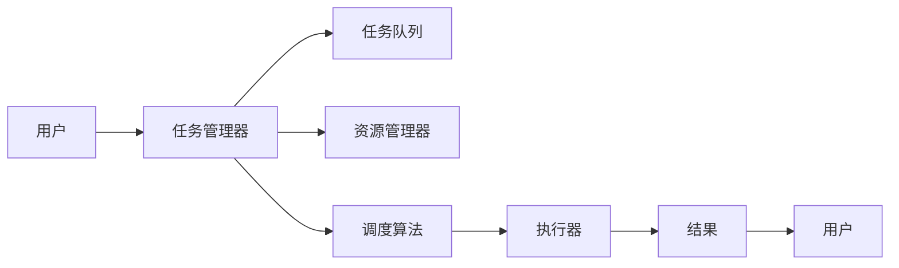
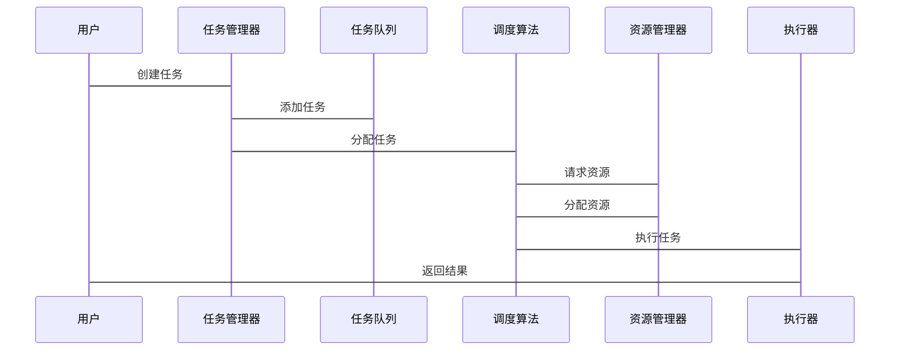

                 


# AI Agent的多任务并行处理能力开发

> **关键词**：AI Agent，多任务并行处理，任务分配，调度算法，资源管理，系统架构

> **摘要**：本文深入探讨了AI Agent在多任务并行处理中的核心能力开发。从背景介绍到核心概念，从算法原理到系统架构，再到项目实战，系统性地分析了AI Agent多任务并行处理的关键技术。文章结合数学公式、算法流程图、系统架构图和实际代码案例，详细阐述了AI Agent多任务并行处理的实现过程，为读者提供了一套完整的开发指南。

---

# 第一部分: AI Agent的多任务并行处理能力开发背景

## 第1章: AI Agent与多任务并行处理概述

### 1.1 AI Agent的基本概念

#### 1.1.1 AI Agent的定义
AI Agent（人工智能代理）是指在计算机系统中，能够感知环境并采取行动以实现目标的实体。它可以是一个软件程序，也可以是一个硬件系统，具备以下核心特征：
- **自主性**：能够在没有外部干预的情况下独立运行。
- **反应性**：能够感知环境并实时做出反应。
- **目标导向**：所有行为都围绕实现特定目标展开。

#### 1.1.2 AI Agent的核心特点
1. **自主性**：AI Agent能够在没有外部干预的情况下自主决策。
2. **反应性**：能够实时感知环境变化并做出反应。
3. **目标导向**：所有行为都以实现特定目标为核心。

#### 1.1.3 多任务并行处理的定义与特点
多任务并行处理是指AI Agent在同一时间或在重叠的时间段内处理多个任务的能力。其特点包括：
1. **并发性**：多个任务同时执行。
2. **资源竞争**：任务之间可能共享资源，需要进行资源管理。
3. **任务依赖**：任务之间可能存在依赖关系，需要进行任务调度。

### 1.2 多任务并行处理的背景与问题背景

#### 1.2.1 当前AI Agent的应用场景
AI Agent广泛应用于以下场景：
- **自动驾驶**：实时处理环境感知、路径规划等任务。
- **智能助手**：同时处理用户请求、信息检索、日程管理等任务。
- **机器人控制**：同时处理运动控制、物体识别、路径规划等任务。

#### 1.2.2 多任务并行处理的必要性
在复杂的实际场景中，AI Agent需要同时处理多个任务，例如自动驾驶中的环境感知、路径规划和决策制定。多任务并行处理能够提高系统的效率和响应速度。

#### 1.2.3 当前技术面临的挑战
1. **资源分配问题**：如何在有限的资源下高效分配任务。
2. **任务优先级问题**：如何确定任务的执行顺序。
3. **任务依赖问题**：如何处理任务之间的依赖关系。

### 1.3 多任务并行处理的边界与外延

#### 1.3.1 任务之间的关系与依赖
任务之间的关系可以分为以下几种：
1. **独立任务**：任务之间无依赖关系。
2. **串行任务**：任务之间存在严格的依赖关系，必须按顺序执行。
3. **并行任务**：任务之间可以并行执行，但可能存在资源竞争。

#### 1.3.2 并行处理的边界条件
1. **资源限制**：系统的计算能力、存储能力等资源限制。
2. **任务复杂度**：任务的复杂度和执行时间影响并行处理的可行性。
3. **任务优先级**：任务的优先级影响其执行顺序。

#### 1.3.3 多任务处理的外延与扩展
多任务处理的外延包括：
1. **分布式计算**：将任务分发到不同的计算节点上执行。
2. **异构计算**：利用不同的硬件资源（如CPU、GPU）进行任务处理。
3. **任务迁移**：动态调整任务的执行位置。

### 1.4 本章小结
本章从AI Agent的基本概念出发，详细介绍了多任务并行处理的背景、特点以及面临的挑战。同时，还探讨了任务之间的关系与依赖，明确了多任务并行处理的边界条件和外延。

---

# 第二部分: AI Agent多任务并行处理的核心概念

## 第2章: 多任务并行处理的核心概念与联系

### 2.1 核心概念原理

#### 2.1.1 任务分配与调度算法
任务分配是指将任务分配到不同的执行单元上，调度算法则是决定任务的执行顺序。任务分配和调度的核心目标是提高资源利用率和系统性能。

#### 2.1.2 并行执行机制
并行执行机制是指多个任务在同一个时间段内执行的能力。并行执行可以通过多线程、多进程或分布式计算实现。

#### 2.1.3 资源管理与优化
资源管理包括对计算资源、存储资源和网络资源的分配与优化，以确保任务能够高效执行。

### 2.2 核心概念属性特征对比

#### 2.2.1 任务类型对比分析
| 任务类型 | 独立任务 | 串行任务 | 并行任务 |
|----------|----------|----------|----------|
| 执行方式 | 并行执行 | 串行执行 | 并行执行 |
| 依赖关系 | 无依赖 | 有依赖 | 无依赖或部分依赖 |
| 资源需求 | 较低 | 较高 | 较高 |

#### 2.2.2 并行度与资源利用率对比
| 并行度 | 高 | 中 | 低 |
|--------|----|----|----|
| 资源利用率 | 高 | 中 | 低 |

#### 2.2.3 任务优先级与调度策略对比
| 任务优先级 | 高 | 中 | 低 |
|------------|----|----|----|
| 调度策略 | FIFO | LIFO | 优先级调度 |

### 2.3 ER实体关系图架构

```mermaid
erDiagram
    actor 用户
    actor 系统
    actor 任务
    actor 资源
    用户 -> 系统 : 发起任务
    系统 -> 任务 : 分配任务
    任务 -> 资源 : 使用资源
    系统 -> 用户 : 返回结果
```

---

## 第3章: 多任务并行处理的算法原理

### 3.1 任务分配与调度算法

#### 3.1.1 任务分配算法的数学模型

$$ \text{任务分配} = \argmin_{x} \sum_{i=1}^{n} (t_i - x_i) $$

其中，$t_i$ 是任务 $i$ 的执行时间，$x_i$ 是分配给执行单元 $x$ 的任务数。

#### 3.1.2 调度算法的实现流程

```mermaid
graph TD
    A[开始] -> B[选择任务] -> C[分配资源] -> D[执行任务] -> E[返回结果] -> F[结束]
```

#### 3.1.3 算法的优缺点对比

| 算法类型 | FIFO | LIFO | 优先级调度 |
|----------|-------|-------|------------|
| 优点 | 实现简单 | 实现简单 | 适合高优先级任务 |
| 缺点 | 资源利用率低 | 资源利用率低 | 需要优先级管理 |

### 3.2 并行执行机制的算法实现

#### 3.2.1 并行执行的数学模型

$$ \text{并行度} = \min(k, n) $$

其中，$k$ 是可用的并行核心数，$n$ 是任务数量。

#### 3.2.2 并行执行的实现流程

```mermaid
graph TD
    A[开始] -> B[分配任务] -> C[并行执行] -> D[合并结果] -> E[返回结果] -> F[结束]
```

---

## 第4章: 系统分析与架构设计方案

### 4.1 问题场景介绍

#### 4.1.1 问题场景描述
AI Agent需要在自动驾驶场景中同时处理环境感知、路径规划和决策制定三个任务。

#### 4.1.2 系统功能需求
1. **环境感知**：实时感知周围环境。
2. **路径规划**：规划最优路径。
3. **决策制定**：根据环境变化动态调整路径。

### 4.2 系统功能设计

#### 4.2.1 领域模型设计



### 4.3 系统架构设计

#### 4.3.1 系统架构图



### 4.4 系统接口设计

#### 4.4.1 系统接口描述
1. **任务创建接口**：创建新任务并添加到任务队列。
2. **资源分配接口**：根据任务需求分配资源。
3. **任务执行接口**：执行分配的任务并返回结果。

#### 4.4.2 系统交互序列图



---

## 第5章: 项目实战

### 5.1 环境安装

#### 5.1.1 环境需求
1. Python 3.8+
2. Mermaid 图形库
3. Git 版本控制工具

### 5.2 系统核心实现源代码

#### 5.2.1 任务管理器实现

```python
class TaskManager:
    def __init__(self):
        self.tasks = []
        self.resources = Resource()

    def create_task(self, task_id, priority, execution_time):
        new_task = Task(task_id, priority, execution_time)
        self.tasks.append(new_task)
        return new_task

    def assign_task(self, task, scheduler):
        scheduler.add_task(task)
```

#### 5.2.2 调度算法实现

```python
class Scheduler:
    def __init__(self):
        self.task_queue = []

    def add_task(self, task):
        self.task_queue.append(task)
        self.schedule_task(task)

    def schedule_task(self, task):
        # 简单的轮询调度算法
        while self.task_queue:
            current_task = self.task_queue.pop(0)
            # 执行任务
            current_task.execute()
```

### 5.3 代码应用解读与分析

#### 5.3.1 代码解读
1. `TaskManager` 类负责任务的创建和分配。
2. `Scheduler` 类负责任务的调度和执行。

#### 5.3.2 代码分析
- `create_task` 方法用于创建新任务。
- `assign_task` 方法将任务分配给调度器。
- `add_task` 方法将任务添加到任务队列。
- `schedule_task` 方法使用轮询算法调度任务。

### 5.4 实际案例分析

#### 5.4.1 案例描述
自动驾驶场景中，AI Agent需要同时处理环境感知、路径规划和决策制定三个任务。

#### 5.4.2 案例实现
```python
# 初始化任务管理器和调度器
task_manager = TaskManager()
scheduler = Scheduler()

# 创建任务
task1 = task_manager.create_task(1, 1, 10)
task2 = task_manager.create_task(2, 2, 20)
task3 = task_manager.create_task(3, 3, 30)

# 分配任务
task_manager.assign_task(task1, scheduler)
task_manager.assign_task(task2, scheduler)
task_manager.assign_task(task3, scheduler)
```

### 5.5 项目小结
通过实际案例分析，我们展示了AI Agent多任务并行处理能力的实现过程。任务管理器和调度器协同工作，确保任务能够高效执行。

---

# 第三部分: 总结与展望

## 第6章: 总结与展望

### 6.1 本章总结
本文从AI Agent的基本概念出发，详细介绍了多任务并行处理的核心概念、算法原理、系统架构和项目实战。通过数学公式、算法流程图和系统架构图的分析，我们展示了一套完整的AI Agent多任务并行处理开发方案。

### 6.2 未来展望
未来，AI Agent的多任务并行处理能力将朝着以下方向发展：
1. **分布式计算**：利用分布式计算提高系统的计算能力。
2. **边缘计算**：将计算能力推向边缘设备，减少网络延迟。
3. **自适应调度**：根据任务动态调整调度策略。

### 6.3 最佳实践 Tips
1. **任务优先级管理**：根据任务的重要性动态调整优先级。
2. **资源分配优化**：根据任务需求动态分配资源。
3. **错误处理**：增加错误处理机制，确保任务能够稳定运行。

---

通过本文的分析，我们希望能够为AI Agent的多任务并行处理能力开发提供一份完整的开发指南。

