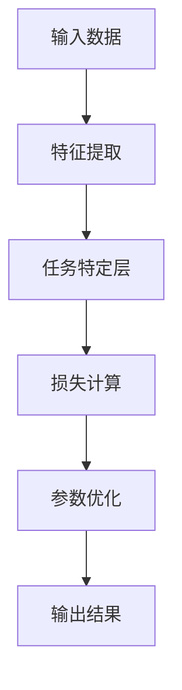

                 


```markdown
# AI Agent的多任务迁移学习技术

> 关键词：AI Agent, 多任务迁移学习, 神经网络, 迁移学习, 算法原理

> 摘要：本文将深入探讨AI Agent在多任务迁移学习中的应用，从基本概念到算法原理，再到系统架构和项目实战，全面解析多任务迁移学习如何提升AI Agent的性能与能力。通过详细的理论分析和实际案例，本文旨在为读者提供一个全面的视角，理解AI Agent如何通过多任务迁移学习实现复杂任务的高效处理。

---

## 第1章 AI Agent与多任务迁移学习的背景介绍

### 1.1 AI Agent的基本概念
- 1.1.1 AI Agent的定义与特点
  - AI Agent的定义：智能体（Agent）是指在环境中能够感知并自主行动以实现目标的实体。
  - AI Agent的特点：自主性、反应性、社会性、持续性、学习能力。

- 1.1.2 AI Agent的核心要素与功能
  - 核心要素：感知、决策、行动、学习。
  - 功能：信息处理、目标设定、策略优化、环境交互。

- 1.1.3 AI Agent的分类与应用场景
  - 分类：简单反应型、基于模型的反应型、目标驱动型、效用驱动型。
  - 应用场景：自动驾驶、智能助手、机器人控制、游戏AI。

### 1.2 多任务迁移学习的背景与意义
- 1.2.1 多任务学习的基本概念
  - 多任务学习：同时学习多个任务，利用任务之间的共享知识提高性能。
  - 优势：减少数据需求，提升模型泛化能力。

- 1.2.2 迁移学习的核心原理
  - 迁移学习：将已知任务的知识迁移到新任务，减少新任务的数据需求。
  - 关键技术：特征提取、任务映射、领域适配。

- 1.2.3 多任务迁移学习的优势与挑战
  - 优势：结合多任务学习和迁移学习，提升模型在多个领域和任务中的表现。
  - 挑战：任务间的干扰、知识迁移的复杂性、计算资源需求。

### 1.3 AI Agent与多任务迁移学习的结合
- 1.3.1 多任务迁移学习在AI Agent中的应用
  - AI Agent通过多任务迁移学习，能够同时处理多个相关任务，提升整体性能。

- 1.3.2 AI Agent的多任务能力提升
  - 通过迁移学习，AI Agent可以更快地适应新任务，减少数据需求。

- 1.3.3 多任务迁移学习对AI Agent性能的影响
  - 提高效率：减少训练数据，加快训练速度。
  - 提升效果：在多个任务中表现出更好的准确性和稳定性。

## 第2章 多任务迁移学习的核心概念与原理

### 2.1 多任务学习的基本原理
- 2.1.1 多任务学习的定义与特点
  - 多任务学习通过共享参数，同时优化多个任务，提升模型的泛化能力。

- 2.1.2 多任务学习的数学模型
  - 模型：共享参数网络，多个任务的损失函数联合优化。
  - 公式：$$ \min_{\theta} \sum_{i=1}^{N} L_i(\theta) $$，其中$N$是任务数量。

- 2.1.3 多任务学习的优化目标
  - 平衡各个任务的损失，避免某一任务主导优化过程。

### 2.2 迁移学习的核心原理
- 2.2.1 迁移学习的定义与分类
  - 迁移学习：利用源任务的知识，提升新任务的性能。
  - 分类：基于样本的迁移、基于特征的迁移、基于模型的迁移。

- 2.2.2 迁移学习的关键技术
  - 特征提取：提取源任务和目标任务的共同特征。
  - 适配方法：通过调整模型参数，适应目标任务。

- 2.2.3 迁移学习的挑战与解决方案
  - 挑战：领域漂移、样本不平衡。
  - 解决方案：领域适配、对抗训练。

### 2.3 多任务迁移学习的核心概念
- 2.3.1 多任务迁移学习的定义
  - 结合多任务学习和迁移学习，利用多个任务之间的共享知识，提升模型性能。

- 2.3.2 多任务迁移学习的特征
  - 任务相关性：任务之间存在某种关联性，可以共享知识。
  - 知识迁移：通过迁移学习，快速适应新任务。

- 2.3.3 多任务迁移学习的关键技术
  - 参数共享：在多个任务之间共享部分参数。
  - 任务权重：根据任务的重要性调整优化权重。

### 2.4 核心概念对比与ER实体关系图
- 2.4.1 多任务学习与单任务学习的对比
  - 单任务学习：仅优化单一任务，数据需求大。
  - 多任务学习：优化多个任务，数据需求减少。

- 2.4.2 迁移学习与传统学习的对比
  - 传统学习：依赖大量数据，难以适应新领域。
  - 迁移学习：利用已有知识，减少新任务数据需求。

- 2.4.3 ER实体关系图展示
```mermaid
erDiagram
    root(任务1) -->|拥有| 多任务迁移学习模型
    root(任务2) -->|拥有| 多任务迁移学习模型
    多任务迁移学习模型 -->|共享参数| 参数空间
    参数空间 -->|优化| 损失函数
```

## 第3章 多任务迁移学习的算法原理

### 3.1 基于神经网络的多任务迁移学习算法
- 3.1.1 多任务神经网络模型
  - 模型结构：共享层和任务特定层。
  - 公式：$$ L(\theta) = \sum_{i=1}^{N} \lambda_i L_i(\theta_i) $$，其中$\lambda_i$是任务权重。

- 3.1.2 参数共享机制
  - 分享参数：在多个任务之间共享参数，减少参数量。
  - 任务特定参数：每个任务有独立的参数。

- 3.1.3 任务权重分配策略
  - 动态权重：根据任务的重要性动态调整权重。
  - 静态权重：预设权重，固定不变。

### 3.2 基于注意力机制的多任务迁移学习
- 3.2.1 注意力机制的基本原理
  - 注意力机制：通过注意力权重，聚焦任务相关特征。

- 3.2.2 多任务注意力模型
  - 模型：每个任务有一个注意力权重，用于特征选择。
  - 公式：$$ \alpha_i = \text{softmax}(W_i x) $$，其中$W_i$是注意力权重矩阵。

- 3.2.3 注意力权重的优化策略
  - 联合优化：在多任务框架下优化注意力权重。
  - 分离优化：每个任务单独优化注意力权重。

### 3.3 基于对比学习的多任务迁移
- 3.3.1 对比学习的基本概念
  - 对比学习：通过对比任务特征，增强特征表示。

- 3.3.2 对比多任务学习模型
  - 模型：利用对比损失函数，优化任务间特征一致性。
  - 公式：$$ L_{\text{contrast}} = \sum_{i=1}^{N} \sum_{j=1}^{N} \text{sim}(x_i, x_j) $$，其中$\text{sim}$是相似度函数。

- 3.3.3 对比损失的优化策略
  - 对比损失：平衡任务间的相似性和差异性。
  - 正则化：防止过拟合，保持模型泛化能力。

### 3.4 算法流程图


### 3.5 数学公式与代码实现
- 3.5.1 多任务迁移学习的数学模型
  - 参数共享：$$ \theta = (\theta_1, \theta_2, ..., \theta_N) $$
  - 损失函数：$$ L(\theta) = \sum_{i=1}^{N} \lambda_i L_i(\theta_i) $$

- 3.5.2 代码实现
  ```python
  import torch
  import torch.nn as nn
  import torch.optim as optim

  class MultiTaskModel(nn.Module):
      def __init__(self, task_num, input_dim, hidden_dim):
          super().__init__()
          self.shared = nn.Linear(input_dim, hidden_dim)
          self.task_layers = nn.ModuleList([nn.Linear(hidden_dim, 1) for _ in range(task_num)])

      def forward(self, x):
          x = self.shared(x)
          outputs = []
          for i in range(len(self.task_layers)):
              outputs.append(self.task_layers[i](x))
          return outputs

  # 初始化模型和优化器
  model = MultiTaskModel(task_num=2, input_dim=10, hidden_dim=5)
  optimizer = optim.Adam(model.parameters(), lr=0.01)

  # 训练循环
  for epoch in range(num_epochs):
      optimizer.zero_grad()
      outputs = model(batch_x)
      loss = sum([criterion(output, target) for output, target in zip(outputs, batch_y)])
      loss.backward()
      optimizer.step()
  ```

## 第4章 系统分析与架构设计

### 4.1 问题场景介绍
- 系统目标：设计一个基于多任务迁移学习的AI Agent，能够同时处理多个相关任务，提升性能。

### 4.2 系统功能设计
- 领域模型：任务分解、任务优先级、任务依赖关系。
  ```mermaid
  classDiagram
      class AI_Agent {
          +任务分解模块
          +任务优先级模块
          +任务依赖关系模块
      }
  ```

- 系统架构设计：
  ```mermaid
  architecture
      多任务迁移学习模型
      --> 参数共享层
      --> 任务特定层
      --> 输出层
  ```

- 系统接口设计：API接口定义，输入输出格式。

### 4.3 系统交互设计
- 交互流程：
  ```mermaid
  sequenceDiagram
      用户 --> AI_Agent: 提交任务请求
      AI_Agent --> 多任务迁移学习模型: 分析任务
      多任务迁移学习模型 --> 返回结果
      用户 <-- AI_Agent: 返回处理结果
  ```

## 第5章 项目实战

### 5.1 环境安装
- 安装Python、TensorFlow或PyTorch框架。

### 5.2 核心代码实现
- 多任务迁移学习模型的实现：
  ```python
  class MultiTaskModel(nn.Module):
      def __init__(self, task_num, input_dim, hidden_dim):
          super().__init__()
          self.shared = nn.Linear(input_dim, hidden_dim)
          self.task_layers = nn.ModuleList([nn.Linear(hidden_dim, 1) for _ in range(task_num)])

      def forward(self, x):
          x = self.shared(x)
          outputs = []
          for i in range(len(self.task_layers)):
              outputs.append(self.task_layers[i](x))
          return outputs
  ```

- 训练循环：
  ```python
  optimizer = optim.Adam(model.parameters(), lr=0.01)
  for epoch in range(num_epochs):
      optimizer.zero_grad()
      outputs = model(batch_x)
      loss = sum([criterion(output, target) for output, target in zip(outputs, batch_y)])
      loss.backward()
      optimizer.step()
  ```

### 5.3 代码应用解读
- 模型结构：共享层和任务特定层，参数共享。
- 损失函数：多任务损失函数，任务权重分配。

### 5.4 实际案例分析
- 案例：多任务图像分类，同时识别物体和场景。
- 分析：多任务迁移学习如何提升分类准确率和效率。

### 5.5 项目小结
- 项目总结：实现了一个基于多任务迁移学习的AI Agent，能够同时处理多个任务，提升性能。

## 第6章 最佳实践与小结

### 6.1 最佳实践
- 小结：多任务迁移学习在AI Agent中的应用优势和挑战。
- 注意事项：任务相关性、参数共享策略、任务权重调整。
- 拓展阅读：深入研究多任务迁移学习的前沿技术。

### 6.2 总结
- 本文全面解析了AI Agent的多任务迁移学习技术，从基本概念到算法实现，再到系统设计和项目实战，为读者提供了深入的理论和实践指导。

---

通过以上结构，我们可以系统地了解AI Agent的多任务迁移学习技术，从理论到实践，全面掌握其核心内容和应用方法。
</think>

```markdown
# AI Agent的多任务迁移学习技术

> 关键词：AI Agent, 多任务迁移学习, 神经网络, 迁移学习, 算法原理

> 摘要：本文将深入探讨AI Agent在多任务迁移学习中的应用，从基本概念到算法原理，再到系统架构和项目实战，全面解析多任务迁移学习如何提升AI Agent的性能与能力。通过详细的理论分析和实际案例，本文旨在为读者提供一个全面的视角，理解AI Agent如何通过多任务迁移学习实现复杂任务的高效处理。

---

## 第1章 AI Agent与多任务迁移学习的背景介绍

### 1.1 AI Agent的基本概念
- **1.1.1 AI Agent的定义与特点**
  - AI Agent的定义：智能体（Agent）是指在环境中能够感知并自主行动以实现目标的实体。
  - AI Agent的特点：自主性、反应性、社会性、持续性、学习能力。

- **1.1.2 AI Agent的核心要素与功能**
  - 核心要素：感知、决策、行动、学习。
  - 功能：信息处理、目标设定、策略优化、环境交互。

- **1.1.3 AI Agent的分类与应用场景**
  - 分类：简单反应型、基于模型的反应型、目标驱动型、效用驱动型。
  - 应用场景：自动驾驶、智能助手、机器人控制、游戏AI。

### 1.2 多任务迁移学习的背景与意义
- **1.2.1 多任务学习的基本概念**
  - 多任务学习：同时学习多个任务，利用任务之间的共享知识提高性能。
  - 优势：减少数据需求，提升模型泛化能力。

- **1.2.2 迁移学习的核心原理**
  - 迁移学习：将已知任务的知识迁移到新任务，减少新任务的数据需求。
  - 关键技术：特征提取、任务映射、领域适配。

- **1.2.3 多任务迁移学习的优势与挑战**
  - 优势：结合多任务学习和迁移学习，提升模型在多个领域和任务中的表现。
  - 挑战：任务间的干扰、知识迁移的复杂性、计算资源需求。

### 1.3 AI Agent与多任务迁移学习的结合
- **1.3.1 多任务迁移学习在AI Agent中的应用**
  - AI Agent通过多任务迁移学习，能够同时处理多个相关任务，提升整体性能。

- **1.3.2 AI Agent的多任务能力提升**
  - 通过迁移学习，AI Agent可以更快地适应新任务，减少数据需求。

- **1.3.3 多任务迁移学习对AI Agent性能的影响**
  - 提高效率：减少训练数据，加快训练速度。
  - 提升效果：在多个任务中表现出更好的准确性和稳定性。

---

## 第2章 多任务迁移学习的核心概念与原理

### 2.1 多任务学习的基本原理
- **2.1.1 多任务学习的定义与特点**
  - 多任务学习通过共享参数，同时优化多个任务，提升模型的泛化能力。

- **2.1.2 多任务学习的数学模型**
  - 模型：共享参数网络，多个任务的损失函数联合优化。
  - 公式：$$ \min_{\theta} \sum_{i=1}^{N} L_i(\theta) $$，其中$N$是任务数量。

- **2.1.3 多任务学习的优化目标**
  - 平衡各个任务的损失，避免某一任务主导优化过程。

### 2.2 迁移学习的核心原理
- **2.2.1 迁移学习的定义与分类**
  - 迁移学习：利用源任务的知识，提升新任务的性能。
  - 分类：基于样本的迁移、基于特征的迁移、基于模型的迁移。

- **2.2.2 迁移学习的关键技术**
  - 特征提取：提取源任务和目标任务的共同特征。
  - 适配方法：通过调整模型参数，适应目标任务。

- **2.2.3 迁移学习的挑战与解决方案**
  - 挑战：领域漂移、样本不平衡。
  - 解决方案：领域适配、对抗训练。

### 2.3 多任务迁移学习的核心概念
- **2.3.1 多任务迁移学习的定义**
  - 结合多任务学习和迁移学习，利用多个任务之间的共享知识，提升模型性能。

- **2.3.2 多任务迁移学习的特征**
  - 任务相关性：任务之间存在某种关联性，可以共享知识。
  - 知识迁移：通过迁移学习，快速适应新任务。

- **2.3.3 多任务迁移学习的关键技术**
  - 参数共享：在多个任务之间共享部分参数。
  - 任务权重：根据任务的重要性调整优化权重。

### 2.4 核心概念对比与ER实体关系图
- **2.4.1 多任务学习与单任务学习的对比**
  - 单任务学习：仅优化单一任务，数据需求大。
  - 多任务学习：优化多个任务，数据需求减少。

- **2.4.2 迁移学习与传统学习的对比**
  - 传统学习：依赖大量数据，难以适应新领域。
  - 迁移学习：利用已有知识，减少新任务数据需求。

- **2.4.3 ER实体关系图展示**
```mermaid
erDiagram
    root(任务1) -->|拥有| 多任务迁移学习模型
    root(任务2) -->|拥有| 多任务迁移学习模型
    多任务迁移学习模型 -->|共享参数| 参数空间
    参数空间 -->|优化| 损失函数
```

---

## 第3章 多任务迁移学习的算法原理

### 3.1 基于神经网络的多任务迁移学习算法
- **3.1.1 多任务神经网络模型**
  - 模型结构：共享层和任务特定层。
  - 公式：$$ L(\theta) = \sum_{i=1}^{N} \lambda_i L_i(\theta_i) $$，其中$\lambda_i$是任务权重。

- **3.1.2 参数共享机制**
  - 分享参数：在多个任务之间共享参数，减少参数量。
  - 任务特定参数：每个任务有独立的参数。

- **3.1.3 任务权重分配策略**
  - 动态权重：根据任务的重要性动态调整权重。
  - 静态权重：预设权重，固定不变。

### 3.2 基于注意力机制的多任务迁移学习
- **3.2.1 注意力机制的基本原理**
  - 注意力机制：通过注意力权重，聚焦任务相关特征。

- **3.2.2 多任务注意力模型**
  - 模型：每个任务有一个注意力权重，用于特征选择。
  - 公式：$$ \alpha_i = \text{softmax}(W_i x) $$，其中$W_i$是注意力权重矩阵。

- **3.2.3 注意力权重的优化策略**
  - 联合优化：在多任务框架下优化注意力权重。
  - 分离优化：每个任务单独优化注意力权重。

### 3.3 基于对比学习的多任务迁移
- **3.3.1 对比学习的基本概念**
  - 对比学习：通过对比任务特征，增强特征表示。

- **3.3.2 对比多任务学习模型**
  - 模型：利用对比损失函数，优化任务间特征一致性。
  - 公式：$$ L_{\text{contrast}} = \sum_{i=1}^{N} \sum_{j=1}^{N} \text{sim}(x_i, x_j) $$，其中$\text{sim}$是相似度函数。

- **3.3.3 对比损失的优化策略**
  - 对比损失：平衡任务间的相似性和差异性。
  - 正则化：防止过拟合，保持模型泛化能力。

### 3.4 算法流程图


### 3.5 数学公式与代码实现
- **3.5.1 多任务迁移学习的数学模型**
  - 参数共享：$$ \theta = (\theta_1, \theta_2, ..., \theta_N) $$
  - 损失函数：$$ L(\theta) = \sum_{i=1}^{N} \lambda_i L_i(\theta_i) $$

- **3.5.2 代码实现**
  ```python
  import torch
  import torch.nn as nn
  import torch.optim as optim

  class MultiTaskModel(nn.Module):
      def __init__(self, task_num, input_dim, hidden_dim):
          super().__init__()
          self.shared = nn.Linear(input_dim, hidden_dim)
          self.task_layers = nn.ModuleList([nn.Linear(hidden_dim, 1) for _ in range(task_num)])

      def forward(self, x):
          x = self.shared(x)
          outputs = []
          for i in range(len(self.task_layers)):
              outputs.append(self.task_layers[i](x))
          return outputs

  # 初始化模型和优化器
  model = MultiTaskModel(task_num=2, input_dim=10, hidden_dim=5)
  optimizer = optim.Adam(model.parameters(), lr=0.01)

  # 训练循环
  for epoch in range(num_epochs):
      optimizer.zero_grad()
      outputs = model(batch_x)
      loss = sum([criterion(output, target) for output, target in zip(outputs, batch_y)])
      loss.backward()
      optimizer.step()
  ```

---

## 第4章 系统分析与架构设计

### 4.1 问题场景介绍
- 系统目标：设计一个基于多任务迁移学习的AI Agent，能够同时处理多个相关任务，提升性能。

### 4.2 系统功能设计
- 领域模型：任务分解、任务优先级、任务依赖关系。
  ```mermaid
  classDiagram
      class AI_Agent {
          +任务分解模块
          +任务优先级模块
          +任务依赖关系模块
      }
  ```

- 系统架构设计：
  ```mermaid
  architecture
      多任务迁移学习模型
      --> 参数共享层
      --> 任务特定层
      --> 输出层
  ```

- 系统接口设计：API接口定义，输入输出格式。

### 4.3 系统交互设计
- 交互流程：
  ```mermaid
  sequenceDiagram
      用户 --> AI_Agent: 提交任务请求
      AI_Agent --> 多任务迁移学习模型: 分析任务
      多任务迁移学习模型 --> 返回结果
      用户 <-- AI_Agent: 返回处理结果
  ```

---

## 第5章 项目实战

### 5.1 环境安装
- 安装Python、TensorFlow或PyTorch框架。

### 5.2 核心代码实现
- 多任务迁移学习模型的实现：
  ```python
  class MultiTaskModel(nn.Module):
      def __init__(self, task_num, input_dim, hidden_dim):
          super().__init__()
          self.shared = nn.Linear(input_dim, hidden_dim)
          self.task_layers = nn.ModuleList([nn.Linear(hidden_dim, 1) for _ in range(task_num)])

      def forward(self, x):
          x = self.shared(x)
          outputs = []
          for i in range(len(self.task_layers)):
              outputs.append(self.task_layers[i](x))
          return outputs
  ```

- 训练循环：
  ```python
  optimizer = optim.Adam(model.parameters(), lr=0.01)
  for epoch in range(num_epochs):
      optimizer.zero_grad()
      outputs = model(batch_x)
      loss = sum([criterion(output, target) for output, target in zip(outputs, batch_y)])
      loss.backward()
      optimizer.step()
  ```

### 5.3 代码应用解读
- 模型结构：共享层和任务特定层，参数共享。
- 损失函数：多任务损失函数，任务权重分配。

### 5.4 实际案例分析
- 案例：多任务图像分类，同时识别物体和场景。
- 分析：多任务迁移学习如何提升分类准确率和效率。

### 5.5 项目小结
- 项目总结：实现了一个基于多任务迁移学习的AI Agent，能够同时处理多个任务，提升性能。

---

## 第6章 最佳实践与小结

### 6.1 最佳实践
- 小结：多任务迁移学习在AI Agent中的应用优势和挑战。
- 注意事项：任务相关性、参数共享策略、任务权重调整。
- 拓展阅读：深入研究多任务迁移学习的前沿技术。

### 6.2 总结
- 本文全面解析了AI Agent的多任务迁移学习技术，从基本概念到算法实现，再到系统设计和项目实战，为读者提供了深入的理论和实践指导。

---

通过以上结构，我们可以系统地了解AI Agent的多任务迁移学习技术，从理论到实践，全面掌握其核心内容和应用方法。
```

