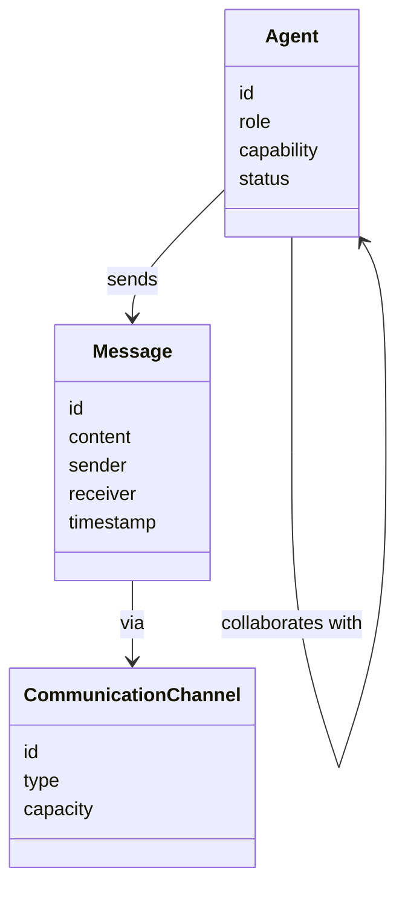
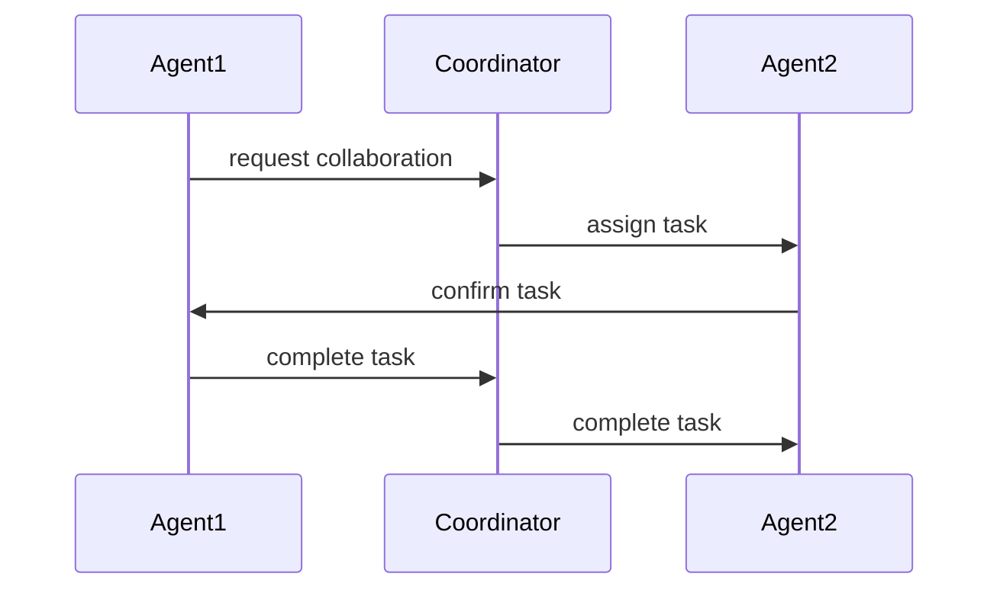
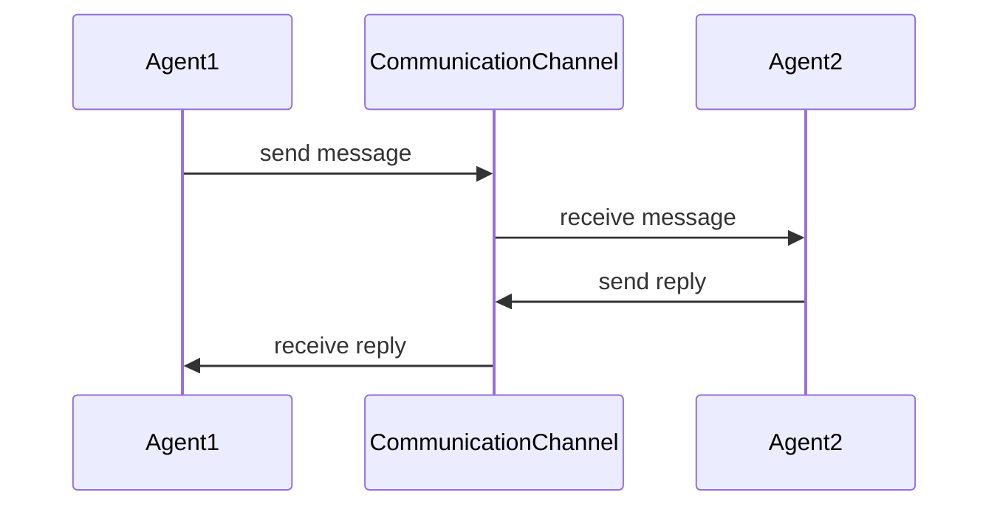

                 


# AI Agent的多智能体协作与通信机制

> **关键词**：AI Agent，多智能体，协作机制，通信机制，分布式系统

> **摘要**：本文深入探讨了AI Agent在多智能体系统中的协作与通信机制。从基本概念到算法实现，从系统架构到项目实战，全面分析了多智能体协作与通信的核心问题，并提出了有效的解决方案。

---

# 第一部分: AI Agent的多智能体协作与通信机制概述

## 第1章: AI Agent与多智能体系统背景

### 1.1 AI Agent的基本概念

#### 1.1.1 什么是AI Agent
AI Agent（人工智能代理）是指能够感知环境并采取行动以实现目标的智能实体。它可以是一个软件程序、机器人或其他智能系统，具备以下核心特征：
- **自主性**：能够在没有外部干预的情况下自主决策。
- **反应性**：能够感知环境并实时调整行为。
- **目标导向性**：通过目标驱动来选择行动。

#### 1.1.2 AI Agent的分类
AI Agent可以根据多种标准进行分类，常见的分类方式包括：
1. **智能水平**：
   - **反应式Agent**：基于当前感知做出反应，不依赖历史信息。
   - **认知式Agent**：具备复杂推理能力，能够处理抽象概念。
2. **应用场景**：
   - **服务机器人**：提供特定服务的智能体，如客服机器人。
   - **自动驾驶系统**：通过感知环境进行决策的智能体。
3. **协作方式**：
   - **独立型**：不依赖其他智能体完成任务。
   - **协作型**：需要与其他智能体协作完成任务。

#### 1.1.3 AI Agent的核心特征
- **自主性**：能够在没有外部干预的情况下自主决策。
- **反应性**：能够感知环境并实时调整行为。
- **目标导向性**：通过目标驱动来选择行动。

### 1.2 多智能体系统的基本概念

#### 1.2.1 多智能体系统的定义
多智能体系统（Multi-Agent System，MAS）是由多个相互作用的智能体组成的系统，这些智能体通过协作和竞争完成特定任务。MAS在分布式问题求解、复杂环境建模等方面具有广泛应用。

#### 1.2.2 多智能体系统的应用场景
- **分布式计算**：任务分解和并行处理。
- **机器人协作**：多机器人协同完成任务。
- **自动驾驶**：多个车辆协同行驶，避免碰撞。
- **智能家居**：多个设备协同工作，提供无缝服务。

#### 1.2.3 多智能体系统的优缺点
- **优点**：
  - **灵活性**：能够适应环境变化。
  - **容错性**：单个智能体故障不影响整体系统。
  - **可扩展性**：可以根据需要添加或移除智能体。
- **缺点**：
  - **复杂性**：协作和通信机制设计复杂。
  - **资源消耗**：需要额外的计算和通信资源。
  - **同步问题**：多个智能体需要协调行动。

### 1.3 问题背景与问题描述

#### 1.3.1 多智能体协作的核心问题
在多智能体系统中，协作是实现任务目标的关键。然而，协作过程中需要解决以下问题：
- **信息共享**：如何高效地共享信息。
- **决策协调**：如何协调多个智能体的决策。
- **冲突解决**：如何处理协作中的冲突。

#### 1.3.2 通信机制的重要性
通信机制是多智能体协作的基础。良好的通信机制可以确保智能体之间能够高效地交换信息，从而提高协作效率。主要挑战包括：
- **信息冗余**：如何避免过多的信息传输。
- **信息延迟**：如何减少信息传递的延迟。
- **信息安全性**：如何保证信息传输的安全性。

#### 1.3.3 当前存在的主要挑战
- **信息同步**：多个智能体之间需要同步信息，以确保协作的一致性。
- **资源分配**：如何合理分配资源以提高系统效率。
- **动态环境**：环境动态变化，需要智能体具备快速适应能力。

---

## 第2章: 多智能体协作与通信机制的核心概念

### 2.1 协作与通信机制的定义

#### 2.1.1 协作机制的定义
协作机制是多智能体系统中，智能体之间为了共同目标而进行合作的方式。协作机制的设计直接影响系统的效率和性能。

#### 2.1.2 通信机制的定义
通信机制是智能体之间交换信息的方式，包括信息的编码、传输和解码等过程。通信机制的效率直接影响协作的效果。

#### 2.1.3 协作与通信的关系
协作是目标，通信是手段。协作机制依赖于通信机制实现信息共享和决策协调。

### 2.2 协作与通信机制的关键属性

#### 2.2.1 协作机制的属性
- **同步性**：协作过程是否需要同步。
- **异步性**：协作过程是否可以异步。
- **一致性**：协作结果是否一致。

#### 2.2.2 通信机制的属性
- **实时性**：通信是否需要实时。
- **带宽**：通信所需的带宽。
- **可靠性**：通信的可靠性。

#### 2.2.3 属性对比分析
通过对比协作机制和通信机制的属性，可以发现协作机制关注的是协作过程中的同步和一致性，而通信机制关注的是信息传输的实时性和可靠性。

### 2.3 协作与通信机制的ER实体关系图

```mermaid
er
    entity(Agent) {
        id
        role
        capability
    }
    entity(Message) {
        id
        content
        sender
        receiver
        timestamp
    }
    entity(CommunicationChannel) {
        id
        type
        capacity
    }
    entity(Task) {
        id
        description
        deadline
    }
    relationship(Association) {
        Agent与Message：1:N
        Message与CommunicationChannel：1:1
        Agent与Task：N:N
    }
```

---

## 第3章: 多智能体协作与通信机制的算法原理

### 3.1 分布式计算中的协作机制

#### 3.1.1 分布式计算的基本原理
分布式计算是指将任务分解成多个部分，分别在不同的计算节点上执行。协作机制在分布式计算中起到关键作用，确保各个节点能够协同工作。

#### 3.1.2 分布式计算中的协作算法
- **任务分解**：将整体任务分解为子任务，分配给不同的智能体。
- **任务执行**：每个智能体独立执行分配的任务。
- **结果汇总**：将各个智能体的结果汇总，得到最终结果。

#### 3.1.3 分布式计算的数学模型
$$ T = \sum_{i=1}^{n} T_i $$
其中，$T$ 表示总任务，$T_i$ 表示第 $i$ 个智能体的任务。

### 3.2 多智能体协作中的通信协议

#### 3.2.1 通信协议的定义
通信协议是智能体之间进行信息交换的规则，包括信息的格式、传输方式和错误处理机制。

#### 3.2.2 常见的通信协议
- **HTTP/HTTPS**：基于请求-响应模式的通信协议。
- **WebSocket**：支持双向通信的协议。
- **Message Queue**：消息队列，支持异步通信。

#### 3.2.3 通信协议的选择
选择通信协议需要考虑以下因素：
- **实时性**：是否需要实时通信。
- **带宽**：可用的网络带宽。
- **安全性**：是否需要加密传输。

### 3.3 多智能体协作中的同步机制

#### 3.3.1 同步机制的定义
同步机制是指智能体之间为了保证协作一致性而采取的措施。

#### 3.3.2 常见的同步算法
- **两阶段提交（2PC）**：用于分布式事务的提交。
- **三阶段提交（3PC）**：优化后的分布式事务提交协议。
- **时间戳**：通过时间戳保证操作的顺序。

#### 3.3.3 同步机制的数学模型
$$ timestamp_i < timestamp_j \rightarrow action_i < action_j $$

---

## 第4章: 多智能体协作与通信机制的系统分析与架构设计

### 4.1 系统分析

#### 4.1.1 问题场景
在多智能体系统中，智能体需要协作完成任务，同时需要高效地通信以确保协作的一致性。

#### 4.1.2 系统功能设计
- **信息共享**：智能体之间共享必要的信息。
- **决策协调**：智能体之间协调决策。
- **冲突解决**：解决协作中的冲突。

#### 4.1.3 领域模型


### 4.2 系统架构设计

#### 4.2.1 系统架构
- **代理层**：负责感知环境和执行行动。
- **通信层**：负责信息的传输和解码。
- **协调层**：负责决策协调和冲突解决。

#### 4.2.2 系统架构图
```mermaid
graph TD
    Agent1 --> CommunicationChannel: sends message
    CommunicationChannel --> Agent2: receives message
    Agent1 --> Coordinator: sends request
    Coordinator --> Agent2: sends instruction
```

#### 4.2.3 接口设计
- **发送消息**：`send_message(sender, receiver, content)`
- **接收消息**：`receive_message(receiver, sender, content)`
- **决策协调**：`coordinate_decision(coordinator, agents)`

### 4.3 交互序列图

#### 4.3.1 协作过程


#### 4.3.2 通信过程


---

## 第5章: 多智能体协作与通信机制的项目实战

### 5.1 环境安装

#### 5.1.1 系统环境
- **操作系统**：Linux/Windows/MacOS
- **编程语言**：Python/Java/C++
- **框架**：Django/Flask（Python）
- **工具**：Git, IDE

#### 5.1.2 安装依赖
```bash
pip install flask
pip install redis
pip install requests
```

### 5.2 系统核心实现

#### 5.2.1 核心代码实现

##### 5.2.1.1 Agent类
```python
class Agent:
    def __init__(self, id, role):
        self.id = id
        self.role = role
        self.status = "idle"
    
    def send_message(self, message):
        # 实现消息发送逻辑
        pass
    
    def receive_message(self, message):
        # 实现消息接收逻辑
        pass
```

##### 5.2.1.2 Message类
```python
class Message:
    def __init__(self, content, sender, receiver):
        self.content = content
        self.sender = sender
        self.receiver = receiver
        self.timestamp = time.time()
```

##### 5.2.1.3 通信通道类
```python
class CommunicationChannel:
    def __init__(self, type):
        self.type = type
        self.capacity = 10  # 最大消息数
    
    def send(self, message):
        # 实现消息发送逻辑
        pass
    
    def receive(self):
        # 实现消息接收逻辑
        pass
```

#### 5.2.2 代码解读
- **Agent类**：封装智能体的行为，包括发送和接收消息。
- **Message类**：封装消息的结构，包括内容、发送方和接收方。
- **通信通道类**：封装通信的逻辑，包括消息的发送和接收。

#### 5.2.3 系统实现流程
1. 初始化智能体和通信通道。
2. 智能体发送消息。
3. 通信通道传输消息。
4. 智能体接收消息。
5. 智能体根据消息进行协作。

### 5.3 案例分析

#### 5.3.1 实际案例
- **任务分解**：将一个复杂任务分解为多个子任务，分配给不同的智能体。
- **协作过程**：智能体之间通过通信机制共享信息，协调决策。
- **结果汇总**：将各个智能体的结果汇总，得到最终结果。

#### 5.3.2 代码实现
```python
# 初始化智能体
agent1 = Agent(1, "navigator")
agent2 = Agent(2, "driver")

# 初始化通信通道
channel = CommunicationChannel("websocket")

# 发送消息
message = Message("start navigation", agent1.id, agent2.id)
agent1.send_message(message)

# 接收消息
received_message = agent2.receive_message()
print(received_message.content)
```

#### 5.3.3 分析与总结
通过案例分析可以看出，多智能体协作与通信机制的有效性取决于协作机制和通信机制的设计。合理的协作机制和高效的通信机制能够显著提高系统的效率和性能。

---

## 第6章: 多智能体协作与通信机制的最佳实践

### 6.1 小结

- **协作机制**：协作机制的设计直接影响系统的效率和性能。
- **通信机制**：通信机制的效率直接影响协作的效果。
- **系统架构**：系统架构的设计需要综合考虑协作和通信的需求。

### 6.2 注意事项

- **信息冗余**：避免过多的信息传输。
- **信息延迟**：尽量减少信息传递的延迟。
- **信息安全性**：确保信息传输的安全性。

### 6.3 未来趋势

- **边缘计算**：在边缘设备上进行计算，减少通信延迟。
- **区块链技术**：利用区块链技术提高协作的安全性和可靠性。
- **自适应算法**：开发自适应算法，提高系统的动态适应能力。

### 6.4 拓展阅读

- **分布式系统**：深入学习分布式系统的理论和实践。
- **区块链技术**：研究区块链技术在多智能体系统中的应用。
- **自适应算法**：探索自适应算法在多智能体系统中的应用。

---

## 第七章: 总结

通过本文的详细分析，我们可以看到，AI Agent的多智能体协作与通信机制是一个复杂但有趣的话题。从基本概念到算法实现，从系统架构到项目实战，每个环节都需要仔细考虑和精心设计。未来，随着技术的发展，多智能体协作与通信机制将变得更加高效和智能，为分布式系统和人工智能领域带来更多的创新和突破。

---

**全文完。**

