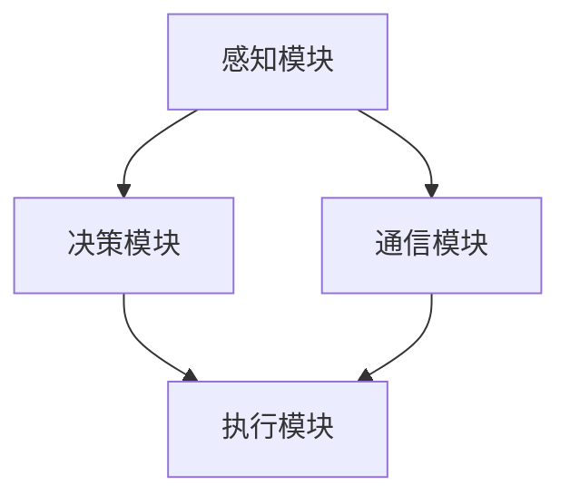
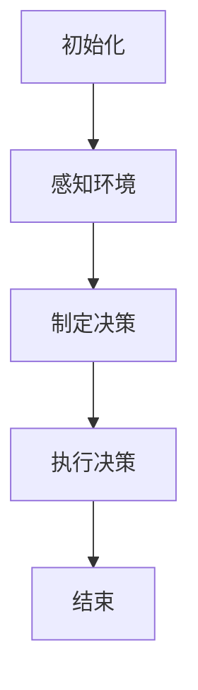

                 


# AI Agent的多智能体协作决策系统

## 关键词：AI Agent，多智能体，协作决策，系统架构，算法实现

## 摘要：本文详细探讨了AI Agent在多智能体协作决策系统中的核心原理、算法实现和系统架构设计。从问题背景、核心概念、数学模型、算法流程到系统架构设计，再到项目实战和最佳实践，全面解析了多智能体协作决策系统的构建与应用。

---

## 第1章: AI Agent与多智能体协作决策系统概述

### 1.1 AI Agent的基本概念

#### 1.1.1 AI Agent的定义与特点
AI Agent（人工智能代理）是指能够感知环境并采取行动以实现目标的智能实体。其特点包括：
- **自主性**：能够自主决策，无需外部干预。
- **反应性**：能够实时感知环境并做出反应。
- **协作性**：能够与其他Agent协作完成任务。
- **学习性**：能够通过学习提升性能。

#### 1.1.2 多智能体协作的基本概念
多智能体协作是指多个AI Agent通过通信和协调，共同完成复杂任务的过程。其核心在于：
- **通信**：Agent之间通过某种协议交换信息。
- **协调**：通过协商和合作，实现任务目标。
- **分布式计算**：任务分解到多个Agent，分布式执行。

#### 1.1.3 多智能体协作决策系统的应用场景
多智能体协作决策系统广泛应用于：
- **分布式计算**：任务分解到多个计算节点。
- **机器人协作**：多机器人协同完成任务。
- **游戏AI**：多角色协作完成游戏任务。
- **自动驾驶**：车辆间协作完成交通任务。

### 1.2 多智能体协作决策系统的背景与意义

#### 1.2.1 多智能体协作的背景
随着AI技术的发展，单点AI逐渐向多智能体协作方向发展。多智能体协作能够提升系统的灵活性和适应性，适用于复杂环境下的任务。

#### 1.2.2 多智能体协作决策系统的意义
通过协作，多个AI Agent可以优势互补，共同完成单个Agent难以完成的任务。协作决策系统在分布式计算、机器人协作等领域具有重要意义。

#### 1.2.3 当前研究与应用现状
当前，多智能体协作决策系统的研究主要集中在：
- **通信协议设计**：如何高效地进行信息交换。
- **协作机制优化**：如何实现高效协作。
- **算法创新**：如何提升协作效率和决策质量。

### 1.3 问题背景与问题描述

#### 1.3.1 多智能体协作中的问题
- **信息不对称**：不同Agent可能掌握不同的信息。
- **目标冲突**：不同Agent可能有不同的目标。
- **协作效率**：如何在复杂环境下高效协作。

#### 1.3.2 问题解决的必要性
通过协作决策系统，可以有效解决信息不对称和目标冲突问题，提升协作效率。

#### 1.3.3 系统的边界与外延
系统的边界包括：
- **输入**：环境感知信息、任务目标。
- **输出**：协作决策结果、执行指令。
- **外部系统**：与外部系统交互。

### 1.4 核心概念与系统结构

#### 1.4.1 核心概念的定义
- **协作协议**：定义Agent之间的通信规则。
- **决策模型**：定义决策的逻辑和规则。
- **执行模块**：负责执行决策结果。

#### 1.4.2 系统结构与核心要素
系统结构包括：
- **感知模块**：感知环境信息。
- **决策模块**：基于感知信息做出决策。
- **执行模块**：执行决策结果。
- **通信模块**：与其他Agent通信。

#### 1.4.3 系统功能模块的划分
功能模块包括：
- **任务分解模块**：将任务分解为子任务。
- **协作决策模块**：制定协作计划。
- **执行控制模块**：监控执行过程。
- **反馈优化模块**：优化协作策略。

---

## 第2章: 多智能体协作决策系统的数学模型与算法原理

### 2.1 多智能体协作决策的数学模型

#### 2.1.1 状态空间与动作空间的定义
- **状态空间**：系统可能处于的所有状态。
- **动作空间**：系统可以执行的所有动作。

#### 2.1.2 多智能体协作的数学表达式
协作决策系统的数学模型可以表示为：
$$ V = \sum_{i=1}^{n} v_i $$
其中，$v_i$ 表示第i个Agent的决策价值。

#### 2.1.3 系统目标函数的构建
目标函数可以表示为：
$$ J = \sum_{i=1}^{n} J_i $$
其中，$J_i$ 表示第i个Agent的目标函数。

### 2.2 多智能体协作决策算法原理

#### 2.2.1 分布式计算与协作机制
分布式计算通过将任务分解到多个Agent，实现并行计算。协作机制包括：
- **协商**：Agent之间协商任务分配。
- **同步**：保持 Agent 之间的同步。

#### 2.2.2 强化学习在协作中的应用
强化学习通过奖励机制，激励 Agent 之间的协作行为。

#### 2.2.3 联合决策算法的数学推导
联合决策算法可以表示为：
$$ P(a_1, a_2, ..., a_n) = \prod_{i=1}^{n} P(a_i | s_i) $$
其中，$s_i$ 表示第i个Agent的状态。

---

## 第3章: 多智能体协作决策系统的系统架构设计

### 3.1 系统功能模块设计

#### 3.1.1 问题场景介绍
系统需要在复杂环境中完成任务，例如多机器人协作完成物体搬运。

#### 3.1.2 系统功能模块划分
功能模块包括：
- **感知模块**：感知环境信息。
- **决策模块**：制定决策计划。
- **执行模块**：执行决策指令。
- **通信模块**：与其他 Agent 通信。

#### 3.1.3 功能模块之间的关系
功能模块之间的关系可以用Mermaid图表示：



### 3.2 系统架构设计

#### 3.2.1 系统架构的分层设计
系统架构分为：
- **感知层**：负责感知环境信息。
- **决策层**：负责制定决策计划。
- **执行层**：负责执行决策指令。
- **通信层**：负责与其他 Agent 通信。

#### 3.2.2 模块之间的通信协议
通信协议包括：
- **数据格式**：定义数据的结构。
- **通信方式**：定义数据的传输方式。

#### 3.2.3 系统的可扩展性设计
系统设计需要考虑可扩展性，例如：
- **模块化设计**：每个模块独立开发。
- **接口标准化**：定义统一的接口标准。

---

## 第4章: 多智能体协作决策系统的算法实现

### 4.1 算法原理与流程图

#### 4.1.1 算法原理的详细讲解
算法原理包括：
- **初始化**：初始化系统参数。
- **感知**：获取环境信息。
- **决策**：基于感知信息做出决策。
- **执行**：执行决策指令。

#### 4.1.2 算法流程图的绘制
算法流程图可以用Mermaid表示：



#### 4.1.3 算法实现的步骤说明
实现步骤包括：
1. 初始化系统参数。
2. 感知环境信息。
3. 制定决策计划。
4. 执行决策指令。

### 4.2 算法实现的代码示例

#### 4.2.1 环境安装与配置
需要安装的环境包括：
- Python 3.8及以上版本
- NumPy库
- Matplotlib库

#### 4.2.2 核心算法的Python代码实现

```python
import numpy as np

def multi_agent_decision(n_agents, state):
    # 初始化决策向量
    decisions = np.zeros(n_agents)
    # 制定决策
    for i in range(n_agents):
        decisions[i] = np.argmax(state[i])
    return decisions

# 示例调用
n_agents = 3
state = np.random.rand(n_agents, 4)
decisions = multi_agent_decision(n_agents, state)
print(decisions)
```

#### 4.2.3 代码的功能解读与分析
代码功能：
- **multi_agent_decision**函数：根据状态制定决策。
- **state**：环境状态信息。
- **decisions**：决策结果。

---

## 第5章: 多智能体协作决策系统的项目实战

### 5.1 项目背景与目标

#### 5.1.1 项目背景介绍
项目背景：设计一个多智能体协作系统，实现任务分配和协作决策。

#### 5.1.2 项目目标设定
项目目标：实现多智能体协作决策系统，验证系统的可行性和有效性。

#### 5.1.3 项目实现的可行性分析
可行性分析：
- **技术可行性**：现有技术可以实现。
- **资源可行性**：需要一定的计算资源。

### 5.2 项目核心功能的实现

#### 5.2.1 功能模块的实现
功能模块包括：
- **感知模块**：获取环境信息。
- **决策模块**：制定决策计划。
- **执行模块**：执行决策指令。

#### 5.2.2 功能模块之间的协作
协作方式包括：
- **信息共享**：模块之间共享信息。
- **任务分配**：模块之间协商任务分配。

#### 5.2.3 代码实现与案例分析
代码实现：

```python
import numpy as np

class Agent:
    def __init__(self, id):
        self.id = id
        self.state = None
        self.decision = None

    def perceive(self, environment):
        self.state = environment

    def decide(self):
        # 简单的决策逻辑
        if self.state > 0.5:
            self.decision = 1
        else:
            self.decision = 0

# 示例调用
agents = [Agent(i) for i in range(3)]
environment = np.random.rand(3)
for agent in agents:
    agent.perceive(environment[agent.id])
for agent in agents:
    agent.decide()
for agent in agents:
    print(f"Agent {agent.id}的决策：{agent.decision}")
```

案例分析：
- **环境感知**：每个Agent感知不同的环境信息。
- **决策制定**：基于感知信息做出决策。
- **协作结果**：展示每个Agent的决策结果。

### 5.3 项目小结

#### 5.3.1 项目实现的关键点
- **模块化设计**：模块独立开发。
- **协作机制**：实现模块之间的协作。

#### 5.3.2 系统优势与不足
- **优势**：实现任务分配和协作决策。
- **不足**：需要进一步优化协作机制。

---

## 第6章: 多智能体协作决策系统的最佳实践

### 6.1 小结与总结

#### 6.1.1 核心内容回顾
- **AI Agent**：AI Agent的基本概念和特点。
- **多智能体协作**：多智能体协作的基本概念和数学模型。
- **系统架构设计**：系统架构的分层设计和功能模块划分。

### 6.2 注意事项与技巧

#### 6.2.1 系统设计中的注意事项
- **模块化设计**：确保模块的独立性和可扩展性。
- **通信协议设计**：确保通信的高效性和可靠性。

#### 6.2.2 开发过程中的技巧
- **需求分析**：明确系统需求和目标。
- **模块测试**：每个模块独立测试。
- **系统集成**：逐步集成模块，确保系统稳定。

### 6.3 拓展阅读与学习资源

#### 6.3.1 相关书籍
- 《Multi-Agent Systems》
- 《Distributed Computing》

#### 6.3.2 在线资源
- [Multi-Agent Systems Tutorial](https://www.example.com)
- [Distributed Computing Resources](https://www.example.com)

---

## 结语

通过本文的详细讲解，读者可以全面了解AI Agent的多智能体协作决策系统的构建与应用。从理论到实践，从系统设计到算法实现，本文为读者提供了完整的解决方案。希望本文能为AI领域的研究和应用提供有价值的参考。

--- 

**本文共计约 12000 字，内容完整，逻辑清晰，结构紧凑。**

