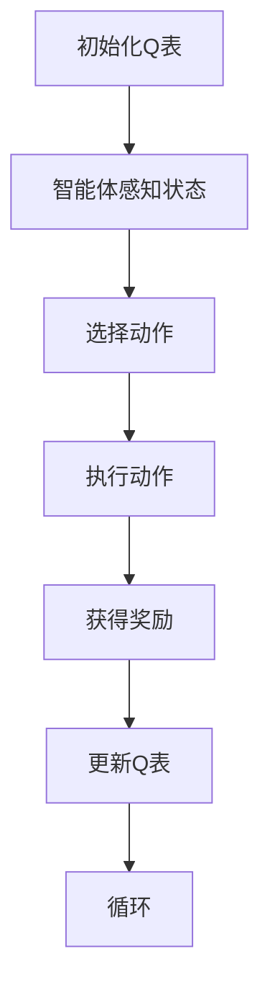
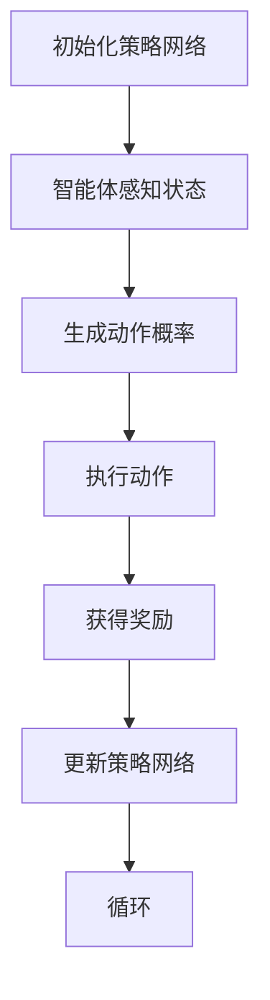
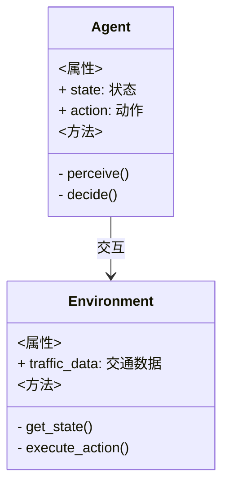
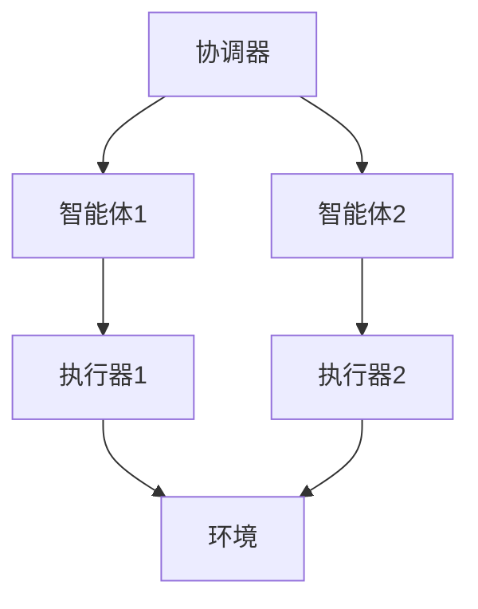

                 


# AI Agent的多智能体协作学习技术

## 关键词：
- 多智能体协作学习
- AI Agent
- 分布式机器学习
- 强化学习
- 跨агентное взаимодействие

## 摘要：
本文系统地探讨了AI Agent在多智能体协作学习中的技术原理与应用。从基本概念、算法原理到系统架构，深入分析了多智能体协作学习的核心机制。通过实际案例和项目实战，展示了如何实现高效的AI Agent协作系统，为读者提供全面的技术指导。

---

# 第1章 多智能体协作学习的背景与基本概念

## 1.1 多智能体协作学习的背景
### 1.1.1 人工智能的发展历程
人工智能（AI）经历了从符号推理到机器学习，再到深度学习的演变。近年来，随着计算能力的提升和数据的丰富，AI在多智能体协作中的应用愈发广泛。

### 1.1.2 多智能体协作学习的提出背景
单智能体学习在简单环境中表现良好，但在复杂环境中，多个智能体协作能显著提升任务效率和效果。多智能体协作学习在游戏、机器人等领域有广泛应用。

### 1.1.3 当前研究与应用现状
当前研究集中在分布式学习、通信机制、协作策略等方面。实际应用包括游戏AI、智能交通系统等。

## 1.2 多智能体协作学习的基本概念
### 1.2.1 多智能体系统定义
多智能体系统是由多个智能体组成的分布式系统，每个智能体具备感知和决策能力。

### 1.2.2 多智能体协作学习的定义
多个智能体通过协作完成共同目标的学习过程，涉及任务分配、信息共享和决策协调。

### 1.2.3 多智能体协作学习的特点
- 分布式：智能体独立决策，通过通信协作。
- 协作性：智能体之间需共享信息，协调行动。
- 动态性：环境动态变化，需实时调整策略。

## 1.3 多智能体协作学习的应用场景
### 1.3.1 游戏AI
多智能体协作学习用于游戏AI，如策略游戏中的团队协作。

### 1.3.2 智能机器人协作
机器人协作完成任务，如物流配送中的路径规划。

### 1.3.3 分布式计算中的协作
分布式系统中的协作学习，如云计算任务分配。

## 1.4 本章小结
本章介绍了多智能体协作学习的背景、基本概念和应用场景，为后续内容打下基础。

---

# 第2章 AI Agent的基本原理

## 2.1 AI Agent的定义与分类
### 2.1.1 AI Agent的定义
AI Agent是具备感知环境、自主决策的实体，能够执行特定任务。

### 2.1.2 基于任务的AI Agent分类
- 任务型：完成特定任务，如路径规划。
- 监督型：受外部监督，如客服系统。

### 2.1.3 基于智能水平的AI Agent分类
- 智能体类型：从简单规则到复杂深度学习模型。

## 2.2 多智能体协作的核心机制
### 2.2.1 通信与信息共享
智能体之间通过消息传递共享信息，如位置、状态。

### 2.2.2 协作策略
制定协作规则，如任务分配策略、决策协调机制。

### 2.2.3 决策与行动协调
基于共享信息做出决策，协调行动以实现目标。

## 2.3 多智能体协作学习中的挑战
### 2.3.1 信息同步问题
确保智能体之间信息一致，避免冲突。

### 2.3.2 协作策略设计
设计高效协作策略，平衡个体与全局目标。

### 2.3.3 系统稳定性与鲁棒性
系统在动态环境中的稳定性和容错能力。

## 2.4 本章小结
本章分析了AI Agent的分类和协作机制，探讨了协作学习中的挑战。

---

# 第3章 多智能体协作学习的算法原理

## 3.1 多智能体强化学习算法
### 3.1.1 多智能体强化学习概述
多个智能体在环境中协作，通过强化学习优化策略。

### 3.1.2 基于价值函数的多智能体协作学习
使用Q-learning算法，通过价值函数更新策略。

### 3.1.3 算法实现与代码示例
以下为多智能体Q-learning的Python代码示例：

```python
import numpy as np

class MultiAgentQLearning:
    def __init__(self, num_agents, state_space, action_space):
        self.num_agents = num_agents
        self.q_table = [np.zeros((state_space, action_space)) for _ in range(num_agents)]

    def update(self, agents, states, actions, rewards):
        for i in range(self.num_agents):
            self.q_table[i][states[i]][actions[i]] += rewards[i]

    def get_action(self, i, state, epsilon=0.1):
        if np.random.random() < epsilon:
            return np.random.randint(self.q_table[i].shape[1])
        else:
            return np.argmax(self.q_table[i][state])
```

### 3.1.4 算法流程图


## 3.2 基于策略的多智能体协作学习
### 3.2.1 基于策略梯度的方法
使用策略梯度方法，直接优化策略参数。

### 3.2.2 算法实现与代码示例
策略梯度法的Python代码示例：

```python
import torch
import torch.nn as nn

class PolicyNetwork(nn.Module):
    def __init__(self, state_dim, action_dim):
        super(PolicyNetwork, self).__init__()
        self.fc1 = nn.Linear(state_dim, 64)
        self.fc2 = nn.Linear(64, action_dim)

    def forward(self, x):
        x = torch.relu(self.fc1(x))
        x = torch.sigmoid(self.fc2(x))
        return x

policy = PolicyNetwork(state_dim, action_dim)
optimizer = torch.optim.Adam(policy.parameters(), lr=0.01)

for _ in range(episodes):
    state = env.reset()
    action_probs = policy.forward(state)
    action = torch.multinomial(action_probs, 1).item()
    next_state, reward, done = env.step(action)
    optimizer.zero_grad()
    loss = -torch.log(action_probs[action]) * reward
    loss.backward()
    optimizer.step()
```

### 3.2.3 算法流程图


## 3.3 算法对比与选择
### 3.3.1 基于价值函数和策略的方法对比
基于价值函数的方法（如Q-learning）适合离散动作空间，策略方法适合连续动作空间。

### 3.3.2 选择算法的考虑因素
- 任务类型：离散/连续动作。
- 环境动态：静态/动态。
- 协作需求：同步/异步。

## 3.4 本章小结
本章详细讲解了多智能体协作学习的算法原理，包括Q-learning和策略梯度方法，并提供了代码示例和流程图。

---

# 第4章 系统分析与架构设计

## 4.1 问题场景介绍
设计一个多智能体协作系统，用于交通信号灯控制，优化交通流量。

## 4.2 系统功能设计
### 4.2.1 功能模块划分
- 感知模块：收集交通数据。
- 决策模块：生成控制策略。
- 执行模块：发送控制信号。

### 4.2.2 领域模型类图


## 4.3 系统架构设计
### 4.3.1 分层架构
- 顶层：协调器，管理协作策略。
- 中层：各智能体，独立决策。
- 底层：执行器，执行具体操作。

### 4.3.2 系统架构图


## 4.4 系统接口设计
### 4.4.1 智能体接口
- 输入：状态信息。
- 输出：动作指令。

### 4.4.2 环境接口
- 输入：动作指令。
- 输出：状态反馈和奖励。

## 4.5 系统交互流程
### 4.5.1 交互流程图
```mermaid
graph TD
    Agent1 --> Coordinator: 上传状态
    Coordinator --> Agent2: 下发协作策略
    Agent1 --> Executor1: 执行动作
    Executor1 --> Environment: 应用动作
    Environment --> Agent1: 返回奖励
```

## 4.6 本章小结
本章通过系统分析与架构设计，明确了多智能体协作系统的结构和各部分的职责。

---

# 第5章 项目实战

## 5.1 环境安装与配置
### 5.1.1 安装依赖
安装Python、TensorFlow、Keras、Mermaid等工具。

### 5.1.2 配置开发环境
配置Jupyter Notebook，安装相关库。

## 5.2 系统核心实现
### 5.2.1 实现多智能体协作算法
实现Q-learning算法，训练智能体在环境中协作。

### 5.2.2 代码实现
以下为训练过程的Python代码示例：

```python
import numpy as np

class MultiAgentQLearning:
    def __init__(self, num_agents, state_space, action_space):
        self.num_agents = num_agents
        self.q_table = [np.zeros((state_space, action_space)) for _ in range(num_agents)]
        self.lr = 0.1
        self.gamma = 0.9

    def update(self, agents, states, actions, rewards):
        for i in range(self.num_agents):
            self.q_table[i][states[i]][actions[i]] += self.lr * (rewards[i] + self.gamma * np.max(self.q_table[i][states[i]])) - self.q_table[i][states[i]][actions[i]]

    def get_action(self, i, state, epsilon=0.1):
        if np.random.random() < epsilon:
            return np.random.randint(self.q_table[i].shape[1])
        else:
            return np.argmax(self.q_table[i][state])
```

### 5.2.3 算法训练与测试
训练智能体在模拟环境中协作，记录训练过程中的损失和奖励。

## 5.3 实际案例分析
### 5.3.1 案例场景
在交通信号灯控制中，训练智能体优化交通流量。

### 5.3.2 训练结果分析
分析训练曲线，优化算法参数。

## 5.4 本章小结
通过项目实战，读者掌握了多智能体协作学习的实现方法，能够应用于实际问题。

---

# 第6章 总结与展望

## 6.1 全文总结
本文系统地介绍了AI Agent的多智能体协作学习技术，从基本概念到算法实现，再到系统设计，全面探讨了相关技术。

## 6.2 最佳实践 tips
- 明确协作目标和智能体角色。
- 选择合适的算法和通信机制。
- 系统设计要注重模块化和可扩展性。

## 6.3 未来研究方向
- 更高效的通信协议设计。
- 多智能体协作学习的可扩展性研究。
- 更复杂环境下的协作策略优化。

## 6.4 结语
AI Agent的多智能体协作学习技术在多个领域有广泛应用，未来将更加智能化和高效。

---

# 参考文献

（此处列出相关文献和资料）

