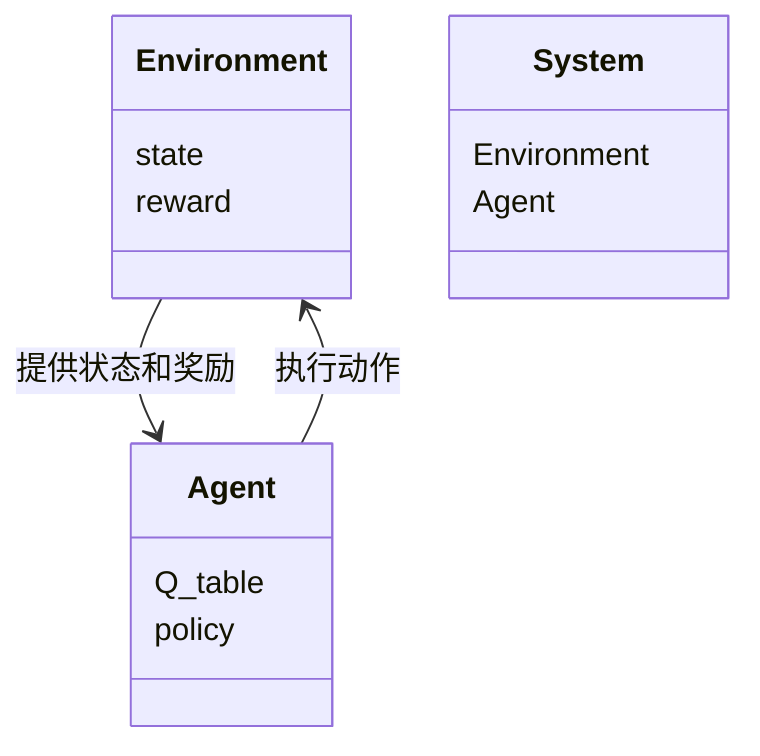
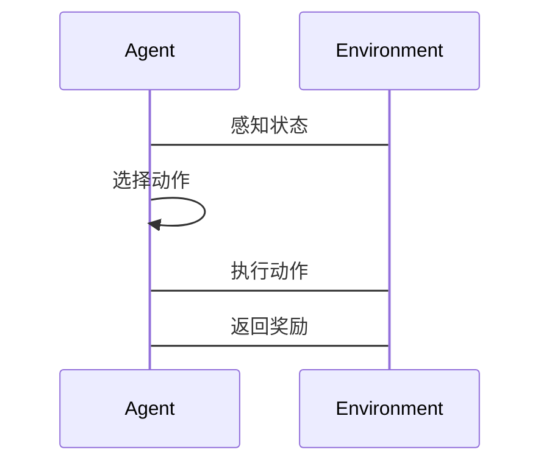

                 


# AI Agent的多智能体博弈与策略学习

## 关键词：
- AI Agent
- 多智能体博弈
- 策略学习
- 纳什均衡
- 强化学习
- 系统架构

## 摘要：
本文深入探讨AI Agent在多智能体博弈中的策略学习方法，分析多智能体系统的组成与特征，详细介绍博弈论在AI Agent中的应用。通过分析Q-learning、纳什Q-learning等算法的数学模型，展示其在多智能体环境中的实现与优化。文章还包括多智能体系统的架构设计、项目实战和高级主题，为读者提供全面的理论与实践指导。

---

# 第一部分: AI Agent与多智能体博弈基础

## 第1章: AI Agent的基本概念与多智能体系统概述

### 1.1 AI Agent的定义与分类

#### 1.1.1 AI Agent的基本定义
AI Agent（人工智能代理）是指能够感知环境、自主决策并采取行动的智能实体。根据智能水平，AI Agent可分为反应式、认知式和混合式代理。

#### 1.1.2 AI Agent的分类与特点
- **反应式AI Agent**：基于当前感知做出反应，适用于简单任务。
- **认知式AI Agent**：具备复杂推理能力，适用于复杂环境。
- **混合式AI Agent**：结合反应式和认知式特征，适用于复杂动态环境。

#### 1.1.3 多智能体系统的基本概念
多智能体系统由多个AI Agent组成，通过协作或竞争完成复杂任务。其核心在于智能体之间的交互与协调。

### 1.2 多智能体系统的组成与特征

#### 1.2.1 多智能体系统的组成要素
- **智能体**：独立决策的个体。
- **环境**：智能体所处的外部世界。
- **通信协议**：智能体之间交互的规则。
- **任务目标**：系统整体的决策目标。

#### 1.2.2 多智能体系统的特征分析
- **分布式性**：各智能体独立决策。
- **协作性**：智能体之间需要协作完成任务。
- **动态性**：环境和任务目标可能动态变化。

#### 1.2.3 多智能体系统与单智能体系统的区别
| 特性 | 单智能体系统 | 多智能体系统 |
|------|--------------|--------------|
| 决策 | 单一决策者   | 多个决策者   |
| 交互 | 无或简单     | 高度复杂     |
| 复杂度 | 较低         | 较高         |

### 1.3 多智能体博弈的基本概念

#### 1.3.1 博弈论基础
博弈论研究理性决策者在冲突情况下的策略选择。基本要素包括参与者、策略、收益和规则。

#### 1.3.2 多智能体博弈的定义
多智能体博弈指多个智能体在共享环境中互动，通过策略选择最大化自身收益的过程。

#### 1.3.3 多智能体博弈的分类
- **合作型博弈**：智能体目标一致。
- **对抗型博弈**：智能体目标冲突。
- **竞争型博弈**：智能体目标部分一致。

---

## 第2章: 多智能体博弈的核心概念与联系

### 2.1 多智能体博弈的原理

#### 2.1.1 纯策略与混合策略
- **纯策略**：智能体始终选择固定策略。
- **混合策略**：智能体以一定概率选择多个策略。

#### 2.1.2 纳什均衡的概念与计算
纳什均衡是博弈中所有参与者策略的稳定状态。计算方法包括枚举法和极小化极大法。

#### 2.1.3 博弈树与博弈图的构建
博弈树展示决策过程，博弈图展示状态转移关系。

### 2.2 多智能体博弈中的角色关系

#### 2.2.1 合作型博弈
智能体通过协作实现共同目标，典型例子是囚徒困境。

#### 2.2.2 对抗型博弈
智能体目标冲突，典型例子是矩阵博弈。

#### 2.2.3 竞争型博弈
智能体目标部分一致，典型例子是拍卖。

### 2.3 多智能体博弈的核心要素对比

| 特性 | 合作型博弈 | 对抗型博弈 | 竞争型博弈 |
|------|------------|------------|------------|
| 目标一致性 | 高        | 低        | 中        |
| 策略依赖性 | 高        | 高        | 中        |

---

## 第3章: 多智能体博弈的算法原理

### 3.1 基于Q-learning的多智能体博弈算法

#### 3.1.1 Q-learning算法的基本原理
Q-learning通过经验更新Q值表，实现策略优化。公式如下：
$$ Q(s, a) = Q(s, a) + \alpha (r + \gamma \max Q(s', a')) - Q(s, a) $$

#### 3.1.2 多智能体Q-learning的实现流程
1. 初始化Q值表。
2. 智能体感知环境。
3. 选择动作并执行。
4. 更新Q值表。
5. 重复直到收敛。

#### 3.1.3 多智能体Q-learning的数学模型
$$ Q_i(s, a) = Q_i(s, a) + \alpha (r_i + \gamma \max Q_j(s', a')) - Q_i(s, a) $$

---

## 第4章: 多智能体博弈的算法实现

### 4.1 基于纳什均衡的博弈算法

#### 4.1.1 纳什均衡的定义与计算
纳什均衡是博弈中所有参与者策略的稳定状态。

#### 4.1.2 纳什Q-learning算法的实现步骤
1. 初始化Q值表。
2. 计算纳什均衡。
3. 更新Q值表。
4. 重复直到收敛。

#### 4.1.3 纳什Q-learning的数学公式
$$ Q(s, a) = Q(s, a) + \alpha (r + \gamma \max Q(s', a')) - Q(s, a) $$

---

## 第5章: 系统分析与架构设计方案

### 5.1 项目介绍
一个简单的多智能体博弈环境，实现纳什均衡计算。

### 5.2 系统功能设计（领域模型Mermaid类图）


### 5.3 系统架构设计（Mermaid架构图）
```mermaid
container 多智能体系统 {
    Environment
    Agent
}
Environment --> Agent: 提供状态和奖励
Agent --> Environment: 执行动作
```

### 5.4 系统交互（Mermaid序列图）


---

## 第6章: 项目实战

### 6.1 环境安装
安装Python和必要的库，如numpy和matplotlib。

### 6.2 核心实现代码
```python
import numpy as np

class Agent:
    def __init__(self, state_space, action_space):
        self.Q = np.zeros((state_space, action_space))
    
    def choose_action(self, state, epsilon=0.1):
        if np.random.random() < epsilon:
            return np.random.randint(0, action_space)
        return np.argmax(self.Q[state])
    
    def update_Q(self, state, action, reward, next_state, alpha=0.1, gamma=0.99):
        self.Q[state][action] += alpha * (reward + gamma * np.max(self.Q[next_state]) - self.Q[state][action])
```

### 6.3 代码应用解读与分析
- **选择动作**：基于epsilon-greedy策略选择动作。
- **更新Q值**：通过Q-learning公式更新Q表。

### 6.4 实际案例分析
分析囚徒困境中的策略选择。

### 6.5 项目小结
总结实现过程中的关键点和经验教训。

---

## 第7章: 高级主题与应用展望

### 7.1 元学习与迁移学习
- **元学习**：学习如何学习，适用于多智能体博弈。
- **迁移学习**：将经验迁移到新任务。

### 7.2 人机协作
结合人类决策和AI Agent的协作，提升系统性能。

### 7.3 多智能体博弈的应用展望
- **游戏AI**：提升游戏AI的智能水平。
- **机器人协作**：实现高效的人机协作。
- **自动驾驶**：优化多车协作与决策。

---

## 第8章: 总结与展望

### 8.1 核心内容总结
总结全文的核心内容，强调多智能体博弈与策略学习的重要性。

### 8.2 未来研究方向
- 更高效的算法设计。
- 更复杂的博弈模型。
- 更广泛的应用场景。

---

## 参考文献
- [1] 纳什均衡的定义与计算。
- [2] 多智能体博弈的数学模型。
- [3] 强化学习的经典算法。

---

通过以上目录结构，我们可以清晰地看到文章的逻辑和内容安排。每一章都涵盖了从基础概念到高级算法的详细讲解，同时结合实际案例和系统设计，帮助读者全面理解AI Agent的多智能体博弈与策略学习。

