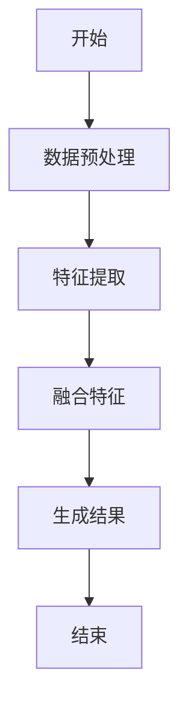
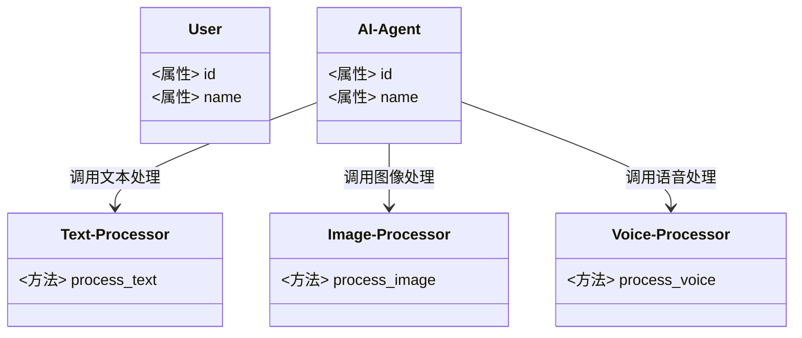
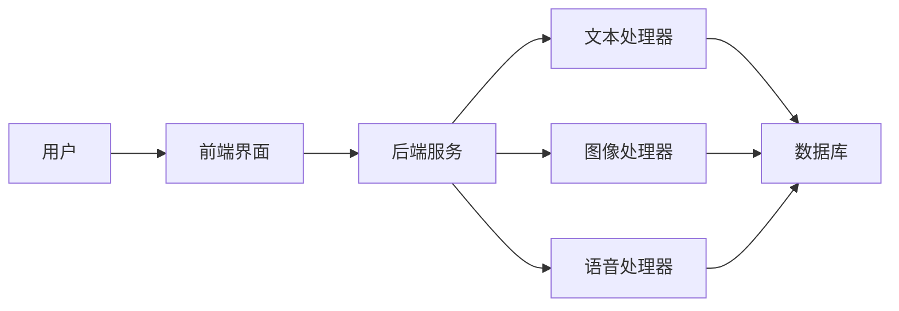
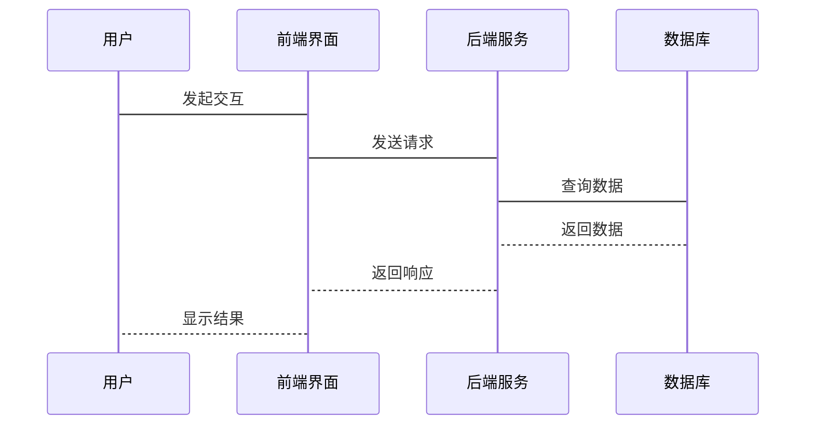

                 


# AI Agent的多模态交互能力开发

> 关键词：AI Agent，多模态交互，自然语言处理，计算机视觉，数据融合，系统架构，机器学习

> 摘要：本文将详细介绍AI Agent的多模态交互能力开发，从基本概念到实际应用，全面解析如何构建具备多模态交互能力的AI Agent。文章内容涵盖多模态数据融合算法、系统架构设计、项目实战等，帮助读者深入理解并掌握AI Agent的多模态交互开发能力。

---

## 第1章 AI Agent与多模态交互概述

### 1.1 AI Agent的基本概念
AI Agent（人工智能代理）是一种智能体，能够感知环境、自主决策并执行任务。它具备以下特点：
- **自主性**：能够在没有外部干预的情况下独立运作。
- **反应性**：能够实时感知环境变化并做出响应。
- **目标导向**：以特定目标为导向，优化决策和行动。

### 1.2 多模态交互的定义与意义
多模态交互是指通过多种数据类型（如文本、图像、语音等）进行信息交换和理解。其意义在于：
- **提升用户体验**：通过多模态信息的整合，提供更自然、更丰富的交互方式。
- **增强任务处理能力**：结合多种数据源，提高AI Agent的感知和决策能力。

### 1.3 AI Agent在多模态交互中的作用
AI Agent在多模态交互中主要起到整合和协调的作用，能够将不同模态的数据进行融合，提供更智能的服务。

---

## 第2章 多模态交互的核心概念与联系

### 2.1 多模态数据融合的原理
多模态数据融合是将来自不同模态的数据进行整合，以获得更准确的信息。常见的融合方法包括：
- **数据级融合**：在数据预处理阶段进行融合。
- **特征级融合**：在特征提取阶段进行融合。
- **决策级融合**：在决策阶段进行融合。

### 2.2 AI Agent与多模态交互的关系
AI Agent通过多模态交互能够更好地理解用户需求，提供更精准的服务。例如，在智能客服系统中，AI Agent可以通过文本、语音和图像等多种模态信息，更全面地理解用户的问题。

### 2.3 多模态交互的ER实体关系图
以下是多模态交互的ER实体关系图：
```mermaid
erDiagram
    actor User {
        <属性> id
        <属性> name
    }
    agent AI-Agent {
        <属性> id
        <属性> name
    }
    modality Text {
        <属性> content
    }
    modality Image {
        <属性> url
    }
    modality Voice {
        <属性> audio_url
    }
    User --> AI-Agent: 发起交互
    AI-Agent --> Text: 处理文本信息
    AI-Agent --> Image: 处理图像信息
    AI-Agent --> Voice: 处理语音信息
```

---

## 第3章 多模态交互的算法原理讲解

### 3.1 多模态数据融合算法
以下是多模态数据融合算法的流程图：


以下是具体的Python代码示例：
```python
import numpy as np

def modality_fusion(text_feature, image_feature, voice_feature):
    # 数据预处理
    text_feature = text_feature.reshape(-1)
    image_feature = image_feature.reshape(-1)
    voice_feature = voice_feature.reshape(-1)
    
    # 特征融合
    fused_feature = np.concatenate([text_feature, image_feature, voice_feature])
    return fused_feature

# 示例数据
text_feature = np.array([1, 2, 3])
image_feature = np.array([4, 5, 6])
voice_feature = np.array([7, 8, 9])

# 融合特征
result = modality_fusion(text_feature, image_feature, voice_feature)
print("融合特征:", result)
```

### 3.2 多模态融合的数学模型
以下是多模态融合的数学模型：
$$
\text{融合特征} = \text{模态1特征} \oplus \text{模态2特征} \oplus \text{模态3特征}
$$
其中，$\oplus$ 表示特征融合操作。

---

## 第4章 系统分析与架构设计方案

### 4.1 问题场景介绍
以智能客服系统为例，AI Agent需要通过文本、语音和图像等多种模态信息，提供更智能的服务。

### 4.2 系统功能设计
以下是系统功能设计的类图：


### 4.3 系统架构设计
以下是系统架构设计的架构图：


### 4.4 系统接口设计
以下是系统接口设计的交互序列图：


---

## 第5章 项目实战

### 5.1 环境安装
安装所需的开发环境，包括Python、TensorFlow、OpenCV等。

### 5.2 系统核心实现源代码
以下是核心代码实现：
```python
import tensorflow as tf
import cv2
import numpy as np

# 文本处理
text_data = "Hello, how can I help you?"
text_model = tf.keras.Sequential([tf.keras.layers.Dense(128, activation='relu'),
                                  tf.keras.layers.Dense(32, activation='relu')])
text_feature = text_model(tf.convert_to_tensor([text_data]))

# 图像处理
image_data = cv2.imread("image.jpg")
image_model = tf.keras.Sequential([tf.keras.layers.Conv2D(32, (3, 3), activation='relu'),
                                  tf.keras.layers.MaxPooling2D((2, 2)),
                                  tf.keras.layers.Flatten()])
image_feature = image_model(tf.convert_to_tensor([image_data]))

# 语音处理
voice_data = np.array([1, 2, 3, 4, 5])
voice_model = tf.keras.Sequential([tf.keras.layers.Dense(32, activation='relu'),
                                  tf.keras.layers.Dense(16, activation='relu')])
voice_feature = voice_model(tf.convert_to_tensor([voice_data]))

# 融合特征
fused_feature = np.concatenate([text_feature, image_feature, voice_feature])
print("融合特征:", fused_feature)
```

### 5.3 代码解读与分析
- **文本处理**：使用神经网络模型提取文本特征。
- **图像处理**：使用卷积神经网络提取图像特征。
- **语音处理**：使用全连接网络提取语音特征。
- **融合特征**：将文本、图像和语音特征进行融合，生成最终的特征向量。

### 5.4 实际案例分析
以智能客服系统为例，通过多模态交互提升用户体验，提高客服效率。

### 5.5 项目小结
总结项目开发过程中的经验和教训，提出改进建议。

---

## 第6章 最佳实践与拓展阅读

### 6.1 最佳实践
- **数据质量**：确保多模态数据的高质量。
- **模型调优**：通过实验不断优化模型性能。
- **系统架构**：设计合理的系统架构，确保系统的可扩展性和可维护性。

### 6.2 小结
通过本文的系统性介绍，读者可以全面理解AI Agent的多模态交互能力开发。

### 6.3 注意事项
- 在开发过程中，需要注意数据隐私和安全问题。
- 在系统设计时，要充分考虑系统的可扩展性和可维护性。

### 6.4 拓展阅读
- 推荐阅读《Deep Learning》、《Pattern Recognition and Machine Learning》等书籍。

---

通过本文的详细讲解，读者可以全面掌握AI Agent的多模态交互能力开发，从理论到实践，逐步构建具备多模态交互能力的智能系统。

