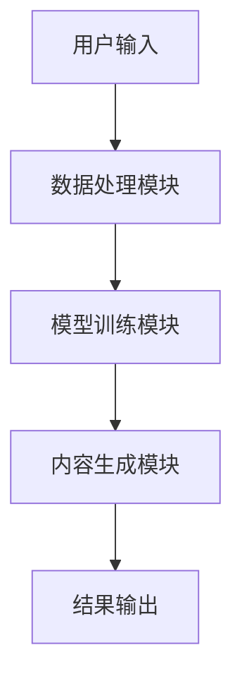
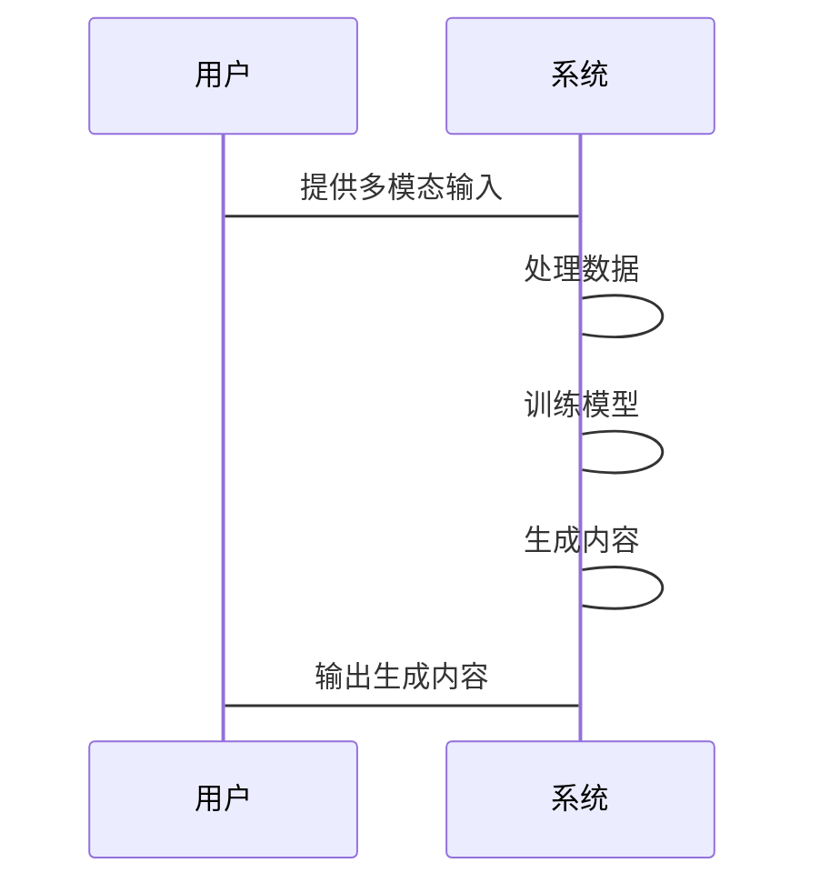

                 


# AI Agent的多模态内容生成与编辑

> 关键词：AI Agent，多模态内容，生成模型，内容编辑，系统架构

> 摘要：本文探讨了AI Agent在多模态内容生成与编辑中的应用，分析了其核心算法、系统架构以及实际应用场景，提供了从理论到实践的全面解析。

---

## 第一部分: AI Agent与多模态内容生成的基础

### 第1章: AI Agent的基本概念

#### 1.1 AI Agent的定义与特点
##### 1.1.1 AI Agent的定义
AI Agent（人工智能代理）是指能够感知环境、执行任务并做出决策的智能实体。它可以是软件程序、机器人或其他智能系统，具备自主性、反应性和目标导向性。

##### 1.1.2 AI Agent的核心特点
| 特性 | 描述 |
|------|------|
| 自主性 | 能够独立执行任务，无需外部干预 |
| 反应性 | 能够感知环境并实时调整行为 |
| 目标导向 | 以实现特定目标为导向 |

##### 1.1.3 AI Agent与传统AI的区别
- **传统AI**：通常专注于特定任务，如语音识别或图像分类，不具备自主性和目标导向性。
- **AI Agent**：具备自主性、反应性和目标导向性，能够动态调整行为以实现目标。

#### 1.2 多模态内容的定义与特点
##### 1.2.1 多模态的定义
多模态是指整合多种数据类型（如文本、图像、语音、视频）进行分析和生成的技术。多模态内容能够提供更丰富和全面的信息表达。

##### 1.2.2 多模态内容的核心特点
| 特性 | 描述 |
|------|------|
| 多样性 | 包含多种数据类型 |
| 融合性 | 能够将不同模态的数据进行融合分析 |
| 表达性 | 提供更丰富的信息表达方式 |

#### 1.3 AI Agent在多模态内容生成中的作用
##### 1.3.1 AI Agent的多模态能力
AI Agent能够处理和生成多种数据类型的内容，如文本、图像和语音，具备多模态数据处理能力。

##### 1.3.2 AI Agent在内容生成中的优势
- **高效性**：能够快速生成高质量的内容。
- **灵活性**：能够根据需求调整生成的内容形式。
- **智能化**：能够理解上下文并生成相关的内容。

##### 1.3.3 多模态内容生成的挑战
- **数据整合复杂性**：不同模态的数据需要协调一致。
- **模型训练难度**：需要处理多种数据类型，模型训练复杂。
- **生成质量控制**：确保生成内容的质量和相关性。

### 第2章: 多模态内容生成的背景与应用

#### 2.1 多模态内容生成的背景
##### 2.1.1 数字化内容的需求增长
随着数字化转型的推进，市场对多样化内容的需求不断增加，多模态内容生成成为必要。

##### 2.1.2 AI技术的快速发展
深度学习和大语言模型的进步为多模态内容生成提供了技术支持。

##### 2.1.3 多模态内容生成的必要性
单模态内容无法满足复杂的表达需求，多模态内容生成能够提供更丰富和准确的信息。

#### 2.2 多模态内容生成的主要应用领域
##### 2.2.1 媒体与娱乐
- **自动生成新闻报道**：整合文本、图像和视频，生成多模态新闻内容。
- **游戏开发**：生成多模态的游戏角色和场景。

##### 2.2.2 教育与培训
- **个性化学习内容**：根据学生需求生成定制化的学习材料。
- **虚拟培训师**：通过多模态交互提供培训支持。

##### 2.2.3 商业与广告
- **智能广告生成**：根据目标受众生成个性化广告内容。
- **品牌故事生成**：生成多模态的品牌故事和宣传材料。

##### 2.2.4 科学研究
- **数据可视化**：将复杂数据转化为多模态的可视化形式。
- **科研报告生成**：整合文本和图表生成研究报告。

#### 2.3 AI Agent在多模态内容生成中的应用案例
##### 2.3.1 媒体内容自动生成
AI Agent可以整合文本、图像和视频数据，自动生成新闻报道和短视频内容。

##### 2.3.2 教育辅助工具
AI Agent可以生成个性化学习材料，如定制化的教材和练习题，提升学习效果。

##### 2.3.3 商业应用实例
AI Agent可以为品牌生成多模态的广告内容，包括文本、图像和视频，提升广告效果。

### 第3章: AI Agent的多模态内容生成原理

#### 3.1 多模态数据的整合与处理
##### 3.1.1 文本、图像、语音等多模态数据的整合
多模态数据整合需要考虑不同数据类型的特性，确保数据能够有效融合。

##### 3.1.2 多模态数据的预处理与特征提取
- **文本预处理**：包括分词、去停用词等。
- **图像预处理**：包括图像增强、特征提取等。
- **语音预处理**：包括降噪、特征提取等。

#### 3.2 AI Agent的多模态模型构建
##### 3.2.1 多模态模型的结构设计
多模态模型通常采用编码器-解码器结构，编码器用于特征提取，解码器用于内容生成。

##### 3.2.2 多模态模型的训练与优化
- **联合训练**：同时训练多模态数据，优化模型性能。
- **跨模态对齐**：通过对比学习等方式，实现不同模态之间的对齐。

#### 3.3 多模态内容生成的算法流程
##### 3.3.1 数据输入与解析
AI Agent接收多模态输入数据，进行解析和处理。

##### 3.3.2 内容生成与输出
- **文本生成**：基于大语言模型生成文本内容。
- **图像生成**：基于生成对抗网络生成图像。
- **多模态生成**：同时生成文本和图像等多模态内容。

##### 3.3.3 结果评估与优化
- **评估指标**：如BLEU、PSNR等，用于评估生成内容的质量。
- **优化方法**：如调整超参数、改进模型结构等，提升生成效果。

### 第4章: 多模态内容生成的核心算法

#### 4.1 大语言模型在文本生成中的应用
##### 4.1.1 大语言模型的原理
大语言模型通过大量数据训练，具备强大的文本生成能力。

##### 4.1.2 大语言模型的实现
- **Transformer架构**：包括编码器和解码器部分。
- **自注意力机制**：通过自注意力机制捕捉文本中的长距离依赖。

##### 4.1.3 大语言模型的数学公式
$$
\text{解码器输出} = \text{自注意力}(解码器输入) + \text{交叉注意力}(编码器输出)
$$

#### 4.2 视觉模型在图像生成中的应用
##### 4.2.1 视觉模型的原理
视觉模型通过卷积神经网络提取图像特征，生成高质量的图像。

##### 4.2.2 视觉模型的实现
- **生成对抗网络（GAN）**：包括生成器和判别器，通过对抗训练生成图像。
- **深度卷积网络（DCN）**：通过深度卷积网络提取图像特征。

##### 4.2.3 视觉模型的数学公式
$$
\text{生成器输出} = G(x) \\
\text{判别器输出} = D(G(x))
$$

#### 4.3 多模态模型的实现
##### 4.3.1 多模态模型的原理
多模态模型通过联合学习不同模态的数据，生成多模态内容。

##### 4.3.2 多模态模型的实现
- **多模态编码器**：将不同模态的数据编码为统一的特征表示。
- **多模态解码器**：根据编码后的特征生成多模态内容。

##### 4.3.3 多模态模型的数学公式
$$
\text{编码器输出} = E(x_1, x_2, \ldots, x_n) \\
\text{解码器输出} = D(E(x_1, x_2, \ldots, x_n))
$$

### 第5章: 多模态内容生成的系统架构

#### 5.1 系统设计
##### 5.1.1 系统功能需求
- **多模态数据输入**：支持文本、图像、语音等多种数据类型的输入。
- **内容生成**：生成文本、图像等多模态内容。
- **结果输出**：输出生成的内容并提供反馈。

##### 5.1.2 系统模块划分
- **数据处理模块**：负责数据的预处理和特征提取。
- **模型训练模块**：负责多模态模型的训练和优化。
- **内容生成模块**：根据输入生成多模态内容。
- **结果评估模块**：评估生成内容的质量并提供反馈。

#### 5.2 系统架构设计
##### 5.2.1 系统架构图


##### 5.2.2 系统交互设计


#### 5.3 系统接口设计
##### 5.3.1 接口描述
- **输入接口**：支持多种数据类型的输入。
- **输出接口**：输出生成的内容并提供反馈。

##### 5.3.2 接口实现
- **API接口**：提供RESTful API，方便调用。
- **数据格式**：支持JSON、XML等数据格式。

### 第6章: 项目实战

#### 6.1 环境安装
##### 6.1.1 安装Python
安装Python 3.8及以上版本。

##### 6.1.2 安装相关库
安装必要的库，如TensorFlow、PyTorch、OpenCV等。

#### 6.2 系统核心实现
##### 6.2.1 数据处理代码
```python
import numpy as np
import cv2

def preprocess_image(image_path):
    # 读取图像
    image = cv2.imread(image_path)
    # 调整图像尺寸
    image = cv2.resize(image, (256, 256))
    # 转换为张量
    image_tensor = np.array(image)
    return image_tensor
```

##### 6.2.2 模型训练代码
```python
import tensorflow as tf
from tensorflow.keras import layers

def build_model():
    inputs = layers.Input(shape=(256, 256, 3))
    x = layers.Conv2D(64, (3, 3), activation='relu')(inputs)
    x = layers.MaxPooling2D((2, 2))(x)
    x = layers.Conv2D(128, (3, 3), activation='relu')(x)
    x = layers.MaxPooling2D((2, 2))(x)
    x = layers.Flatten()(x)
    x = layers.Dense(256, activation='relu')(x)
    outputs = layers.Dense(10, activation='softmax')(x)
    model = tf.keras.Model(inputs=inputs, outputs=outputs)
    return model
```

##### 6.2.3 内容生成代码
```python
import openai

def generate_text(prompt):
    response = openai.Completion.create(
        engine="gpt-3.5",
        prompt=prompt,
        max_tokens=1000,
        temperature=0.7
    )
    return response.choices[0].text
```

#### 6.3 代码应用解读与分析
##### 6.3.1 数据处理代码解读
- **preprocess_image函数**：读取图像并进行预处理，包括调整尺寸和转换为张量。

##### 6.3.2 模型训练代码解读
- **build_model函数**：构建一个卷积神经网络模型，用于图像分类任务。

##### 6.3.3 内容生成代码解读
- **generate_text函数**：使用OpenAI的GPT-3.5模型生成文本内容，基于给定的提示。

#### 6.4 实际案例分析
##### 6.4.1 案例背景
假设我们需要生成一篇关于“人工智能”的多模态新闻报道，包括文本和图像。

##### 6.4.2 系统实现
- **输入**：用户提供“人工智能”作为主题。
- **处理**：系统生成相关的文本内容和相关图像。
- **输出**：生成一篇包含文本和图像的新闻报道。

##### 6.4.3 代码实现
```python
# 提供主题
prompt = "人工智能"

# 生成文本内容
text_content = generate_text(prompt)

# 生成图像
image_path = "AI-icon.png"

# 输出结果
print("生成的文本内容：")
print(text_content)
print("生成的图像路径：")
print(image_path)
```

#### 6.5 项目小结
通过项目实战，我们能够了解AI Agent在多模态内容生成中的实际应用，掌握从数据处理到模型训练再到内容生成的整个流程。

---

## 总结

本文系统地介绍了AI Agent在多模态内容生成与编辑中的应用，从基础概念到核心算法，再到系统架构和项目实战，为读者提供了全面的知识体系。通过本文的学习，读者可以掌握AI Agent的多模态内容生成技术，并能够在实际应用中灵活运用这些知识。未来，随着AI技术的不断发展，AI Agent的多模态内容生成将更加智能化和多样化，为各个领域带来更多的创新和变革。

--- 

关键词：AI Agent，多模态内容，生成模型，内容编辑，系统架构

摘要：本文探讨了AI Agent在多模态内容生成与编辑中的应用，分析了其核心算法、系统架构以及实际应用场景，提供了从理论到实践的全面解析。

