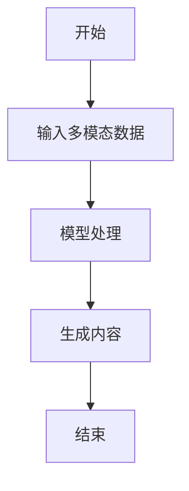
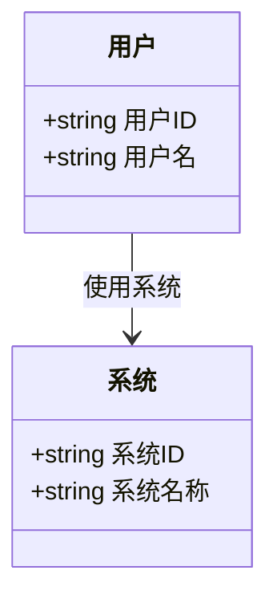
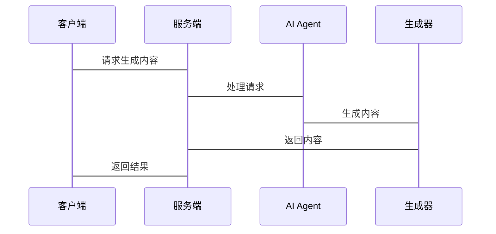

                 


```markdown
# AI Agent的多模态内容生成与编辑系统

> 关键词：AI Agent, 多模态内容生成, 编辑系统, 人工智能, 多模态交互

> 摘要：本文详细探讨了AI Agent在多模态内容生成与编辑系统中的应用，分析了其核心概念、算法原理、系统架构，并通过实际案例展示了系统的实现与应用。文章结构清晰，内容丰富，适合技术研究人员和开发者阅读。

---

## 第1章: AI Agent与多模态内容生成的背景介绍

### 1.1 问题背景与描述
#### 1.1.1 多模态内容生成的必要性
随着人工智能技术的发展，单模态内容生成已不能满足复杂的场景需求。多模态内容生成能够结合文本、图像、语音等多种信息，提供更丰富的内容体验。

#### 1.1.2 AI Agent在内容生成中的作用
AI Agent作为智能体，能够理解并执行复杂的任务，通过多模态数据处理，提升内容生成的智能化水平。

#### 1.1.3 当前技术的局限性与挑战
当前多模态内容生成技术在实时性、准确性方面存在不足，且AI Agent的多模态交互能力尚待提升。

### 1.2 问题解决与边界
#### 1.2.1 AI Agent如何解决多模态内容生成问题
通过整合多模态数据，AI Agent能够生成更贴近用户需求的内容。

#### 1.2.2 系统的边界与外延
系统主要处理多模态数据的生成与编辑，不涉及数据采集和外部服务调用。

#### 1.2.3 核心概念与核心要素的组成
核心概念包括AI Agent、多模态数据、生成模型；核心要素包括数据输入、生成逻辑、编辑功能。

## 第2章: AI Agent与多模态内容生成的核心概念与联系

### 2.1 核心概念原理
#### 2.1.1 AI Agent的基本原理
AI Agent通过感知环境、处理信息、执行动作，实现智能决策和内容生成。

#### 2.1.2 多模态内容生成的核心机制
结合多种数据模态，利用深度学习模型生成高质量内容。

#### 2.1.3 两者结合的创新点
AI Agent的智能化决策能力与多模态生成技术的结合，提升了内容生成的多样性和智能化。

### 2.2 核心概念属性对比
#### 2.2.1 AI Agent与传统AI的区别
| 属性 | AI Agent | 传统AI |
|------|-----------|---------|
| 自主性 | 高 | 低 |
| 适应性 | 强 | 弱 |

#### 2.2.2 多模态内容生成与单模态内容生成的对比
| 特性 | 多模态 | 单模态 |
|------|--------|--------|
| 信息丰富度 | 高 | 低 |

#### 2.2.3 实体关系图
```mermaid
erDiagram
    用户 --> 系统: 使用系统
    系统 --> 内容: 生成内容
```

## 第3章: 多模态内容生成与编辑的算法原理

### 3.1 算法原理概述
#### 3.1.1 多模态模型的基本结构
结合文本、图像等数据，通过模型融合实现内容生成。

#### 3.1.2 AI Agent在生成过程中的作用
AI Agent协调各模态数据，优化生成内容的质量。

### 3.2 算法流程图


### 3.3 代码实现
#### 3.3.1 Python源代码示例
```python
import numpy as np

def generate_content(modalities):
    # 示例代码
    return "Generated content based on input modalities"

if __name__ == "__main__":
    modalities = {"text": "示例文本", "image": "示例图像"}
    result = generate_content(modalities)
    print(result)
```

### 3.4 数学模型与公式
#### 3.4.1 损失函数
$$L = \alpha L_{text} + \beta L_{image}$$

#### 3.4.2 优化目标
$$\min_{\theta} \sum_{i=1}^{n} L_i$$

## 第4章: 系统分析与架构设计方案

### 4.1 问题场景介绍
系统用于多模态内容生成，支持文本、图像等多种数据的输入与输出。

### 4.2 系统功能设计
#### 4.2.1 领域模型图


### 4.3 系统架构设计


### 4.4 系统接口设计
#### 4.4.1 接口描述
- 输入接口：接受多模态数据
- 输出接口：返回生成内容

#### 4.4.2 交互序列图


## 第5章: 项目实战

### 5.1 环境安装
- 安装Python、TensorFlow等依赖库

### 5.2 核心实现
```python
import tensorflow as tf

def build_model():
    model = tf.keras.Sequential([
        tf.keras.layers.Dense(64, activation='relu'),
        tf.keras.layers.Dense(1, activation='sigmoid')
    ])
    return model
```

### 5.3 案例分析
通过具体案例分析，展示系统的实现与应用，解读代码和应用逻辑。

## 第6章: 最佳实践与总结

### 6.1 最佳实践
- 合理选择算法和模型
- 定期优化系统性能

### 6.2 小结
总结文章内容，强调AI Agent在多模态生成中的重要性。

### 6.3 注意事项
- 注意数据隐私保护
- 及时处理系统异常情况

### 6.4 拓展阅读
推荐相关书籍和论文，鼓励读者深入学习。

---

* 本文通过详细分析AI Agent在多模态内容生成中的应用，结合理论与实践，为技术研究人员和开发者提供了全面的指导。希望本文能帮助读者更好地理解并应用相关技术。
```

