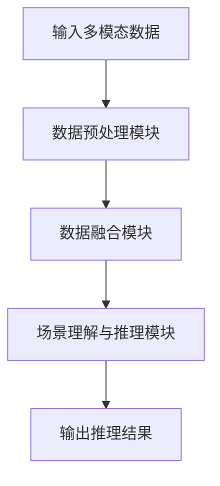
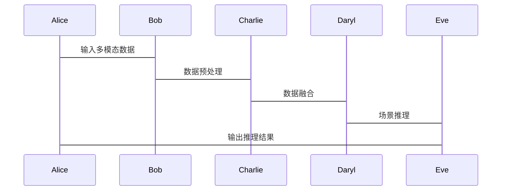

                 


# AI Agent的多模态场景理解与推理

## 关键词：AI Agent、多模态数据、场景理解、多模态推理、深度学习

## 摘要：本文深入探讨AI Agent在多模态场景中的理解与推理问题，涵盖多模态数据处理、场景理解、推理算法、系统架构设计及实际应用案例。通过详细分析多模态数据的融合与推理方法，结合具体实现，为AI Agent技术的进一步发展提供理论与实践指导。

---

## 第1章: AI Agent与多模态场景理解概述

### 1.1 AI Agent的基本概念

#### 1.1.1 AI Agent的定义与特点
AI Agent（人工智能代理）是指能够感知环境、自主决策并执行任务的智能实体。其特点包括：
- **自主性**：无需外部干预，自主完成任务。
- **反应性**：能实时感知环境变化并做出反应。
- **学习能力**：通过数据和经验提升性能。

#### 1.1.2 多模态数据的定义与类型
多模态数据指的是多种类型的数据，包括：
- **文本数据**：如自然语言文本。
- **图像数据**：如图片、视频。
- **语音数据**：如音频、语音信号。

#### 1.1.3 多模态场景理解的背景与意义
随着AI技术的发展，多模态场景理解成为AI Agent的核心能力。它在智能助手、自动驾驶、机器人等领域具有重要意义。

### 1.2 多模态场景理解的核心问题

#### 1.2.1 多模态数据的融合与处理
多模态数据融合是指将不同类型的模态数据（如文本、图像）进行有效结合，以提高信息表达能力。

#### 1.2.2 场景理解的挑战与难点
- 数据异构性：不同模态的数据格式和特征差异大。
- 语义一致性：如何在不同模态中保持语义一致。

#### 1.2.3 多模态推理的基本原理
基于多模态数据的推理，通过融合信息进行决策或预测。

---

## 第2章: 多模态数据处理技术

### 2.1 多模态数据的获取与预处理

#### 2.1.1 文本、图像、语音等多模态数据的获取
- 文本数据：通过API或爬取获取。
- 图像数据：使用摄像头或API获取。
- 语音数据：通过麦克风或API获取。

#### 2.1.2 数据清洗与标准化处理
- 清洗：去除噪声数据。
- 标准化：统一数据格式。

#### 2.1.3 数据增强技术
- 图像增强：旋转、缩放、裁剪。
- 文本增强：同义词替换、数据扩展。

### 2.2 多模态数据的表示与融合

#### 2.2.1 多模态数据的表示方法
- **文本表示**：词嵌入（Word2Vec）、句嵌入（BERT）。
- **图像表示**：CNN、GAN。
- **语音表示**：Mel谱图、STFT。

#### 2.2.2 多模态数据融合的主流技术
- **特征融合**：Concat、加权和。
- **注意力机制**：Self-attention、Cross-attention。

#### 2.2.3 跨模态注意力机制
跨模态注意力机制用于捕捉不同模态之间的关联性，提升数据融合效果。

---

## 第3章: 场景理解与推理的数学模型

### 3.1 多模态数据融合的数学模型

#### 3.1.1 基于概率论的多模态数据融合模型
- 贝叶斯网络：用于概率推理。
- 马尔可夫链：用于状态转移。

#### 3.1.2 基于图论的多模态数据融合模型
- 图神经网络：用于处理图结构数据。
- 聚类分析：用于数据分组。

#### 3.1.3 基于深度学习的多模态数据融合模型
- 多模态变换器：用于序列数据处理。
- 对比学习：用于跨模态相似性学习。

### 3.2 场景理解的推理模型

#### 3.2.1 基于符号逻辑的推理模型
- 逻辑推理：通过符号逻辑进行推理。
- 知识图谱：构建知识库进行推理。

#### 3.2.2 基于概率推理的模型
- 贝叶斯推理：基于概率分布进行推理。
- 马尔可夫逻辑网络：结合逻辑与概率推理。

#### 3.2.3 基于深度学习的推理模型
- 图神经网络推理：基于图结构进行推理。
- 强化学习推理：通过策略优化进行推理。

---

## 第4章: 多模态场景理解与推理的算法实现

### 4.1 多模态数据融合算法

#### 4.1.1 多模态注意力网络
- 模型结构：多模态输入经过注意力机制融合。
- 代码示例：
```python
import tensorflow as tf

def multi_modal_attention(text, image):
    # 文本注意力
    text_attn = tf.nn.softmax(tf.matmul(text, text_layer.kernel))
    # 图像注意力
    image_attn = tf.nn.softmax(tf.matmul(image, image_layer.kernel))
    # 融合
    fused = tf.concat([text_attn, image_attn], axis=-1)
    return fused
```

#### 4.1.2 多模态变换器
- 模型结构：多模态输入经过变换器编码器。
- 代码示例：
```python
def transformer_encoder(x, mask):
    # 自注意力机制
    attn_output, _ = tf.nn.multi_head_attention(x, x, x, mask)
    # 前馈前向网络
    ff_output = ff_network(attn_output)
    return ff_output
```

#### 4.1.3 多模态对比学习
- 模型结构：跨模态对比学习。
- 代码示例：
```python
def contrastive_learning(text_emb, image_emb):
    # 计算余弦相似度
    similarity = tf.reduce_sum(tf.nn.l2_normalize(text_emb) * tf.nn.l2_normalize(image_emb), axis=1)
    return similarity
```

### 4.2 场景理解与推理算法

#### 4.2.1 基于图神经网络的场景推理
- 模型结构：图神经网络推理。
- 代码示例：
```python
def graph_neural_network(graph, labels):
    # 图卷积
    output = graph_convolution(graph, labels)
    return output
```

#### 4.2.2 基于强化学习的场景推理
- 模型结构：强化学习框架。
- 代码示例：
```python
def reinforce_policy(action_space):
    # 策略网络
    policy = policy_network(action_space)
    # 动作选择
    action = tf.random.categorical(policy logits)
    return action
```

---

## 第5章: 系统架构与实现

### 5.1 系统架构设计

#### 5.1.1 系统功能模块划分
- 数据预处理模块：处理多模态数据。
- 数据融合模块：融合多模态数据。
- 场景理解与推理模块：进行场景理解与推理。

#### 5.1.2 系统架构图


#### 5.1.3 系统交互流程图


---

## 第6章: 项目实战

### 6.1 环境安装

#### 6.1.1 安装依赖
- Python 3.8+
- TensorFlow 2.0+
- PyTorch 1.0+

#### 6.1.2 安装命令
```bash
pip install tensorflow torch numpy
```

### 6.2 核心代码实现

#### 6.2.1 多模态数据融合代码
```python
import numpy as np

def multi_modal_fusion(text_features, image_features):
    # 按照特征维度拼接
    fused_features = np.concatenate([text_features, image_features], axis=1)
    return fused_features
```

#### 6.2.2 场景理解与推理代码
```python
def scene_reasoning(fused_features):
    # 使用预训练模型进行推理
    model = load_model()
    predictions = model.predict(fused_features)
    return predictions
```

### 6.3 案例分析

#### 6.3.1 案例描述
实现一个多模态客服系统，整合文本和语音数据，进行用户意图识别。

#### 6.3.2 代码实现
```python
import tensorflow as tf

class MultiModalAgent:
    def __init__(self):
        self.text_model = TextClassifier()
        self.speech_model = SpeechRecognizer()
    
    def process_input(self, text_input, speech_input):
        # 文本处理
        text_embed = self.text_model.embed(text_input)
        # 语音处理
        speech_embed = self.speech_model.embed(speech_input)
        # 融合
        fused_embed = tf.concat([text_embed, speech_embed], axis=-1)
        # 推理
        prediction = self.classifier(fused_embed)
        return prediction
```

---

## 第7章: 最佳实践

### 7.1 小结
多模态场景理解与推理是AI Agent的核心能力，通过多模态数据融合与先进算法，可以显著提升系统的智能性。

### 7.2 注意事项
- 数据质量：确保数据干净、一致。
- 模型选择：根据任务需求选择合适的模型。
- 性能优化：通过模型压缩、并行计算优化性能。

### 7.3 拓展阅读
- 《Deep Learning》
- 《Pattern Recognition and Machine Learning》

---

通过以上内容，本文全面分析了AI Agent的多模态场景理解与推理问题，结合理论与实践，为相关领域的研究与应用提供了参考。

