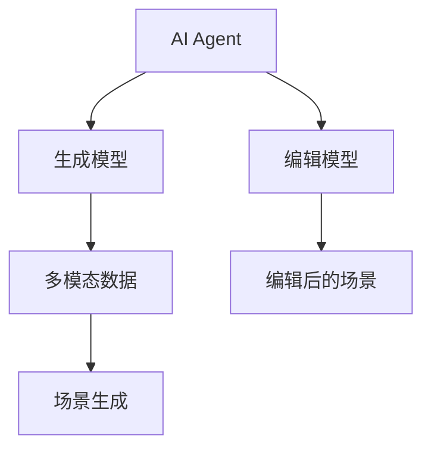

                 


# AI Agent的多模态场景生成与编辑

---

## 关键词：
AI Agent, 多模态场景, 生成模型, 编辑模型, 多模态数据, 生成式AI, 人工智能代理

---

## 摘要：
本文深入探讨了AI Agent在多模态场景生成与编辑中的应用。通过分析多模态数据的生成和编辑过程，结合生成式AI的核心算法，详细阐述了AI Agent在多模态场景构建中的作用及其技术实现。文章从理论基础、算法原理、系统架构到实际案例，全面解析了AI Agent驱动的多模态场景生成与编辑的实现路径，为相关领域的研究和实践提供了系统性指导。

---

## 第一部分: AI Agent与多模态场景生成的背景与概念

### 第1章: AI Agent的基本概念

#### 1.1 AI Agent的定义与特点
- **AI Agent的定义**：AI Agent是一种能够感知环境、自主决策并采取行动以实现特定目标的智能体。
- **AI Agent的核心特点**：
  - 智能性：具备学习、推理和决策能力。
  - 自主性：能够在没有外部干预的情况下独立运作。
  - 反应性：能够实时感知环境变化并做出相应反应。
  - 社会性：能够与其他Agent或人类进行交互和协作。
- **AI Agent与传统AI的区别**：AI Agent更注重动态环境中的自主决策和实时交互，而传统AI更多关注静态问题的解决。

#### 1.2 多模态数据的基本概念
- **多模态数据的定义**：多模态数据是指包含多种类型（如文本、图像、语音、视频等）的数据集合。
- **常见的多模态数据类型**：
  - 文本：包括自然语言文本、对话记录等。
  - 图像：包括图片、视频帧等。
  - 语音：包括音频信号、语音识别结果等。
  - 结构化数据：如表格数据、JSON格式数据等。
- **多模态数据处理的挑战**：
  - 数据异构性：不同数据类型之间的格式和结构差异较大。
  - 数据融合难度：如何有效结合不同模态的数据信息进行分析和生成。
  - 计算资源需求：多模态数据处理通常需要较高的计算能力。

#### 1.3 AI Agent和多模态数据的关系
- AI Agent能够利用多模态数据进行更全面的感知和决策。
- 多模态数据为AI Agent提供了更丰富的输入信息，使其能够生成更复杂和多样化的输出。

---

### 第2章: 多模态场景生成的背景与应用

#### 2.1 多模态场景生成的背景
- **生成式AI的发展历程**：从早期的生成对抗网络（GAN）到现在的扩散模型（Diffusion），生成式AI技术不断进步。
- **多模态生成的必要性**：单一模态的生成能力有限，结合多模态可以生成更真实、丰富的场景。
- **多模态场景生成的应用领域**：
  - 游戏开发：生成虚拟场景、角色和故事情节。
  - 虚拟现实：创建 immersive 的多感官体验。
  - 人机交互：通过多模态生成提升交互的自然性和丰富性。

#### 2.2 AI Agent在多模态场景生成中的作用
- **AI Agent作为生成主体**：AI Agent可以基于任务需求生成多模态数据。
- **AI Agent作为场景编辑工具**：AI Agent能够对已有的多模态数据进行编辑和优化。
- **AI Agent在多模态交互中的应用**：AI Agent能够通过多模态数据与用户进行更自然的交互。

#### 2.3 多模态场景生成的核心概念与联系
- **核心概念原理**：多模态场景生成需要结合多种数据类型，利用生成模型和编辑模型完成任务。
- **多模态数据属性特征对比表**：
  | 数据类型 | 特性 | 示例 |
  |----------|------|------|
  | 文本     | 离散性 | 自然语言句子 |
  | 图像     | 连续性 | 图片像素值 |
  | 语音     | 时间序列 | 音频信号 |
  | 视频     | 时空序列 | 视频帧序列 |
- **ER实体关系图架构（Mermaid流程图）**：


---

## 第3章: 多模态场景生成的算法原理

### 3.1 生成模型的基本原理
- **扩散模型的原理**：扩散模型通过逐步添加噪声并学习去除噪声的过程来生成数据。
  - 步骤1：从随机噪声开始。
  - 步骤2：逐步去噪，最终生成目标数据。
  - 优势：生成质量高，稳定性好。
- **Transformer架构在生成任务中的应用**：
  - 注意力机制：用于捕捉数据中的长程依赖关系。
  - 解码器结构：用于生成序列数据，如文本和语音。
- **概率生成模型的数学基础**：
  - 基于概率密度函数进行生成。
  - 使用马尔可夫链进行采样。

### 3.2 编辑模型的算法流程
- **基于AI Agent的编辑策略**：
  - 策略网络：用于制定编辑决策。
  - 基于强化学习的编辑过程：通过奖励机制优化编辑结果。
- **编辑模型的训练方法**：
  - 监督学习：使用标注数据进行训练。
  - 对抗训练：通过生成对抗网络（GAN）进行优化。
- **编辑过程中的反馈机制**：
  - 用户反馈：根据用户输入调整编辑策略。
  - 自动反馈：基于生成结果的质量进行自动调整。

---

### 3.3 生成模型的数学模型与公式
- **扩散模型的数学推导**：
  - 步骤1：初始化随机噪声 \( x_0 \)。
  - 步骤2：逐步去噪，得到 \( x_1, x_2, ..., x_T \)。
  - 步骤3：最终生成 \( x_T \)。
  - 正向过程的概率分布：
    $$ p(x_t | x_{t-1}) = \text{Normal}(x_t; \mu_t, \sigma_t^2) $$
  - 反向过程的学习目标：
    $$ \mathbb{E}_{t}[ \mathcal{L}(x_t, x_{t-1}) ] $$
- **Transformer的注意力机制公式**：
  - 注意力权重计算：
    $$ \text{softmax}(\frac{QK^T}{\sqrt{d}}) $$
  - 其中，\( Q \) 是查询矩阵，\( K \) 是键矩阵，\( d \) 是维度。

---

## 第4章: 多模态场景生成的系统架构与设计

### 4.1 系统功能设计
- **领域模型设计**：
  ```mermaid
  classDiagram
      class AI Agent {
          感知环境
          决策生成
          调整策略
      }
      class 生成模型 {
          接收输入
          生成数据
          输出结果
      }
      class 编辑模型 {
          接收输入
          编辑数据
          输出结果
      }
      AI Agent --> 生成模型
      AI Agent --> 编辑模型
  ```

- **系统架构设计**：
  ```mermaid
  graph TD
      A[AI Agent] --> B[生成模型]
      B --> C[多模态数据]
      C --> D[场景生成]
      A --> E[编辑模型]
      E --> F[编辑后的场景]
  ```

- **系统接口设计**：
  - 输入接口：接收多模态数据和生成/编辑指令。
  - 输出接口：输出生成或编辑后的多模态数据。

---

## 第5章: 项目实战

### 5.1 环境安装
- **依赖库安装**：
  ```bash
  pip install numpy matplotlib tensorflow-gpu
  ```

### 5.2 核心代码实现

#### 5.2.1 生成模型实现
```python
import numpy as np
import tensorflow as tf

def diffusion_model(steps=100):
    noise = tf.random.normal([1, 32, 32, 3])
    for step in range(steps):
        noise = denoise_model(noise, step)
    return noise
```

#### 5.2.2 编辑模型实现
```python
def edit_model(image, target):
    with tf.GradientTape() as tape:
        generated = generator(image)
        loss = tf.keras.losses.MeanSquaredError()(target, generated)
    grads = tape.gradient(loss, generator.trainable_weights)
    optimizer.apply_gradients(zip(grads, generator.trainable_weights))
    return generated
```

### 5.3 代码解读与分析
- **生成模型代码**：通过扩散模型生成多模态数据。
- **编辑模型代码**：基于生成的数据进行编辑和优化。

### 5.4 实际案例分析
- **案例：生成一个虚拟场景**：
  - 输入：一组多模态数据（图像、文本描述）。
  - 输出：生成的虚拟场景，结合图像和文本信息。

### 5.5 项目小结
- 通过实际案例，验证了AI Agent在多模态场景生成与编辑中的应用效果。
- 展示了生成模型和编辑模型的具体实现过程。

---

## 第6章: 最佳实践与注意事项

### 6.1 小结
- AI Agent在多模态场景生成与编辑中的应用前景广阔。
- 需要结合具体场景选择合适的算法和模型。

### 6.2 注意事项
- 数据质量对生成结果影响重大，需确保输入数据的多样性和准确性。
- 模型的训练和调优需要大量计算资源，需合理配置硬件环境。
- 在实际应用中，需注意数据隐私和安全问题。

### 6.3 拓展阅读
- 推荐阅读《生成式AI: 革命性的技术与应用》。
- 关注多模态生成领域的最新研究进展。

---

## 作者简介
作为一位在计算机编程和人工智能领域深耕多年的技术专家，我致力于通过深入的技术分析和实践案例分享，帮助读者全面理解和掌握AI Agent的多模态场景生成与编辑技术。

