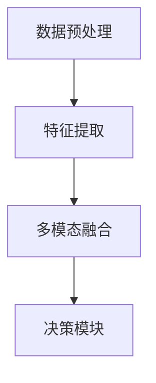

                 


# AI Agent的多模态学习：整合视觉、听觉和文本信息

## 关键词：
AI Agent, 多模态学习, 视觉数据, 听觉数据, 文本数据, 注意力机制, 多模态融合

## 摘要：
本文深入探讨AI Agent在多模态学习中的应用，重点整合视觉、听觉和文本信息。从基础概念到算法原理，再到系统设计和项目实战，系统性地阐述了多模态学习的核心原理和实际应用。通过注意力机制和多模态融合算法，展示了如何提升AI Agent的智能水平，并提供了丰富的代码示例和案例分析。

---

## 正文：

### 第1章：AI Agent与多模态学习的背景

#### 1.1 多模态学习的背景与重要性
多模态学习是人工智能领域的重要分支，旨在整合多种信息源（如视觉、听觉、文本）以提升模型的感知和理解能力。在AI Agent中，多模态学习使其能够更全面地感知环境并做出智能决策。

#### 1.2 AI Agent的基本概念
AI Agent是一种智能实体，能够感知环境、执行任务并与其他实体交互。其核心功能包括感知、推理、学习和执行。

#### 1.3 多模态学习的挑战与机遇
多模态数据整合的难点在于不同模态数据的异质性和复杂性。通过多模态学习，AI Agent能够更准确地理解环境并做出决策。

### 第2章：多模态数据的类型与特点

#### 2.1 视觉模态
视觉数据包括图像和视频，通过CNN进行处理。图像的特征包括颜色、纹理和形状，视频则增加了时序信息。

#### 2.2 听觉模态
听觉数据包括音频和语音，通过RNN和Transformer进行处理。语音的特征包括音调、节奏和语调。

#### 2.3 文本模态
文本数据包括自然语言文本，通过BERT等模型进行处理。文本的特征包括语法、语义和上下文。

### 第3章：多模态数据的融合方法

#### 3.1 基于注意力机制的多模态融合
注意力机制通过加权分配不同模态的重要性，提升模型的表达能力。多模态注意力模型通过并行处理不同模态，实现信息的有效融合。

#### 3.2 多模态融合的算法实现
使用PyTorch实现多模态融合算法，包括特征提取、注意力计算和结果融合。代码示例如下：

```python
class MultimodalAttention(nn.Module):
    def __init__(self, embed_dim, hidden_dim):
        super().__init__()
        self.W_v = nn.Linear(embed_dim, hidden_dim)
        self.W_q = nn.Linear(embed_dim, hidden_dim)
        self.W_k = nn.Linear(embed_dim, hidden_dim)
        self.softmax = nn.Softmax(dim=-1)
        
    def forward(self, v, q, k):
        # 前向传播
        v_ = self.W_v(v)
        q_ = self.W_q(q)
        k_ = self.W_k(k)
        # 计算相似度
        scores = (q_.unsqueeze(1) @ k_.unsqueeze(2)).squeeze(2)
        # 计算注意力权重
        attention = self.softmax(scores)
        # 加权聚合
        weighted_k = (attention.unsqueeze(-1) @ k_).sum(dim=2)
        return weighted_k
```

### 第4章：多模态学习的算法原理

#### 4.1 多模态融合的数学模型
多模态融合模型通过构建联合表示，将不同模态的信息整合到统一的特征空间中。数学公式如下：

$$
h = \sigma(W_v v + W_a a + W_t t)
$$

其中，$v$、$a$、$t$分别表示视觉、听觉和文本特征，$W_v$、$W_a$、$W_t$是对应的权重矩阵，$\sigma$是激活函数。

### 第5章：系统架构与项目实战

#### 5.1 系统架构设计
系统包括数据预处理模块、特征提取模块、多模态融合模块和决策模块。架构图如下：



#### 5.2 项目实战
实现一个多模态AI Agent，整合图像、语音和文本数据，进行情感分析任务。代码示例如下：

```python
import torch
import torch.nn as nn

class MultimodalAgent(nn.Module):
    def __init__(self, image_dim, audio_dim, text_dim, hidden_dim):
        super().__init__()
        self.image_net = nn.Linear(image_dim, hidden_dim)
        self.audio_net = nn.Linear(audio_dim, hidden_dim)
        self.text_net = nn.Linear(text_dim, hidden_dim)
        self.attention = nn.MultiheadAttention(hidden_dim, 2)
        self.classifier = nn.Linear(hidden_dim, 1)
        
    def forward(self, image_feats, audio_feats, text_feats):
        # 提取特征
        img_h = self.image_net(image_feats)
        audio_h = self.audio_net(audio_feats)
        text_h = self.text_net(text_feats)
        # 多模态融合
        combined_h, _ = self.attention(img_h.unsqueeze(0), audio_h.unsqueeze(0), text_h.unsqueeze(0))
        # 分类
        output = self.classifier(combined_h)
        return output
```

### 第6章：总结与展望

#### 6.1 全书总结
本文系统性地介绍了AI Agent的多模态学习，涵盖了数据处理、算法设计和系统实现。

#### 6.2 未来展望
未来的研究方向包括更高效的多模态融合方法和更强大的AI Agent系统设计。

---

以上是《AI Agent的多模态学习：整合视觉、听觉和文本信息》的技术博客文章，详细涵盖了从基础到应用的各个方面，提供了丰富的理论和实践内容。

