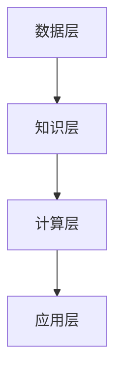

                 


# AI Agent的多模态常识推理与知识整合

> 关键词：AI Agent，多模态，常识推理，知识整合，机器学习，深度学习

> 摘要：本文探讨了AI Agent在多模态环境下的常识推理与知识整合方法。通过分析多模态数据处理、知识图谱构建、推理模型设计等关键技术，结合实际项目案例，深入讲解了AI Agent实现智能决策的核心机制。

---

## 第一部分: AI Agent的基础

### 第1章: AI Agent概述

#### 1.1 AI Agent的基本概念

##### 1.1.1 什么是AI Agent
AI Agent（人工智能代理）是指能够感知环境、自主决策并执行任务的智能实体。它通过传感器获取信息，利用计算模型进行推理，并通过执行器与环境交互。AI Agent的核心目标是实现智能体的自主性和适应性。

##### 1.1.2 AI Agent的类型
AI Agent可以分为以下几类：
- **反应式AI Agent**：基于当前感知做出反应，不依赖历史信息。
- **认知式AI Agent**：具备复杂推理和规划能力，能够处理长期任务。
- **协作式AI Agent**：能够与其他智能体或人类进行协作，完成共同目标。
- **学习式AI Agent**：能够通过经验或数据进行自我改进和优化。

##### 1.1.3 多模态AI Agent的定义
多模态AI Agent是指能够处理和整合多种类型数据（如文本、图像、语音等）的智能代理。它能够从多个信息源获取数据，结合上下文进行推理，从而做出更准确和全面的决策。

---

#### 1.2 多模态处理的重要性

##### 1.2.1 多模态数据的来源
多模态数据来源于不同的感官输入，包括：
- **图像数据**：来自摄像头或视觉传感器。
- **文本数据**：来自自然语言文本。
- **语音数据**：来自麦克风或语音传感器。
- **其他数据**：如触觉、嗅觉等，但目前应用较少。

##### 1.2.2 多模态数据的整合方法
多模态数据的整合可以通过以下方法实现：
- **特征融合**：在数据预处理阶段将不同模态的特征合并。
- **联合建模**：在模型训练阶段同时考虑多种模态的信息。
- **注意力机制**：通过自注意力网络赋予不同模态数据不同的权重。

##### 1.2.3 多模态处理的优势
多模态处理能够提升AI Agent的感知能力、理解能力和决策能力。例如，在图像识别任务中结合文本信息可以提高准确性；在语音识别任务中结合上下文可以改善语义理解。

---

### 第2章: 常识推理与知识整合

#### 2.1 常识推理的基本概念

##### 2.1.1 什么是常识推理
常识推理是指AI系统在日常知识的基础上进行推理和判断的能力。例如，理解“鸟会飞”这一常识，并能够推断出“如果鸟在树上，它可能在觅食”。

##### 2.1.2 常识推理的挑战
常识推理的挑战包括：
- 数据稀疏性：某些常识可能在训练数据中很少出现。
- 上下文依赖性：常识推理需要考虑具体的情境和背景。
- 不确定性：常识推理的结果可能不唯一，需要处理模糊性和不确定性。

##### 2.1.3 常识推理的应用场景
常识推理广泛应用于自然语言处理、机器人控制、智能推荐等领域。例如，在对话系统中，AI Agent需要根据常识推理来理解用户的意图。

---

#### 2.2 知识整合的必要性

##### 2.2.1 知识整合的目标
知识整合的目标是将分散在不同来源中的知识统一起来，形成一个完整的知识体系。例如，将文本数据中的实体关系与图像数据中的物体识别结果整合，形成统一的知识图谱。

##### 2.2.2 知识整合的方法
知识整合的方法包括：
- **基于规则的整合**：通过预定义的规则将不同模态的知识进行映射。
- **基于学习的整合**：利用机器学习模型自动学习知识之间的关系。
- **基于图的整合**：将知识表示为图结构，通过图推理进行整合。

##### 2.2.3 知识整合的工具
常用的工具包括：
- **知识图谱构建工具**：如Neo4j、Ubergraph。
- **自然语言处理工具**：如spaCy、NLTK。
- **图像处理工具**：如OpenCV、TensorFlow。

---

## 第二部分: 多模态常识推理的原理

### 第3章: 多模态数据的处理与融合

#### 3.1 多模态数据的处理

##### 3.1.1 图像数据的处理
图像数据的处理通常包括图像识别、目标检测和图像分割。例如，使用卷积神经网络（CNN）进行图像分类，识别出图像中的物体。

##### 3.1.2 文本数据的处理
文本数据的处理包括分词、词向量表示和文本嵌入。例如，使用词袋模型或词嵌模型（如Word2Vec）将文本转换为向量表示。

##### 3.1.3 声音数据的处理
声音数据的处理包括语音识别和声纹识别。例如，使用隐马尔可夫模型（HMM）或深度学习模型（如LSTM）进行语音识别。

---

#### 3.2 多模态数据的融合方法

##### 3.2.1 基于特征融合的方法
特征融合是指将不同模态的特征向量进行线性组合或非线性变换。例如，将图像特征和文本特征拼接起来，形成一个联合特征向量。

##### 3.2.2 基于模型融合的方法
模型融合是指将多个模态分别处理后，将结果输入到一个联合模型中进行推理。例如，分别训练图像分类模型和文本分类模型，然后将结果输入到逻辑回归模型中进行最终分类。

##### 3.2.3 基于注意力机制的融合方法
注意力机制可以赋予不同模态不同的权重。例如，在多模态问答系统中，模型会根据问题的类型，动态调整对图像和文本信息的关注程度。

---

### 第4章: 多模态推理模型

#### 4.1 多模态推理模型的构建

##### 4.1.1 模型的设计原则
多模态推理模型的设计原则包括：
- **模态独立性**：不同模态的特征处理应相对独立。
- **模态互补性**：不同模态的特征应能够互补，共同提升推理效果。
- **可解释性**：模型的推理过程应尽可能透明，便于调试和优化。

##### 4.1.2 模型的训练方法
多模态推理模型通常采用端到端的训练方法，使用反向传播算法优化模型参数。例如，使用交叉熵损失函数进行分类任务的优化。

##### 4.1.3 模型的评估指标
常用的评估指标包括准确率、精确率、召回率和F1分数。例如，在图像分类任务中，准确率是最常用的评估指标。

---

#### 4.2 常见的多模态推理模型

##### 4.2.1 图像-文本联合推理模型
图像-文本联合推理模型通过结合图像和文本信息，实现更准确的推理。例如，使用图像描述生成模型，将图像内容生成描述性文本。

##### 4.2.2 图像-语音联合推理模型
图像-语音联合推理模型通过结合图像和语音信息，实现更智能的交互。例如，在智能安防系统中，结合视频画面和语音指令进行目标识别。

##### 4.2.3 文本-语音联合推理模型
文本-语音联合推理模型通过结合文本和语音信息，实现更自然的对话。例如，在智能音箱中，结合用户的语音指令和上下文对话历史，生成更精准的响应。

---

## 第三部分: 知识整合的方法

### 第5章: 知识图谱的构建与应用

#### 5.1 知识图谱的构建

##### 5.1.1 知识图谱的定义
知识图谱是一种以图结构表示知识的数据库，节点表示实体或概念，边表示实体之间的关系。例如，知识图谱可以表示“猫是动物的一种”这样的关系。

##### 5.1.2 知识图谱的构建步骤
知识图谱的构建步骤包括数据抽取、实体识别、关系抽取和知识融合。例如，从文本中抽取实体及其关系，构建一个结构化的知识库。

##### 5.1.3 知识图谱的存储与管理
知识图谱可以存储在图数据库中，如Neo4j。存储时需要考虑数据的高效查询和更新。例如，使用索引优化查询性能。

---

#### 5.2 知识图谱的应用

##### 5.2.1 知识图谱在推理中的作用
知识图谱为AI Agent提供了丰富的背景知识，能够帮助其进行常识推理。例如，在问答系统中，知识图谱可以提供实体关系和属性信息，提高回答的准确性。

##### 5.2.2 知识图谱的查询与推理
知识图谱的查询可以通过SPARQL语言实现。推理可以通过规则推理或机器学习模型实现。例如，通过查询知识图谱中的关系，可以推断出隐含的事实。

##### 5.2.3 知识图谱的更新与维护
知识图谱需要定期更新，以反映现实世界的变化。例如，当新的实体或关系出现时，需要及时更新知识图谱。

---

### 第6章: 基于知识图谱的推理策略

#### 6.1 基于规则的推理

##### 6.1.1 规则的定义与表示
规则通常以逻辑表达式的形式表示，例如，“如果A，则B”。规则推理通过匹配规则库中的规则，推导出结论。

##### 6.1.2 规则的推理过程
规则推理过程包括规则匹配和结论推导。例如，在医疗诊断系统中，通过匹配患者的症状，推导出可能的诊断。

##### 6.1.3 规则推理的应用场景
规则推理适用于知识简单、规则明确的场景。例如，在金融风险评估中，可以通过预定义的规则进行风险分类。

---

#### 6.2 基于机器学习的推理

##### 6.2.1 机器学习推理的原理
机器学习推理通过训练模型，学习知识图谱中的模式和关系。例如，使用深度学习模型进行知识图谱嵌入，表示实体和关系。

##### 6.2.2 机器学习推理的优势
机器学习推理能够处理复杂和模糊的推理任务。例如，在自然语言处理中，通过学习语言模型进行语义推理。

##### 6.2.3 机器学习推理的挑战
机器学习推理需要大量的训练数据和计算资源。此外，模型的可解释性也是一个挑战。

---

## 第四部分: 系统架构与实现

### 第7章: 系统架构设计

#### 7.1 系统功能设计

##### 7.1.1 系统概述
多模态常识推理系统需要具备数据处理、知识整合、推理计算和结果输出四大功能模块。例如，数据处理模块负责接收和预处理多模态数据，知识整合模块负责构建和更新知识图谱，推理计算模块负责基于知识图谱进行推理，结果输出模块负责将推理结果输出给用户。

##### 7.1.2 系统功能模块
- **数据处理模块**：负责多模态数据的采集和预处理。
- **知识整合模块**：负责知识图谱的构建和管理。
- **推理计算模块**：负责基于知识图谱进行推理。
- **结果输出模块**：负责将推理结果输出给用户。

##### 7.1.3 系统功能流程
数据处理模块将多模态数据输入系统，知识整合模块构建知识图谱，推理计算模块基于知识图谱进行推理，结果输出模块将推理结果输出给用户。

---

#### 7.2 系统架构设计

##### 7.2.1 系统架构概述
系统架构采用分层设计，包括数据层、知识层、计算层和应用层。数据层负责数据的存储和管理，知识层负责知识图谱的构建和更新，计算层负责推理计算，应用层负责与用户交互。

##### 7.2.2 系统架构图


##### 7.2.3 系统接口设计
系统接口包括数据接口、知识接口和推理接口。数据接口负责与数据源交互，知识接口负责与知识图谱交互，推理接口负责与推理模块交互。

---

### 第8章: 项目实战

#### 8.1 项目背景与目标

##### 8.1.1 项目背景
本项目旨在开发一个多模态常识推理系统，能够处理图像、文本和语音等多种数据，结合知识图谱进行推理，实现智能问答和决策。

##### 8.1.2 项目目标
- 开发一个多模态数据处理模块。
- 构建一个多领域知识图谱。
- 实现多模态常识推理算法。
- 开发一个用户友好的问答系统。

---

#### 8.2 项目实现

##### 8.2.1 环境配置
项目需要以下环境：
- **编程语言**：Python 3.8+
- **深度学习框架**：TensorFlow或PyTorch
- **图数据库**：Neo4j
- **自然语言处理库**：spaCy或NLTK
- **图像处理库**：OpenCV或TensorFlow
- **语音处理库**：Librosa或TensorFlow

##### 8.2.2 核心代码实现

###### 8.2.2.1 数据预处理代码
```python
import cv2
import numpy as np

def preprocess_image(image_path):
    image = cv2.imread(image_path)
    image = cv2.resize(image, (224, 224))
    image = image.astype(np.float32)
    image = np.expand_dims(image, axis=0)
    return image
```

###### 8.2.2.2 知识图谱构建代码
```python
from neo4j import GraphDatabase
from neo4j.exceptions import ServiceUnavailable

class KnowledgeGraph:
    def __init__(self, uri, user, password):
        self.driver = GraphDatabase.driver(uri, auth=(user, password))
    
    def close(self):
        self.driver.close()
    
    def create_node(self, label, properties):
        with self.driver.session() as session:
            session.write_transaction(self._create_node, label, properties)
    
    def _create_node(self, tx, label, properties):
        node = tx.create_node(label, properties)
        return node
```

###### 8.2.2.3 推理算法代码
```python
import tensorflow as tf
from tensorflow.keras import layers

def build_model(input_shape):
    inputs = layers.Input(shape=input_shape)
    x = layers.Conv2D(32, (3,3), activation='relu')(inputs)
    x = layers.MaxPooling2D((2,2))(x)
    x = layers.Flatten()(x)
    x = layers.Dense(64, activation='relu')(x)
    outputs = layers.Dense(10, activation='softmax')(x)
    return tf.keras.Model(inputs=inputs, outputs=outputs)
```

##### 8.2.3 项目小结
通过本项目，我们实现了多模态数据处理、知识图谱构建和推理算法开发。项目的成功运行验证了多模态常识推理技术的可行性，同时也为后续研究提供了宝贵的实践经验。

---

## 第五部分: 高级应用与未来展望

### 第9章: 高级应用

#### 9.1 教育领域中的应用
AI Agent可以用于智能教育系统，根据学生的学习情况和知识水平，提供个性化的学习建议和辅导。

#### 9.2 医疗领域中的应用
AI Agent可以用于智能医疗系统，帮助医生进行疾病诊断和治疗方案推荐。

#### 9.3 智能客服领域中的应用
AI Agent可以用于智能客服系统，通过多模态数据处理和常识推理，提供更智能的客户服务。

---

### 第10章: 未来展望

#### 10.1 技术趋势
未来的AI Agent将更加智能化和人性化，具备更强的多模态处理能力和常识推理能力。例如，通过脑机接口技术，AI Agent可以直接与人类进行交互。

#### 10.2 挑战与机遇
尽管多模态常识推理技术取得了显著进展，但仍面临诸多挑战，如数据多样性、模型可解释性等。同时，随着技术的进步，也将带来更多的机遇，如在教育、医疗、交通等领域的广泛应用。

---

## 第六部分: 最佳实践与总结

### 第11章: 最佳实践

#### 11.1 关键技术总结
- 多模态数据处理：图像、文本、语音的预处理和融合。
- 知识图谱构建：实体识别、关系抽取和知识融合。
- 推理算法开发：基于规则和基于机器学习的推理方法。

#### 11.2 项目开发注意事项
- 数据质量：确保多模态数据的准确性和完整性。
- 知识图谱的可扩展性：设计灵活的知识图谱结构，方便后续扩展。
- 模型的可解释性：确保推理过程清晰透明，便于调试和优化。

#### 11.3 未来学习方向
- 深度学习技术：继续关注深度学习在多模态数据处理和推理中的应用。
- 知识图谱技术：研究知识图谱的构建、管理和应用。
- 多模态融合技术：探索更先进的多模态数据融合方法。

---

## 第七部分: 结语

### 7.1 总结
本文系统地介绍了AI Agent的多模态常识推理与知识整合技术，从基础概念到高级应用，详细讲解了关键技术和发展趋势。通过实际项目案例，读者可以掌握多模态数据处理、知识图谱构建和推理算法开发的核心方法。

### 7.2 展望
随着人工智能技术的不断进步，AI Agent的多模态常识推理与知识整合技术将在更多领域得到广泛应用。未来的研究将更加注重技术的可解释性和实际应用效果，推动人工智能技术的进一步发展。

---

通过本文的学习，读者可以全面掌握AI Agent的多模态常识推理与知识整合技术的核心内容和实现方法，为后续的研究和实践打下坚实的基础。

