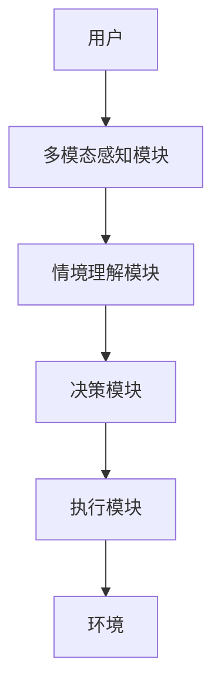
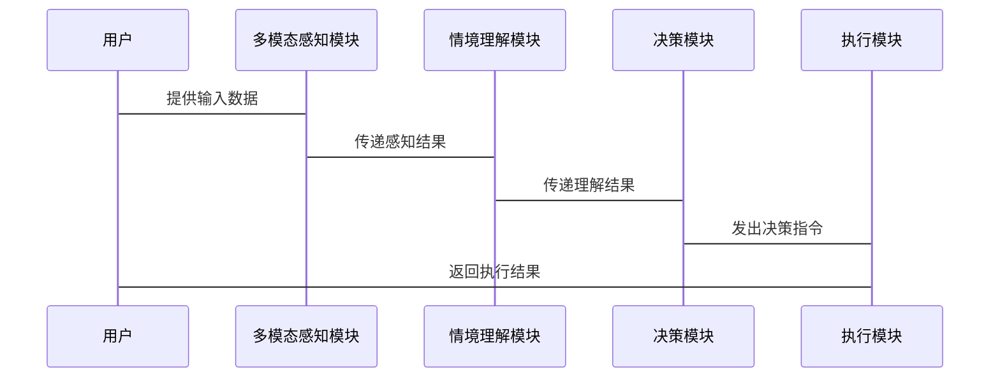

                 


# AI Agent的多模态情境感知与反应系统

## 关键词：AI Agent, 多模态, 情境感知, 反应系统, 深度学习, 多模态数据融合

## 摘要：AI Agent的多模态情境感知与反应系统是一种结合了多种数据模态（如文本、图像、语音等）进行情境理解和智能反应的技术。本文将从基本概念、核心算法、系统架构等多个方面详细探讨这一系统的构建过程，包括多模态数据的感知与融合、情境理解与决策反应的实现，以及系统的实际应用案例。

---

## 第1章: AI Agent的基本概念与背景

### 1.1 AI Agent的定义与类型

#### 1.1.1 什么是AI Agent
AI Agent（人工智能代理）是指能够感知环境、做出决策并采取行动的智能实体。它可以是一个软件程序、机器人或其他智能系统，通过与环境交互来实现特定目标。AI Agent的核心能力包括感知、推理、决策和执行。

#### 1.1.2 AI Agent的主要类型
AI Agent可以根据智能水平、应用场景和功能特点进行分类：
- **反应式Agent**：基于当前感知做出实时反应，不依赖历史信息。
- **认知式Agent**：具备复杂推理和规划能力，能够处理长期任务。
- **学习式Agent**：通过机器学习技术不断优化自身的感知和决策能力。
- **社交式Agent**：能够与其他Agent或人类进行交互和协作。

#### 1.1.3 AI Agent的应用领域
AI Agent广泛应用于多个领域：
- **智能家居**：通过多模态感知（如声音、图像）提供智能化服务。
- **自动驾驶**：利用多模态数据（如视觉、雷达）进行环境感知和决策。
- **智能客服**：通过自然语言处理和语音识别实现多模态交互。

---

### 1.2 多模态情境感知的背景与意义

#### 1.2.1 情境感知的基本概念
情境感知是指系统能够理解当前环境的状态、用户的需求和意图。多模态情境感知则是指系统能够同时处理多种数据模态（如文本、图像、语音等）来实现更准确的情境理解。

#### 1.2.2 多模态数据的定义与特点
多模态数据是指来自不同感官渠道的数据，例如：
- **文本数据**：如对话内容、文档信息。
- **图像数据**：如视觉场景、物体识别。
- **语音数据**：如语音识别、情感分析。

多模态数据的特点包括多样性、互补性和复杂性。通过融合多模态数据，系统能够获得更全面的环境信息，从而做出更准确的决策。

#### 1.2.3 多模态情境感知的重要性
多模态情境感知能够显著提升AI Agent的智能水平：
- **提高准确性**：通过融合多种数据模态，减少单一模态的局限性。
- **增强交互性**：支持多种交互方式，提升用户体验。
- **拓展应用场景**：适用于复杂场景，如自动驾驶、智能医疗等。

---

## 第2章: 多模态情境感知的核心概念

### 2.1 情境感知的关键要素

#### 2.1.1 数据源的多样性
多模态情境感知需要整合多种数据源：
- **文本数据**：包括用户输入的自然语言文本。
- **图像数据**：包括视觉场景的图像信息。
- **语音数据**：包括用户的语音输入和环境声音。

#### 2.1.2 环境特征的提取
从多模态数据中提取有用的特征：
- **文本特征**：如关键词、语义向量。
- **图像特征**：如物体检测、图像分割。
- **语音特征**：如音调、语速、情感特征。

#### 2.1.3 上下文的理解与关联
通过上下文理解用户的需求和意图：
- **短文本上下文**：如对话历史。
- **长文本上下文**：如文档主题。
- **图像上下文**：如场景中的物体关系。

---

### 2.2 多模态数据的融合方法

#### 2.2.1 数据融合的基本原理
多模态数据融合的目标是将不同模态的信息整合到一个统一的表示中，以便更好地理解情境。

#### 2.2.2 常见的多模态融合技术
- **特征级融合**：在特征层面上对不同模态的特征进行融合。
- **语义级融合**：在语义层面上对不同模态的信息进行融合。
- **决策级融合**：在决策层面上对不同模态的决策结果进行融合。

#### 2.2.3 融合方法的优缺点对比

| 融合方法 | 优点 | 缺点 |
|----------|------|------|
| 特征级融合 | 融合早，信息互补性好 | 实现复杂，可能增加计算开销 |
| 语义级融合 | 语义表达能力强 | 需要复杂的语义理解模型 |
| 决策级融合 | 实现简单，计算效率高 | 可能忽略模态间的细粒度信息 |

---

### 2.3 反应系统的设计原则

#### 2.3.1 反应系统的定义与目标
反应系统是AI Agent的核心部分，负责根据感知到的情境信息做出相应的反应。

#### 2.3.2 反应决策的逻辑框架
反应决策的逻辑框架通常包括以下几个步骤：
1. **情境感知**：理解当前环境的状态和用户的需求。
2. **决策推理**：基于感知结果进行推理，确定最优的反应策略。
3. **反应执行**：根据决策结果执行相应的动作。

#### 2.3.3 反应系统的灵活性与鲁棒性
- **灵活性**：能够适应不同的环境和用户需求。
- **鲁棒性**：在面对不确定性时，仍能做出合理决策。

---

## 第3章: 多模态情境感知与反应系统的算法原理

### 3.1 多模态数据的感知算法

#### 3.1.1 数据采集与预处理
- **数据采集**：通过传感器、摄像头等设备获取多模态数据。
- **数据预处理**：对采集到的数据进行清洗、归一化等处理。

#### 3.1.2 情境理解的深度学习模型
- **基于Transformer的多模态编码**：将不同模态的数据转换为统一的向量表示。
- **图神经网络在情境理解中的应用**：通过图结构建模模态之间的关系。

#### 3.1.3 模型训练与优化策略
- **损失函数设计**：如交叉熵损失、均方误差等。
- **优化算法选择**：如随机梯度下降（SGD）、Adam优化器等。

---

### 3.2 多模态数据融合的算法实现

#### 3.2.1 数据融合的数学模型
- **线性融合模型**：将不同模态的特征向量进行线性组合。
- **非线性融合模型**：如深度神经网络中的多模态融合。

#### 3.2.2 数据融合的实现步骤
1. **数据对齐**：将不同模态的数据对齐到相同的时空坐标系。
2. **特征提取**：提取每种模态的特征向量。
3. **融合计算**：将特征向量进行融合，得到融合后的特征向量。

---

### 3.3 反应系统的算法设计

#### 3.3.1 决策树的构建与优化
- **决策树构建**：基于训练数据构建决策树模型。
- **决策树优化**：通过剪枝等方法减少过拟合。

#### 3.3.2 基于强化学习的决策策略
- **强化学习框架**：通过奖励机制优化决策策略。
- **策略网络设计**：如DQN（Deep Q-Network）算法。

---

## 第4章: 多模态情境感知与反应系统的系统架构设计

### 4.1 系统应用场景与功能需求

#### 4.1.1 系统应用场景
- **智能家居**：通过多模态感知实现智能家电控制。
- **智能客服**：通过多模态交互提供更高效的客服服务。

#### 4.1.2 系统功能需求
- **多模态数据采集**：支持文本、图像、语音等多种数据的采集。
- **情境理解**：能够准确理解用户的需求和意图。
- **智能反应**：根据情境理解结果做出相应的反应。

---

### 4.2 系统架构设计

#### 4.2.1 领域模型设计
- **领域模型**：如智能家居领域的设备控制模型。

#### 4.2.2 系统架构图


#### 4.2.3 系统交互序列图


---

## 第5章: 项目实战

### 5.1 环境安装

#### 5.1.1 安装Python环境
```bash
python --version
pip install numpy
pip install tensorflow
pip install pytorch
```

#### 5.1.2 安装其他依赖
```bash
pip install matplotlib
pip install scikit-learn
pip install open-cv-python
```

---

### 5.2 核心代码实现

#### 5.2.1 多模态数据融合代码
```python
import numpy as np
import pandas as pd

# 示例：文本和图像特征的融合
text_features = np.random.rand(10, 5)  # 文本特征矩阵
image_features = np.random.rand(10, 5)  # 图像特征矩阵

# 线性融合
combined_features = np.concatenate((text_features, image_features), axis=1)
print("Combined features shape:", combined_features.shape)
```

#### 5.2.2 决策模块代码
```python
import torch
import torch.nn as nn

# 示例：简单决策网络
class DecisionNetwork(nn.Module):
    def __init__(self, input_dim, output_dim):
        super(DecisionNetwork, self).__init__()
        self.fc = nn.Linear(input_dim, output_dim)
    
    def forward(self, x):
        return self.fc(x)

# 初始化网络
input_dim = 10
output_dim = 2
model = DecisionNetwork(input_dim, output_dim)
print(model)
```

---

### 5.3 案例分析与详细讲解

#### 5.3.1 案例分析
假设我们开发一个智能家居AI Agent，能够通过语音和图像识别来控制家庭设备。

#### 5.3.2 代码应用解读
- **多模态数据融合**：将用户的语音指令和环境图像进行融合，得到更准确的用户意图。
- **决策模块**：根据融合后的特征，决定是打开还是关闭某个设备。

---

### 5.4 项目小结
通过本次项目实战，我们了解了如何在实际应用中构建一个多模态情境感知与反应系统。从数据采集、特征提取、数据融合到决策执行，每一步都需要精心设计和实现。

---

## 第6章: 最佳实践与总结

### 6.1 最佳实践
- **数据预处理**：确保数据的干净和一致性。
- **模型优化**：通过交叉验证和超参数调优提升模型性能。
- **系统测试**：在真实场景中进行充分的测试和验证。

### 6.2 小结
本文详细探讨了AI Agent的多模态情境感知与反应系统的构建过程，从基本概念到算法实现，再到系统架构设计和项目实战，为读者提供了全面的指导。

### 6.3 注意事项
- **数据隐私**：在处理用户数据时，需要注意隐私保护。
- **系统鲁棒性**：在设计系统时，需要考虑各种异常情况。

### 6.4 拓展阅读
- **深度学习经典书籍**：《Deep Learning》（Ian Goodfellow等著）。
- **多模态数据处理**：《Multimodal Data Processing》（李航著）。

---

通过以上内容，读者可以系统地学习和理解AI Agent的多模态情境感知与反应系统的实现过程，并能够将其应用到实际项目中。

