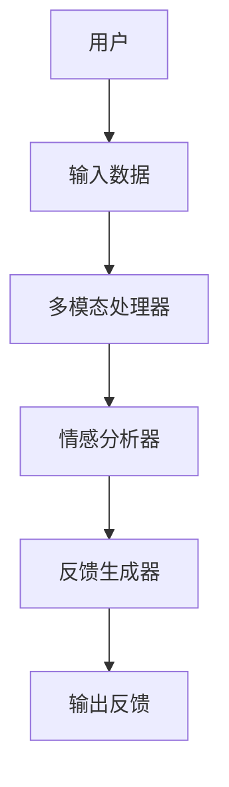
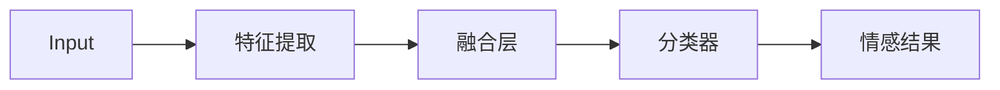
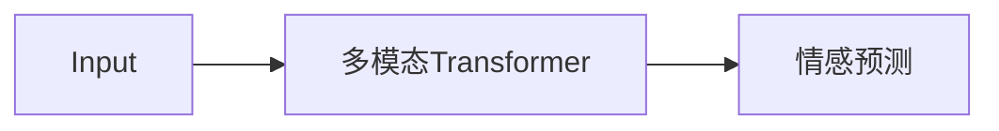
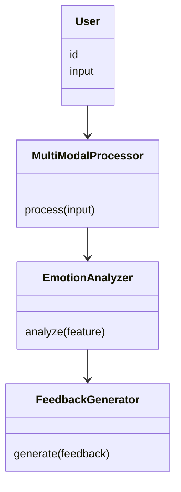
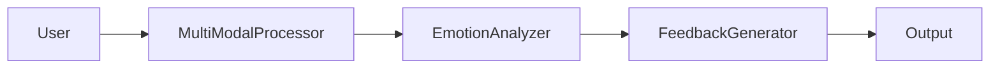

                 


# AI Agent的多模态情感交互系统设计

## 关键词：AI Agent，多模态交互，情感计算，系统设计，Python代码

## 摘要：  
随着人工智能技术的快速发展，AI Agent在各个领域的应用日益广泛。为了提高人机交互的自然性和情感共鸣，多模态情感交互系统成为研究的重点。本文从AI Agent的背景出发，详细探讨了多模态情感交互系统的核心概念、算法原理、系统架构以及实际项目实现。通过理论与实践相结合的方式，为读者提供了一个全面了解和设计AI Agent多模态情感交互系统的指南。

---

## 第1章: 背景介绍

### 1.1 问题背景  
随着AI Agent的普及，用户对情感交互的需求日益增长。传统的单一模态交互方式难以满足复杂的情感分析和表达需求，因此多模态情感交互系统应运而生。

#### 1.1.1 多模态情感交互的需求  
- 用户期望与AI Agent进行更自然的交流，不仅仅是文本或语音交互，而是结合视觉、触觉等多种模态的交互方式。  
- 在教育、医疗、娱乐等领域，多模态交互能够提供更个性化的体验。  

#### 1.1.2 当前技术的局限性  
- 单一模态交互难以捕捉用户真实情感状态。  
- 多模态数据的融合和同步处理技术尚未成熟。  

#### 1.1.3 问题的解决方法  
- 结合多模态数据（如语音、面部表情、肢体动作）进行情感分析。  
- 利用深度学习模型对多模态数据进行融合和处理。  

### 1.2 问题描述  
AI Agent的多模态情感交互系统需要能够实时捕捉并分析用户的多种情感信息，包括语音语调、面部表情、肢体语言等，从而实现更智能的交互。

#### 1.2.1 情感交互的核心问题  
- 如何有效融合多模态数据？  
- 如何准确识别和表达情感状态？  

#### 1.2.2 多模态数据的整合挑战  
- 数据格式多样，难以统一处理。  
- 数据量大，计算资源需求高。  

#### 1.2.3 系统设计的目标与边界  
- 目标：提供高精度的情感交互体验。  
- 边界：仅关注情感相关数据，不涉及其他任务。  

### 1.3 问题解决  
通过结合深度学习和自然语言处理技术，AI Agent能够更精准地识别用户情感，并通过多模态反馈提升交互体验。

#### 1.3.1 多模态数据处理方法  
- 数据预处理：标准化和归一化处理。  
- 特征提取：利用CNN、RNN等模型提取语音、图像特征。  

#### 1.3.2 情感分析的优化策略  
- 使用多任务学习模型同时处理多种模态数据。  
- 引入情感词典和上下文信息。  

#### 1.3.3 系统架构的设计思路  
- 分模块处理不同模态数据。  
- 通过融合层整合各模态特征，输出情感结果。  

---

## 第2章: 核心概念与联系

### 2.1 多模态情感交互系统的核心原理  
多模态情感交互系统通过整合多种感官数据，利用深度学习模型进行情感分析和反馈生成。

#### 2.1.1 多模态数据融合  
- 数据融合方法：加权融合、特征融合、决策融合。  
- 使用注意力机制对不同模态的重要性进行加权。  

#### 2.1.2 情感计算模型  
- 基于Transformer的情感分析模型。  
- 跨模态注意力机制（Cross-attention）。  

#### 2.1.3 交互反馈机制  
- 根据情感分析结果生成实时反馈，如语音语调调整、面部表情变化。  

### 2.2 核心概念的属性特征对比  

| 模态类型 | 特征维度 | 数据格式 | 适用场景 |
|---------|----------|----------|----------|
| 语音    | 音调、语速 | 音频信号 | 情感识别 |
| 面部表情 | 眼睛、嘴巴 | 图像数据 | 情感识别 |
| 文本     | 词汇、语调 | 文本数据 | 情感分析 |

#### 2.2.1 模态类型对比  
- 语音和面部表情数据具有实时性，适合实时交互。  
- 文本数据处理相对简单，但难以捕捉实时情感变化。  

#### 2.2.2 情感维度分析  
- 情感维度包括快乐、悲伤、愤怒等，需通过数据标注确定。  

#### 2.2.3 交互方式的特征  
- 同步交互：实时反馈，如对话中的情感回应。  
- 异步交互：非实时处理，如邮件的情感分析。  

### 2.3 ER实体关系图  


---

## 第3章: 算法原理

### 3.1 多模态数据处理算法  
#### 3.1.1 数据预处理流程  
- 数据清洗：去除噪声。  
- 数据增强：增加数据多样性。  

#### 3.1.2 特征提取方法  
- 语音特征：MFCC、谱图特征。  
- 图像特征：CNN提取视觉特征。  

#### 3.1.3 数据融合策略  
- 使用融合层（Fusion Layer）整合多模态特征。  

### 3.2 情感分析算法  
#### 3.2.1 模型训练流程  


#### 3.2.2 情感计算模型的实现  
- 使用Transformer模型进行跨模态注意力机制。  
- 模型结构如图所示：  


#### 3.2.3 情感计算模型的训练  
- 使用PyTorch框架，定义损失函数：  
$$ \text{Loss} = \frac{1}{N}\sum_{i=1}^{N} \text{CE}(y_i, \hat{y}_i) $$  
- 优化器：Adam，学习率调整。  

#### 3.2.4 情感计算模型的推理  
- 加载预训练模型，输入多模态数据，输出情感结果。  

### 3.3 代码实现  
```python
import torch
import torch.nn as nn
import torch.optim as optim

class MultiModalTransformer(nn.Module):
    def __init__(self, input_size, hidden_size):
        super(MultiModalTransformer, self).__init__()
        self.transformer = nn.Transformer(input_size, hidden_size)
        self.classifier = nn.Linear(hidden_size, 2)  # 情感二分类

    def forward(self, x):
        x = self.transformer(x)
        output = self.classifier(x)
        return output

# 示例训练代码
model = MultiModalTransformer(input_size=512, hidden_size=256)
criterion = nn.CrossEntropyLoss()
optimizer = optim.Adam(model.parameters(), lr=0.001)

for epoch in range(num_epochs):
    for batch in dataloader:
        inputs, labels = batch
        outputs = model(inputs)
        loss = criterion(outputs, labels)
        loss.backward()
        optimizer.step()
```

---

## 第4章: 系统分析与架构设计

### 4.1 系统架构设计  
#### 4.1.1 项目介绍  
- 系统名称：AI情感交互系统。  
- 主要功能：多模态情感分析、实时反馈生成。  

#### 4.1.2 系统功能设计  
- 领域模型：  


- 系统架构图：  


#### 4.1.3 接口设计与交互流程  
- 接口：RESTful API，提供情感分析和反馈生成服务。  
- 交互流程：  
  1. 用户输入多模态数据。  
  2. 系统处理数据并分析情感。  
  3. 系统生成反馈并返回结果。  

---

## 第5章: 项目实战

### 5.1 环境安装与配置  
- 安装Python、PyTorch、TensorFlow、OpenCV等库。  

### 5.2 核心代码实现  
```python
import torch
import torch.nn as nn
import torch.optim as optim

class EmotionAnalyzer:
    def __init__(self):
        self.model = MultiModalTransformer(input_size=512, hidden_size=256)
        self.model.load_state_dict(torch.load("emotion_model.pth"))

    def analyze(self, input_features):
        with torch.no_grad():
            output = self.model(input_features)
            return output.argmax(dim=1).item()
```

### 5.3 代码解读与分析  
- `EmotionAnalyzer`类：负责情感分析任务。  
- `analyze`方法：输入特征，返回情感结果。  

### 5.4 实际案例分析  
- 案例：用户输入带有面部表情和语音的对话，系统分析情感并生成反馈。  
- 分析：系统识别用户情感为“快乐”，并生成相应的语音和表情反馈。  

### 5.5 项目小结  
- 项目实现了多模态情感分析的核心功能。  
- 系统架构设计合理，具有良好的扩展性。  

---

## 第6章: 总结与展望

### 6.1 总结  
本文详细介绍了AI Agent的多模态情感交互系统的实现过程，包括核心概念、算法原理、系统架构和项目实战。通过理论与实践的结合，为读者提供了一个全面的设计方案。

### 6.2 未来展望  
- 进一步优化多模态数据融合算法。  
- 研究更高效的情感计算模型。  
- 探索更多应用场景，如虚拟助手、智能客服等。  

---

## 附录  
- 术语表：定义本文中涉及的关键术语。  
- 工具安装指南：详细说明开发环境的搭建步骤。  
- 参考文献：列出相关文献和资料。  

---

通过以上内容，读者可以系统地了解AI Agent的多模态情感交互系统设计的各个方面，并能够将其应用于实际项目中。

