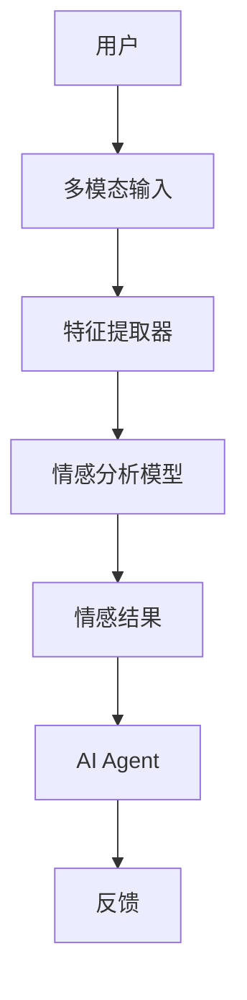
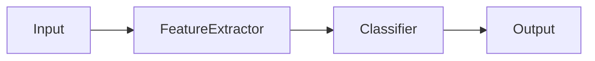

                 


# AI Agent的多模态情感表达技术

## 关键词：AI Agent，多模态情感表达，情感分析，自然语言处理，计算机视觉，语音处理

## 摘要：本文深入探讨AI Agent在多模态情感表达技术中的应用，分析其核心原理、算法实现、系统架构及实际应用场景。通过详细的技术分析和实例讲解，揭示多模态数据如何协同提升情感表达的准确性和自然度，为AI Agent的设计与优化提供理论依据和实践指导。

---

# 第一部分: AI Agent的多模态情感表达技术概述

## 第1章: 背景与问题背景

### 1.1 问题背景

#### 1.1.1 多模态情感表达的定义
多模态情感表达是指通过多种信息载体（如文本、语音、图像、视频等）共同传递情感信息，使情感表达更加丰富、准确和自然。AI Agent作为智能化的交互主体，需要能够理解并生成多模态情感信息，以实现更贴近人类的交流方式。

#### 1.1.2 AI Agent在情感表达中的作用
AI Agent通过多模态情感表达技术，可以实现以下功能：
- 理解用户的多模态情感输入（如语气、表情、肢体语言等）。
- 生成符合上下文和情感需求的多模态情感输出（如带有情感的文本、语音、图像等）。
- 在复杂场景中协同处理多种模态数据，提升交互的自然性和智能性。

#### 1.1.3 当前技术的局限性
- **数据融合难度大**：不同模态的数据具有不同的特征和表达方式，如何有效融合是技术难点。
- **情感表达的准确性不足**：现有技术在处理复杂情感（如讽刺、幽默）时，准确性有待提高。
- **实时性与资源消耗的平衡**：多模态数据处理对计算资源要求较高，如何在实时交互中实现高效处理是挑战。

### 1.2 问题描述

#### 1.2.1 多模态数据的整合挑战
多模态数据整合的关键挑战包括：
- 数据异构性：不同模态的数据格式和特征维度差异大。
- 数据同步性：多模态数据的时间同步和空间对齐问题。
- 数据冗余性：如何避免不同模态数据中的冗余信息，提升处理效率。

#### 1.2.2 情感表达的准确性问题
情感表达的准确性受以下因素影响：
- 模型训练数据的质量和多样性。
- 多模态数据的特征提取精度。
- 情感分析模型的泛化能力。

#### 1.2.3 不同模态数据的协同问题
不同模态数据的协同表达涉及：
- 如何通过协同学习提升整体情感表达的准确性。
- 不同模态数据的权重分配问题。
- 模态间信息冲突的处理机制。

### 1.3 问题解决

#### 1.3.1 多模态数据融合的方法
多模态数据融合的常见方法包括：
- **特征级融合**：将不同模态的特征向量进行拼接或加权融合。
- **决策级融合**：分别对各模态数据进行情感分类，再将结果进行融合。
- **注意机制融合**：通过自注意力机制捕捉模态间的关联性。

#### 1.3.2 情感表达模型的优化策略
情感表达模型的优化策略包括：
- 使用预训练模型（如BERT、ResNet）提取特征。
- 引入对比学习，提升模型对情感差异的区分能力。
- 结合领域知识图谱，增强情感表达的语境理解。

#### 1.3.3 AI Agent的交互设计
AI Agent的交互设计需考虑：
- 多模态输入的实时处理能力。
- 情感表达的自然流畅性。
- 用户反馈的快速响应机制。

### 1.4 边界与外延

#### 1.4.1 多模态情感表达的边界
多模态情感表达的边界主要体现在：
- **数据范围**：仅处理单一情感类别，不涉及复杂情感。
- **场景限制**：适用于特定场景（如客服交互、虚拟助手）。

#### 1.4.2 与其他技术的区分
与单一模态情感分析相比，多模态情感表达技术的优势在于：
- 信息维度更丰富。
- 表达情感更准确。
- 交互体验更自然。

#### 1.4.3 技术的未来发展
未来发展方向包括：
- **跨模态学习**：探索更高效的模态间信息交互方式。
- **实时性优化**：提升多模态数据处理的计算效率。
- **个性化定制**：根据用户需求定制化情感表达方式。

### 1.5 核心要素组成

#### 1.5.1 多模态数据的采集与处理
多模态数据的采集包括：
- 文本数据（如用户输入的文本）。
- 语音数据（如用户的语音输入）。
- 图像数据（如用户的面部表情）。

数据处理步骤包括：
1. 数据预处理：去噪、标准化等。
2. 特征提取：提取文本、语音、图像的关键特征。
3. 数据融合：将不同模态的特征进行融合。

#### 1.5.2 情感分析模型的设计
情感分析模型的设计包括：
- 模型输入：多模态特征向量。
- 模型结构：多层感知机、LSTM、Transformer等。
- 模型输出：情感标签或情感强度。

#### 1.5.3 AI Agent的交互机制
AI Agent的交互机制包括：
- 多模态输入解析：解析用户的多模态输入，提取情感信息。
- 情感表达生成：根据解析结果生成相应的多模态情感输出。
- 实时反馈：根据用户反馈调整情感表达方式。

---

## 第2章: 核心概念与联系

### 2.1 多模态情感表达的核心原理

#### 2.1.1 多模态数据的特征提取
多模态数据的特征提取包括：
- 文本特征：词袋模型、词嵌入（如Word2Vec、BERT）。
- 语音特征：梅尔频率倒谱系数（MFCC）、声学特征。
- 图像特征：颜色特征、纹理特征、人脸关键点。

#### 2.1.2 情感表达的计算模型
情感表达的计算模型包括：
- 单模态情感分析：基于单一模态数据的情感分类。
- 多模态情感分析：基于多模态数据的情感分类。
- 跨模态注意力网络：通过注意力机制捕捉模态间的关联性。

#### 2.1.3 AI Agent的实时反馈机制
AI Agent的实时反馈机制包括：
- 基于情感分析结果生成相应的反馈。
- 根据用户反馈调整情感表达方式。
- 实时更新情感表达模型。

### 2.2 核心概念对比表格

| 概念 | 特征 | 优缺点 | 应用场景 |
|------|------|--------|----------|
| 单模态情感分析 | 基于单一模态数据（如文本、语音、图像）进行情感分析 | 易实现，但信息单一 | 简单场景下的情感分析 |
| 多模态情感分析 | 基于多种模态数据进行情感分析 | 信息丰富，准确性高 | 复杂场景下的情感分析 |
| AI Agent | 智能交互主体，能够理解并生成多模态情感信息 | 高效交互，但需多模态支持 | 智能客服、虚拟助手 |

### 2.3 ER实体关系图



---

## 第3章: 算法原理

### 3.1 情感分析模型

#### 3.1.1 模型结构



#### 3.1.2 源代码实现

```python
import numpy as np
from sklearn.svm import SVC

# 示例：基于文本和语音特征的情感分类器
def train_emotion_classifier(X_train, y_train):
    model = SVC(kernel='rb

