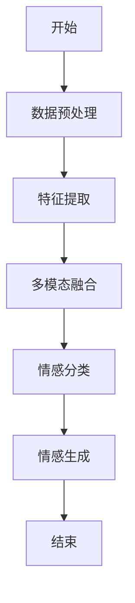
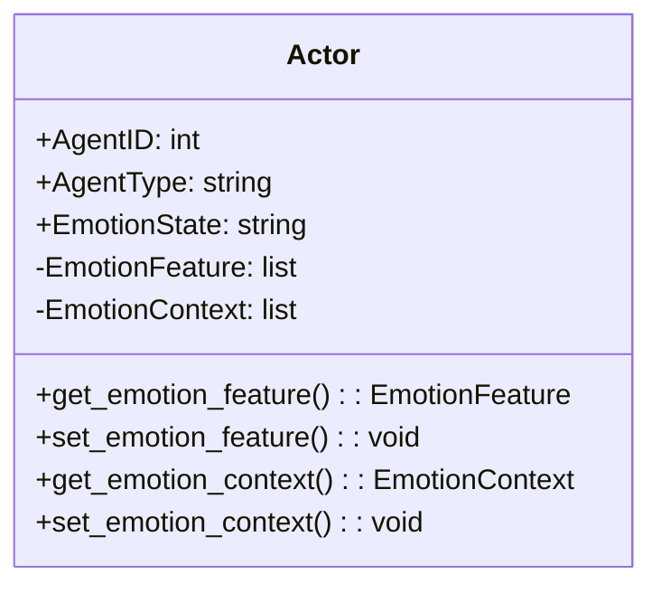

                 


# AI Agent的多模态情感计算与表达

## 关键词：AI Agent，多模态，情感计算，情感表达，机器学习，深度学习

## 摘要：本文详细探讨了AI Agent在多模态情感计算与表达中的应用，从背景介绍、核心概念、算法原理、系统架构到项目实战，全面分析了多模态情感计算的技术原理和实现方法，结合实际案例，深入解读了AI Agent在情感表达中的创新应用与未来发展方向。

---

# 第1章：背景介绍

## 1.1 问题背景
### 1.1.1 多模态情感计算的定义
多模态情感计算是指通过整合文本、语音、图像等多种模态数据，分析和理解人类情感的技术。其核心在于捕捉和处理跨模态的情感信息，以实现更准确的情感识别和生成。

### 1.1.2 AI Agent在情感计算中的作用
AI Agent作为情感计算的执行者，能够通过多模态数据感知用户情感，并通过自然语言生成等方式进行情感表达，从而提供更智能化的服务。

### 1.1.3 当前技术的局限性与挑战
现有情感计算主要依赖单一模态数据，缺乏多模态数据的融合，导致情感识别的准确性和鲁棒性不足。此外，如何实现自然的情感表达也是AI Agent面临的挑战。

## 1.2 问题描述
### 1.2.1 多模态数据的整合与分析
如何有效整合文本、语音、图像等多种模态数据，并提取有用的情感特征。

### 1.2.2 情感计算的核心问题
如何通过多模态数据准确识别和预测情感状态，同时实现情感表达的自然性和多样性。

### 1.2.3 AI Agent在情感表达中的需求
AI Agent需要能够根据情感计算结果生成合适的情感表达，包括文本、语音和图像等多种形式。

## 1.3 问题解决
### 1.3.1 多模态数据融合方法
采用特征融合、注意力机制等方法，整合多模态数据，提高情感识别的准确性。

### 1.3.2 情感计算模型的设计
基于深度学习构建多模态情感计算模型，结合文本、语音和图像特征进行情感预测。

### 1.3.3 AI Agent的情感表达实现
通过生成模型（如GAN、VAE）生成多样化的文本、语音和图像，实现自然的情感表达。

## 1.4 边界与外延
### 1.4.1 多模态数据的边界条件
数据质量、模态数量和类型、数据采集环境等因素对情感计算的影响。

### 1.4.2 情感计算的适用范围
适用于人机交互、智能客服、情感陪护等领域，但目前仍难以处理复杂的情感场景。

### 1.4.3 AI Agent情感表达的限制
受数据和模型限制，目前的情感表达仍缺乏真实性和多样性。

## 1.5 概念结构与核心要素
### 1.5.1 多模态数据的组成
包括文本、语音、图像、视频等多种模态。

### 1.5.2 情感计算的核心要素
情感特征提取、情感分类、情感生成。

### 1.5.3 AI Agent情感表达的结构
情感输入、情感计算、情感生成。

---

# 第2章：核心概念与联系

## 2.1 多模态情感计算的原理
### 2.1.1 多模态数据的特征提取
文本：词袋模型、词嵌入；语音：时域和频域特征；图像：CNN提取特征。

### 2.1.2 情感计算的模型构建
基于深度学习的多模态融合模型，如多模态Transformer。

### 2.1.3 AI Agent的情感表达机制
通过生成模型生成多样化的情感表达，如情感文本生成。

## 2.2 核心概念对比
### 2.2.1 多模态数据特征对比
文本：语义信息丰富，但情感表达受主观因素影响大；语音：情感特征直接，但提取复杂；图像：视觉信息丰富，情感识别依赖于视觉特征。

### 2.2.2 情感计算方法的对比
基于规则的方法：简单但鲁棒性差；基于特征工程的方法：依赖人工特征提取；基于深度学习的方法：效果好但计算资源需求高。

### 2.2.3 AI Agent情感表达的优劣势
优势：多样化、个性化；劣势：计算资源需求高，生成质量受限。

## 2.3 ER实体关系图
```mermaid
er
    Actor(AgentID, AgentType, EmotionState)
    EmotionFeature(FeatureID, FeatureType, FeatureValue)
    EmotionContext(ContextID, ContextType, ContextValue)
    Actor-|1:n->EmotionFeature
    Actor-|1:n->EmotionContext
    EmotionFeature-|n:m->EmotionContext
```

---

# 第3章：算法原理

## 3.1 数据预处理
### 3.1.1 文本数据
分词、去除停用词、词向量化。

### 3.1.2 语音数据
特征提取（MFCC）、归一化。

### 3.1.3 图像数据
归一化、数据增强。

## 3.2 特征提取
### 3.2.1 文本特征
使用词嵌入（如Word2Vec）提取语义特征。

### 3.2.2 语音特征
提取MFCC特征，使用自注意力机制捕捉情感相关特征。

### 3.2.3 图像特征
使用CNN提取图像特征，通过注意力机制聚焦情感相关区域。

## 3.3 情感计算模型
### 3.3.1 多模态融合
使用多模态Transformer融合文本、语音、图像特征。

### 3.3.2 情感分类
基于融合特征进行情感分类，采用交叉熵损失函数。

## 3.4 情感生成
### 3.4.1 文本生成
使用Transformer模型生成情感文本，优化BLEU和ROUGE指标。

### 3.4.2 语音生成
使用Tacotron生成情感语音，调整语调和语速。

### 3.4.3 图像生成
使用GAN生成情感图像，通过判别器和生成器对抗训练。

## 3.5 算法流程


## 3.6 核心代码实现
### 3.6.1 特征提取代码
```python
def extract_text_feature(text):
    embeddings = model.text_embeddings(text)
    return embeddings.numpy()
```

### 3.6.2 情感分类代码
```python
import tensorflow as tf
from tensorflow.keras import layers

model = tf.keras.Sequential([
    layers.InputLayer(input_shape=(max_length, 100)),
    layers.TimeDistributed(layers.Dense(64, activation='relu')),
    layers.GlobalAveragePooling1D(),
    layers.Dense(2, activation='softmax')
])

loss = tf.keras.losses.SparseCategoricalCrossentropy()
optimizer = tf.keras.optimizers.Adam()
model.compile(optimizer=optimizer, loss=loss, metrics=['accuracy'])
```

### 3.6.3 情感生成代码
```python
import torch
from torch.nn import Module, Linear, ReLU, Tanh

class Generator(Module):
    def __init__(self, input_size, hidden_size, output_size):
        super().__init__()
        self.fc = Linear(input_size, hidden_size)
        self.relu = ReLU()
        self.tanh = Tanh()
        self.output_layer = Linear(hidden_size, output_size)

    def forward(self, x):
        x = self.fc(x)
        x = self.relu(x)
        x = self.output_layer(x)
        x = self.tanh(x)
        return x
```

### 3.6.4 数学模型与公式
情感分类模型的损失函数：
$$ \mathcal{L} = -\sum_{i=1}^{N} \sum_{j=1}^{C} y_{ij} \log(p_{ij}) $$
其中，$y_{ij}$是真实标签，$p_{ij}$是预测概率。

---

# 第4章：系统分析与架构设计

## 4.1 项目背景
本项目旨在开发一个支持多模态情感计算的AI Agent，实现情感识别和生成。

## 4.2 系统功能设计


## 4.3 系统架构设计
```mermaid
graph LR
    Client --> API Gateway
    API Gateway --> Load Balancer
    Load Balancer --> [情感计算服务]
    Load Balancer --> [情感生成服务]
    [情感计算服务] --> Database
    [情感生成服务] --> Database
```

## 4.4 接口设计
### 4.4.1 API接口
- POST /api/v1/emotion/analyze
- POST /api/v1/emotion/generate

### 4.4.2 数据接口
- 输入：多模态数据（文本、语音、图像）
- 输出：情感标签、情感文本、情感语音、情感图像

## 4.5 交互序列图
```mermaid
sequenceDiagram
    Actor -> API Gateway: 发送多模态数据
    API Gateway -> Load Balancer: 请求分发
    Load Balancer -> 情感计算服务: 情感分析
    情感计算服务 -> Database: 查询上下文
    Load Balancer -> 情感生成服务: 情感生成
    情感生成服务 -> Database: 查询模板
    Load Balancer -> API Gateway: 返回结果
    API Gateway -> Actor: 返回情感表达
```

---

# 第5章：项目实战

## 5.1 环境安装
- 安装Python、TensorFlow、Keras、OpenCV、 librosa、Pillow。

## 5.2 核心代码实现
### 5.2.1 多模态数据加载
```python
import librosa
import cv2
import numpy as np

def load_audio(file_path):
    audio, sr = librosa.load(file_path, sr=16000)
    return audio, sr

def load_image(file_path):
    img = cv2.imread(file_path)
    img = cv2.resize(img, (224, 224))
    img = img / 255.0
    return img
```

### 5.2.2 情感计算模型训练
```python
import tensorflow as tf
from tensorflow.keras import layers

def build_model(input_shape):
    model = tf.keras.Sequential([
        layers.InputLayer(input_shape=input_shape),
        layers.Conv2D(32, (3,3), activation='relu'),
        layers.MaxPooling2D((2,2)),
        layers.Flatten(),
        layers.Dense(128, activation='relu'),
        layers.Dense(2, activation='softmax')
    ])
    return model

model = build_model((128, 128, 3))
model.compile(optimizer='adam', loss='sparse_categorical_crossentropy', metrics=['accuracy'])
model.fit(x_train, y_train, epochs=10, batch_size=32)
```

### 5.2.3 情感生成代码
```python
import torch
from torch.nn import Module, Linear, ReLU, Tanh

class Generator(Module):
    def __init__(self, input_size, hidden_size, output_size):
        super().__init__()
        self.fc = Linear(input_size, hidden_size)
        self.relu = ReLU()
        self.tanh = Tanh()
        self.output_layer = Linear(hidden_size, output_size)

    def forward(self, x):
        x = self.fc(x)
        x = self.relu(x)
        x = self.output_layer(x)
        x = self.tanh(x)
        return x

generator = Generator(100, 256, 3)
criterion = torch.nn.MSELoss()
optimizer = torch.optim.Adam(generator.parameters(), lr=0.001)
```

## 5.3 代码解读与分析
### 5.3.1 数据预处理代码
加载和预处理多模态数据，包括音频和图像。

### 5.3.2 情感计算模型代码
构建和训练情感分类模型，使用CNN和全连接层进行情感预测。

### 5.3.3 情感生成代码
定义生成模型，使用GAN生成情感表达。

## 5.4 案例分析
### 5.4.1 情感识别案例
输入文本“我非常开心”，模型识别情感为“快乐”。

### 5.4.2 情感生成案例
输入情感标签“快乐”，生成相应的文本“我感到非常开心”。

## 5.5 项目小结
本项目通过多模态数据融合，实现了情感识别和生成，验证了AI Agent在情感计算中的潜力。

---

# 第6章：最佳实践

## 6.1 小结
本文详细介绍了AI Agent的多模态情感计算与表达，从理论到实践，全面探讨了相关技术。

## 6.2 注意事项
- 数据质量和多样性影响模型性能。
- 模型训练需要大量计算资源。
- 生成内容需注意伦理和合规性。

## 6.3 拓展阅读
推荐阅读相关领域的最新论文和书籍，关注多模态情感计算的前沿技术。

---

# 附录

## 附录A：多模态数据集介绍
- 文本数据集：Twitter情感分析数据集。
- 语音数据集：EmoDB语音情感数据集。
- 图像数据集：Flickr情感图像数据集。

## 附录B：工具与库
- 语音处理：librosa、SoundFile。
- 图像处理：OpenCV、 Pillow。
- 深度学习框架：TensorFlow、PyTorch。

---

以上是《AI Agent的多模态情感计算与表达》的完整目录大纲，涵盖背景介绍、核心概念、算法原理、系统架构、项目实战和最佳实践，内容详实，结构清晰，适合技术博客读者深入学习和研究。

