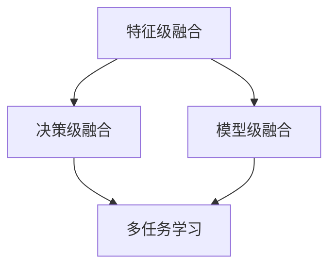
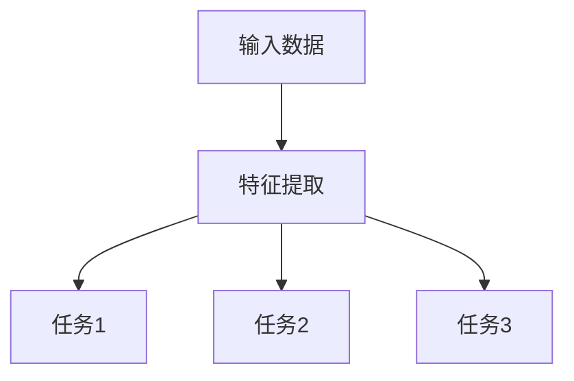
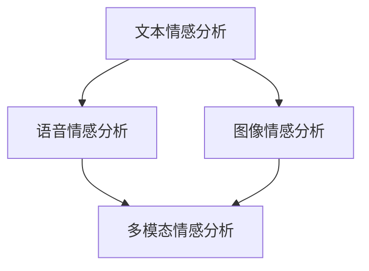
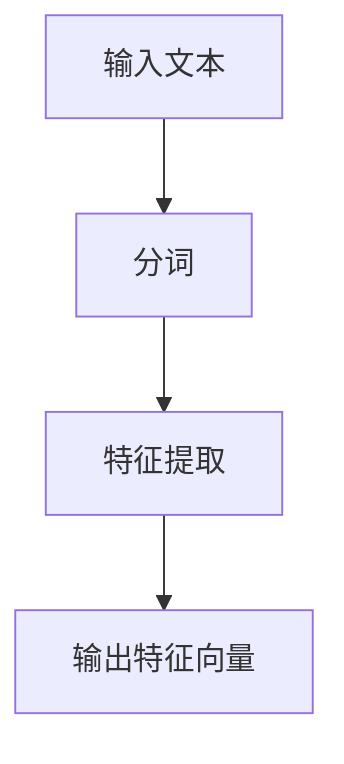
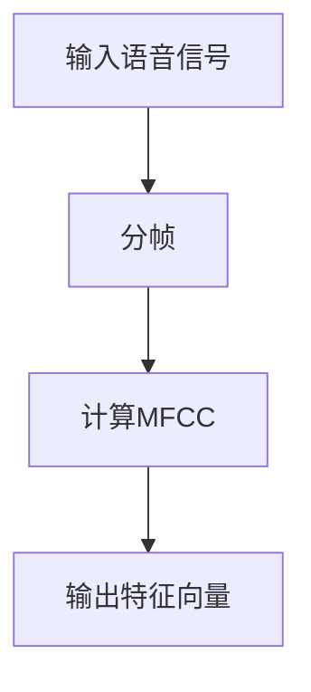
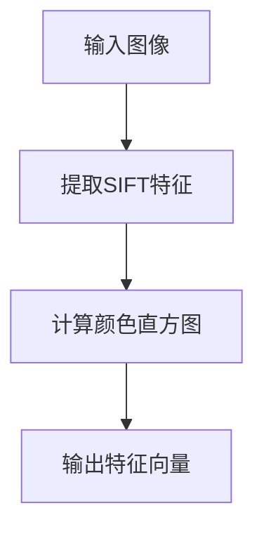
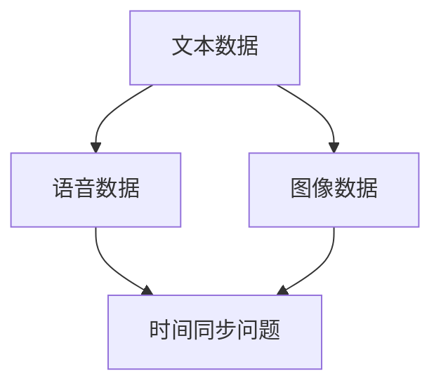
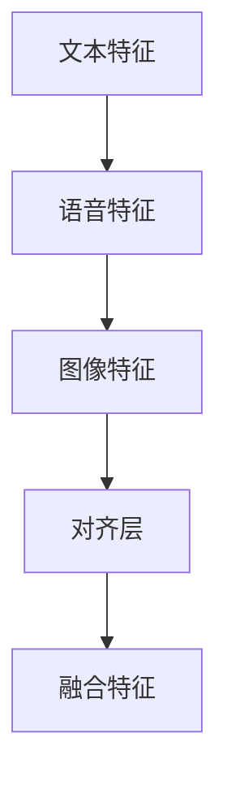
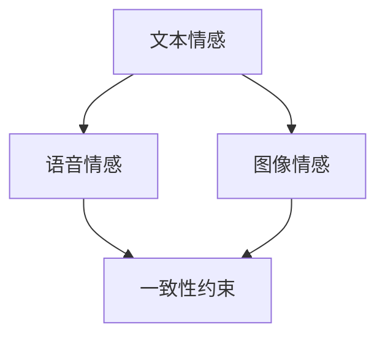

                 


# AI Agent的多模态情感计算技术

## 关键词：AI Agent, 多模态情感计算, 情感分析, 多模态数据融合, 人机交互

## 摘要：本文系统地探讨了AI Agent在多模态情感计算中的应用，从基础概念到高级算法，再到实际应用，全面分析了多模态情感计算的技术原理和实现方法。文章结合具体案例，深入讲解了多模态数据处理、情感分析算法、数据融合方法等关键问题，并展望了该领域的未来发展方向。

---

# 第二章: 多模态情感计算的核心概念与技术

## 2.1 多模态数据的特征与处理

### 2.1.1 文本数据的情感分析

#### 2.1.1.1 文本情感分析的特征提取
文本情感分析的核心是通过语义理解和上下文分析来识别文本的情感倾向。常用的特征提取方法包括词袋模型（Bag of Words, BoW）和词嵌入模型（如Word2Vec、GloVe）。

**示例：**
使用BoW模型对文本进行处理：
- 分词：将文本分割成单词或短语。
- 词袋构建：统计每个单词的出现频率。

**代码示例：**
```python
from sklearn.feature_extraction.text import CountVectorizer

text = "This is a positive review."
vectorizer = CountVectorizer()
X = vectorizer.fit_transform([text])
print(vectorizer.get_feature_names())
```

#### 2.1.1.2 情感倾向分类
情感倾向分类通常是二分类问题（正面/负面）或细粒度分类（如正面、中性、负面）。常用的算法包括逻辑回归（Logistic Regression）、支持向量机（SVM）、随机森林（Random Forest）和深度学习模型（如LSTM、BERT）。

**代码示例：**
```python
from sklearn.linear_model import LogisticRegression

X_train, y_train = ..., ...  # 训练数据
X_test, y_test = ..., ...    # 测试数据

model = LogisticRegression()
model.fit(X_train, y_train)
print("Accuracy:", model.score(X_test, y_test))
```

### 2.1.2 语音数据的情感识别

#### 2.1.2.1 语音特征提取
语音情感识别主要基于语音信号的特征，如音调、音高、语速、停顿等。常用的方法包括梅尔频率倒谱系数（MFCC）和声学模型（如GMM）。

**示例：**
使用MFCC提取语音特征：
- 音频信号预处理：降噪、分帧。
- 特征提取：计算每帧的MFCC系数。

**代码示例：**
```python
import librosa

audio_path = "example.wav"
y, sr = librosa.load(audio_path, sr=16000)
mfccs = librosa.feature.mfcc(y, sr=sr)
print(mfccs.shape)
```

#### 2.1.2.2 声调与语调分析
声调分析主要通过语音信号的时频特征来识别情感。例如，高声调通常表示兴奋或愤怒，低声调通常表示悲伤或沮丧。

**代码示例：**
```python
import numpy as np

# 假设y是音频信号，sr是采样率
def calculate_pitch(y, sr):
    pitches = []
    for i in range(0, len(y), sr//10):
        frame = y[i:i+sr//10]
        # 计算该帧的基频
        pitch = np.mean(librosa.pitch_keyboard(frame, sr=sr))
        pitches.append(pitch)
    return pitches
```

### 2.1.3 图像数据的情感分析

#### 2.1.3.1 图像特征提取
图像情感分析通常基于颜色、纹理和形状特征。常用的方法包括颜色直方图、SIFT特征和卷积神经网络（CNN）。

**示例：**
使用颜色直方图分析图像情感：
- 将图像分割成颜色通道（RGB）。
- 统计每个通道的颜色分布。

**代码示例：**
```python
import cv2

image = cv2.imread("example.jpg")
# 分割颜色通道
r, g, b = cv2.split(image)
# 统计颜色分布
color_histogram = cv2.calcHist([image], [0], None, [256], [0, 256])
print(color_histogram.shape)
```

#### 2.1.3.2 基于CNN的图像情感分析
卷积神经网络（CNN）是图像情感分析的常用方法。模型通常包括卷积层、池化层和全连接层。

**代码示例：**
```python
import tensorflow as tf
from tensorflow.keras import layers

model = tf.keras.Sequential([
    layers.Conv2D(32, (3,3), activation='relu', input_shape=(64,64,3)),
    layers.MaxPooling2D((2,2)),
    layers.Conv2D(64, (3,3), activation='relu'),
    layers.MaxPooling2D((2,2)),
    layers.Flatten(),
    layers.Dense(128, activation='relu'),
    layers.Dense(2, activation='softmax')
])
model.compile(optimizer='adam', loss='sparse_categorical_crossentropy', metrics=['accuracy'])
model.summary()
```

---

## 2.2 多模态数据融合方法

### 2.2.1 数据融合的定义与分类

#### 2.2.1.1 数据融合的定义
数据融合是指将来自不同模态的数据进行整合，以提高信息的准确性和完整性。多模态数据融合可以分为特征级融合和决策级融合。

**图2-1: 数据融合的分类**


### 2.2.2 基于特征的融合方法

#### 2.2.2.1 基于加权平均的融合
加权平均融合是一种简单有效的特征融合方法，适用于模态间特征相关性较高的场景。

**公式2-1: 加权平均融合**
$$
f_{\text{fusion}} = \sum_{i=1}^{n} w_i f_i
$$
其中，$w_i$是第$i$个模态的权重，$f_i$是第$i$个模态的特征向量。

**代码示例：**
```python
# 假设text_emb, speech_emb, image_emb分别是文本、语音和图像的特征向量
weights = [0.4, 0.3, 0.3]  # 权重
fusion_feature = text_emb * weights[0] + speech_emb * weights[1] + image_emb * weights[2]
```

#### 2.2.2.2 基于注意力机制的融合
注意力机制通过自适应地分配不同模态的权重，实现更精细的特征融合。

**公式2-2: 注意力权重计算**
$$
w_i = \text{softmax}(W a_i)
$$
其中，$W$是注意力权重矩阵，$a_i$是第$i$个模态的注意力向量。

**代码示例：**
```python
import tensorflow as tf

# 假设text_emb, speech_emb, image_emb分别是文本、语音和图像的特征向量
input = tf.keras.Input(shape=(text_emb.shape[1],))
attention_layer = tf.keras.layers.Dense(3, activation='softmax')(input)
fusion_feature = tf.keras.layers.Dot(axes=1)([input, attention_layer])
```

### 2.2.3 基于模型的融合方法

#### 2.2.3.1 多任务学习
多任务学习通过共享特征提取部分，实现多模态数据的联合优化。

**图2-2: 多任务学习框架**


**代码示例：**
```python
import tensorflow as tf

# 输入数据
input_text = tf.keras.Input(shape=(max_length,), dtype='int32')
input_speech = tf.keras.Input(shape=(num_speech_features,), dtype='float32')
input_image = tf.keras.Input(shape=(64,64,3), dtype='float32')

# 特征提取
x = tf.keras.layers.Embedding(vocab_size, 128)(input_text)
x = tf.keras.layers.Flatten()(x)
x = tf.keras.layers.Dense(64, activation='relu')(x)
x_speech = tf.keras.layers.Dense(64, activation='relu')(input_speech)
x_image = tf.keras.layers.Conv2D(32, (3,3), activation='relu')(input_image)
x_image = tf.keras.layers.Flatten()(x_image)

# 多任务输出
output_text = tf.keras.layers.Dense(2, activation='softmax')(x)
output_speech = tf.keras.layers.Dense(2, activation='softmax')(x_speech)
output_image = tf.keras.layers.Dense(2, activation='softmax')(x_image)

model = tf.keras.Model(inputs=[input_text, input_speech, input_image], outputs=[output_text, output_speech, output_image])
model.compile(optimizer='adam', loss={'output_text': 'sparse_categorical_crossentropy', 'output_speech': 'sparse_categorical_crossentropy', 'output_image': 'sparse_categorical_crossentropy'}, loss_weights=[1, 1, 1])
```

#### 2.2.3.2 模型级融合
模型级融合将多个独立模型的输出结果进行融合，通常用于提升模型的泛化能力。

**公式2-3: 模型级融合**
$$
y_{\text{final}} = \sum_{i=1}^{n} w_i y_i
$$
其中，$w_i$是第$i$个模型的权重，$y_i$是第$i$个模型的输出。

**代码示例：**
```python
import numpy as np

# 假设model1_output, model2_output, model3_output是三个模型的输出
weights = [0.4, 0.3, 0.3]
final_output = np.sum([model1_output * weights[0], model2_output * weights[1], model3_output * weights[2]], axis=0)
```

---

## 2.3 情感计算的关键技术

### 2.3.1 情感分析的分类与指标

#### 2.3.1.1 情感分析的分类
情感分析可以分为文本情感分析、语音情感分析和图像情感分析，也可以分为二分类（正面/负面）和多分类（正面、中性、负面）。

**图2-3: 情感分析的分类**


#### 2.3.1.2 评估指标
常用的评估指标包括准确率（Accuracy）、精确率（Precision）、召回率（Recall）和F1值（F1-score）。

**公式2-4: F1值计算**
$$
F1 = \frac{2 \times \text{Precision} \times \text{Recall}}{\text{Precision} + \text{Recall}}
$$

**代码示例：**
```python
from sklearn.metrics import f1_score

y_true = [0, 1, 0, 1, 1]
y_pred = [0, 1, 1, 1, 0]
print(f1_score(y_true, y_pred, average='macro'))
```

### 2.3.2 情感计算中的特征提取

#### 2.3.2.1 文本特征提取
文本特征提取主要通过词袋模型、词嵌入模型和句法分析实现。

**图2-4: 文本特征提取流程**


**代码示例：**
```python
from tensorflow.keras.preprocessing.text import Tokenizer
from tensorflow.keras.preprocessing.sequence import pad_sequences

text = "This is a positive review."
tokenizer = Tokenizer(num_words=1000)
tokenizer.fit_on_texts([text])
sequences = tokenizer.texts_to_sequences([text])
X = pad_sequences(sequences, maxlen=10)
print(X)
```

#### 2.3.2.2 语音特征提取
语音特征提取主要通过MFCC和声学模型实现。

**图2-5: 语音特征提取流程**


**代码示例：**
```python
import librosa

audio_path = "example.wav"
y, sr = librosa.load(audio_path, sr=16000)
mfccs = librosa.feature.mfcc(y, sr=sr)
print(mfccs.shape)
```

#### 2.3.2.3 图像特征提取
图像特征提取主要通过颜色直方图、SIFT特征和卷积神经网络实现。

**图2-6: 图像特征提取流程**


**代码示例：**
```python
import cv2

image = cv2.imread("example.jpg")
# 提取SIFT特征
sift = cv2.SIFT_create()
kp, des = sift.detectAndCompute(image, None)
print(des.shape)
```

### 2.3.3 多模态情感计算的挑战

#### 2.3.3.1 数据异构性
多模态数据的异构性主要体现在数据格式、数据量和时间同步上。

**图2-7: 数据异构性问题**


#### 2.3.3.2 跨模态语义对齐
跨模态语义对齐是多模态情感计算的核心问题之一，通常通过注意力机制和对齐模型实现。

**图2-8: 跨模态语义对齐流程**


**代码示例：**
```python
import tensorflow as tf

# 假设text_emb, speech_emb, image_emb分别是文本、语音和图像的特征向量
# 对齐层
text_emb = tf.keras.layers.Dense(64, activation='relu')(text_emb)
speech_emb = tf.keras.layers.Dense(64, activation='relu')(speech_emb)
image_emb = tf.keras.layers.Dense(64, activation='relu')(image_emb)
# 融合特征
fusion_feature = tf.keras.layers.Add()([text_emb, speech_emb, image_emb])
```

#### 2.3.3.3 情感一致性
情感一致性是指不同模态数据表达的情感是否一致，通常需要通过联合学习和对抗训练实现。

**图2-9: 情感一致性问题**


**代码示例：**
```python
import tensorflow as tf

# 假设text_emotion, speech_emotion, image_emotion分别是文本、语音和图像的情感预测
# 一致性约束
text_emotion = tf.keras.layers.Dense(2, activation='softmax')(text_emb)
speech_emotion = tf.keras.layers.Dense(2, activation='softmax')(speech_emb)
image_emotion = tf.keras.layers.Dense(2, activation='softmax')(image_emb)
# 一致性损失
consistency_loss = tf.reduce_mean(tf.square(text_emotion - speech_emotion)) + tf.reduce_mean(tf.square(text_emotion - image_emotion))
model.add_loss(consistency_loss)
```

---

## 2.4 总结与展望

### 2.4.1 本章总结
本章详细介绍了多模态情感计算的核心概念与技术，包括文本、语音和图像数据的特征提取方法，多模态数据融合策略，以及情感计算的关键技术。通过这些方法，可以实现对多模态数据的高效情感分析。

### 2.4.2 未来展望
随着深度学习和多模态技术的不断发展，多模态情感计算将在以下方面取得进一步突破：
- 更加智能化的特征融合方法，如基于自注意力机制的融合。
- 更加鲁棒的跨模态语义对齐技术，如基于对比学习的对齐模型。
- 更加广泛的应用场景，如智能客服、情感机器人和医疗辅助诊断。

---

通过以上详细的内容，我们可以看到，多模态情感计算是一项复杂但充满潜力的技术。未来，随着AI Agent的不断发展，多模态情感计算将在人机交互、智能系统等领域发挥越来越重要的作用。

