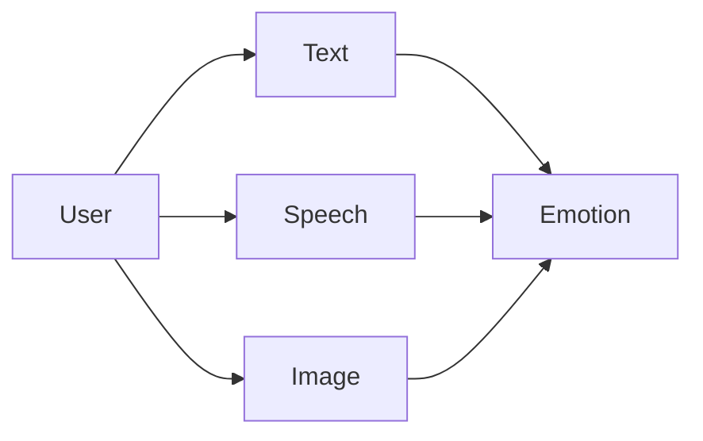
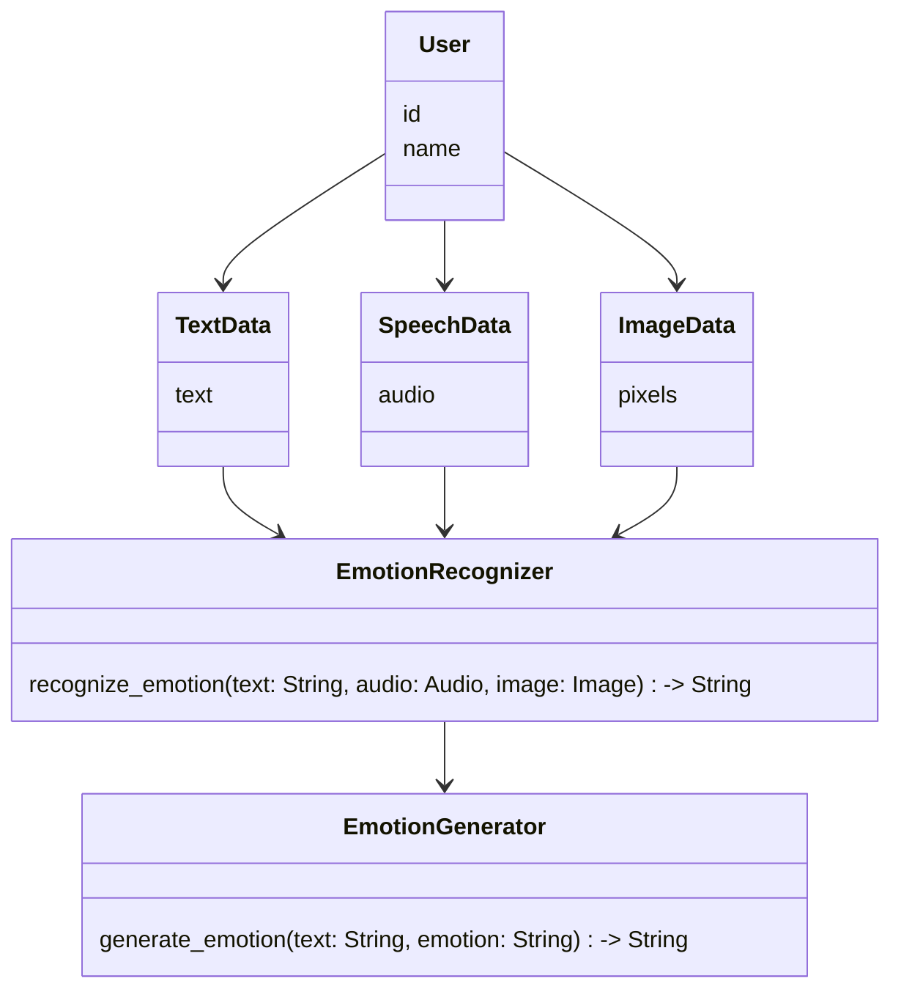

                 


# AI Agent的多模态情感识别与生成

> 关键词：AI Agent, 多模态, 情感识别, 情感生成, 深度学习

> 摘要：  
本文深入探讨了AI Agent在多模态情感识别与生成领域的技术原理与应用。通过分析多模态数据的整合与处理方法，详细介绍了基于深度学习的情感识别算法与生成模型，展示了实际项目中的系统架构设计与实现。文章内容涵盖理论、算法、系统设计与项目实战，为读者提供了全面的技术视角。

---

# {{文章标题}}

## 目录大纲

### 第一部分：背景介绍

#### 第1章：AI Agent与多模态情感识别概述

##### 1.1 AI Agent的基本概念

- 1.1.1 AI Agent的定义与特点  
  AI Agent是一种智能体，能够感知环境、自主决策并执行任务。其特点包括智能性、自主性、反应性和社会性。  

- 1.1.2 多模态数据的定义与重要性  
  多模态数据指的是结合了文本、语音、图像等多种数据形式的数据。在情感识别中，多模态数据能够提供更全面的信息，提高识别的准确性和鲁棒性。  

- 1.1.3 情感识别与生成的背景与意义  
  情感识别是理解人类情感的核心技术，广泛应用于人机交互、心理健康评估等领域。情感生成则是通过技术手段模拟人类情感表达的过程，进一步增强人机交互的自然性。  

##### 1.2 多模态情感识别的背景与问题描述

- 1.2.1 多模态数据在情感识别中的作用  
  通过结合文本、语音和图像等多种模态数据，可以更准确地捕捉和理解人类情感。  

- 1.2.2 当前技术的挑战与机遇  
  当前技术在多模态情感识别中面临数据融合难度大、跨模态理解能力有限等挑战，同时也带来了提升人机交互体验的机遇。  

- 1.2.3 问题的边界与外延  
  本文聚焦于AI Agent在多模态情感识别与生成中的技术实现，探讨其在实际应用中的潜力与挑战。  

##### 1.3 本书的核心目标与内容框架

- 1.3.1 本书的核心目标  
  本书旨在深入探讨AI Agent在多模态情感识别与生成中的技术原理与应用，为读者提供从理论到实践的全面指导。  

- 1.3.2 内容框架与结构安排  
  本书分为五部分：背景介绍、多模态情感识别的核心概念、算法原理、系统架构设计与项目实战。  

---

### 第二部分：多模态情感识别的核心概念

#### 第2章：多模态情感识别的核心概念与联系

##### 2.1 多模态数据的特点与分类

- 2.1.1 文本、语音、图像的特征对比  
  | 模态 | 特征 | 优势 | 属于的领域 |
  |------|------|------|------------|
  | 文本 | 离散性、语义丰富性 | 易处理、信息量大 | 自然语言处理 |
  | 语音 | 时序性、情感丰富性 | 信息量高 | 语音信号处理 |
  | 图像 | 空间性、视觉丰富性 | 信息量高 | 计算机视觉 |

- 2.1.2 多模态数据的融合方式  
  - 并行融合：分别处理各模态数据后进行融合。  
  - 串行融合：逐步处理各模态数据，逐步融合。  

- 2.1.3 各模态数据的优劣势分析  
  - 文本：信息量大，但缺乏非语言信息。  
  - 语音：情感信息丰富，但实时性要求高。  
  - 图像：视觉信息丰富，但情感识别依赖于特征提取能力。  

##### 2.2 多模态情感识别的实体关系图



##### 2.3 核心概念原理

- 2.3.1 多模态数据的整合与处理  
  多模态数据的整合需要考虑数据的异构性，通过预处理、特征提取和融合等步骤实现。  

- 2.3.2 情感识别的基本原理  
  情感识别基于多模态数据的特征提取与分类，通过深度学习模型实现对情感状态的判别。  

---

### 第三部分：算法原理讲解

#### 第3章：多模态情感识别的算法原理

##### 3.1 深度学习在情感识别中的应用

- 3.1.1 基于CNN的图像特征提取  
  使用卷积神经网络（CNN）提取图像的空间特征，如颜色、纹理等。  

- 3.1.2 基于RNN的文本序列处理  
  使用循环神经网络（RNN）处理文本序列，捕捉上下文信息。  

##### 3.2 多模态融合算法

- 3.2.1 多模态特征融合方法  
  - 晚融合：在特征层进行融合。  
  - 中融合：在模型中间层进行融合。  

- 3.2.2 跨模态注意力机制  
  通过注意力机制实现跨模态信息的交互与增强。  

##### 3.3 情感生成的算法原理

- 3.3.1 基于GPT的情感生成  
  使用生成式预训练模型（如GPT）生成情感化文本。  

- 3.3.2 扩散模型的应用  
  使用扩散模型（如Stable Diffusion）生成与情感相关的图像。  

---

### 第四部分：系统分析与架构设计

#### 第4章：系统架构设计方案

##### 4.1 问题场景介绍

- 4.1.1 系统目标与功能需求  
  系统目标：实现AI Agent的多模态情感识别与生成功能。  
  功能需求：包括情感识别、情感生成、多模态数据处理等。  

- 4.1.2 使用场景与用户角色  
  使用场景：人机交互、情感分析、内容生成。  
  用户角色：开发者、数据科学家、用户体验设计师。  

##### 4.2 系统功能设计

- 4.2.1 领域模型的Mermaid类图  


- 4.2.2 系统架构的Mermaid架构图  


- 4.2.3 系统接口与交互设计  
  ```mermaid
  sequenceDiagram
      User ->> API Gateway: 发送多模态数据
      API Gateway ->> EmotionRecognizer: 调用情感识别服务
      EmotionRecognizer ->> Database: 查询模型参数
      EmotionRecognizer ->> API Gateway: 返回识别结果
      API Gateway ->> EmotionGenerator: 调用情感生成服务
      EmotionGenerator ->> Database: 查询模型参数
      EmotionGenerator ->> API Gateway: 返回生成结果
      API Gateway ->> User: 返回最终结果
  ```

---

### 第五部分：项目实战

#### 第5章：多模态情感识别与生成的项目实现

##### 5.1 环境安装与配置

- 5.1.1 开发环境的选择  
  - Python 3.8+
  - 虚拟环境（如virtualenv）
  - IDE（如PyCharm、VS Code）  

- 5.1.2 必要库的安装  
  ```bash
  pip install numpy pandas torch transformers mermaid4jupyter
  ```

##### 5.2 核心代码实现

- 5.2.1 情感识别模型  
  ```python
  import torch
  import torch.nn as nn
  import torch.nn.functional as F

  class EmotionRecognizer(nn.Module):
      def __init__(self):
          super(EmotionRecognizer, self).__init__()
          self.conv1 = nn.Conv2d(3, 6, 5)
          self.pool = nn.MaxPool2d(2, 2)
          self.fc1 = nn.Linear(6 * 5 * 5, 120)
          self.fc2 = nn.Linear(120, 10)

      def forward(self, x):
          x = self.pool(F.relu(self.conv1(x)))
          x = x.view(-1, 6 * 5 * 5)
          x = F.relu(self.fc1(x))
          x = self.fc2(x)
          return x
  ```

- 5.2.2 情感生成模型  
  ```python
  from transformers import GPT2LMHeadModel, GPT2Tokenizer

  model = GPT2LMHeadModel.from_pretrained('gpt2')
  tokenizer = GPT2Tokenizer.from_pretrained('gpt2')

  def generate_emotion(text, max_length=50):
      inputs = tokenizer.encode(text, return_tensors='pt')
      outputs = model.generate(inputs, max_length=max_length, do_sample=True)
      return tokenizer.decode(outputs[0])
  ```

##### 5.3 项目小结

- 5.3.1 项目总结  
  通过本项目，我们实现了AI Agent的多模态情感识别与生成功能，验证了算法的有效性和系统的可行性。  

- 5.3.2 最佳实践与注意事项  
  - 数据预处理是关键，确保数据质量与多样性。  
  - 模型调参需谨慎，避免过拟合与欠拟合。  
  - 系统设计需考虑扩展性，便于后续功能的添加与优化。  

- 5.3.3 拓展阅读  
  - 《Deep Learning》（Ian Goodfellow）  
  - 《Hands-On Machine Learning with Scikit-Learn, Keras, and TensorFlow》（Aurélien Géron）  

---

### 第六部分：高级应用与未来展望

#### 第6章：多模态情感识别的高级应用与未来趋势

##### 6.1 高级应用

- 6.1.1 教育领域中的应用  
  - 情感分析辅助教学反馈。  

- 6.1.2 医疗领域中的应用  
  - 情感监测辅助心理健康评估。  

- 6.1.3 娱乐领域中的应用  
  - 情感驱动的个性化内容推荐。  

##### 6.2 未来技术挑战与趋势

- 6.2.1 技术挑战  
  - 多模态数据的实时处理与低延迟需求。  
  - 跨模态理解的深度与泛化能力。  

- 6.2.2 未来趋势  
  - 智能助手的多模态情感交互将更加自然与个性化。  
  - 结合元学习与自适应算法，提升情感识别与生成的动态适应能力。  

---

### 第七部分：总结与展望

#### 第7章：总结与展望

##### 7.1 全文总结

- 本文系统地介绍了AI Agent在多模态情感识别与生成中的技术实现与应用。通过理论分析、算法设计与项目实战，展示了多模态情感识别与生成的潜力与价值。  

##### 7.2 对未来的展望

- 随着深度学习技术的不断进步，AI Agent的多模态情感识别与生成将更加智能化与个性化。未来的研究方向将聚焦于跨模态理解的深度、实时性与动态适应性，推动人机交互的进一步发展。  

---

通过以上结构，我们可以清晰地看到AI Agent的多模态情感识别与生成技术的全貌。从理论到实践，从算法到系统，本文为读者提供了一个全面的技术视角，助力他们在这一领域的深入探索与实践。

