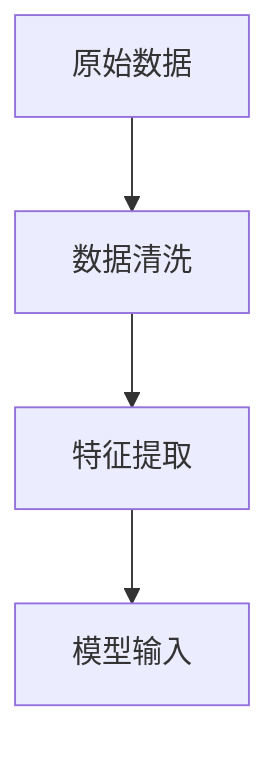
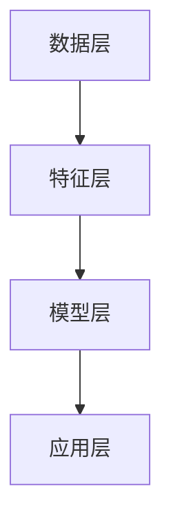
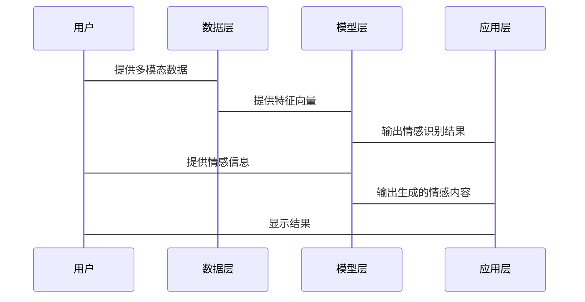

                 


# AI Agent的多模态情感识别与生成

> 关键词：多模态情感识别，生成，AI Agent，深度学习，自然语言处理

> 摘要：本文深入探讨了AI Agent在多模态情感识别与生成中的应用，从背景介绍、核心概念、算法原理、系统架构设计到项目实战，全面分析了多模态情感识别与生成的技术细节和实现方法。文章还探讨了其在实际应用中的潜力和挑战。

---

# 第1章: 多模态情感识别与生成的背景介绍

## 1.1 多模态情感识别与生成的背景

### 1.1.1 问题背景与挑战

随着人工智能技术的快速发展，情感识别与生成在多个领域中发挥着越来越重要的作用。然而，单一模态的情感识别与生成存在诸多局限性，例如仅依赖文本或仅依赖语音的识别方式难以捕捉复杂的情感信息。通过结合文本、语音、图像等多种模态数据，可以更全面地理解人类情感，从而实现更精准的情感识别与生成。

### 1.1.2 多模态数据的定义与特点

多模态数据指的是多种类型的数据（如文本、语音、图像、视频等）的组合。这些数据可以相互补充，提供更丰富的信息。例如，结合文本和语音可以更好地捕捉情感的细微变化，结合图像和文本可以更准确地识别情感状态。

### 1.1.3 情感识别与生成的核心目标

情感识别的核心目标是通过分析多模态数据，准确识别出情感类别（如快乐、悲伤、愤怒等）；情感生成的核心目标是根据给定的情感信息，生成相应的情感文本、语音或图像等内容。

---

## 1.2 多模态情感识别与生成的核心概念

### 1.2.1 核心概念的定义与属性对比

| **概念**         | **定义**                                                                 | **属性**                                                                 |
|------------------|--------------------------------------------------------------------------|--------------------------------------------------------------------------|
| 多模态数据       | 多种类型的数据（如文本、语音、图像）的组合                                      | 数据类型多样性、信息互补性、复杂性                                     |
| 情感识别         | 通过分析多模态数据，识别出情感类别                                             | 数据驱动、模型驱动、高精度                                             |
| 情感生成         | 根据情感信息生成相应的情感内容                                                 | 创生性、多样性、可控性                                                 |

### 1.2.2 多模态情感识别与生成的ER实体关系图

```mermaid
erDiagram
    user : 用户
    emotion_data : 多模态情感数据
    emotion_recognition : 情感识别模型
    emotion_generation : 情感生成模型
    emotion_result : 情感识别结果
    generated_emotion : 生成的情感内容

    user --> emotion_data : 提供
    emotion_data --> emotion_recognition : 输入
    emotion_recognition --> emotion_result : 输出
    emotion_recognition --> emotion_generation : 输入
    emotion_generation --> generated_emotion : 输出
```

---

# 第2章: 多模态情感识别与生成的核心概念与联系

## 2.1 多模态情感识别的原理

### 2.1.1 多模态数据融合的原理

多模态数据融合是指将不同模态的数据进行融合，以提取更丰富的特征信息。常见的融合方式包括早期融合和晚期融合。

- **早期融合**：在特征提取阶段对不同模态的数据进行融合。
- **晚期融合**：在分类阶段对不同模态的特征进行融合。

### 2.1.2 情感识别的关键步骤

情感识别的关键步骤包括数据预处理、特征提取、情感分类等。

- **数据预处理**：对原始数据进行清洗、归一化等处理。
- **特征提取**：提取有助于情感识别的特征（如文本中的词袋模型、语音中的频域特征）。
- **情感分类**：利用机器学习或深度学习模型对情感进行分类。

---

## 2.2 多模态情感生成的原理

### 2.2.1 情感生成的核心算法

情感生成的核心算法包括生成对抗网络（GAN）、变(autoencoder)等。

- **生成对抗网络（GAN）**：通过生成器和判别器的对抗训练，生成逼真的情感内容。
- **变**：通过编码和解码的过程，生成与输入情感一致的内容。

### 2.2.2 多模态数据的生成过程

多模态数据的生成过程包括情感信息输入、生成模型训练、生成内容输出等步骤。

- **情感信息输入**：输入情感类别或情感描述。
- **生成模型训练**：利用多模态数据进行训练，使生成模型能够生成与情感一致的内容。
- **生成内容输出**：根据输入的情感信息，生成相应的文本、语音或图像等内容。

---

## 2.3 多模态情感识别与生成的联系

### 2.3.1 数据流的双向关系

多模态情感识别与生成之间存在双向关系。识别是生成的基础，生成是识别的扩展。

- **识别驱动生成**：通过识别出的情感类别，生成相应的情感内容。
- **生成辅助识别**：通过生成的情感内容，验证识别的准确性。

### 2.3.2 情感识别与生成的协同作用

情感识别与生成的协同作用体现在以下几个方面：

- 提高情感识别的准确性。
- 增强情感生成的多样性。
- 实现情感表达的闭环。

---

# 第3章: 多模态情感识别与生成的算法原理

## 3.1 多模态情感识别的算法流程

### 3.1.1 数据预处理与特征提取



### 3.1.2 情感分类的深度学习模型

情感分类的深度学习模型可以采用卷积神经网络（CNN）或循环神经网络（RNN）等。

- **CNN模型**：
  - 输入：多模态特征。
  - 输出：情感类别。

  ```python
  import tensorflow as tf
  model = tf.keras.Sequential([
      tf.keras.layers.Conv2D(32, (3,3), activation='relu', input_shape=(64,64,3)),
      tf.keras.layers.MaxPooling2D((2,2)),
      tf.keras.layers.Flatten(),
      tf.keras.layers.Dense(128, activation='relu'),
      tf.keras.layers.Dense(num_classes, activation='softmax')
  ])
  ```

### 3.1.3 情感分类的数学模型与公式

情感分类的损失函数可以采用交叉熵损失函数：

$$ L = -\sum_{i=1}^{n} y_i \log(p_i) $$

其中，\( y_i \) 是真实标签，\( p_i \) 是预测概率。

---

## 3.2 多模态情感生成的算法流程

### 3.2.1 情感生成的生成模型

情感生成的生成模型可以采用生成对抗网络（GAN）。

- **生成器**：生成与情感一致的内容。
- **判别器**：判别生成内容是否真实。

  ```python
  import tensorflow as tf
  # 生成器
  generator = tf.keras.Sequential([
      tf.keras.layers.Dense(256, activation='relu'),
      tf.keras.layers.Dense(128, activation='relu'),
      tf.keras.layers.Dense(1, activation='sigmoid')
  ])
  
  # 判别器
  discriminator = tf.keras.Sequential([
      tf.keras.layers.Dense(128, activation='relu'),
      tf.keras.layers.Dense(64, activation='relu'),
      tf.keras.layers.Dense(1, activation='sigmoid')
  ])
  ```

### 3.2.2 多模态数据的生成算法

多模态数据的生成算法包括联合生成和条件生成。

- **联合生成**：同时生成多种模态的数据。
- **条件生成**：根据一种模态的数据生成其他模态的数据。

---

## 3.3 算法的数学模型与公式

### 3.3.1 情感分类的损失函数

$$ L_{\text{分类}} = -\sum_{i=1}^{n} y_i \log(p_i) $$

### 3.3.2 情感生成的生成函数

$$ G(z, y) = \text{生成与情感 } y \text{ 相关的内容} $$

其中，\( z \) 是噪声向量，\( y \) 是情感标签。

---

# 第4章: 多模态情感识别与生成的系统分析与架构设计

## 4.1 系统功能设计

### 4.1.1 多模态数据采集模块

多模态数据采集模块负责采集文本、语音、图像等多种模态的数据。

- 文本采集：从社交媒体、聊天记录中获取文本数据。
- 语音采集：通过麦克风采集语音数据。
- 图像采集：通过摄像头采集图像数据。

### 4.1.2 情感识别模块

情感识别模块负责对采集到的数据进行情感识别。

- 文本情感识别：基于词袋模型或词嵌入模型进行情感分类。
- 语音情感识别：基于语音特征（如音调、语速）进行情感分类。
- 图像情感识别：基于图像特征（如颜色、纹理）进行情感分类。

### 4.1.3 情感生成模块

情感生成模块负责根据识别出的情感生成相应的情感内容。

- 文本生成：生成与情感一致的文本内容。
- 语音生成：生成与情感一致的语音内容。
- 图像生成：生成与情感一致的图像内容。

---

## 4.2 系统架构设计

### 4.2.1 分层架构设计

多模态情感识别与生成系统的分层架构包括数据层、特征层、模型层和应用层。

- **数据层**：存储多模态数据。
- **特征层**：提取多模态特征。
- **模型层**：进行情感识别与生成。
- **应用层**：提供用户界面和API接口。

### 4.2.2 模块间的交互关系



---

## 4.3 系统接口设计

### 4.3.1 数据接口

- 输入接口：接收多模态数据。
- 输出接口：输出情感识别结果或生成的情感内容。

### 4.3.2 模型接口

- 输入接口：接收特征向量。
- 输出接口：输出情感类别或生成内容。

### 4.3.3 用户接口

- 输入接口：接收用户输入的情感信息。
- 输出接口：显示情感识别结果或生成的情感内容。

---

## 4.4 系统交互流程图



---

# 第5章: 多模态情感识别与生成的项目实战

## 5.1 环境安装与配置

### 5.1.1 开发环境的选择

推荐使用Python 3.8及以上版本，安装TensorFlow、Keras、PyTorch等深度学习框架。

### 5.1.2 依赖库的安装

安装必要的依赖库：

```bash
pip install numpy
pip install pandas
pip install tensorflow
pip install keras
pip install matplotlib
```

---

## 5.2 核心代码实现

### 5.2.1 数据预处理代码

```python
import numpy as np
import pandas as pd

# 文本数据预处理
def preprocess_text(text):
    # 分词处理
    words = text.split()
    # 转换为词袋模型
    word_set = set(words)
    vector = np.zeros(len(word_set))
    for i, word in enumerate(word_set):
        if word in words:
            vector[i] = 1
    return vector

# 语音数据预处理
def preprocess_audio(audio_data):
    # 提取语音特征（如梅尔频谱）
    features = extract_features(audio_data)
    return features
```

### 5.2.2 情感识别模型代码

```python
import tensorflow as tf
from tensorflow.keras import layers

# 定义情感识别模型
def emotion_recognition_model(input_shape, num_classes):
    model = tf.keras.Sequential([
        layers.Conv2D(32, (3,3), activation='relu', input_shape=input_shape),
        layers.MaxPooling2D((2,2)),
        layers.Flatten(),
        layers.Dense(128, activation='relu'),
        layers.Dense(num_classes, activation='softmax')
    ])
    return model
```

### 5.2.3 情感生成模型代码

```python
import tensorflow as tf
from tensorflow.keras import layers

# 定义生成器模型
def generator_model(latent_dim, num_classes):
    model = tf.keras.Sequential([
        layers.Dense(256, activation='relu', input_dim=latent_dim),
        layers.Dense(128, activation='relu'),
        layers.Dense(num_classes, activation='sigmoid')
    ])
    return model

# 定义判别器模型
def discriminator_model(input_shape):
    model = tf.keras.Sequential([
        layers.Dense(128, activation='relu', input_shape=input_shape),
        layers.Dense(64, activation='relu'),
        layers.Dense(1, activation='sigmoid')
    ])
    return model
```

---

## 5.3 代码解读与分析

### 5.3.1 数据流的处理逻辑

数据流的处理逻辑包括数据采集、预处理、特征提取和模型输入等步骤。

### 5.3.2 模型训练与优化

模型训练与优化包括损失函数的定义、优化器的选择、训练数据的迭代等。

- **损失函数**：交叉熵损失函数。
- **优化器**：Adam优化器。
- **训练数据**：批量训练。

---

## 5.4 实际案例分析

### 5.4.1 情感识别案例

假设输入一段文本“我非常高兴”，模型识别出情感类别为“高兴”。

### 5.4.2 情感生成案例

假设输入情感类别“高兴”，生成器生成文本“今天天气真好，我感到非常开心”。

---

# 第6章: 多模态情感识别与生成的高级应用与扩展

## 6.1 多模态情感识别的高级算法

### 6.1.1 增量学习

增量学习是一种动态更新模型的算法，适用于数据量大的场景。

### 6.1.2 联合学习

联合学习是一种多模型协作的算法，适用于多模态数据的融合。

---

## 6.2 多模态情感生成的高级算法

### 6.2.1 增量生成

增量生成是一种逐步生成内容的算法，适用于长文本的生成。

### 6.2.2 对抗训练

对抗训练是一种生成对抗网络的优化方法，适用于生成高质量的情感内容。

---

## 6.3 多模态情感识别与生成的扩展应用

### 6.3.1 情感对话系统

情感对话系统可以根据用户的情感状态生成相应的回复。

### 6.3.2 情感内容生成

情感内容生成可以根据用户指定的情感生成文本、语音或图像等内容。

---

# 第7章: 多模态情感识别与生成的总结与展望

## 7.1 总结

本文深入探讨了AI Agent在多模态情感识别与生成中的应用，从背景介绍、核心概念、算法原理、系统架构设计到项目实战，全面分析了多模态情感识别与生成的技术细节和实现方法。

## 7.2 展望

未来，随着人工智能技术的不断发展，多模态情感识别与生成将有更广泛的应用场景，例如智能客服、情感教育、情感娱乐等。同时，如何提高情感识别的准确性和情感生成的多样性仍是一个重要的研究方向。

---

# 结语

通过本文的分析，读者可以全面了解AI Agent在多模态情感识别与生成中的技术细节和实现方法，为进一步的研究和应用提供参考。

