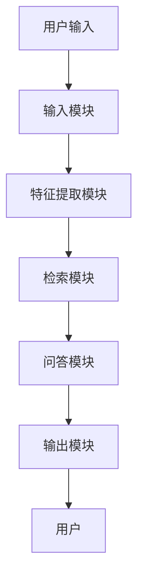
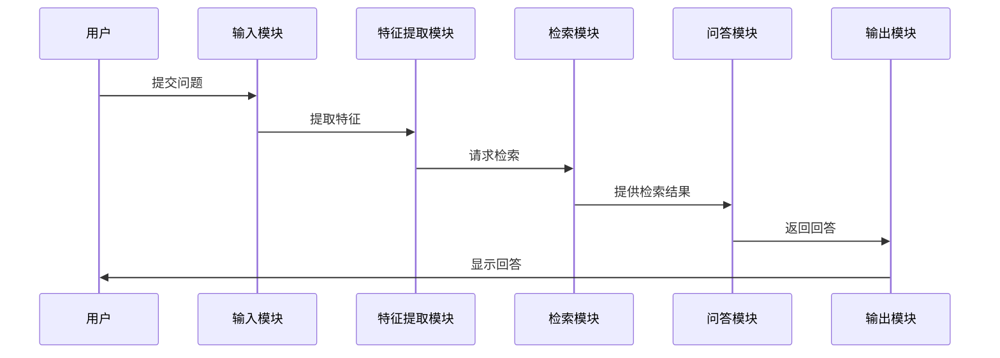

                 


# AI Agent的多模态检索与问答系统

## 关键词：AI Agent，多模态检索，问答系统，深度学习，自然语言处理

## 摘要：本文深入探讨了AI Agent在多模态检索与问答系统中的应用，从核心概念到算法原理，再到系统架构设计，结合实际案例分析，详细讲解了多模态数据处理、检索算法优化、问答系统实现等关键技术。通过本文，读者将全面了解AI Agent在多模态环境下的智能问答系统的构建与优化方法。

---

## 第一部分: AI Agent的基本概念

### 第1章: AI Agent的定义与特点

#### 1.1 AI Agent的定义
AI Agent（智能代理）是指能够感知环境、自主决策并执行任务的智能实体。它能够通过传感器获取信息，利用计算模型进行分析，并通过执行器与环境交互。AI Agent的核心目标是帮助用户完成特定任务，提高效率和准确性。

#### 1.2 AI Agent的特点
- **自主性**：AI Agent能够自主决策，无需外部干预。
- **反应性**：能够实时感知环境变化并做出反应。
- **目标导向**：所有行动都围绕实现特定目标展开。
- **学习能力**：通过数据和经验不断优化性能。

#### 1.3 AI Agent的应用场景
- 智能助手（如Siri、Alexa）
- 智能客服
- 智能推荐系统
- 自动化交易系统

### 第2章: 多模态检索的背景与意义

#### 2.1 多模态数据的定义
多模态数据指的是多种类型的数据形式，如文本、图像、音频、视频等。这些数据类型相互补充，能够提供更全面的信息。

#### 2.2 多模态检索的应用场景
- **图像检索**：通过文字描述查找图片。
- **视频检索**：根据内容或标签查找视频。
- **跨模态问答**：结合文本和图像信息回答问题。

#### 2.3 多模态检索的优势
- 提高检索的准确性和相关性。
- 更好地理解和处理复杂信息。
- 提供更丰富的用户体验。

### 第3章: 问答系统的演变

#### 3.1 传统问答系统
基于规则的问答系统，依赖预定义的规则和知识库，适用于特定领域的问题。

#### 3.2 智能问答系统
利用自然语言处理技术和深度学习模型，能够理解和回答更复杂的问题。

#### 3.3 基于检索的问答系统
通过检索预存的数据或文档，找到最相关的答案，适用于开放领域的问答。

#### 3.4 基于生成的问答系统
利用生成模型（如GPT）生成回答，能够创造性的回答问题，但准确性和可靠性较低。

---

## 第二部分: 多模态数据处理的核心概念

### 第4章: 多模态数据的分类与融合

#### 4.1 多模态数据的分类
- **文本数据**：包括自然语言文本、结构化数据等。
- **图像数据**：包括图片、视频等视觉信息。
- **音频数据**：包括语音、音乐等听觉信息。
- **结构化数据**：包括数据库中的表格数据。

#### 4.2 多模态数据的融合方法
- **特征融合**：将不同模态的数据特征进行融合，如将文本和图像的特征向量进行拼接。
- **注意力机制**：在多模态数据处理中，注意力机制能够帮助模型关注重要信息。
- **变换器模型**：利用Transformer结构进行跨模态信息的交互和融合。

#### 4.3 多模态检索的挑战与解决方案
- **数据异构性问题**：不同模态的数据具有不同的特征和表示方式，如何统一表示是一个挑战。
- **跨模态检索的难点**：需要建立不同模态数据之间的关联关系，实现有效的检索。

---

## 第三部分: 多模态检索算法原理

### 第5章: 多模态检索的数学模型

#### 5.1 表示学习的基本概念
表示学习的目标是将不同类型的输入数据映射到一个共同的向量空间中，使得相似的输入具有相似的表示。

#### 5.2 多模态表示学习的数学公式
$$
f(x) = g(y)
$$
其中，\(x\) 是输入数据，\(y\) 是另一种模态的数据，\(f\) 和 \(g\) 是分别作用于不同模态的映射函数。

#### 5.3 检索评分函数的定义
检索评分函数用于衡量两个模态数据之间的相关性：
$$
score(x, y) = \frac{x \cdot y}{\|x\| \|y\|}
$$

### 第6章: 基于深度学习的多模态检索

#### 6.1 基于CNN的图像特征提取
卷积神经网络（CNN）用于提取图像的特征，常见的模型包括VGG、ResNet等。

#### 6.2 基于Transformer的文本特征提取
Transformer模型通过自注意力机制捕捉文本中的语义信息，适用于长文本的特征提取。

#### 6.3 跨模态注意力机制
跨模态注意力机制允许模型在不同模态之间共享注意力权重，实现信息的相互增强。

---

## 第四部分: 基于检索的问答系统

### 第7章: 基于检索的问答系统

#### 7.1 检索式问答的流程
1. 用户输入问题。
2. 系统将问题映射到多模态数据空间。
3. 系统检索相关数据，找到最相关的答案。
4. 返回答案。

#### 7.2 检索式问答的关键技术
- **高效的检索算法**：如BM25、DPR等。
- **多模态索引优化**：通过索引优化技术提高检索效率。

#### 7.3 检索式问答的优缺点
优点：准确率高，可靠性好；缺点：生成能力有限，无法回答未见过的问题。

### 第8章: 基于生成的问答系统

#### 8.1 基于Transformer的生成模型
利用生成式模型如GPT生成回答，能够创造性的回答问题。

#### 8.2 基于GPT的生成机制
通过自回归的方式生成文本，具有强大的语言建模能力。

#### 8.3 生成式问答的挑战
- 计算资源消耗大。
- 回答的准确性和相关性难以保证。

---

## 第五部分: AI Agent的系统架构设计

### 第9章: 系统模块划分

#### 9.1 模块划分
- **输入模块**：接收用户输入。
- **特征提取模块**：对输入进行多模态特征提取。
- **检索模块**：基于特征进行多模态检索。
- **问答模块**：生成或检索回答。
- **输出模块**：将答案返回给用户。

#### 9.2 系统功能设计
- **数据处理**：支持多种数据格式的输入。
- **特征提取**：采用深度学习模型提取特征。
- **多模态检索**：实现跨模态数据的高效检索。
- **问答生成**：支持基于检索和生成的问答方式。

### 第10章: 系统架构设计

#### 10.1 系统架构图


#### 10.2 系统接口设计
- 输入接口：接收多模态输入数据。
- 输出接口：返回回答结果。

#### 10.3 系统交互序列图


---

## 第六部分: 项目实战

### 第11章: 环境安装与配置

#### 11.1 环境要求
- Python 3.8+
- PyTorch 1.9+
- transformers库
- numpy

#### 11.2 安装依赖
```bash
pip install torch transformers numpy
```

### 第12章: 核心代码实现

#### 12.1 多模态特征提取
```python
import torch
from transformers import AutoTokenizer, AutoModel

class MultiModalFeatureExtractor:
    def __init__(self, text_model_name='bert-base'):
        self.text_tokenizer = AutoTokenizer.from_pretrained(text_model_name)
        self.text_model = AutoModel.from_pretrained(text_model_name)
    
    def extract_text_features(self, text):
        inputs = self.text_tokenizer(text, return_tensors='pt')
        with torch.no_grad():
            outputs = self.text_model(**inputs)
        return outputs.last_hidden_state.squeeze(0).mean(dim=-1).numpy()
```

#### 12.2 多模态检索
```python
import numpy as np

class MultiModalRetriever:
    def __init__(self, text_features, image_features):
        self.text_features = text_features
        self.image_features = image_features
    
    def retrieve(self, query_text, query_image):
        text_score = np.dot(query_text, self.text_features.T)
        image_score = np.dot(query_image, self.image_features.T)
        total_score = text_score + image_score
        return np.argmax(total_score)
```

### 第13章: 案例分析

#### 13.1 项目介绍
构建一个多模态问答系统，支持文本和图像的输入，能够回答相关问题。

#### 13.2 实际案例分析
用户输入一张图片和一个问题，系统结合文本和图像信息进行检索，返回最相关的答案。

---

## 第七部分: 总结与展望

### 第14章: 最佳实践与注意事项

#### 14.1 最佳实践
- 合理选择模型和算法。
- 注重数据质量，确保数据的多样性和代表性。
- 定期更新和优化模型。

#### 14.2 注意事项
- 避免模型过拟合。
- 注意计算资源的消耗。
- 保护用户数据隐私。

### 第15章: 未来展望

#### 15.1 深度学习的进一步发展
- 更高效的模型架构。
- 更强的多模态理解能力。

#### 15.2 多模态问答系统的未来方向
- 结合更多模态的数据。
- 实现实时交互和动态更新。

#### 15.3 AI Agent的智能化提升
- 更强的自主决策能力。
- 更广泛的应用场景。

---

## 参考文献

1. Vaswani, A., et al. "Attention Is All You Need." Advances in Neural Information Processing Systems 30 (2017).
2. Radford, A., et al. "Language Models Are Few-Shot Learners." arXiv preprint arXiv:1909.02792 (2019).
3. He, K., et al. "Deep Residual Learning for Image Recognition." arXiv preprint arXiv:1512.03385 (2015).

---

以上是《AI Agent的多模态检索与问答系统》的技术博客文章的完整大纲和内容。

