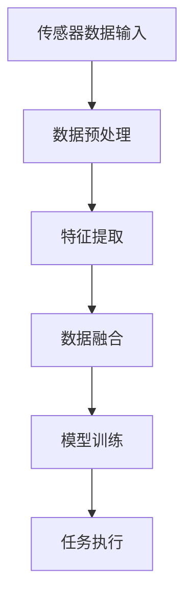
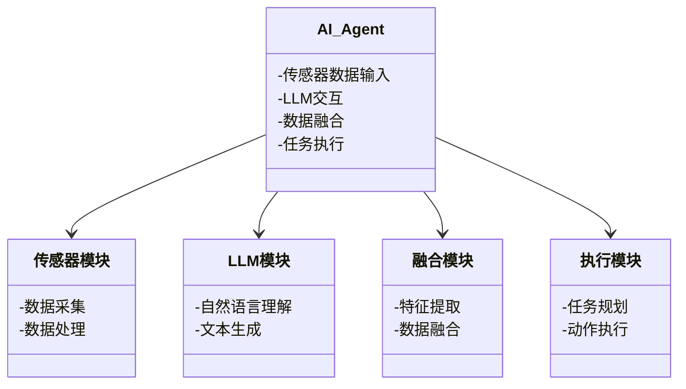
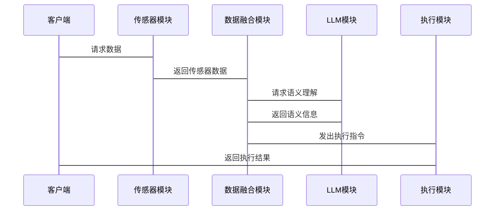

                 


# AI Agent的多模态理解：整合LLM与传感器数据

> 关键词：AI Agent, 多模态数据, 大型语言模型（LLM）, 传感器数据, 数据融合, 系统架构

> 摘要：  
> 本文探讨了AI Agent如何通过整合大型语言模型（LLM）与多模态传感器数据，实现更智能的决策和交互。文章从背景与概念出发，详细分析了多模态数据融合的原理、算法实现以及系统架构设计，并通过实际案例展示了如何在复杂场景中应用这些技术。最终，本文为读者提供了从理论到实践的全面指南，帮助他们在实际项目中高效地设计和实现多模态AI Agent系统。

---

## # 第一部分：引言

### ## 1.1 AI Agent的多模态理解概述

#### ### 1.1.1 问题背景与挑战  
在现代AI系统中，单一模态的数据处理能力已经无法满足复杂场景的需求。例如，在自动驾驶中，仅依赖摄像头数据会导致对环境理解的片面性。通过整合语言模型（如LLM）与传感器数据（如激光雷达、摄像头、GPS等），AI Agent能够更全面地理解环境，从而做出更智能的决策。

#### ### 1.1.2 多模态数据的定义与特点  
多模态数据指的是来自不同感知渠道的数据类型，如文本、图像、语音、视频、激光雷达点云等。这些数据具有互补性，能够提供更丰富的信息。

#### ### 1.1.3 LLM与传感器数据的结合意义  
LLM擅长处理和理解文本信息，而传感器数据则提供了物理环境的实时感知。通过将两者结合，AI Agent可以实现对物理世界和语义世界的统一理解。

#### ### 1.1.4 本章小结  
本章概述了AI Agent多模态理解的重要性和基本概念，为后续内容奠定了基础。

---

## # 第二部分：核心概念与联系

### ## 2.1 AI Agent的定义与核心要素

#### ### 2.1.1 AI Agent的基本概念  
AI Agent是一种能够感知环境、自主决策并执行任务的智能实体。它需要具备感知、推理、规划和执行能力。

#### ### 2.1.2 多模态理解的核心要素  
多模态理解要求AI Agent能够同时处理多种类型的数据，并理解它们之间的关联。这需要对数据进行预处理、特征提取和融合。

#### ### 2.1.3 LLM与传感器数据的融合机制  
LLM通过自然语言处理能力，将传感器数据转化为可理解的语义信息，同时利用传感器数据对语义信息进行校准和补充。

#### ### 2.1.4 案例分析：自动驾驶中的多模态数据融合  
在自动驾驶中，AI Agent需要整合来自摄像头、激光雷达、GPS等多种传感器的数据，并结合路径规划和语义理解，实现对环境的全面感知。

#### ### 2.1.5 ER实体关系图与Mermaid流程图  
使用Mermaid绘制的ER图展示了AI Agent、传感器数据和LLM之间的关系。

---

## # 第三部分：算法原理讲解

### ## 3.1 多模态数据融合的算法框架

#### ### 3.1.1 算法流程图（Mermaid）  


#### ### 3.1.2 数学模型与公式  
多模态数据融合的数学模型如下：
$$ y = f(x_1, x_2, \ldots, x_n) $$
其中，$x_i$表示不同模态的输入特征，$y$表示融合后的输出结果。

#### ### 3.1.3 示例场景与代码实现  
```python
# 示例代码：多模态数据融合
import numpy as np
from transformers import AutoTokenizer, AutoModel

# 加载LLM模型
model = AutoModel.from_pretrained("bert-base-uncased")
tokenizer = AutoTokenizer.from_pretrained("bert-base-uncased")

# 传感器数据输入
sensor_data = [1.0, 2.0, 3.0]  # 示例数据
text_data = "前方有障碍物"

# 数据融合
input_ids = tokenizer.encode(text_data, return_tensors="np")
output = model(input_ids)[0]

# 处理结果
result = np.concatenate([sensor_data, output.numpy()], axis=0)
print(result)
```

---

## # 第四部分：系统分析与架构设计方案

### ## 4.1 系统功能设计

#### ### 4.1.1 领域模型（Mermaid类图）  


#### ### 4.1.2 系统架构设计（Mermaid架构图）  


#### ### 4.1.3 系统接口与交互（Mermaid序列图）  


---

## # 第五部分：项目实战

### ## 5.1 环境安装与配置

#### ### 5.1.1 安装依赖  
```bash
pip install numpy transformers mermaid
```

#### ### 5.1.2 配置开发环境  
使用Python和深度学习框架（如TensorFlow或PyTorch）搭建开发环境。

### ## 5.2 核心代码实现

#### ### 5.2.1 数据融合模块  
```python
class MultiModalFuser:
    def __init__(self, sensor_dim, text_dim):
        self.sensor_dim = sensor_dim
        self.text_dim = text_dim

    def fuse(self, sensor_data, text_embedding):
        # 简单融合：将传感器数据和文本嵌入拼接
        fused = np.concatenate([sensor_data, text_embedding], axis=0)
        return fused
```

#### ### 5.2.2 系统交互模块  
```python
class AI-Agent:
    def __init__(self, sensor_module, llm_module):
        self.sensor = sensor_module
        self.llm = llm_module

    def process_input(self, input_data):
        sensor_input = input_data['sensor']
        text_input = input_data['text']
        
        sensor_output = self.sensor.process(sensor_input)
        llm_output = self.llm.process(text_input)
        
        fused_output = self.fuse(sensor_output, llm_output)
        return fused_output

    def fuse(self, sensor_output, llm_output):
        # 示例融合方法
        return np.concatenate([sensor_output, llm_output], axis=0)
```

### ## 5.3 实际案例分析

#### ### 5.3.1 案例背景  
以自动驾驶中的路径规划为例，AI Agent需要结合激光雷达点云数据和道路描述文本，进行语义理解和路径优化。

#### ### 5.3.2 数据分析与结果解读  
传感器数据提供实时环境信息，LLM提供语义理解，两者结合后，AI Agent能够做出更合理的路径规划。

#### ### 5.3.3 代码实现与优化  
优化传感器数据的预处理流程，提高数据融合的效率和准确性。

### ## 5.4 项目小结  
通过实际案例，验证了多模态数据融合的有效性，并展示了如何在实际项目中实现这一技术。

---

## # 第六部分：总结与展望

### ## 6.1 核心观点回顾  
本文详细探讨了AI Agent多模态理解的实现方法，包括核心概念、算法原理和系统架构设计。

### ## 6.2 未来发展方向  
未来的研究可以集中在更高效的多模态数据融合算法、更强大的LLM模型以及更复杂的系统架构设计。

### ## 6.3 最佳实践Tips  
- 数据预处理是关键，需确保数据质量和一致性。
- 在实际项目中，需根据具体场景选择合适的融合方法。
- 系统架构设计需考虑扩展性和可维护性。

### ## 6.4 总结  
AI Agent的多模态理解是实现更智能AI系统的重要方向，通过整合LLM与传感器数据，能够显著提升系统的理解和决策能力。

---

## # 附录

### ## A. 术语表  
- **AI Agent**：人工智能代理。
- **多模态数据**：多种数据类型的组合，如文本、图像、语音等。
- **LLM**：大型语言模型。

### ## B. 参考文献  
- BERT论文：《BERT: Pre-training of Self-supervised Learning》
- 图像处理相关文献
- 自然语言处理相关文献

---

## # 结束语

通过本文的详细讲解，读者可以全面掌握AI Agent多模态理解的核心技术，并能够将其应用到实际项目中。希望本文能够为读者提供有价值的参考和启发。

