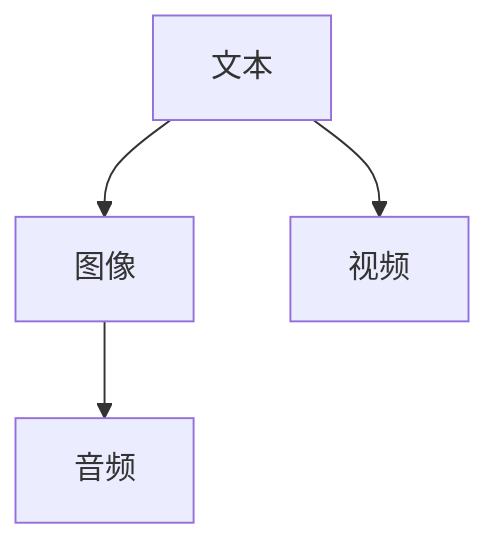
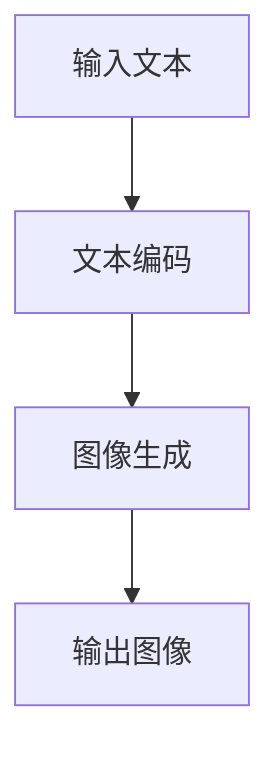
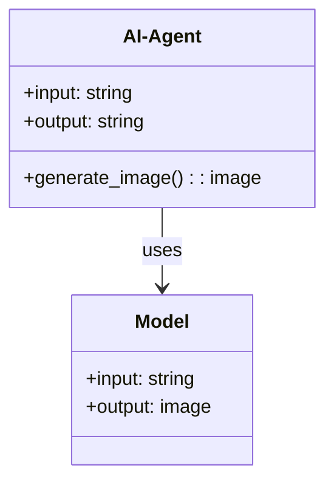
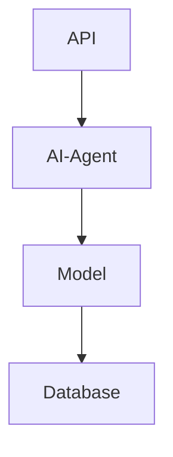
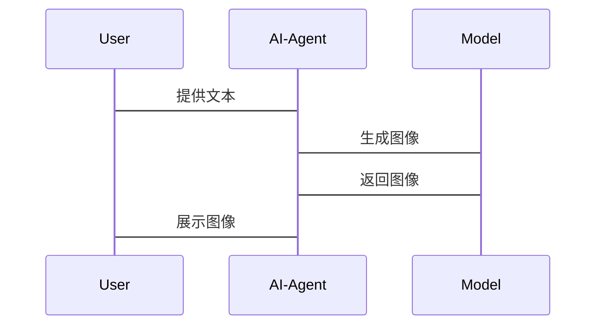

                 


# AI Agent的多模态生成：创造跨媒体内容

> 关键词：AI Agent，多模态生成，跨媒体内容，生成模型，深度学习，数据融合

> 摘要：本文深入探讨了AI Agent在多模态生成中的应用，从基本概念到算法原理，再到系统架构和项目实战，全面解析如何利用多模态生成技术创造跨媒体内容。

---

# 第一部分: AI Agent的多模态生成概述

## 第1章: AI Agent与多模态生成概述

### 1.1 AI Agent的基本概念

#### 1.1.1 什么是AI Agent
AI Agent（人工智能代理）是一种智能系统，能够感知环境、执行任务并做出决策。它可以是软件程序、机器人或其他智能设备，旨在模拟人类的决策过程。

#### 1.1.2 AI Agent的类型
AI Agent可以分为以下几种类型：
- **反应式AI Agent**：根据当前输入做出即时反应，不依赖历史信息。
- **认知式AI Agent**：具备复杂推理和规划能力，能够处理长期任务。
- **协作式AI Agent**：能够与其他AI Agent或人类协作完成任务。

#### 1.1.3 多模态生成的定义
多模态生成是指AI Agent能够生成多种类型的数据，如文本、图像、音频、视频等。跨媒体内容则是指在不同媒介之间生成内容，例如从文本生成图像，或者从图像生成视频。

### 1.2 多模态生成的应用场景

#### 1.2.1 跨媒體内容的定义
跨媒体内容是指跨越多种媒介的内容，例如将文本转化为图像，或者将图像转化为视频。这种内容在教育、医疗、娱乐等领域有广泛应用。

#### 1.2.2 多模态生成在不同领域中的应用
- **教育**：生成个性化学习材料，如根据学生的需求生成图像和视频。
- **医疗**：生成医学图像，辅助诊断。
- **娱乐**：生成游戏中的动态内容，如角色和场景。

#### 1.2.3 跨媒體内容生成的挑战
- **数据一致性**：不同媒介的数据需要一致。
- **生成质量**：生成的内容需要与输入数据匹配。
- **计算资源**：多模态生成需要大量的计算资源。

## 第2章: 多模态生成的核心概念与联系

### 2.1 多模态生成的原理

#### 2.1.1 数据融合的原理
数据融合是指将不同来源的数据进行整合，以提高生成内容的质量。例如，将文本和图像数据结合，生成更准确的图像。

#### 2.1.2 跨模态理解的核心算法
跨模态理解是指从一种模态的数据中推断另一种模态的数据。例如，从文本中理解生成图像的内容。

#### 2.1.3 跨模态生成的模型结构
跨模态生成模型通常由编码器和解码器组成，编码器将输入数据转化为统一的表示，解码器则根据表示生成目标模态的数据。

### 2.2 多模态生成的ER实体关系图



### 2.3 多模态生成的对比分析

#### 2.3.1 不同模态的特征对比

| 模态类型 | 特征描述 | 示例 |
|----------|----------|------|
| 文本 | 离散数据，结构化 | "猫在桌子上" |
| 图像 | 连续数据，非结构化 | 图片中的猫 |
| 音频 | 时间序列数据 | 猫的叫声 |

#### 2.3.2 模态之间的关系分析
- **文本和图像**：文本可以描述图像内容，图像可以辅助文本理解。
- **图像和音频**：图像可以表示音频中的场景，音频可以增强图像的表现。

#### 2.3.3 模态融合的优缺点

| 优点 | 缺点 |
|------|------|
| 提高生成质量 | 增加计算复杂度 |
| 增强用户体验 | 数据获取困难 |

## 第3章: 多模态生成的算法原理

### 3.1 多模态生成的主要算法

#### 3.1.1 扩散模型
扩散模型是一种生成模型，通过逐步添加噪声并逐步去除噪声来生成数据。

#### 3.1.2 变体自编码器
变体自编码器（VAE）是一种生成模型，通过将输入数据映射到潜在空间，再从潜在空间生成数据。

#### 3.1.3 其他生成模型
- **GAN（生成对抗网络）**：通过生成器和判别器的对抗训练生成数据。
- **Flow-based models**：通过可逆变换将简单分布的数据映射到复杂分布。

### 3.2 多模态生成算法的Mermaid流程图



### 3.3 多模态生成算法的Python实现

```python
import torch
def generate_image(text):
    text_emb = model.encode(text)
    image = model.decode(text_emb)
    return image
```

### 3.4 扩散模型的数学公式

$$ q(x_t|x_{t-1}) = \mathcal{N}(x_t; \sqrt{1-\beta_t}x_{t-1}, \beta_t\mathbf{I}) $$

### 3.5 生成模型的优缺点

| 模型 | 优点 | 缺点 |
|------|------|------|
| 扩散模型 | 高质量生成 | 训练时间长 |
| VAE | 训练速度快 | 生成质量低 |
| GAN | 多样性高 | 易发模式坍塌 |

---

# 第二部分: 多模态生成的系统架构与项目实战

## 第4章: 多模态生成的系统架构设计

### 4.1 项目介绍
本项目旨在构建一个AI Agent，能够生成跨媒体内容，如根据文本生成图像。

### 4.2 系统功能设计



### 4.3 系统架构设计



### 4.4 系统接口设计
- **输入接口**：接收文本输入。
- **输出接口**：返回生成的图像。

### 4.5 系统交互的Mermaid序列图



## 第5章: 项目实战

### 5.1 环境安装
- **Python 3.8+**
- **TensorFlow或PyTorch**

### 5.2 核心代码实现

```python
import tensorflow as tf
from tensorflow.keras import layers

def build_model():
    text_input = layers.Input(shape=(128,))
    text_emb = layers.Dense(256, activation='relu')(text_input)
    image_output = layers.Dense(784, activation='sigmoid')(text_emb)
    return tf.keras.Model(inputs=text_input, outputs=image_output)
```

### 5.3 代码解读与分析
- **text_input**：输入文本向量。
- **text_emb**：文本向量经过全连接层得到嵌入表示。
- **image_output**：嵌入表示经过全连接层生成图像向量。

### 5.4 实际案例分析
以生成猫的图像为例，输入文本“一只猫坐在沙发上”，模型生成对应的图像。

### 5.5 项目小结
通过本项目，我们实现了AI Agent生成跨媒体内容的功能，验证了多模态生成技术的实际应用。

---

# 第三部分: 最佳实践与总结

## 第6章: 最佳实践

### 6.1 注意事项
- **数据质量**：确保输入数据的多样性和质量。
- **模型选择**：根据任务需求选择合适的生成模型。
- **计算资源**：保证足够的计算资源，优化训练效率。

### 6.2 小结
本文全面介绍了AI Agent的多模态生成技术，从基本概念到算法原理，再到系统架构和项目实战，为读者提供了系统的指导。

### 6.3 拓展阅读
- **推荐书籍**：《生成式人工智能》
- **推荐论文**：《A Survey on Deep Learning for Multimodal Data Analysis》

---

# 总结

通过本文的详细讲解，读者可以全面了解AI Agent的多模态生成技术，掌握跨媒体内容生成的核心概念和实现方法。希望本文能为读者在AI Agent和多模态生成领域的研究和实践提供有价值的参考。

