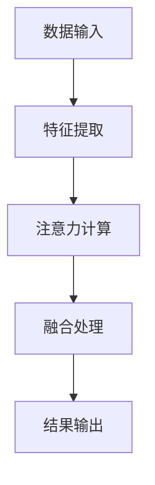

                 


# AI Agent的多模态融合与交叉注意力机制

> 关键词：AI Agent，多模态融合，交叉注意力机制，深度学习，注意力网络，多模态数据处理

> 摘要：本文系统地探讨了AI Agent在多模态数据融合中的应用，重点分析了交叉注意力机制在多模态数据处理中的原理、算法实现及其在实际系统中的应用。文章从背景介绍、核心概念、算法原理、数学模型、系统架构、项目实战等多维度进行深入分析，结合实际案例和代码实现，帮助读者全面理解AI Agent的多模态融合与交叉注意力机制的核心思想和应用场景。

---

## 第一部分: AI Agent的多模态融合与交叉注意力机制背景介绍

### 第1章: AI Agent的基本概念与问题背景

#### 1.1 AI Agent的定义与特点
- **1.1.1 AI Agent的基本概念**  
  AI Agent（人工智能代理）是指能够感知环境、执行任务并做出决策的智能体。它通常具备自主性、反应性、目标导向性和社会性等特征。在现代AI应用中，AI Agent广泛应用于自动驾驶、智能助手、机器人控制等领域。

- **1.1.2 多模态数据的定义与特点**  
  多模态数据指的是来自不同感官渠道的数据，如文本、图像、语音、视频、传感器数据等。多模态数据的特点是信息互补性强，能够提供更全面的环境感知能力。

- **1.1.3 交叉注意力机制的基本原理**  
  交叉注意力机制是一种用于处理多模态数据的机制，它允许模型在不同模态之间建立关联，从而更好地理解和利用多源信息。

#### 1.2 多模态融合的背景与意义
- **1.2.1 多模态数据的来源与特点**  
  多模态数据来源于不同的传感器或输入渠道，例如图像来自摄像头，文本来自用户输入，语音来自麦克风等。每种模态都有其独特的信息表达方式。

- **1.2.2 多模态融合的必要性**  
  在许多实际应用中，单一模态的数据往往不足以提供足够的信息来完成任务。通过融合多模态数据，可以显著提高系统的感知能力和决策水平。

- **1.2.3 交叉注意力机制在多模态融合中的作用**  
  交叉注意力机制通过建模不同模态之间的关系，帮助模型在多模态数据中提取关键信息，从而实现更高效的融合。

#### 1.3 问题背景与描述
- **1.3.1 多模态数据处理的挑战**  
  多模态数据的异构性和复杂性给数据处理带来了挑战，如何有效地将不同模态的数据结合起来是当前研究的热点问题。

- **1.3.2 交叉注意力机制的应用场景**  
  交叉注意力机制适用于需要处理多模态数据的任务，例如图像描述生成、视频语义理解、多语言翻译等。

- **1.3.3 问题解决的思路与目标**  
  本文的目标是通过引入交叉注意力机制，探索一种高效的多模态数据融合方法，以提高AI Agent的感知和决策能力。

#### 1.4 边界与外延
- **1.4.1 多模态融合的边界**  
  多模态融合的边界在于如何有效地处理不同类型的数据，同时避免信息冗余和计算复杂度过高的问题。

- **1.4.2 交叉注意力机制的应用范围**  
  交叉注意力机制适用于需要建模模态间关系的场景，但其应用范围受到计算能力和数据规模的限制。

- **1.4.3 相关概念的对比与区分**  
  多模态融合与单一模态处理的主要区别在于数据来源和信息整合方式。交叉注意力机制与传统注意力机制的区别在于其能够处理多模态数据之间的关系。

#### 1.5 核心概念结构与组成
- **1.5.1 多模态数据的组成要素**  
  多模态数据通常包括文本、图像、语音等多种类型的数据。

- **1.5.2 交叉注意力机制的核心要素**  
  交叉注意力机制的核心要素包括查询（Query）、键（Key）、值（Value）的计算，以及注意力权重的分配。

- **1.5.3 系统整体架构的组成**  
  系统整体架构通常包括数据输入、特征提取、注意力计算、融合处理和结果输出等模块。

---

## 第二部分: 多模态融合与交叉注意力机制的核心概念与联系

### 第2章: 多模态融合的核心原理

#### 2.1 多模态数据的表示与处理
- **2.1.1 多模态数据的表示方法**  
  多模态数据可以通过向量、矩阵或图结构等方式进行表示，具体选择取决于数据类型和任务需求。

- **2.1.2 多模态数据的预处理步骤**  
  预处理步骤通常包括数据清洗、归一化、特征提取等，以确保数据的可用性和一致性。

- **2.1.3 多模态数据的融合方式**  
  多模态数据的融合方式包括早期融合、晚期融合和层次化融合，每种方式都有其优缺点。

#### 2.2 交叉注意力机制的原理
- **2.2.1 注意力机制的基本原理**  
  注意力机制是一种基于权重分配的机制，用于关注输入数据中的重要部分。交叉注意力机制通过引入模态间的关系，进一步增强注意力的表达能力。

- **2.2.2 交叉注意力机制的创新点**  
  交叉注意力机制的创新点在于能够建模不同模态之间的相互关系，从而实现更高效的多模态数据融合。

- **2.2.3 交叉注意力机制的数学表达**  
  交叉注意力机制的数学表达可以表示为：  
  $$\text{Attention}(Q, K, V) = \text{softmax}(\frac{QK^T}{\sqrt{d}})V$$  
  其中，\( Q \) 是查询，\( K \) 是键，\( V \) 是值，\( d \) 是维度数。

#### 2.3 多模态融合与交叉注意力机制的联系
- **2.3.1 多模态融合的实现方式**  
  多模态融合可以通过交叉注意力机制实现，从而在不同模态之间建立关联。

- **2.3.2 交叉注意力机制的核心属性特征**  
  交叉注意力机制具有关系建模能力强、计算效率高、适应性强等特点。

- **2.3.3 实体关系图的 Mermaid 流程图**  
  ```mermaid
  graph TD
      A[Query] --> B[Key]
      B --> C[Value]
      C --> D[Attention Output]
  ```

---

## 第三部分: 算法原理讲解

### 第3章: 交叉注意力机制的算法实现

#### 3.1 算法步骤与流程图
- **3.1.1 算法步骤**  
  1. 输入多模态数据，包括查询 \( Q \)、键 \( K \) 和值 \( V \)。  
  2. 计算注意力权重：\( \text{softmax}(\frac{QK^T}{\sqrt{d}}) \)。  
  3. 加权求和：输出结果 \( \text{Attention Output} = \text{softmax}(QK^T) V \)。

- **3.1.2 算法的 Mermaid 流程图**  
  ```mermaid
  graph TD
      A[Input] --> B[Query]
      A --> C[Key]
      A --> D[Value]
      B --> E[Compute Attention Weights]
      C --> E
      D --> F[Apply Weights]
      E --> F
      F --> G[Output]
  ```

#### 3.2 交叉注意力机制的 Python 实现
```python
import torch

def cross_attention(query, key, value, dim=128):
    # 计算注意力权重
    scores = torch.matmul(query, key.transpose(-2, -1)) / torch.sqrt(torch.tensor(dim))
    scores = torch.softmax(scores, dim=-1)
    # 加权求和
    output = torch.matmul(scores, value)
    return output

# 示例输入
batch_size = 1
seq_len = 10
d_model = 128

query = torch.randn(batch_size, seq_len, d_model)
key = torch.randn(batch_size, seq_len, d_model)
value = torch.randn(batch_size, seq_len, d_model)

# 调用函数
output = cross_attention(query, key, value)
print(output.shape)  # 输出形状为 (batch_size, seq_len, d_model)
```

#### 3.3 算法的数学模型和公式
- **3.3.1 注意力机制的数学公式**  
  注意力机制的计算公式可以表示为：  
  $$\text{Attention}(Q, K, V) = \text{softmax}(\frac{QK^T}{\sqrt{d}})V$$  
  其中，\( Q \)、\( K \) 和 \( V \) 分别是查询、键和值矩阵。

- **3.3.2 交叉注意力机制的数学推导**  
  交叉注意力机制通过引入模态间的关系，进一步优化了注意力权重的计算方式。

---

## 第四部分: 数学模型与公式

### 第4章: 交叉注意力机制的数学模型

#### 4.1 数学公式与模型分析
- **4.1.1 注意力机制的数学公式**  
  注意力机制的数学公式可以表示为：  
  $$\text{Attention}(Q, K, V) = \text{softmax}(\frac{QK^T}{\sqrt{d}})V$$  
  其中，\( Q \) 是查询，\( K \) 是键，\( V \) 是值，\( d \) 是维度数。

- **4.1.2 交叉注意力机制的数学推导**  
  交叉注意力机制通过引入模态间的关系，优化了注意力权重的计算方式。

#### 4.2 数学模型的实现与应用
- **4.2.1 模型实现**  
  交叉注意力机制的实现基于上述数学公式，可以通过矩阵乘法和Softmax函数来实现。

- **4.2.2 模型应用**  
  交叉注意力机制可以应用于图像描述生成、视频语义理解等任务。

---

## 第五部分: 系统分析与架构设计

### 第5章: 系统架构设计方案

#### 5.1 系统功能设计
- **5.1.1 领域模型设计**  
  领域模型包括数据输入、特征提取、注意力计算、融合处理和结果输出等模块。

- **5.1.2 系统架构设计**  
  系统架构通常包括数据预处理模块、多模态融合模块、决策模块和输出模块。

- **5.1.3 接口设计与交互流程**  
  系统接口设计包括数据输入接口、模型训练接口和结果输出接口。

#### 5.2 系统架构的 Mermaid 图


---

## 第六部分: 项目实战

### 第6章: 交叉注意力机制的项目实现

#### 6.1 项目环境与安装
- **6.1.1 环境要求**  
  需要安装Python、TensorFlow或PyTorch框架。

- **6.1.2 依赖安装**  
  使用以下命令安装依赖：  
  ```bash
  pip install numpy torch matplotlib
  ```

#### 6.2 项目核心代码实现
```python
import torch
import torch.nn as nn
import torch.nn.functional as F

class CrossAttention(nn.Module):
    def __init__(self, embed_dim):
        super(CrossAttention, self).__init__()
        self.embed_dim = embed_dim

    def forward(self, query, key, value):
        # 计算注意力权重
        scores = F.softmax(torch.matmul(query, key.transpose(-2, -1)) / torch.sqrt(torch.tensor(self.embed_dim)), dim=-1)
        # 加权求和
        output = torch.matmul(scores, value)
        return output

# 示例代码
batch_size = 1
seq_len = 10
d_model = 128

model = CrossAttention(d_model)
query = torch.randn(batch_size, seq_len, d_model)
key = torch.randn(batch_size, seq_len, d_model)
value = torch.randn(batch_size, seq_len, d_model)

output = model(query, key, value)
print(output.shape)  # 输出形状为 (batch_size, seq_len, d_model)
```

#### 6.3 代码功能解读与分析
- **代码功能解读**  
  代码实现了一个交叉注意力机制的模块，包括查询、键和值的输入，注意力权重的计算，以及最终的加权求和输出。

- **代码分析**  
  该代码通过矩阵乘法和Softmax函数实现了交叉注意力机制，能够处理多模态数据的融合任务。

#### 6.4 实际案例分析
- **实际案例1: 图像描述生成**  
  使用交叉注意力机制，可以将图像特征与文本描述进行融合，生成更准确的图像描述。

- **实际案例2: 视频语义理解**  
  交叉注意力机制可以用于视频特征与语音特征的融合，提高视频语义理解的准确率。

---

## 第七部分: 总结与展望

### 第7章: 总结与展望

#### 7.1 核心知识点回顾
- 多模态数据的定义与特点。  
- 交叉注意力机制的基本原理与实现方法。  
- 交叉注意力机制在实际系统中的应用。

#### 7.2 最佳实践 tips
- 在实际项目中，建议根据具体任务需求选择合适的多模态数据融合方法。  
- 注意力机制的计算效率和模型复杂度需要权衡考虑。

#### 7.3 小结
交叉注意力机制是一种高效的多模态数据融合方法，通过建模模态间的关系，显著提高了AI Agent的感知和决策能力。

#### 7.4 注意事项
- 在实现交叉注意力机制时，需要注意数据维度的匹配和计算效率的优化。  
- 需要根据具体任务需求调整模型参数和超参数。

#### 7.5 拓展阅读
- 阅读相关论文和文献，深入理解交叉注意力机制的最新研究成果。  
- 学习其他多模态数据融合方法，如对比学习、图神经网络等。

---

通过以上结构和内容的设计，本文系统地探讨了AI Agent的多模态融合与交叉注意力机制的核心思想和应用场景，结合实际案例和代码实现，帮助读者全面理解该领域的核心技术和实践方法。

