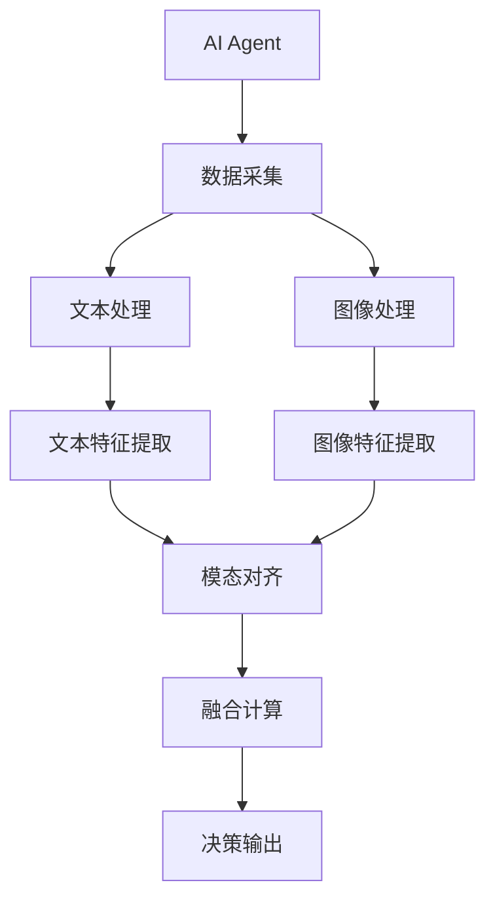

                 


# AI Agent的多模态融合技术：提升理解深度

> 关键词：AI Agent、多模态融合、自然语言处理、计算机视觉、深度学习、数据融合

> 摘要：本文探讨了AI Agent中的多模态融合技术，通过分析其核心概念、算法原理、系统架构及项目实战，展示了如何通过多模态数据的融合提升AI Agent的理解深度。文章结合实际案例和数学模型，深入浅出地讲解了多模态融合的关键技术及其应用。

---

## 第一部分: AI Agent与多模态融合概述

### 第1章: AI Agent与多模态融合概述

#### 1.1 AI Agent的基本概念
- **AI Agent的定义与特点**  
  AI Agent（人工智能代理）是指能够感知环境、自主决策并执行任务的智能实体。其特点包括自主性、反应性、目标导向和学习能力。

- **多模态数据的定义与特点**  
  多模态数据指的是来自不同感官渠道的数据，如文本、图像、语音、视频和传感器数据。这些数据具有异构性、互补性和冗余性的特点。

- **多模态融合的意义与目标**  
  多模态融合旨在将来自不同模态的数据进行综合处理，以提升AI Agent的理解能力和决策精度。目标包括提高准确性、增强鲁棒性和扩展应用场景。

#### 1.2 多模态融合技术的背景与应用
- **多模态数据的来源与类型**  
  文本数据（如对话、文档）、图像数据（如照片、图表）、语音数据（如录音、语音命令）、视频数据（如监控录像）、传感器数据（如温度、湿度）。

- **多模态融合技术的背景**  
  随着AI技术的发展，单一模态的数据处理已难以满足复杂场景的需求，多模态融合技术应运而生。

- **多模态融合技术的应用领域**  
  包括智能助手、自动驾驶、机器人控制、医疗诊断、虚拟现实和安防监控等领域。

---

## 第二部分: 多模态融合的核心概念与技术原理

### 第2章: 多模态融合的核心概念

#### 2.1 多模态融合的基本原理
- **多模态数据的特征提取**  
  通过编码器将不同模态的数据转换为统一的特征表示。

- **模态对齐与融合策略**  
  模态对齐是将不同模态的数据对齐到同一语义空间的过程，融合策略则决定如何将这些特征结合起来。

- **融合结果的评估与优化**  
  使用准确率、召回率、F1分数等指标评估融合效果，并通过优化算法提升性能。

#### 2.2 多模态融合的关键技术
- **特征提取与表示学习**  
  使用深度学习模型（如CNN、RNN）提取特征，并通过对比学习进一步优化表示。

- **模态对齐方法**  
  包括基于相似度的对齐、基于注意力机制的对齐和基于对抗网络的对齐。

- **融合策略的选择与实现**  
  根据任务需求选择加权融合、注意力融合或图结构融合等策略。

#### 2.3 多模态融合的数学模型
- **线性组合模型**  
  $$ y = w_1 x_1 + w_2 x_2 + \dots + w_n x_n $$
  其中，$w_i$是模态$i$的权重，$x_i$是模态$i$的特征，$y$是融合结果。

- **注意力机制模型**  
  $$ \alpha_i = \frac{\exp(a_i)}{\sum_j \exp(a_j)} $$
  其中，$\alpha_i$是模态$i$的注意力权重，$a_i$是注意力得分。

- **图神经网络模型**  
  使用图结构表示多模态数据，通过GCN（图卷积网络）或GAT（图注意力网络）进行融合。

---

## 第三部分: 多模态融合的算法实现

### 第3章: 传统多模态融合算法

#### 3.1 基于特征融合的传统算法
- **加权平均法**  
  通过设定各模态的权重，将特征线性组合。

- **主成分分析（PCA）**  
  对多模态数据进行降维，提取共同主成分。

- **K近邻（KNN）**  
  在特征空间中找到相似的数据点进行融合。

#### 3.2 基于模型融合的传统算法
- **Stacking**  
  使用多个基模型的输出作为输入，构建元模型进行预测。

- **Voting**  
  在多个基模型中投票决定最终结果。

- **Averaging**  
  对多个基模型的输出取平均值。

#### 3.3 算法实现步骤
1. 数据预处理：归一化、降维。
2. 特征提取：使用CNN、RNN提取各模态特征。
3. 模态对齐：使用注意力机制对齐特征。
4. 融合计算：选择融合策略，计算融合结果。
5. 结果输出：输出最终的融合结果。

---

## 第四部分: 系统分析与架构设计

### 第4章: 系统分析与架构设计

#### 4.1 问题场景介绍
- 系统需要处理多模态数据，如用户输入的文本和图像，生成准确的响应。

#### 4.2 系统功能设计
- 数据采集模块：采集多模态数据。
- 数据预处理模块：清洗和归一化数据。
- 融合模块：对齐和融合多模态特征。
- 决策模块：基于融合结果生成响应。

#### 4.3 系统架构设计


#### 4.4 接口设计与交互流程
- 接口设计：RESTful API，用于接收多模态数据和返回融合结果。
- 交互流程：用户输入查询，系统处理并返回结果。

---

## 第五部分: 项目实战

### 第5章: 项目实战

#### 5.1 环境安装
- 安装必要的库：Python、TensorFlow、Keras、OpenCV、Pillow。

#### 5.2 核心代码实现
```python
import numpy as np
from tensorflow.keras.layers import Input, Dense, concatenate
from tensorflow.keras.models import Model

# 定义输入层
input_text = Input(shape=(100,))
input_image = Input(shape=(64,64,3))

# 特征提取
text_features = Dense(32, activation='relu')(input_text)
image_features = Dense(32, activation='relu')(input_image)

# 模态对齐
combined = concatenate([text_features, image_features])

# 融合计算
output = Dense(1, activation='sigmoid')(combined)

# 定义模型
model = Model(inputs=[input_text, input_image], outputs=output)
model.compile(optimizer='adam', loss='binary_crossentropy', metrics=['accuracy'])
```

#### 5.3 案例分析
- 使用训练好的模型处理输入的文本和图像数据，生成融合结果。

#### 5.4 项目总结
- 总结项目实现的过程和结果，分析遇到的挑战和解决方案。

---

## 第六部分: 总结与展望

### 第6章: 总结与展望

#### 6.1 本章小结
- 多模态融合技术通过整合多种数据源，显著提升了AI Agent的理解和决策能力。

#### 6.2 未来发展方向
- 更高效的数据融合方法：如自适应对齐和动态融合。
- 更智能的多模态模型：如基于Transformer的多模态架构。
- 更广泛的应用场景：如元宇宙和增强现实中的多模态交互。

#### 6.3 最佳实践 tips
- 根据任务需求选择合适的融合策略。
- 使用预训练模型加速特征提取。
- 定期优化模型参数以提升性能。

#### 6.4 拓展阅读
- 推荐书籍：《Deep Learning》、《Pattern Recognition and Machine Learning》。
- 推荐论文：多模态融合的经典论文和最新研究成果。

---

通过以上结构，本文系统地介绍了AI Agent的多模态融合技术，从理论到实践，为读者提供了全面的知识框架。希望读者能够通过本文深入理解多模态融合的核心技术，并在实际应用中灵活运用。

