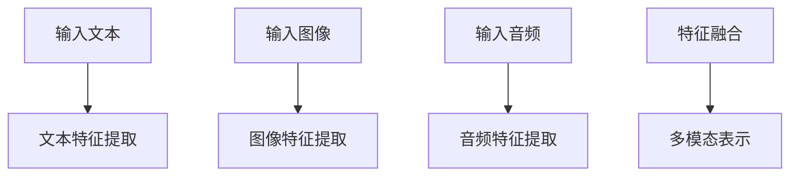
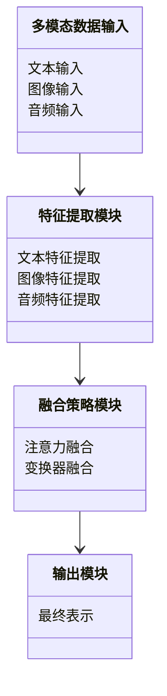

                 


# AI Agent的多模态融合：整合文本、图像和音频输入

## 关键词
多模态融合、AI Agent、文本数据、图像数据、音频数据、注意力机制、变换器

## 摘要
多模态数据整合是AI Agent技术发展的重要方向，通过整合文本、图像和音频等多种数据类型，AI Agent能够更全面地理解和处理复杂场景中的信息。本文从多模态融合的核心概念出发，详细探讨了多模态数据的特点、融合算法的原理，以及系统架构设计，并通过具体案例展示了多模态融合的实际应用。通过本文的学习，读者能够深入了解如何将文本、图像和音频数据有效融合，提升AI Agent的智能水平。

---

## 第一部分: AI Agent的多模态融合概述

### 第1章: 多模态融合的背景与意义

#### 1.1 多模态数据的定义与特点
多模态数据是指多种数据形式的组合，常见的多模态数据包括文本、图像、音频、视频等。多模态数据的特点如下：
- **异构性**：不同数据类型具有不同的特征和表示方式。
- **互补性**：不同数据类型能够相互补充，提供更全面的信息。
- **复杂性**：多模态数据的整合需要处理不同类型数据的异构性和复杂性。

#### 1.2 多模态融合在AI Agent中的应用价值
AI Agent需要处理复杂的现实场景，多模态数据的整合能够显著提升其智能水平。例如：
- **智能问答系统**：结合文本和音频数据，提供更准确的语义理解。
- **智能安防系统**：结合图像和音频数据，实现更精准的目标识别。

#### 1.3 多模态融合的挑战
多模态融合面临以下挑战：
- **数据异构性**：不同数据类型之间的特征维度和表示方式差异较大。
- **信息冗余**：多模态数据中可能存在冗余信息，如何有效提取有用信息是关键。
- **计算复杂度**：多模态数据的处理需要较高的计算资源。

### 第2章: 多模态融合的核心概念与联系

#### 2.1 多模态数据的属性特征对比
以下是对文本、图像和音频数据的属性特征对比：

| 数据类型 | 特征维度 | 数据表示 | 时间/空间维度 |
|----------|----------|----------|--------------|
| 文本      | 单一维度 | 离散值   | 离散         |
| 图像      | 多维（二维） | 连续值   | 空间         |
| 音频      | 单一维度 | 离散值   | 时间         |

#### 2.2 多模态融合的实体关系图
```mermaid
er
actor: 用户
agent: AI Agent
text_data: 文本数据
image_data: 图像数据
audio_data: 音频数据
```

#### 2.3 多模态融合的算法框架


---

## 第二部分: 多模态融合的算法原理

### 第3章: 多模态注意力机制

#### 3.1 注意力机制的定义
注意力机制是一种用于处理序列数据的方法，通过计算不同位置的重要性权重，提升模型对关键信息的关注。

#### 3.2 多模态注意力机制的实现
多模态注意力机制结合了不同数据类型的信息，通过交叉注意力计算，实现多模态数据的协同表示。

#### 3.3 多模态注意力机制的数学公式
$$\text{Attention}(Q, K, V) = \text{softmax}(\frac{QK^T}{\sqrt{d_k}})V$$

### 第4章: 多模态变换器

#### 4.1 变换器的定义
变换器是一种基于自注意力机制的深度学习模型，适用于处理序列数据。

#### 4.2 多模态变换器的结构
多模态变换器结合了多模态数据的特征，通过自注意力机制实现多模态信息的融合。

#### 4.3 多模态变换器的数学模型
$$\text{FFN}(x) = \text{ReLU}(W_1x + b_1)W_2 + b_2$$

---

## 第三部分: 多模态融合的系统架构设计

### 第5章: 多模态融合系统的架构

#### 5.1 系统功能模块


### 第6章: 多模态融合系统的接口设计

#### 6.1 系统接口定义
系统接口包括数据输入接口、特征提取接口、融合策略接口和输出接口。

#### 6.2 系统接口的交互流程
```mermaid
sequenceDiagram
actor 用户
agent

用户->>agent: 提供文本、图像和音频数据
agent->>特征提取模块: 提取文本、图像和音频特征
特征提取模块->>融合策略模块: 融合特征
融合策略模块->>输出模块: 输出多模态表示
agent->>用户: 返回结果
```

---

## 第四部分: 多模态融合的项目实战

### 第7章: 多模态问答系统

#### 7.1 项目环境安装
```bash
pip install numpy
pip install tensorflow
pip install matplotlib
```

#### 7.2 核心代码实现
```python
import numpy as np
import tensorflow as tf

def text_feature_extraction(text):
    # 文本特征提取代码
    return text_embeddings

def image_feature_extraction(image):
    # 图像特征提取代码
    return image_embeddings

def audio_feature_extraction(audio):
    # 音频特征提取代码
    return audio_embeddings

def multimodal_attention(Q, K, V):
    # 注意力机制代码
    return attention_output

def multimodal_transformer(x):
    # 变换器代码
    return transformer_output
```

#### 7.3 代码功能解读
- `text_feature_extraction`：文本特征提取函数，将输入文本转换为向量表示。
- `image_feature_extraction`：图像特征提取函数，将输入图像转换为向量表示。
- `audio_feature_extraction`：音频特征提取函数，将输入音频转换为向量表示。
- `multimodal_attention`：多模态注意力机制函数，实现特征的融合。
- `multimodal_transformer`：多模态变换器函数，实现特征的深度学习融合。

#### 7.4 实际案例分析
通过实际案例分析，展示多模态问答系统的实现流程和性能优化方法。

---

## 第五部分: 最佳实践

### 第8章: 小结与注意事项

#### 8.1 小结
多模态融合是AI Agent技术的重要组成部分，通过整合文本、图像和音频等多种数据类型，能够显著提升AI Agent的智能水平。

#### 8.2 注意事项
- 数据预处理：确保多模态数据的预处理步骤一致。
- 特征提取：选择合适的特征提取方法，确保特征的可比性和有效性。
- 算法优化：通过参数调节和模型优化，提升多模态融合的效果。

### 第9章: 拓展阅读

#### 9.1 推荐书籍
- 《Deep Learning》
- 《Attention Is All You Need》

#### 9.2 推荐论文
- "A Transformer-Based Framework for Multimodal Understanding"
- "Multimodal Fusion Networks for Image-to-Text Retrieval"

---

通过本文的学习，读者能够深入了解多模态融合的核心概念、算法原理和系统架构设计，并通过实际案例掌握多模态融合的实现方法。多模态融合技术的应用将为AI Agent的发展注入新的活力，推动人工智能技术的进一步创新。

