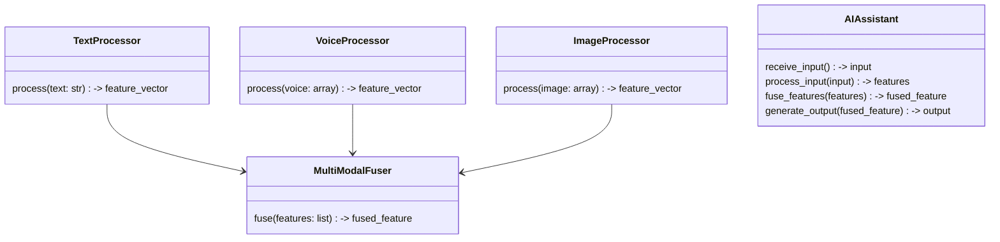
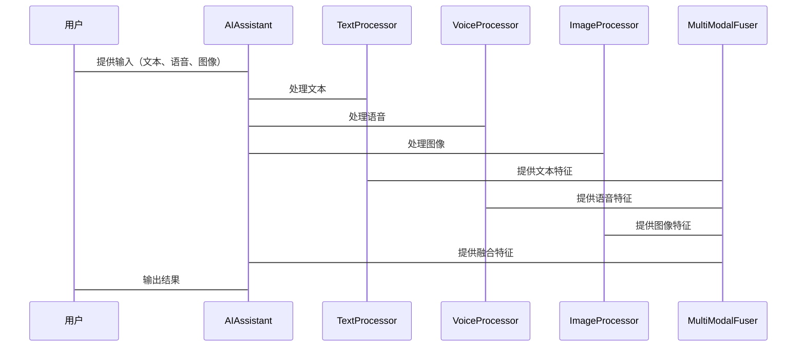

                 


# AI Agent的多模态输入处理：文本、语音和图像的整合

**关键词**：AI Agent，多模态输入，文本处理，语音处理，图像处理，融合算法，系统架构

**摘要**：本文深入探讨了AI Agent如何整合文本、语音和图像三种模态的输入数据，分析了多模态数据的特征与融合方法，详细讲解了基于注意力机制的多模态融合算法，结合系统架构设计与项目实战，展示了如何实现一个多模态AI Agent系统，最后给出了最佳实践建议。

---

## 第二部分: 多模态数据的特征与融合方法

## 第4章: 多模态数据的特征分析

### 4.1 文本数据的特征分析

#### 4.1.1 文本数据的结构特点

文本数据是AI Agent处理的重要输入之一，具有以下特点：

- **序列性**：文本数据通常以序列形式出现，例如句子、段落等。
- **语义丰富性**：文本数据可以通过上下文和语法规则传达复杂的语义信息。
- **多样性**：文本数据可以是任何形式，如新闻、对话、社交媒体帖子等。

#### 4.1.2 文本数据的预处理方法

为了有效处理文本数据，通常需要进行以下预处理步骤：

1. **分词**：将文本分割成单词或短语。
2. **去除停用词**：移除常见但无实际意义的词汇，如“的”、“是”等。
3. **词干提取或词形还原**：将词汇标准化，例如将“running”还原为“run”。
4. **向量化**：将文本数据转换为数值表示，例如使用词袋模型、TF-IDF或词嵌入（如Word2Vec、GloVe）。

#### 4.1.3 文本数据的情感分析

情感分析是文本处理中的一个重要任务，用于判断文本的情感倾向（如正面、负面或中性）。常用的方法包括基于规则的分析、机器学习模型（如SVM、随机森林）和深度学习模型（如LSTM、Transformer）。

**示例**：
给定文本：“这部电影太棒了！”，情感分析算法可以识别出情感为正面。

### 4.2 语音数据的特征分析

#### 4.2.1 语音数据的声学特征

语音数据的特征主要包括：

- **音调**：语音的高低变化，反映了说话的情感。
- **音速**：语音的速度，快慢可以传达不同的情感。
- **音量**：语音的强弱，可以反映情绪的激烈程度。
- **停顿**：语音中的停顿可以表示思考或强调。

#### 4.2.2 语音数据的语调分析

语调分析是通过分析语音的音调变化来识别情感或意图。例如：

- **上升调**：通常表示疑问或不确定性。
- **下降调**：通常表示肯定或结束。

#### 4.2.3 语音数据的噪声处理

在实际应用中，语音数据通常会受到噪声的干扰，如背景音乐、环境噪音等。为了提高语音识别的准确性，需要进行降噪处理，常用的方法包括：

- **滤波器方法**：如高通滤波器用于去除低频噪声。
- **统计方法**：如基于马尔可夫模型的语音增强。
- **深度学习方法**：如使用卷积神经网络（CNN）进行降噪。

### 4.3 图像数据的特征分析

#### 4.3.1 图像数据的视觉特征

图像数据的视觉特征包括：

- **颜色**：图像的颜色分布，如RGB值。
- **纹理**：图像表面的细节结构，如边缘检测。
- **形状**：图像中的物体形状和轮廓。
- **光照**：图像的亮度和对比度。

#### 4.3.2 图像数据的边缘检测

边缘检测是图像处理中的关键步骤，用于识别图像中的边缘。常用的方法包括：

- **Canny边缘检测**：通过高斯滤波、计算梯度和非极大值抑制来检测边缘。
- **Sobel边缘检测**：基于一阶导数的边缘检测。

#### 4.3.3 图像数据的场景识别

场景识别是通过分析图像内容来识别场景类别，如室内、室外、自然景观等。常用的方法包括：

- **基于区域的卷积神经网络（R-CNN）**：通过候选区域生成和分类实现场景识别。
- **基于图像分割的场景识别**：通过分割图像来识别不同区域的内容。

---

## 第5章: 多模态数据的融合方法

### 5.1 基于特征融合的方法

#### 5.1.1 特征级融合的定义

特征级融合是指在将不同模态的数据转换为特征向量后，将这些特征向量进行融合。常见的特征级融合方法包括：

1. **简单相加**：将不同模态的特征向量相加。
2. **加权融合**：根据模态的重要性对特征向量进行加权后相加。
3. **拼接融合**：将不同模态的特征向量拼接成一个长向量。

#### 5.1.2 常见的特征融合技术

- **线性组合**：$ y = w_1x_1 + w_2x_2 + \dots + w_nx_n $，其中$ w_i $是权重系数，$ x_i $是不同模态的特征。
- **注意力机制**：通过计算不同模态的重要性，动态调整特征的权重。
- **多模态编码器**：使用编码器将不同模态的数据编码为统一的表示。

#### 5.1.3 特征融合的优缺点

| 特性 | 优点 | 缺点 |
|------|------|------|
| 简单相加 | 实现简单 | 可能忽略模态之间的关联 |
| 加权融合 | 可以根据模态的重要性进行调整 | 需要手动设置权重 |
| 拼接融合 | 保留了不同模态的信息 | 可能导致维度灾难 |

### 5.2 基于决策融合的方法

决策融合是在对不同模态的数据分别进行处理后，将结果进行融合。常见的决策融合方法包括：

1. **投票法**：多个模态的结果进行投票，选择多数结果。
2. **加权投票法**：根据模态的重要性进行加权投票。
3. **融合规则**：根据特定规则进行结果融合。

---

## 第6章: 基于注意力机制的多模态融合算法

### 6.1 注意力机制的原理

注意力机制是一种模仿人类注意力的机制，用于在处理多模态数据时，关注更重要的部分。其核心思想是为每个输入数据分配一个注意力权重，表示该部分的重要性。

数学模型如下：

$$ \alpha_i = \frac{e^{score(x_i)}}{\sum_{j=1}^{n}e^{score(x_j)}} $$

其中，$ score(x_i) $是通过某种方式计算出的相似度或相关性，$\alpha_i$是注意力权重。

### 6.2 基于注意力机制的多模态融合算法

#### 6.2.1 算法步骤

1. **输入预处理**：将文本、语音和图像数据分别进行预处理，提取特征向量。
2. **计算注意力权重**：通过计算每个模态的注意力权重，确定每个模态的重要性。
3. **融合特征向量**：根据注意力权重对特征向量进行加权融合。
4. **输出结果**：将融合后的特征向量输入到分类器或生成器中，输出最终结果。

#### 6.2.2 代码实现

```python
import numpy as np

def compute_attention(x, y, z):
    # x: 文本特征向量
    # y: 语音特征向量
    # z: 图像特征向量
    # 计算相似度
    similarity = np.dot(x, y.T) + np.dot(y, z.T) + np.dot(z, x.T)
    # 计算注意力权重
    alpha = np.exp(similarity) / np.sum(np.exp(similarity))
    return alpha

def multi_modal_fusion(x, y, z):
    alpha = compute_attention(x, y, z)
    # 融合特征向量
    fused_feature = alpha * (x + y + z)
    return fused_feature
```

### 6.3 算法的数学模型

融合后的特征向量可以表示为：

$$ f = \sum_{i=1}^{3} \alpha_i x_i $$

其中，$\alpha_i$是注意力权重，$x_i$是不同模态的特征向量。

---

## 第7章: 系统分析与架构设计

### 7.1 系统功能设计

#### 7.1.1 领域模型（Mermaid 类图）



---

### 7.2 系统架构设计

#### 7.2.1 系统架构图（Mermaid 架构图）

```mermaid
container 多模态AI Agent系统 {
    AIAssistant
    TextProcessor
    VoiceProcessor
    ImageProcessor
    MultiModalFuser
}
AIAssistant --> TextProcessor
AIAssistant --> VoiceProcessor
AIAssistant --> ImageProcessor
TextProcessor --> MultiModalFuser
VoiceProcessor --> MultiModalFuser
ImageProcessor --> MultiModalFuser
MultiModalFuser --> AIAssistant
```

---

### 7.3 系统接口设计

系统接口设计包括：

1. **输入接口**：接收文本、语音和图像输入。
2. **特征提取接口**：对输入数据进行特征提取。
3. **融合接口**：将不同模态的特征向量进行融合。
4. **输出接口**：输出融合后的结果。

---

### 7.4 系统交互流程（Mermaid 序列图）



---

## 第8章: 项目实战

### 8.1 环境安装

需要安装以下库：

```bash
pip install numpy
pip install matplotlib
pip install scikit-learn
pip install transformers
pip install soundfile
pip install opencv-python
```

---

### 8.2 系统核心实现源代码

#### 8.2.1 文本处理代码

```python
import transformers
from transformers import AutoTokenizer, AutoModel

tokenizer = AutoTokenizer.from_pretrained('bert-base-chinese')
model = AutoModel.from_pretrained('bert-base-chinese')

def text_feature_extraction(text):
    inputs = tokenizer(text, return_tensors='np')
    outputs = model(**inputs)
    features = outputs.last_hidden_state[:, 0, :]
    return features
```

#### 8.2.2 语音处理代码

```python
import soundfile as sf
import numpy as np

def voice_feature_extraction(audio_path):
    audio, _ = sf.read(audio_path)
    # 计算语音特征，如梅尔频率倒谱系数（MFCC）
    mfcc = librosa.feature.mfcc(y=audio, sr=_)
    return mfcc.T
```

#### 8.2.3 图像处理代码

```python
import cv2

def image_feature_extraction(image_path):
    img = cv2.imread(image_path)
    # 计算图像特征，如HOG特征
    hog = cv2.HOGDescriptor()
    features = hog.compute(img)
    return features
```

---

### 8.3 代码应用解读与分析

- **文本处理代码**：使用BERT模型提取文本特征，返回一个二维数组，其中每一行对应一个词的特征向量。
- **语音处理代码**：使用 librosa 库计算MFCC特征，返回一个二维数组，其中每一行对应一个时间点的特征向量。
- **图像处理代码**：使用 OpenCV 库计算HOG特征，返回一个二维数组，其中每一行对应一个特征向量。

---

### 8.4 实际案例分析

假设我们有一个多模态AI Agent系统，需要处理以下输入：

1. 文本输入：“今天天气很好，我们去公园吧。”
2. 语音输入：带有愉悦情绪的语音片段。
3. 图像输入：公园的图片。

通过上述代码，我们可以分别提取文本、语音和图像的特征向量，然后将它们融合在一起，得到一个统一的特征向量，用于进一步的分类或生成任务。

---

### 8.5 项目小结

通过本章的项目实战，我们了解了如何将理论应用于实际项目中，包括环境安装、特征提取、融合算法实现和系统交互设计。这为我们后续的开发和优化提供了坚实的基础。

---

## 第9章: 总结与展望

### 9.1 总结

本文详细介绍了AI Agent的多模态输入处理，包括文本、语音和图像的特征分析、融合方法、算法实现和系统架构设计。通过理论分析和项目实战，我们掌握了多模态数据处理的核心技术。

### 9.2 展望

未来，随着深度学习技术的不断发展，多模态数据处理将更加智能化和高效化。我们可以探索更多先进的融合方法，如基于变换器的多模态编码器、自监督学习等，以提升AI Agent的性能和用户体验。

### 9.3 最佳实践 Tips

1. 在处理多模态数据时，首先要确保各模态数据的质量，如文本的准确性和语音图像的清晰度。
2. 根据具体应用场景选择合适的特征提取和融合方法。
3. 在系统设计中，尽量采用模块化设计，方便后续的优化和扩展。

### 9.4 注意事项

- 多模态数据处理需要多学科知识的结合，需要团队协作。
- 在实际应用中，要注意数据隐私和安全问题。
- 融合算法的选择要根据具体任务需求，不能一味追求复杂性。

### 9.5 拓展阅读

1. 变换器（Transformer）在多模态处理中的应用。
2. 自监督学习在多模态数据处理中的应用。
3. 图神经网络在多模态数据融合中的应用。

---

**结束语**：希望通过本文的学习，读者能够对AI Agent的多模态输入处理有一个全面的了解，并能够将其应用到实际项目中，开发出更智能、更高效的AI系统。

