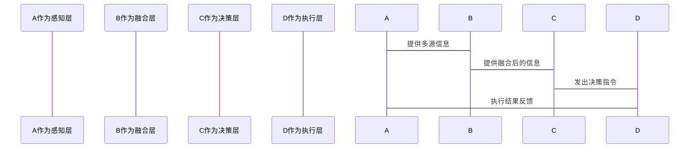

                 


# AI Agent的多源信息融合与决策技术

**关键词**：AI Agent，多源信息融合，决策技术，数据融合，智能系统设计

**摘要**：  
本文系统探讨了AI Agent在多源信息融合与决策技术中的核心原理、算法实现及系统设计。首先，介绍了AI Agent的基本概念及其在多源信息融合中的重要作用。接着，详细分析了多源信息融合的核心技术，包括基于统计、知识和学习的融合方法。随后，重点阐述了多源信息融合的数学模型与算法流程，结合实际案例展示了AI Agent如何通过多源信息融合实现智能决策。最后，总结了多源信息融合技术在AI Agent中的应用价值及未来发展方向。

---

# 第一部分: AI Agent与多源信息融合概述

## 第1章: AI Agent的基本概念

### 1.1 AI Agent的定义与特点
AI Agent（智能体）是指在计算机系统中，能够感知环境、自主决策并执行任务的实体。其核心特点包括：
1. **自主性**：无需外部干预，自主完成任务。
2. **反应性**：能够实时感知环境并做出反应。
3. **目标导向性**：基于目标驱动行为。
4. **学习能力**：通过经验改进性能。

**AI Agent的分类**：
- **简单反射型Agent**：基于当前感知做出反应。
- **基于模型的反射型Agent**：利用内部模型进行决策。
- **目标驱动型Agent**：以目标为导向进行决策。
- **效用驱动型Agent**：基于效用函数优化决策。

---

### 1.2 多源信息融合的定义与意义
多源信息融合是指将来自不同来源、异构形式的信息进行整合，以提高信息准确性和可靠性的过程。其意义在于：
1. **消除信息冗余**：通过融合去除重复信息，提高决策效率。
2. **提升信息质量**：整合多源信息，降低不确定性。
3. **增强系统鲁棒性**：通过多源信息互补，提高系统抗干扰能力。

---

## 第2章: 多源信息融合的核心技术

### 2.1 多源信息融合的层次与流程
多源信息融合的层次包括：
1. **数据级融合**：在原始数据层面进行融合。
2. **特征级融合**：在数据特征层面进行融合。
3. **决策级融合**：在决策结果层面进行融合。

融合流程通常包括：
1. **数据预处理**：清洗、归一化等。
2. **特征提取**：提取关键特征。
3. **融合计算**：通过算法进行信息融合。
4. **结果优化**：优化融合结果。

---

# 第二部分: 多源信息融合的技术实现

## 第3章: 多源信息融合的算法原理

### 3.1 基于统计的融合方法
#### 3.1.1 贝叶斯网络模型
贝叶斯网络是一种概率图模型，通过条件概率表征变量之间的依赖关系。其核心公式为：
$$ P(A|B) = \frac{P(B|A)P(A)}{P(B)} $$

#### 3.1.2 证据推理方法
证据推理是一种基于不确定性推理的方法，通过 Dempster-Shafer 理论进行信息融合。其核心公式为：
$$ Bel(a) = \sum_{B \subseteq A, a \in B} m(B) $$

#### 3.1.3 融合权重的统计方法
通过计算各信息源的权重，进行加权融合：
$$ w_i = \frac{1}{\sum_{j=1}^{n} |x_i - x_j|} $$

---

### 3.2 基于知识的融合方法
#### 3.2.1 知识图谱构建
通过构建知识图谱，将多源信息映射到统一的知识空间中。

#### 3.2.2 基于规则的融合方法
通过预定义规则进行信息融合，例如：
$$ 如果 A 和 B 都支持 C，则 C 的概率增加。 $$

#### 3.2.3 基于语义理解的融合方法
利用自然语言处理技术，理解文本语义并进行信息融合。

---

## 第4章: 多源信息融合的数学模型与公式

### 4.1 基于概率论的融合模型
#### 4.1.1 贝叶斯公式
$$ P(A|B) = \frac{P(B|A)P(A)}{P(B)} $$

#### 4.1.2 融合权重计算公式
$$ w_i = \frac{1}{\sum_{j=1}^{n} |x_i - x_j|} $$

---

# 第三部分: AI Agent的决策技术

## 第5章: 决策技术的核心原理

### 5.1 决策模型的构建
决策模型是基于多源信息融合结果，制定最优决策的过程。常用的决策模型包括：
1. **马尔可夫决策过程**：基于状态转移进行决策。
2. **强化学习模型**：通过试错优化决策策略。
3. **基于规则的决策模型**：通过预定义规则进行决策。

---

### 5.2 决策优化方法
#### 5.2.1 强化学习优化
通过强化学习算法（如Q-learning）优化决策策略：
$$ Q(s, a) = r + \gamma \max_{a'} Q(s', a') $$

#### 5.2.2 动态规划优化
通过动态规划方法优化决策路径：
$$ V(s) = \max_{a} [r + V(s')] $$

---

## 第6章: AI Agent的系统设计与实现

### 6.1 系统架构设计
AI Agent的系统架构通常包括：
1. **感知层**：负责信息采集。
2. **融合层**：负责多源信息融合。
3. **决策层**：负责制定决策。
4. **执行层**：负责执行决策。

---

### 6.2 系统交互流程
通过Mermaid序列图展示系统交互流程：



---

## 第7章: 项目实战与案例分析

### 7.1 环境安装与配置
安装必要的依赖：
```bash
pip install numpy matplotlib scikit-learn
```

### 7.2 核心代码实现
```python
import numpy as np
from sklearn.metrics import accuracy_score

# 示例：基于统计的多源信息融合
def fuse_data(data1, data2):
    # 加权融合
    weight1 = 0.7
    weight2 = 0.3
    fused = data1 * weight1 + data2 * weight2
    return fused

# 示例：决策优化
def optimize_decision(model, data):
    # 假设模型为分类器
    predicted = model.predict(data)
    accuracy = accuracy_score(y_true, predicted)
    return accuracy
```

### 7.3 案例分析
通过一个实际案例，展示如何通过多源信息融合提升AI Agent的决策能力。例如，在自动驾驶场景中，通过融合激光雷达、摄像头和IMU数据，优化车辆的路径规划。

---

## 第8章: 总结与展望

### 8.1 总结
本文详细探讨了AI Agent的多源信息融合与决策技术，从算法原理到系统设计，展示了其在实际应用中的巨大潜力。

### 8.2 展望
未来，随着AI技术的发展，多源信息融合技术将在以下几个方面进一步发展：
1. **边缘计算**：在边缘设备上进行实时信息融合。
2. **分布式系统**：在分布式环境中实现高效信息融合。
3. **强化学习**：结合强化学习进一步优化决策过程。

---

### 小结
通过本文的学习，读者可以全面了解AI Agent的多源信息融合与决策技术的核心原理和实现方法。希望本文能够为相关领域的研究和实践提供有价值的参考。

