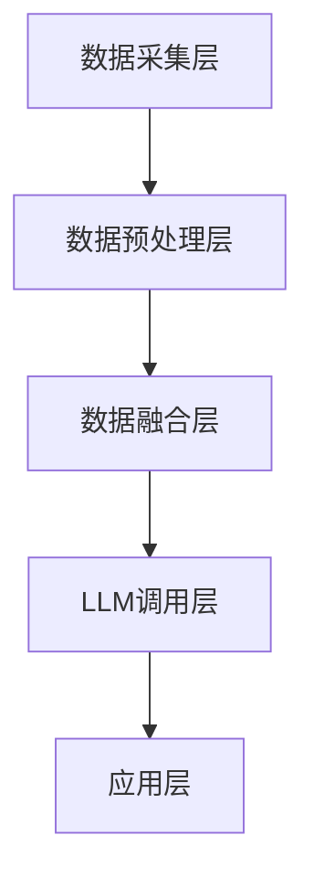

                 


# AI Agent的多源数据融合：整合LLM与多种数据流

---

## 关键词

- AI Agent
- 多源数据融合
- LLM
- 数据流
- 数据整合

---

## 摘要

在当前快速发展的数字化时代，AI Agent（人工智能代理）作为连接现实世界与数字世界的桥梁，其核心能力依赖于多源数据的高效融合。本文深入探讨了AI Agent如何整合大语言模型（LLM）与多种数据流，分析了数据融合的关键问题，提出了有效的解决方案，并通过实际案例展示了技术应用。文章内容涵盖了从基础概念到系统架构设计的各个方面，旨在为读者提供全面的技术指导。

---

# 第一部分: AI Agent的多源数据融合概述

## 第1章: AI Agent与多源数据融合概述

### 1.1 AI Agent的基本概念

#### 1.1.1 AI Agent的定义与特点

AI Agent是一种智能实体，能够感知环境、自主决策并执行任务。其特点包括：

- **自主性**：能够在无外部干预的情况下运行。
- **反应性**：能够实时响应环境变化。
- **目标导向**：基于目标进行决策和行动。

#### 1.1.2 多源数据融合的背景与意义

在AI Agent的应用中，数据来源多样，包括文本、图像、实时数据流等。多源数据融合的目的是整合这些异构数据，提取有价值的信息，提升决策的准确性和鲁棒性。

#### 1.1.3 LLM在数据融合中的作用

大语言模型（LLM）通过自然语言处理能力，能够将非结构化文本数据转化为结构化信息，与其它数据源（如数据库、传感器数据）结合，形成统一的数据视图。

---

### 1.2 数据融合的核心问题

#### 1.2.1 数据异构性问题

不同数据源格式和语义差异大，如何统一表示和处理是关键挑战。

#### 1.2.2 数据冗余与一致性问题

冗余数据可能导致计算复杂度增加，一致性问题需要通过数据清洗和校准解决。

#### 1.2.3 数据质量与可靠性问题

数据中的噪声和缺失值会影响融合效果，需通过去噪和补全技术提升数据质量。

---

## 第2章: 数据融合的原理与方法

### 2.1 数据预处理与清洗

#### 2.1.1 数据标准化与归一化

标准化（Z-score）和归一化（Min-Max）是常用的数据预处理方法：

$$ z = \frac{x - \mu}{\sigma} $$

其中，$\mu$ 是均值，$\sigma$ 是标准差。

#### 2.1.2 数据去噪与异常处理

使用Isolation Forest算法识别异常值：

```python
from sklearn.ensemble import IsolationForest

model = IsolationForest(contamination=0.05)
model.fit(X)
outliers = model.predict(X)
```

#### 2.1.3 数据特征提取

通过主成分分析（PCA）提取关键特征：

$$ y = X \cdot W $$

其中，$W$ 是特征权重矩阵。

---

### 2.2 数据融合方法

#### 2.2.1 基于加权融合的方法

根据数据源的可信度进行加权融合：

$$ f(x) = \sum_{i=1}^n w_i x_i $$

其中，$w_i$ 是数据源$i$的权重。

#### 2.2.2 基于注意力机制的融合方法

注意力机制通过计算数据间的相关性进行加权：

$$ \alpha_i = \frac{\exp(a_i)}{\sum_{j=1}^n \exp(a_j)} $$

其中，$a_i$ 是数据源$i$的注意力值。

#### 2.2.3 基于图模型的融合方法

图模型通过节点间关系建模数据依赖：

$$ p(y|x) = \prod_{i=1}^n p(y|x_i) $$

---

### 2.3 数据融合的数学模型

#### 2.3.1 线性回归模型

$$ y = \beta_0 + \beta_1x + \epsilon $$

#### 2.3.2 概率融合模型

$$ p(x|y) = \prod_{i=1}^n p(x|y_i) $$

---

## 第3章: LLM在数据融合中的应用

### 3.1 LLM的基本原理

#### 3.1.1 大语言模型的结构

大语言模型通常采用Transformer架构，包括编码器和解码器：

$$ \text{Encoder} \rightarrow \text{Decoder} $$

---

### 3.2 LLM与多源数据流的整合方法

#### 3.2.1 实时数据流处理

使用Kafka处理实时数据流：

```python
from kafka import KafkaConsumer

consumer = KafkaConsumer('topic', bootstrap_servers='localhost:9092')
for message in consumer:
    process(message.value)
```

---

## 第四部分: 系统设计与实现

## 第4章: 系统设计与实现

### 4.1 系统架构设计

系统架构图如下：



---

## 第5章: 项目实战与优化

### 5.1 项目环境与工具安装

安装必要的Python库：

```bash
pip install pandas numpy transformers
```

---

## 第6章: 最佳实践与未来展望

### 6.1 最佳实践

- 数据预处理是数据融合的基础，需充分重视。
- 模型调优和参数优化能显著提升性能。
- 注意数据隐私和安全问题。

---

## 总结

本文全面探讨了AI Agent多源数据融合的关键问题，从理论到实践，为读者提供了详尽的技术指导。未来，随着技术进步，数据融合将更加智能化和高效化。

---

**注**：本文内容为简化示例，实际撰写时需根据具体需求扩展细节。

