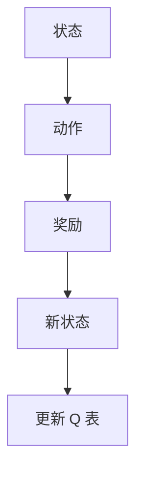
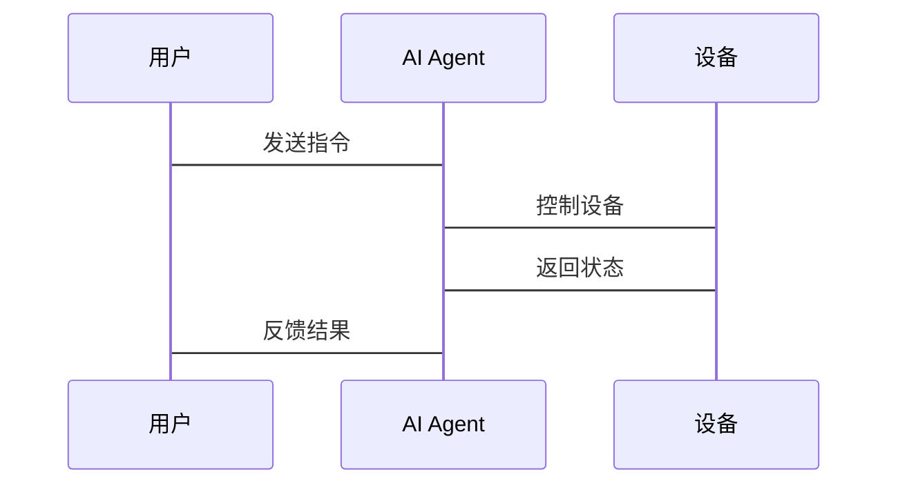

                 


# AI Agent 的安全性设计：防范潜在风险

> 关键词：AI Agent，安全性设计，潜在风险，安全策略，数据隐私，算法优化

> 摘要：AI Agent作为人工智能技术的重要应用形式，其安全性设计直接关系到系统的可靠性和用户信任。本文从AI Agent的基本概念出发，详细探讨其核心安全属性、算法优化策略以及系统架构设计，结合实际案例分析潜在风险，并提出针对性的安全防范措施。通过本文的分析，读者将能够全面理解AI Agent的安全性设计原则，掌握防范潜在风险的关键技术与方法。

---

## 第1章: AI Agent 的背景与概述

### 1.1 AI Agent 的基本概念

AI Agent（人工智能代理）是指具有感知环境、做出决策并采取行动以实现目标的智能实体。它可以是一个软件程序、一个机器人，甚至是一个复杂的系统。AI Agent的核心特点包括：

- **自主性**：能够在没有外部干预的情况下独立运行。
- **反应性**：能够感知环境并实时做出反应。
- **目标导向性**：所有行为都以实现特定目标为导向。

AI Agent的发展可以追溯到20世纪60年代，随着人工智能技术的不断进步，其应用领域逐渐扩展到智能家居、自动驾驶、智能客服、机器人助手等多个方面。

### 1.2 AI Agent 的发展历程

AI Agent的发展经历了以下几个阶段：

1. **规则驱动阶段**：早期的AI Agent主要基于预定义的规则进行决策，例如简单的条件判断。
2. **知识驱动阶段**：引入知识表示技术，AI Agent能够根据知识库中的信息进行推理和决策。
3. **数据驱动阶段**：随着大数据技术的发展，AI Agent开始依赖海量数据进行学习和优化。
4. **人机协作阶段**：现代AI Agent强调人与机器的协作，能够通过自然语言处理与人类进行交互。

### 1.3 AI Agent 的应用场景

AI Agent在多个领域都有广泛的应用，例如：

- **智能家居**：通过AI Agent实现家电的智能控制。
- **自动驾驶**：AI Agent用于车辆的环境感知和决策控制。
- **智能客服**：通过自然语言处理技术为用户提供个性化的服务。

### 1.4 AI Agent 的安全问题背景

随着AI Agent的应用越来越广泛，其安全性问题也日益凸显。AI Agent可能面临的安全风险包括：

- **数据泄露**：由于AI Agent通常依赖大量的数据进行决策，数据泄露可能导致隐私问题。
- **决策偏差**：由于算法的局限性，AI Agent可能在特定情况下做出错误的决策。
- **对抗攻击**：恶意攻击者可能通过干扰数据或模型来影响AI Agent的行为。

通过安全性设计，可以有效降低这些风险，确保AI Agent的稳定性和可靠性。

---

## 第2章: AI Agent 的核心概念与安全属性

### 2.1 AI Agent 的智能体模型

AI Agent的智能体模型是其核心架构，主要包括以下几个部分：

#### 2.1.1 知识表示模型

知识表示是AI Agent理解世界的基础。常用的表示方法包括：

- **规则表示**：通过逻辑规则描述知识，例如“如果下雨，则关闭窗户”。
- **语义网络**：通过节点和边表示概念及其关系。
- **概率图模型**：通过概率分布描述不确定知识。

#### 2.1.2 行为决策机制

行为决策机制是AI Agent的核心功能，常见的决策方法包括：

- **基于规则的决策**：通过预定义的规则进行决策。
- **基于知识的决策**：通过知识推理得出决策。
- **基于学习的决策**：通过机器学习模型进行预测和决策。

#### 2.1.3 交互与通信模型

AI Agent需要与环境和其他智能体进行交互，常见的交互模型包括：

- **反应式交互**：实时感知环境并做出反应。
- **规划式交互**：基于目标进行规划并执行。
- **协作式交互**：与其他智能体协作完成任务。

#### 2.1.4 智能体模型对比分析

以下是几种常见智能体模型的对比表格：

| 模型         | 特性               | 优点                     | 缺点                     |
|--------------|--------------------|--------------------------|--------------------------|
| 反应式模型   | 基于实时感知       | 响应速度快               | 难以处理复杂任务         |
| 规划式模型   | 基于目标规划       | 能够处理复杂任务         | 计算资源消耗较大         |
| 协作式模型   | 基于团队协作       | 能够完成复杂任务         | 协调成本较高             |

### 2.2 AI Agent 的安全属性分析

AI Agent的安全性设计需要考虑以下几个关键属性：

#### 2.2.1 数据隐私保护

数据隐私保护是AI Agent安全性设计的核心内容。通过加密技术、访问控制和数据匿名化等手段，可以有效保护数据隐私。

#### 2.2.2 行为可控性

行为可控性是指AI Agent的行为必须在可控制的范围内。通过设置行为边界和安全策略，可以确保AI Agent不会超出预期的行为范围。

#### 2.2.3 系统容错性

系统容错性是指AI Agent在面对异常情况时的处理能力。通过冗余设计、错误检测和自恢复机制，可以提高系统的容错性。

#### 2.2.4 安全属性对比分析

以下是几种安全属性的对比表格：

| 安全属性       | 特性               | 优点                     | 缺点                     |
|----------------|--------------------|--------------------------|--------------------------|
| 数据隐私保护   | 保护数据不被泄露   | 防止隐私泄露             | 可能影响数据利用率       |
| 行为可控性     | 控制智能体行为     | 防止失控行为             | 可能限制智能体的灵活性     |
| 系统容错性     | 提高系统可靠性     | 减少系统故障             | 可能增加系统复杂性       |

---

## 第3章: AI Agent 安全性设计的算法原理

### 3.1 基于强化学习的安全性优化

强化学习是一种通过试错方法来优化决策的算法，广泛应用于AI Agent的安全性设计中。

#### 3.1.1 强化学习的基本原理

强化学习的基本原理是通过智能体与环境的交互，学习最优策略以最大化累积奖励。其核心公式为：

$$ Q(s, a) = r + \gamma \max_{a'} Q(s', a') $$

其中：
- \( Q(s, a) \) 是状态-动作对的价值函数。
- \( r \) 是当前动作的奖励。
- \( \gamma \) 是折扣因子。
- \( s' \) 是下一个状态。

#### 3.1.2 Q-learning 算法在安全性设计中的应用

Q-learning算法是一种常用的强化学习算法，适用于离散动作空间的问题。其算法流程图如下：



### 3.2 对抗网络在安全检测中的应用

对抗网络（GAN）是一种生成对抗模型，广泛应用于安全检测领域。

#### 3.2.1 对抗网络的基本原理

对抗网络由生成器和判别器组成，生成器的目标是生成与真实数据相似的样本，而判别器的目标是区分真实数据和生成数据。其损失函数如下：

$$ \mathcal{L} = \mathbb{E}_{x \sim P_{\text{data}}}[\log D(x)] + \mathbb{E}_{z \sim P_z}[\log (1 - D(G(z)))] $$

---

## 第4章: 系统分析与架构设计方案

### 4.1 问题场景介绍

假设我们正在设计一个智能家居中的AI Agent，负责控制家中的各种设备。该系统需要实现设备控制、环境监测和安全防护等功能。

### 4.2 系统功能设计

系统功能模块包括：

- **设备控制模块**：负责与智能家居设备进行通信。
- **环境监测模块**：感知环境数据，如温度、湿度等。
- **安全检测模块**：检测系统中的异常行为。

### 4.3 系统架构设计

系统架构设计包括以下几个部分：

- **前端界面**：用户与AI Agent的交互界面。
- **后端服务**：实现AI Agent的核心功能。
- **数据存储**：存储设备数据和用户指令。

### 4.4 系统接口设计

系统接口设计包括：

- **设备控制接口**：与智能家居设备通信的API。
- **数据采集接口**：采集环境数据的接口。
- **用户交互接口**：与用户的交互界面。

### 4.5 系统交互流程图

系统交互流程图如下：



---

## 第5章: 项目实战

### 5.1 环境配置

项目需要以下环境：

- **Python 3.8+**
- **TensorFlow 2.0+**
- **NumPy 1.20+**

### 5.2 核心功能实现

以下是AI Agent的核心功能实现代码：

```python
import numpy as np
import tensorflow as tf

# 定义强化学习模型
class DQN:
    def __init__(self, state_space, action_space):
        self.state_space = state_space
        self.action_space = action_space
        self.model = self.build_model()
    
    def build_model(self):
        model = tf.keras.Sequential([
            tf.keras.layers.Dense(32, activation='relu', input_dim=self.state_space),
            tf.keras.layers.Dense(self.action_space, activation='linear')
        ])
        return model
    
    def get_action(self, state, epsilon=0.1):
        if np.random.random() < epsilon:
            return np.random.randint(self.action_space)
        q_values = self.model.predict(state)
        return np.argmax(q_values[0])
```

### 5.3 代码解读与分析

上述代码定义了一个基于DQN算法的强化学习模型，包括模型构建和动作选择函数。通过调整epsilon参数，可以控制探索与利用的平衡。

### 5.4 实际案例分析

以智能家居中的灯光控制为例，AI Agent可以根据环境亮度自动调节灯光强度。通过数据采集和模型训练，可以实现智能调节功能。

### 5.5 项目小结

通过项目实战，我们可以看到AI Agent的安全性设计需要从算法、系统架构和数据管理等多个方面进行综合考虑。

---

## 第6章: 最佳实践与小结

### 6.1 安全性设计的关键点

- **数据隐私保护**：通过加密和访问控制保护数据隐私。
- **行为可控性**：通过设置行为边界和安全策略确保行为可控。
- **系统容错性**：通过冗余设计和错误检测提高系统的容错性。

### 6.2 项目小结

本文详细探讨了AI Agent的安全性设计，从核心概念到算法实现，再到系统架构设计，为读者提供了全面的指导。通过实际案例分析，我们看到了AI Agent在实际应用中的潜力和挑战。

### 6.3 注意事项

在实际应用中，需要根据具体场景调整设计方案，并定期进行安全测试和优化。

### 6.4 拓展阅读

建议读者进一步阅读以下文献：

1. Russell, S., & Norvig, P. (2010). *Artificial Intelligence: A Modern Approach*.
2. Goodfellow, I., Bengio, Y., & Courville, A. (2016). *Deep Learning*.

---

通过本文的分析，读者可以全面理解AI Agent的安全性设计原则，掌握防范潜在风险的关键技术与方法。希望本文能够为AI Agent的安全性设计提供有益的参考。

