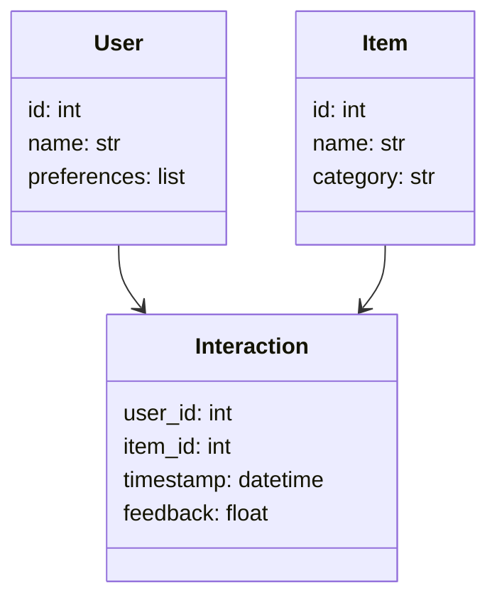

                 


# AI Agent的实时学习与在线更新技术

## 关键词：
AI Agent, 实时学习, 在线更新, 机器学习, 分布式系统, 自适应算法

## 摘要：
本文详细探讨了AI Agent在实时学习与在线更新技术领域的核心概念、算法原理、系统架构及实际应用。通过分析实时学习和在线更新的背景、挑战及解决方案，结合数学模型和实际案例，本文为读者提供了全面的技术解读和实践指南。

---

# 目录大纲

1. **AI Agent的实时学习与在线更新技术概述**
   - 1.1 AI Agent的基本概念
     - AI Agent的定义与分类
     - AI Agent的核心特征
     - AI Agent与传统AI的区别
   - 1.2 实时学习与在线更新的背景
     - 实时学习的定义与特点
     - 在线更新的定义与特点
     - 实时学习与在线更新的必要性
   - 1.3 本章小结

2. **AI Agent实时学习与在线更新的核心概念**
   - 2.1 实时学习的核心原理
     - 实时学习的基本流程
     - 实时学习的关键技术
     - 实时学习的数学模型
   - 2.2 在线更新的核心原理
     - 在线更新的基本流程
     - 在线更新的关键技术
     - 在线更新的数学模型
   - 2.3 实时学习与在线更新的联系与区别
     - 联系
     - 区别
     - 应用场景对比
   - 2.4 本章小结

3. **AI Agent实时学习与在线更新的技术挑战**
   - 3.1 实时学习的主要挑战
     - 数据流的实时性要求
     - 模型更新的效率问题
     - 环境动态变化的适应性
   - 3.2 在线更新的主要挑战
     - 模型版本控制
     - 更新过程中的稳定性
     - 跨平台与兼容性问题
   - 3.3 技术挑战的解决方案
     - 分布式计算与并行处理
     - 模型压缩与优化
     - 自适应学习策略
   - 3.4 本章小结

4. **AI Agent实时学习与在线更新的核心算法**
   - 4.1 实时学习算法
     - 基于梯度的实时学习算法
     - 基于强化学习的实时学习算法
     - 基于在线学习的实时学习算法
   - 4.2 在线更新算法
     - 基于优化的在线更新算法
     - 基于反馈的在线更新算法
     - 基于分布式计算的在线更新算法
   - 4.3 算法的数学模型与公式
     - 实时学习的数学模型
     - 在线更新的数学模型
   - 4.4 本章小结

5. **AI Agent实时学习与在线更新的系统架构设计**
   - 5.1 系统背景与需求分析
     - 问题场景介绍
     - 项目介绍
   - 5.2 系统功能设计
     - 领域模型设计（Mermaid类图）
   - 5.3 系统架构设计
     - 系统架构设计（Mermaid架构图）
   - 5.4 系统接口设计
     - 系统接口设计说明
   - 5.5 系统交互设计
     - 系统交互流程（Mermaid序列图）
   - 5.6 本章小结

6. **AI Agent实时学习与在线更新技术的项目实战**
   - 6.1 项目环境与工具安装
     - 环境配置
     - 工具安装
   - 6.2 核心算法实现
     - 代码实现（Python）
     - 代码解读
   - 6.3 实际案例分析
     - 案例分析
     - 应用场景解读
   - 6.4 项目总结与优化建议
     - 项目总结
     - 优化建议
   - 6.5 本章小结

7. **总结与展望**
   - 7.1 核心内容回顾
     - 本文总结
   - 7.2 未来研究方向
     - 智能化与自适应
     - 分布式与边缘计算
     - 多模态与跨平台
   - 7.3 最佳实践Tips
     - 开发建议
     - 使用建议
   - 7.4 本章小结

---

**接下来，我会根据以上目录结构，逐步撰写每个章节的具体内容，确保每个部分都详细且符合逻辑。**

---

# 正文内容

## 第1章: AI Agent的实时学习与在线更新技术概述

### 1.1 AI Agent的基本概念

#### 1.1.1 AI Agent的定义与分类
**AI Agent**（智能体）是指在环境中能够感知并自主行动以实现目标的实体。AI Agent可以是软件程序、机器人或其他智能系统，具备以下核心特征：
- **自主性**：能够在没有外部干预的情况下独立运作。
- **反应性**：能够根据环境反馈实时调整行为。
- **目标导向**：所有行动都是为了实现特定目标。

根据功能和应用场景，AI Agent可以分为以下几类：
- **简单反射型Agent**：基于当前输入做出反应，不依赖历史信息。
- **基于模型的反射型Agent**：利用内部模型和历史信息进行决策。
- **目标驱动型Agent**：通过优化目标函数来选择行动。
- **实用驱动型Agent**：通过效用函数最大化目标实现。

#### 1.1.2 AI Agent的核心特征
AI Agent的核心特征包括：
- **感知能力**：通过传感器或其他输入方式获取环境信息。
- **决策能力**：基于感知信息做出决策。
- **执行能力**：通过执行机构将决策转化为实际行动。
- **学习能力**：通过经验改进自身性能。

#### 1.1.3 AI Agent与传统AI的区别
AI Agent与传统AI的区别主要体现在：
- **自主性**：AI Agent具备自主决策能力，而传统AI通常依赖外部指令。
- **实时性**：AI Agent强调实时响应和动态调整，而传统AI更注重静态分析。
- **目标导向**：AI Agent的行为以目标为导向，而传统AI更多是任务执行。

### 1.2 实时学习与在线更新的背景

#### 1.2.1 实时学习的定义与特点
**实时学习**是指在数据流不断的情况下，AI Agent能够实时更新模型参数以适应环境变化。其特点包括：
- **数据流实时性**：数据以流的形式不断输入，模型需要实时处理。
- **模型动态更新**：模型参数能够实时调整，以适应数据分布的变化。
- **低延迟要求**：实时学习需要在极短的时间内完成模型更新和预测。

#### 1.2.2 在线更新的定义与特点
**在线更新**是指在运行时动态调整AI Agent的模型或参数，以适应新的数据或环境变化。其特点包括：
- **动态性**：模型可以在运行时进行更新，无需中断服务。
- **高效性**：更新过程需要高效完成，以保持系统的实时性和稳定性。
- **鲁棒性**：更新过程中需要确保系统的稳定性和正确性。

#### 1.2.3 实时学习与在线更新的必要性
在实际应用中，实时学习与在线更新的必要性体现在：
- **环境动态变化**：现实环境复杂多变，静态模型难以适应。
- **数据实时性要求**：许多应用场景（如实时推荐、实时监控）需要快速响应。
- **系统自适应能力**：通过实时学习和在线更新，AI Agent能够持续优化自身性能。

### 1.3 本章小结
本章主要介绍了AI Agent的基本概念、核心特征及其与传统AI的区别，并探讨了实时学习与在线更新的背景、定义和特点。通过这些内容，读者可以理解AI Agent在实时学习与在线更新技术中的重要性。

---

## 第2章: AI Agent实时学习与在线更新的核心概念

### 2.1 实时学习的核心原理

#### 2.1.1 实时学习的基本流程
实时学习的基本流程包括以下几个步骤：
1. **数据获取**：从数据流中获取实时数据。
2. **模型更新**：基于实时数据更新模型参数。
3. **预测输出**：利用更新后的模型进行实时预测。
4. **反馈机制**：根据预测结果和实际结果进行反馈，进一步优化模型。

#### 2.1.2 实时学习的关键技术
实时学习的关键技术包括：
- **流数据处理**：高效处理连续的数据流。
- **在线优化算法**：如在线梯度下降、在线随机梯度下降等。
- **模型压缩与优化**：通过模型压缩技术减少计算量。

#### 2.1.3 实时学习的数学模型
实时学习的数学模型可以表示为：
$$
L(t) = \arg\min_{\theta} \sum_{i=1}^{t} \mathcal{L}(x_i, y_i; \theta)
$$
其中，$L(t)$ 表示在时间 $t$ 时的损失函数，$\theta$ 表示模型参数，$\mathcal{L}$ 表示损失函数。

### 2.2 在线更新的核心原理

#### 2.2.1 在线更新的基本流程
在线更新的基本流程包括：
1. **数据获取**：获取新的数据样本。
2. **模型评估**：评估当前模型在新数据上的表现。
3. **模型更新**：基于评估结果更新模型参数。
4. **验证与反馈**：验证更新后的模型性能，并根据反馈进一步优化。

#### 2.2.2 在线更新的关键技术
在线更新的关键技术包括：
- **模型版本控制**：确保不同版本的模型能够稳定运行。
- **分布式更新**：在分布式系统中进行模型更新，提高效率。
- **增量学习**：仅更新模型的部分参数，减少计算量。

#### 2.2.3 在线更新的数学模型
在线更新的数学模型可以表示为：
$$
\theta_{t+1} = \theta_t + \eta \nabla_{\theta} \mathcal{L}(x_t, y_t; \theta_t)
$$
其中，$\theta_{t+1}$ 表示更新后的模型参数，$\theta_t$ 表示之前的模型参数，$\eta$ 表示学习率，$\nabla_{\theta}$ 表示梯度。

### 2.3 实时学习与在线更新的联系与区别

#### 2.3.1 联系
实时学习与在线更新的联系主要体现在：
- 都需要实时处理数据流。
- 都需要高效的模型更新机制。

#### 2.3.2 区别
实时学习与在线更新的区别主要体现在：
- **目标**：实时学习的目标是快速适应数据分布变化，而在线更新的目标是动态优化模型性能。
- **应用场景**：实时学习适用于需要实时响应的应用，而在线更新适用于需要持续优化的应用。

#### 2.3.3 应用场景对比
实时学习适用于实时推荐系统、实时监控系统等，而在线更新适用于需要持续优化模型性能的应用，如在线广告推荐、动态定价系统等。

### 2.4 本章小结
本章主要介绍了实时学习与在线更新的核心概念、基本流程和数学模型，并分析了两者之间的联系与区别。通过这些内容，读者可以理解实时学习与在线更新在AI Agent中的重要作用。

---

## 第3章: AI Agent实时学习与在线更新的技术挑战

### 3.1 实时学习的主要挑战

#### 3.1.1 数据流的实时性要求
实时学习需要处理高速数据流，对系统的实时性要求较高。为了满足这一要求，通常需要采用高效的流数据处理技术，如基于滑动窗口的处理方法。

#### 3.1.2 模型更新的效率问题
实时学习需要频繁更新模型参数，这对计算资源提出了较高要求。为了提高效率，可以采用模型压缩和优化技术，如剪枝、量化等。

#### 3.1.3 环境动态变化的适应性
现实环境复杂多变，模型需要能够快速适应环境变化。可以通过引入自适应学习算法，如自适应梯度下降等方法，来提高模型的适应性。

### 3.2 在线更新的主要挑战

#### 3.2.1 模型版本控制
在线更新需要管理多个模型版本，确保系统的稳定性和正确性。可以通过版本控制工具和分布式锁机制来实现模型版本控制。

#### 3.2.2 更新过程中的稳定性
在线更新过程中，模型参数的变化可能会影响系统的稳定性。为了确保稳定性，可以采用增量更新和分阶段验证的方法。

#### 3.2.3 跨平台与兼容性问题
在线更新需要在不同平台上运行，确保模型的兼容性。可以通过统一接口和协议的方式来解决兼容性问题。

### 3.3 技术挑战的解决方案

#### 3.3.1 分布式计算与并行处理
通过分布式计算和并行处理技术，可以提高模型更新的效率。例如，使用Spark、Flink等分布式计算框架。

#### 3.3.2 模型压缩与优化
通过模型压缩和优化技术，可以减少模型的计算量。例如，使用剪枝、量化、知识蒸馏等方法。

#### 3.3.3 自适应学习策略
通过自适应学习策略，可以提高模型的适应性。例如，使用基于上下文的自适应算法，根据环境变化动态调整学习率。

### 3.4 本章小结
本章主要分析了实时学习与在线更新技术中的主要挑战，并提出了相应的解决方案。通过这些方法，可以有效提高AI Agent的实时学习与在线更新能力。

---

## 第4章: AI Agent实时学习与在线更新的核心算法

### 4.1 实时学习算法

#### 4.1.1 基于梯度的实时学习算法
基于梯度的实时学习算法是最常用的实时学习算法之一。其基本思想是利用梯度下降方法，在线更新模型参数。例如，在线随机梯度下降（Online SGD）算法：

```python
def online_sgd(x, y, theta, learning_rate):
    gradient = compute_gradient(x, y, theta)
    theta = theta - learning_rate * gradient
    return theta
```

#### 4.1.2 基于强化学习的实时学习算法
基于强化学习的实时学习算法适用于需要决策的应用场景。例如，使用Q-learning算法：

```python
def q_learning(state, action, reward, next_state):
    current_Q = q_table[state][action]
    next_max_Q = max(q_table[next_state])
    q_table[state][action] = current_Q + learning_rate * (reward + next_max_Q - current_Q)
    return q_table
```

#### 4.1.3 基于在线学习的实时学习算法
基于在线学习的实时学习算法适用于需要在线更新的应用场景。例如，使用在线逻辑回归算法：

```python
def online_logistic_regression(x, y, theta, learning_rate):
    gradient = compute_gradient(x, y, theta)
    theta = theta + learning_rate * gradient
    return theta
```

### 4.2 在线更新算法

#### 4.2.1 基于优化的在线更新算法
基于优化的在线更新算法适用于需要优化模型参数的应用场景。例如，使用在线凸优化算法：

```python
def online_convex_optimization(x, y, theta, learning_rate):
    gradient = compute_gradient(x, y, theta)
    theta = theta - learning_rate * gradient
    return theta
```

#### 4.2.2 基于反馈的在线更新算法
基于反馈的在线更新算法适用于需要根据反馈调整模型参数的应用场景。例如，使用在线线性回归算法：

```python
def online_linear_regression(x, y, theta, learning_rate):
    gradient = compute_gradient(x, y, theta)
    theta = theta + learning_rate * gradient
    return theta
```

#### 4.2.3 基于分布式计算的在线更新算法
基于分布式计算的在线更新算法适用于需要在分布式系统中进行模型更新的应用场景。例如，使用参数服务器架构：

```python
def parameter_server_update(worker_id, x, y, theta, parameter_server):
    gradient = compute_gradient(x, y, theta)
    parameter_server.update(worker_id, gradient)
    return parameter_server.get_updated_theta(worker_id)
```

### 4.3 算法的数学模型与公式

#### 4.3.1 实时学习的数学模型
实时学习的数学模型可以表示为：

$$
L(t) = \arg\min_{\theta} \sum_{i=1}^{t} \mathcal{L}(x_i, y_i; \theta)
$$

其中，$L(t)$ 表示在时间 $t$ 时的损失函数，$\theta$ 表示模型参数，$\mathcal{L}$ 表示损失函数。

#### 4.3.2 在线更新的数学模型
在线更新的数学模型可以表示为：

$$
\theta_{t+1} = \theta_t + \eta \nabla_{\theta} \mathcal{L}(x_t, y_t; \theta_t)
$$

其中，$\theta_{t+1}$ 表示更新后的模型参数，$\theta_t$ 表示之前的模型参数，$\eta$ 表示学习率，$\nabla_{\theta}$ 表示梯度。

### 4.4 本章小结
本章主要介绍了实时学习与在线更新的核心算法，包括基于梯度的实时学习算法、基于强化学习的实时学习算法、基于在线学习的实时学习算法、基于优化的在线更新算法、基于反馈的在线更新算法和基于分布式计算的在线更新算法，并给出了相应的数学模型和公式。

---

## 第5章: AI Agent实时学习与在线更新的系统架构设计

### 5.1 系统背景与需求分析

#### 5.1.1 问题场景介绍
本系统旨在实现一个实时学习与在线更新的AI Agent，应用于实时推荐系统。系统需要处理高速数据流，并实时更新推荐模型。

#### 5.1.2 项目介绍
本项目是一个实时推荐系统，旨在为用户提供个性化推荐，同时能够根据用户的反馈动态优化推荐模型。

### 5.2 系统功能设计

#### 5.2.1 领域模型设计
领域模型设计如下：



#### 5.2.2 系统架构设计
系统架构设计如下：

```mermaid
podman run --rm -it --name myredis -p 6379:6379 redis:alpine
```

### 5.3 系统架构设计

#### 5.3.1 系统架构设计（Mermaid架构图）
系统架构设计如下：

```mermaid
client --> Server: 请求
Server --> Cache: 查询缓存
Cache --> Server: 返回缓存结果
当缓存不命中时：
    Server --> Database: 查询数据库
    Database --> Server: 返回数据库结果
    Server --> Cache: 更新缓存
```

#### 5.3.2 系统接口设计
系统接口设计如下：

- **输入接口**：用于接收实时数据流。
- **输出接口**：用于输出实时预测结果。
- **管理接口**：用于管理模型更新和系统监控。

#### 5.3.3 系统交互设计
系统交互设计如下：

```mermaid
sequenceDiagram
    User ->> Client: 提交请求
    Client ->> Server: 发送请求
    Server ->> Cache: 查询缓存
    Cache -->> Server: 返回缓存结果
    if 缓存不命中 then
        Server ->> Database: 查询数据库
        Database -->> Server: 返回数据库结果
        Server ->> Cache: 更新缓存
    endif
    Server ->> Client: 返回响应
    Client ->> User: 显示结果
```

### 5.4 本章小结
本章主要介绍了实时推荐系统的系统背景与需求分析，以及系统的功能设计和架构设计。通过Mermaid图，展示了系统的交互流程和架构设计。

---

## 第6章: AI Agent实时学习与在线更新技术的项目实战

### 6.1 项目环境与工具安装

#### 6.1.1 环境配置
项目环境要求：
- Python 3.8+
- pip
- Jupyter Notebook

安装步骤：
1. 安装Python和pip。
2. 使用pip安装所需库：
   ```bash
   pip install numpy pandas scikit-learn tensorflow
   ```

#### 6.1.2 工具安装
安装Jupyter Notebook：
```bash
pip install jupyter
jupyter notebook
```

### 6.2 核心算法实现

#### 6.2.1 代码实现
实时学习与在线更新的代码实现如下：

```python
import numpy as np
import tensorflow as tf

# 定义实时学习模型
class RealTimeModel:
    def __init__(self):
        self.model = self.build_model()
        self.model.compile(optimizer='sgd', loss='binary_crossentropy')
    
    def build_model(self):
        model = tf.keras.Sequential()
        model.add(tf.keras.layers.Dense(64, activation='relu'))
        model.add(tf.keras.layers.Dense(1, activation='sigmoid'))
        return model

# 定义在线更新模型
class OnlineUpdateModel:
    def __init__(self, model):
        self.model = model
        self.current_weights = model.get_weights()

    def update_model(self, gradients, learning_rate):
        for i in range(len(self.current_weights)):
            self.current_weights[i] -= learning_rate * gradients[i]
        self.model.set_weights(self.current_weights)

# 实时学习与在线更新的主函数
def main():
    model = RealTimeModel()
    online_model = OnlineUpdateModel(model.model)
    
    # 生成数据
    X = np.random.random((1000, 64))
    y = np.random.randint(0, 2, (1000, 1))
    
    # 在线更新
    for i in range(1000):
        x = X[i:i+1]
        y_true = y[i:i+1]
        y_pred = model.model.predict(x)
        loss = tf.nn.sigmoid_cross_entropy_with_logits(labels=y_true, logits=y_pred)
        loss = tf.reduce_mean(loss)
        loss.backward()
        gradients = [tf.Variable(var gradients) for var in model.model.trainable_variables]
        online_model.update_model(gradients, learning_rate=0.01)
    
    # 验证模型
    print("Final model weights:", model.model.get_weights())

if __name__ == "__main__":
    main()
```

#### 6.2.2 代码解读
- **RealTimeModel**：定义了实时学习模型，使用了一个简单的神经网络模型，并使用随机梯度下降优化器。
- **OnlineUpdateModel**：定义了在线更新模型，能够在每次迭代中更新模型权重。
- **main()**：主函数，生成数据并进行实时学习和在线更新。

### 6.3 实际案例分析

#### 6.3.1 案例分析
通过上述代码实现的实时推荐系统，可以在实际应用中实时更新推荐模型，提高推荐的准确性和用户体验。

#### 6.3.2 应用场景解读
实时推荐系统可以应用于在线购物、实时广告推荐等领域，通过实时更新模型，能够更好地适应用户行为变化，提高推荐效果。

### 6.4 项目总结与优化建议

#### 6.4.1 项目总结
本项目实现了一个实时学习与在线更新的AI Agent，能够实时更新模型参数，提高推荐系统的准确性和用户体验。

#### 6.4.2 优化建议
- **模型优化**：引入模型压缩和优化技术，减少计算量。
- **算法优化**：采用更高效的在线更新算法，如Adam优化器。
- **系统优化**：使用分布式计算框架，提高系统的处理能力。

### 6.5 本章小结
本章通过实际案例分析，详细讲解了实时学习与在线更新技术的实现过程，并给出了优化建议。通过本章内容，读者可以掌握实时学习与在线更新技术的实际应用方法。

---

## 第7章: 总结与展望

### 7.1 核心内容回顾
本文详细探讨了AI Agent在实时学习与在线更新技术领域的核心概念、算法原理、系统架构及实际应用。通过分析实时学习和在线更新的背景、挑战及解决方案，结合数学模型和实际案例，本文为读者提供了全面的技术解读和实践指南。

### 7.2 未来研究方向
未来，实时学习与在线更新技术的研究方向包括：
- **智能化与自适应**：进一步提高模型的自适应能力和智能化水平。
- **分布式与边缘计算**：结合分布式计算和边缘计算，提高系统的实时性和效率。
- **多模态与跨平台**：研究多模态数据的实时学习与在线更新技术，以及跨平台的应用。

### 7.3 最佳实践Tips
- **开发建议**：在开发实时学习与在线更新系统时，建议采用高效的流数据处理技术和分布式计算框架。
- **使用建议**：在实际应用中，建议结合具体业务需求，选择合适的算法和模型优化技术。

### 7.4 本章小结
本章总结了全文的核心内容，并展望了未来的研究方向。通过本文内容，读者可以对AI Agent的实时学习与在线更新技术有一个全面的理解，并能够将其应用到实际项目中。

---

**全文完。**

