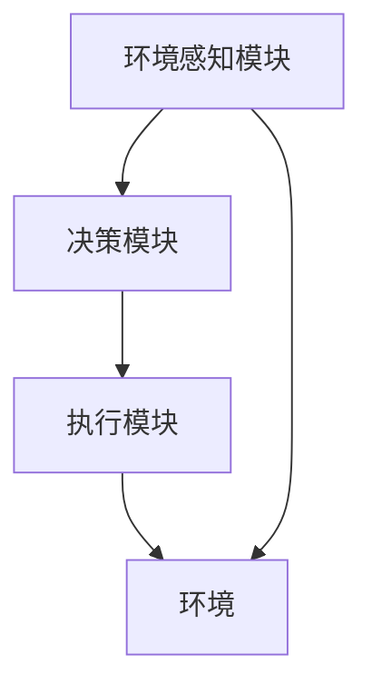

                 


# AI Agent的实时环境感知与适应能力

> 关键词：AI Agent, 环境感知, 实时决策, 多模态数据融合, 强化学习, 大模型, 系统架构

> 摘要：本文详细探讨了AI Agent在实时环境感知与适应能力方面的核心技术和实现方法。从基础概念到高级算法，从系统架构到项目实战，全面分析了AI Agent如何通过多模态感知、强化学习和大模型技术实现对复杂环境的实时理解和智能适应。文章还提供了具体的代码实现和案例分析，帮助读者深入理解AI Agent的设计与实现。

---

## 第一部分: AI Agent的实时环境感知与适应能力概述

### 第1章: AI Agent的基本概念与背景

#### 1.1 AI Agent的定义与特点
AI Agent（智能体）是指能够感知环境、自主决策并采取行动的智能系统。与传统的被动执行任务的程序不同，AI Agent具备以下核心特点：
- **自主性**：能够在没有外部干预的情况下自主运行。
- **反应性**：能够实时感知环境并动态调整行为。
- **主动性**：主动采取行动以实现目标。
- **社会性**：能够与其他Agent或人类进行交互和协作。

#### 1.2 AI Agent的应用场景
AI Agent广泛应用于多个领域：
- **智能助手**：如Siri、Alexa等，能够通过语音交互帮助用户完成任务。
- **自动驾驶**：通过环境感知和实时决策实现车辆的自主行驶。
- **智能机器人**：如工业机器人和家庭服务机器人，能够根据环境变化调整动作。

#### 1.3 AI Agent的发展历程
AI Agent的概念起源于20世纪60年代的知识表示与推理研究，经历了从简单规则到复杂决策的演变。近年来，随着大模型技术的发展，AI Agent的能力得到了显著提升，尤其是在环境感知和实时适应方面。

---

### 第2章: 环境感知的核心概念与技术

#### 2.1 环境感知的定义与分类
环境感知是指AI Agent通过传感器或其它方式获取环境信息，并对这些信息进行处理以理解环境状态的过程。环境感知可以分为以下几类：
- **基于传感器的感知**：通过摄像头、激光雷达等传感器获取环境数据。
- **基于视觉的感知**：通过图像处理技术识别环境中的物体和场景。
- **基于语言的感知**：通过自然语言处理技术理解人类的指令和反馈。

#### 2.2 多模态感知与数据融合
为了提高环境感知的准确性和鲁棒性，AI Agent通常需要结合多种感知方式（如视觉、听觉、触觉等）进行多模态感知。数据融合是将多模态数据整合为一个统一的环境表示的关键技术。常见的数据融合方法包括：
- **加权融合**：根据传感器的可靠性和重要性对数据进行加权融合。
- **概率融合**：基于概率论对多模态数据进行融合，如使用贝叶斯网络。

#### 2.3 环境感知的挑战与解决方案
环境感知面临的挑战包括：
- **复杂环境的不确定性**：如何在动态和不可预测的环境中准确感知。
- **传感器噪声和干扰**：如何处理传感器数据中的噪声和干扰。
- **实时性要求**：如何在实时场景中快速完成感知任务。

---

## 第二部分: AI Agent的核心算法与实现

### 第3章: 实时决策与行动策略

#### 3.1 决策算法概述
实时决策是AI Agent的核心能力之一，常见的决策算法包括：
- **基于规则的决策**：通过预定义的规则进行决策，适用于简单场景。
- **基于概率的决策**：通过概率模型计算不同选择的概率，选择最优行动。
- **基于强化学习的决策**：通过强化学习算法（如Q-learning）在与环境的交互中学习最优策略。

#### 3.2 多目标优化与权衡
在复杂的环境中，AI Agent往往需要在多个目标之间进行权衡。例如，在自动驾驶中，AI Agent需要在安全性和行驶效率之间找到平衡。多目标优化的目标是找到一个满足所有目标的最优解。

---

### 第4章: 环境适应的核心算法与实现

#### 4.1 基于强化学习的环境适应
强化学习是一种通过与环境交互来学习最优策略的算法。在实时环境适应中，强化学习通过以下步骤实现：
1. **状态感知**：通过传感器获取环境状态。
2. **动作选择**：根据当前状态选择最优动作。
3. **奖励机制**：根据环境反馈调整动作策略。

#### 4.2 基于大模型的环境理解
大模型（如GPT、Transformer）在环境理解中发挥重要作用。通过将环境数据输入大模型，AI Agent可以生成对环境的高层次理解，并根据上下文进行推理和决策。

---

## 第三部分: 系统架构与设计

### 第5章: 系统架构设计

#### 5.1 系统功能设计
AI Agent的系统功能包括：
- **环境感知模块**：负责收集和处理环境数据。
- **决策模块**：基于感知数据生成行动策略。
- **执行模块**：根据决策结果执行动作。

#### 5.2 系统架构图
以下是AI Agent的系统架构图：



#### 5.3 接口与交互设计
AI Agent的接口设计需要考虑与传感器、执行器以及外部系统的交互。以下是一个典型的交互序列图：

```mermaid
sequenceDiagram
    participant 传感器
    participant 执行器
    participant 外部系统
    传感器 ->> 环境感知模块: 发送环境数据
    环境感知模块 ->> 决策模块: 传递处理后的数据
    决策模块 ->> 执行器: 发送动作指令
    执行器 ->> 环境: 执行动作
    外部系统 <-> 决策模块: 交互指令
```

---

## 第四部分: 项目实战

### 第6章: 项目实战与案例分析

#### 6.1 项目背景与目标
本项目旨在实现一个基于强化学习的AI Agent，使其能够在动态环境中实时感知并适应环境变化。

#### 6.2 环境安装与配置
需要安装以下环境和工具：
- Python 3.8+
- TensorFlow或PyTorch
- OpenCV
- ROS（Robot Operating System）

#### 6.3 核心代码实现
以下是强化学习算法的Python实现示例：

```python
import numpy as np
import gym

env = gym.make('CartPole-v1')
env.seed(42)

class Agent:
    def __init__(self, state_dim, action_dim):
        self.state_dim = state_dim
        self.action_dim = action_dim
        self.Q = np.zeros((state_dim, action_dim))
    
    def act(self, state):
        return np.argmax(self.Q[state, :])
    
    def update(self, state, action, reward, next_state):
        alpha = 0.1
        gamma = 0.99
        target = reward + gamma * np.max(self.Q[next_state, :])
        self.Q[state, action] += alpha * (target - self.Q[state, action])

agent = Agent(env.observation_space.shape[0], env.action_space.n)
for episode in range(1000):
    state = env.reset()
    total_reward = 0
    while True:
        action = agent.act(state)
        next_state, reward, done, _ = env.step(action)
        agent.update(state, action, reward, next_state)
        total_reward += reward
        state = next_state
        if done:
            break
    print(f"Episode {episode}, Total Reward: {total_reward}")
```

---

## 第五部分: 总结与展望

### 第7章: 总结与展望

#### 7.1 全文总结
本文详细探讨了AI Agent在实时环境感知与适应能力方面的核心技术和实现方法。从环境感知到决策策略，从算法实现到系统架构，全面分析了AI Agent的设计与实现。

#### 7.2 未来展望
未来，AI Agent的发展将朝着以下几个方向推进：
- **更强的环境理解能力**：通过大模型和多模态感知技术提高环境理解的深度。
- **更高效的实时决策**：通过强化学习和边缘计算技术提升决策的实时性和效率。
- **更广泛的应用场景**：AI Agent将在更多领域（如医疗、教育、农业）发挥重要作用。

---

### 附录: 最佳实践与注意事项

- **性能优化**：在实时环境中，需要优化感知和决策的计算效率。
- **安全性考虑**：确保AI Agent的行为符合安全规范，避免潜在风险。
- **可解释性**：提高AI Agent决策的可解释性，便于调试和优化。

---

通过本文的分析与实践，读者可以全面理解AI Agent的实时环境感知与适应能力，并将其应用于实际场景中。

