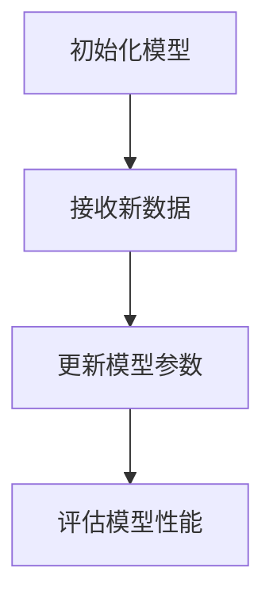
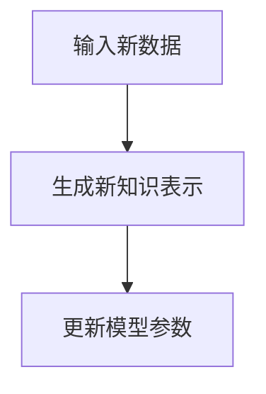
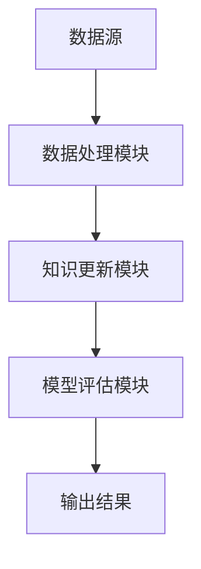

                 


# AI Agent的实时知识更新：保持LLM信息的时效性

## 关键词：AI Agent, 实时知识更新, LLM, 持续学习, 增量学习, 知识图谱, 系统架构

## 摘要：  
在人工智能快速发展的今天，AI Agent（智能体）的应用越来越广泛。然而，随着数据的不断变化和新信息的涌入，如何保持AI Agent知识的时效性成为一个关键问题。本文深入探讨AI Agent的实时知识更新机制，分析其核心算法、系统架构和实际应用，提供从理论到实践的全面指导，帮助读者理解并实现高效的实时知识更新。

---

# 第一部分: AI Agent的实时知识更新背景与概念

## 第1章: AI Agent与实时知识更新概述

### 1.1 AI Agent的基本概念  
AI Agent（智能体）是一种能够感知环境、自主决策并执行任务的智能系统。它具备以下特点：  
- **自主性**：无需外部干预，自主完成任务。  
- **反应性**：能够实时感知环境并做出响应。  
- **目标导向**：基于目标驱动行为。  
- **学习能力**：能够通过经验改进性能。  

AI Agent的应用场景包括智能助手、推荐系统、自动驾驶等。与传统AI相比，现代AI Agent更加注重动态环境下的实时响应和自主决策能力。  

---

### 1.2 实时知识更新的必要性  
AI Agent的核心能力依赖于知识的准确性与时效性。然而，以下问题凸显了实时知识更新的必要性：  
1. **信息过时**：静态知识库无法应对动态环境中的新信息。  
2. **决策失误**：过时的知识可能导致错误的决策。  
3. **适应性不足**：AI Agent难以适应快速变化的环境需求。  

实时知识更新的目标是通过持续学习和调整，保持AI Agent知识库的最新性，从而提升其性能和决策能力。  

---

### 1.3 本章小结  
本章介绍了AI Agent的基本概念及其在动态环境中的应用需求，重点强调了实时知识更新的重要性。下一章将深入探讨实时知识更新的核心机制。

---

# 第二部分: AI Agent实时知识更新的核心机制

## 第2章: 实时知识更新的理论基础  

### 2.1 知识表示与更新的基本原理  
知识表示是AI Agent理解世界的基础。常见的知识表示方法包括：  
1. **符号表示**：使用符号逻辑表示知识，适用于规则驱动的任务。  
2. **向量表示**：将知识转化为高维向量，适用于机器学习模型。  
3. **知识图谱**：通过图结构表示实体及其关系，适用于复杂知识场景。  

知识更新的触发条件包括：  
- 新信息的出现（如新闻事件、用户反馈）。  
- 环境变化（如天气变化、市场波动）。  
- 时间推移（如日期、时间相关的知识）。  

---

### 2.2 实时更新的算法基础  
实时知识更新的核心算法包括增量学习和持续学习。  

#### 2.2.1 增量学习与持续学习的对比  
| **对比维度** | **增量学习** | **持续学习** |  
|--------------|---------------|---------------|  
| 数据来源     | 批量数据       | 流数据         |  
| 更新频率     | 定期批量更新   | 实时更新       |  
| 适用场景     | 数据集较小     | 数据流实时变化 |  

通过上表可以看出，增量学习适用于数据量较小的场景，而持续学习更适合实时数据流的处理。  

---

## 第3章: 增量学习算法详解  

### 3.1 增量学习的基本原理  
增量学习的核心思想是通过逐步更新模型，避免重新训练整个模型。其流程如下：  
1. 初始化模型参数。  
2. 接收新的数据样本。  
3. 更新模型参数，仅针对新增数据进行优化。  
4. 评估更新后的模型性能。  

#### 3.1.1 增量学习的流程图  


---

### 3.2 持续学习算法详解  
持续学习的核心是模型能够“记忆”已有知识，同时学习新知识。其流程如下：  
1. 输入新数据样本。  
2. 模型基于已有知识生成新知识表示。  
3. 更新模型参数，保持旧知识的同时学习新知识。  

#### 3.2.1 持续学习的流程图  


---

### 3.3 算法优化与对比  
增量学习和持续学习各有优劣。增量学习适合数据量较小的场景，而持续学习适合实时数据流的处理。优化策略包括：  
- **学习率调整**：动态调整学习率，平衡新旧知识的学习。  
- **知识蒸馏**：通过教师模型指导学生模型学习，减少计算开销。  

---

## 第4章: 系统设计与架构  

### 4.1 系统功能设计  
实时知识更新系统的核心功能包括：  
1. **知识库管理**：存储和管理知识数据。  
2. **更新策略**：制定知识更新的规则和触发条件。  
3. **模型评估**：评估模型的性能和更新效果。  

---

### 4.2 系统架构设计  
系统架构包括以下模块：  
1. **数据处理模块**：接收和解析数据流。  
2. **知识更新模块**：执行增量学习或持续学习算法。  
3. **模型评估模块**：评估模型的性能并输出结果。  

#### 4.2.1 系统架构图  


---

## 第5章: 项目实战与案例分析  

### 5.1 项目背景与目标  
以新闻摘要生成为例，实时更新AI Agent的知识库，使其能够快速适应新闻事件的变化。  

---

### 5.2 环境配置与数据预处理  
1. **环境配置**：安装必要的库，如`transformers`、`scikit-learn`。  
2. **数据预处理**：将新闻数据转化为模型可接受的格式。  

---

### 5.3 模型实现与代码示例  
以下是一个简单的增量学习实现示例：  

```python
import torch
from torch import nn

# 初始化模型参数
model = nn.Linear(2, 1)
optimizer = torch.optim.SGD(model.parameters(), lr=0.1)

# 假设输入数据
x = torch.tensor([[1, 0]], dtype=torch.float32)
y = torch.tensor([[1]], dtype=torch.float32)

# 前向传播
output = model(x)
loss = nn.MSELoss()(output, y)

# 反向传播
optimizer.zero_grad()
loss.backward()
optimizer.step()

print("模型更新后的参数:", model.weight)
```

---

### 5.4 案例分析与结果展示  
通过上述代码，模型能够逐步更新参数，适应新数据的变化。最终，AI Agent能够生成更准确的新闻摘要。  

---

## 第六部分: 最佳实践与总结  

### 6.1 本章小结  
本文详细探讨了AI Agent的实时知识更新机制，从理论到实践，为读者提供了全面的指导。  

### 6.2 注意事项  
- 知识更新的频率和模型性能之间需要权衡。  
- 数据质量和多样性对模型更新效果至关重要。  

### 6.3 未来趋势  
未来，随着AI技术的发展，实时知识更新将更加智能化和自动化。  

### 6.4 拓展阅读  
推荐阅读相关领域的论文和书籍，深入理解增量学习和持续学习的最新进展。  

---

# 结语  
实时知识更新是AI Agent保持竞争力的关键。通过本文的深入分析，读者可以掌握其实现方法，并在实际项目中灵活应用。  

--- 

# 附录：相关术语表  
（略）

