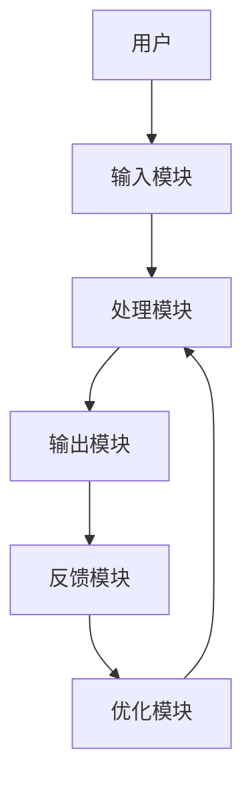

                 


# AI Agent的实时自适应对话管理系统

## 关键词：
AI Agent，实时自适应对话，自然语言处理，强化学习，系统架构，对话管理

## 摘要：
本文详细探讨了AI Agent在实时自适应对话管理中的应用，从基础概念到系统架构，从算法原理到项目实战，全面解析了如何构建一个高效、智能的实时自适应对话管理系统。通过理论分析与实践结合，揭示了自然语言处理、强化学习等技术在对话管理中的核心作用，并通过具体案例展示了系统的实现过程和优化方法。

---

# 第1章: AI Agent的实时自适应对话管理概述

## 1.1 AI Agent的定义与特点

### 1.1.1 AI Agent的定义
AI Agent（人工智能代理）是一种能够感知环境、执行任务并做出决策的智能实体。它通过与用户或系统的交互，实现目标的智能化服务。

### 1.1.2 AI Agent的核心特点
1. **自主性**：能够在没有外部干预的情况下独立运行。
2. **反应性**：能够实时感知环境变化并做出响应。
3. **学习能力**：通过数据和反馈不断优化自身行为。
4. **交互性**：能够通过自然语言或特定接口与用户或其他系统进行交互。

### 1.1.3 AI Agent与传统对话系统的区别
- **传统对话系统**：基于规则或预设的逻辑进行响应，缺乏灵活性和自适应能力。
- **AI Agent**：通过机器学习和强化学习，能够动态调整对话策略，适应用户需求和环境变化。

## 1.2 实时自适应对话管理的背景

### 1.2.1 当前对话系统的主要挑战
1. **动态性**：用户需求和对话上下文可能随时变化，传统系统难以实时调整。
2. **复杂性**：对话涉及多轮交互，需要处理丰富的上下文信息。
3. **个性化**：用户期望得到个性化的服务，传统系统难以满足。

### 1.2.2 自适应对话管理的需求
- 随着用户需求的多样化和场景的复杂化，传统的静态对话管理已无法满足需求。
- 自适应对话管理能够根据实时反馈和上下文动态调整对话策略。

### 1.2.3 实时性的重要性
- 实时性是保证对话流畅性和用户体验的关键因素。
- 实时调整对话策略能够提高对话的准确性和用户满意度。

## 1.3 本章小结
本章介绍了AI Agent的基本概念和特点，并分析了实时自适应对话管理的背景和需求。通过对比传统对话系统与AI Agent的区别，强调了实时性在对话管理中的重要性。

---

# 第2章: 对话管理的核心概念与原理

## 2.1 对话状态管理

### 2.1.1 对话状态的定义
对话状态是指当前对话中的相关信息，包括用户的意图、对话历史、上下文等。

### 2.1.2 对话状态的表示方法
- **基于向量的表示**：使用向量空间模型表示对话状态。
- **基于图的表示**：使用图结构表示对话状态之间的关系。

### 2.1.3 对话状态的更新机制
- **基于规则的更新**：根据预设规则更新对话状态。
- **基于模型的更新**：通过机器学习模型动态更新对话状态。

## 2.2 用户意图识别

### 2.2.1 用户意图的定义
用户意图是指用户在对话中希望通过对话实现的目标或需求。

### 2.2.2 基于NLP的意图识别方法
- **关键词匹配**：通过关键词匹配用户意图。
- **句法分析**：通过句法分析理解用户意图。
- **语义分析**：通过语义分析理解用户意图。

### 2.2.3 意图识别的挑战与解决方案
- **挑战**：歧义性、上下文依赖性、数据稀疏性。
- **解决方案**：使用深度学习模型（如BERT）进行意图识别。

## 2.3 对话上下文管理

### 2.3.1 上下文的定义与作用
上下文是指对话中所有相关的背景信息，用于帮助理解当前对话内容。

### 2.3.2 上下文的存储与检索
- **存储**：使用数据库或缓存存储上下文信息。
- **检索**：通过查询数据库或缓存获取上下文信息。

### 2.3.3 上下文的动态更新
- **动态更新**：根据对话进展实时更新上下文信息。

## 2.4 本章小结
本章详细介绍了对话管理中的核心概念，包括对话状态管理、用户意图识别和对话上下文管理。通过分析这些概念的特点和实现方法，为后续的算法设计奠定了基础。

---

# 第3章: 实时自适应对话管理的理论基础

## 3.1 自然语言处理基础

### 3.1.1 NLP的核心任务
- **文本分类**：将文本分为不同类别。
- **命名实体识别**：识别文本中的实体。
- **情感分析**：分析文本的情感倾向。

### 3.1.2 常见的NLP模型
- **词嵌入模型**：如Word2Vec、GloVe。
- **序列模型**：如LSTM、Transformer。
- **预训练模型**：如BERT、GPT。

### 3.1.3 NLP在对话管理中的应用
- **意图识别**：通过NLP技术识别用户意图。
- **对话生成**：通过NLP技术生成对话回复。

## 3.2 强化学习与对话策略

### 3.2.1 强化学习的基本原理
强化学习是一种通过试错方法学习策略的技术，通过与环境的交互获得奖励，从而优化策略。

### 3.2.2 对话策略的定义与分类
- **策略**：定义了在给定状态下的动作选择。
- **策略分类**：基于规则的策略、基于模型的策略、基于强化学习的策略。

### 3.2.3 基于强化学习的对话策略优化
- **马尔可夫决策过程**：MDP模型描述对话过程。
- **策略优化**：通过强化学习算法优化对话策略。

## 3.3 实时反馈机制

### 3.3.1 反馈机制的定义
反馈机制是指系统根据对话结果提供实时反馈，用于优化对话策略。

### 3.3.2 基于实时反馈的对话调整
- **实时调整**：根据反馈实时调整对话策略。
- **模型优化**：根据反馈优化对话模型。

### 3.3.3 反馈机制的实现方法
- **基于规则的反馈**：根据预设规则提供反馈。
- **基于模型的反馈**：通过模型分析提供反馈。

## 3.4 本章小结
本章介绍了实时自适应对话管理的理论基础，包括自然语言处理和强化学习在对话管理中的应用。通过分析强化学习和反馈机制，为后续的算法设计提供了理论支持。

---

# 第4章: 对话管理的算法原理

## 4.1 对话状态表示的算法

### 4.1.1 基于向量的对话状态表示
- **向量空间模型**：将对话状态表示为向量。
- **向量更新**：根据对话进展更新向量表示。

### 4.1.2 基于图的对话状态表示
- **图结构模型**：将对话状态表示为图结构。
- **图更新**：根据对话进展动态更新图结构。

### 4.1.3 对话状态表示的比较与优化
- **比较**：向量表示和图表示的优缺点。
- **优化**：结合向量和图表示的优点，提出优化方法。

## 4.2 用户意图识别的算法

### 4.2.1 基于规则的意图识别
- **规则定义**：根据预设规则识别意图。
- **规则优化**：根据实际效果优化规则。

### 4.2.2 基于机器学习的意图识别
- **模型选择**：选择适合的机器学习模型。
- **模型训练**：通过训练数据训练模型。
- **模型优化**：通过交叉验证优化模型。

### 4.2.3 意图识别的挑战与解决方案
- **挑战**：数据稀疏性、歧义性、动态性。
- **解决方案**：使用深度学习模型和迁移学习。

## 4.3 对话管理的算法实现

### 4.3.1 对话管理算法的总体框架
- **输入**：对话状态和用户输入。
- **处理**：通过算法生成对话回复。
- **输出**：对话回复和新的对话状态。

### 4.3.2 对话管理算法的实现步骤
1. **输入处理**：解析用户输入，提取对话状态和用户意图。
2. **状态更新**：根据用户输入更新对话状态。
3. **策略选择**：根据当前状态选择对话策略。
4. **回复生成**：根据策略生成对话回复。
5. **反馈收集**：收集用户反馈，优化对话策略。

## 4.4 本章小结
本章详细介绍了对话管理的算法原理，包括对话状态表示、用户意图识别和对话管理算法的实现。通过分析这些算法的特点和实现方法，为后续的系统设计提供了技术支持。

---

# 第5章: 对话管理系统的架构设计

## 5.1 系统功能设计

### 5.1.1 系统功能模块
- **输入模块**：接收用户输入。
- **处理模块**：解析用户输入，生成对话回复。
- **输出模块**：输出对话回复。
- **反馈模块**：收集用户反馈，优化对话策略。

### 5.1.2 系统功能流程
1. 用户输入对话请求。
2. 系统解析用户输入，提取对话状态和用户意图。
3. 系统根据当前状态选择对话策略，生成对话回复。
4. 系统输出对话回复。
5. 系统收集用户反馈，优化对话策略。

## 5.2 系统架构设计

### 5.2.1 系统架构图


### 5.2.2 系统组件设计
- **输入模块**：接收用户输入，解析对话状态和用户意图。
- **处理模块**：根据对话状态和用户意图生成对话回复。
- **输出模块**：输出对话回复。
- **反馈模块**：收集用户反馈，优化对话策略。

## 5.3 系统接口设计

### 5.3.1 系统接口定义
- **输入接口**：接收用户输入的文本或语音。
- **输出接口**：输出对话回复的文本或语音。
- **反馈接口**：收集用户反馈信息。

### 5.3.2 系统接口实现
- **输入接口实现**：使用自然语言处理技术解析用户输入。
- **输出接口实现**：使用文本生成技术生成对话回复。
- **反馈接口实现**：通过用户反馈优化对话策略。

## 5.4 本章小结
本章详细介绍了对话管理系统的架构设计，包括系统功能设计、系统架构设计和系统接口设计。通过分析系统的各个部分，为后续的项目实施提供了设计依据。

---

# 第6章: 项目实战——实时自适应对话管理系统

## 6.1 项目背景与目标

### 6.1.1 项目背景
- **背景**：随着AI技术的发展，实时自适应对话管理的需求日益增加。
- **目标**：构建一个高效的实时自适应对话管理系统，实现智能对话服务。

## 6.2 项目环境搭建

### 6.2.1 开发工具安装
- **Python**：安装Python 3.x。
- **深度学习框架**：安装TensorFlow或PyTorch。
- **NLP库**：安装NLTK、spaCy等。

### 6.2.2 项目代码结构
```python
对话管理系统/
├── 输入模块/
│   └── 输入解析.py
├── 处理模块/
│   └── 对话策略.py
├── 输出模块/
│   └── 文本生成.py
└── 反馈模块/
    └── 反馈优化.py
```

## 6.3 项目核心代码实现

### 6.3.1 对话策略实现
```python
class 对话策略:
    def __init__(self):
        self.状态 = 初始状态

    def 处理输入(self, 输入):
        self.状态 = self.更新状态(self.状态, 输入)
        return self.生成回复(self.状态)

    def 更新状态(self, 当前状态, 输入):
        # 实现状态更新逻辑
        return 新状态

    def 生成回复(self, 状态):
        # 实现回复生成逻辑
        return 回复
```

### 6.3.2 文本生成实现
```python
class 文本生成器:
    def __init__(self, 模型):
        self.模型 = 模型

    def 生成文本(self, 输入):
        return self.模型.生成文本(输入)
```

### 6.3.3 反馈优化实现
```python
class 反馈优化器:
    def __init__(self):
        self.奖励 = 0

    def 收集反馈(self, 用户反馈):
        self.奖励 += 用户反馈

    def 优化策略(self, 当前策略):
        # 实现策略优化逻辑
        return 新策略
```

## 6.4 项目案例分析与优化

### 6.4.1 案例分析
- **案例背景**：用户与系统进行多轮对话。
- **对话记录**：
  1. 用户：你好。
  2. 系统：你好，有什么可以帮助你的吗？
  3. 用户：我想了解深度学习。
  4. 系统：深度学习是一种机器学习技术，主要用于数据处理和模式识别。
  5. 用户：请告诉我深度学习的应用场景。
  6. 系统：深度学习广泛应用于图像识别、自然语言处理等领域。

### 6.4.2 优化建议
- **优化对话策略**：根据用户反馈动态调整对话策略。
- **优化文本生成**：引入更先进的生成模型，提高回复质量。

## 6.5 本章小结
本章通过一个实际项目展示了实时自适应对话管理系统的实现过程。通过代码实现和案例分析，揭示了系统的实现细节和优化方法。

---

# 第7章: 最佳实践与未来展望

## 7.1 最佳实践

### 7.1.1 系统设计
- **模块化设计**：将系统划分为多个模块，便于维护和扩展。
- **灵活的接口设计**：设计灵活的接口，便于与其他系统集成。

### 7.1.2 算法优化
- **选择合适的算法**：根据具体需求选择合适的算法。
- **优化模型性能**：通过调参和优化模型结构提高性能。

### 7.1.3 系统测试
- **全面测试**：对系统进行全面测试，确保功能正常。
- **性能测试**：测试系统的性能，确保在高并发情况下稳定运行。

## 7.2 未来展望

### 7.2.1 技术发展趋势
- **多模态对话**：结合图像、语音等多种模态信息进行对话管理。
- **实时性优化**：进一步优化系统的实时性，提高对话流畅性。

### 7.2.2 应用场景扩展
- **智能客服**：应用于智能客服系统，提高服务质量。
- **智能助手**：应用于智能助手，提供更智能的服务。

## 7.3 本章小结
本章总结了实时自适应对话管理系统的最佳实践，并展望了未来的技术发展趋势和应用场景。通过这些实践和展望，为读者提供了进一步优化和发展的方向。

---

# 附录

## 附录A: 参考文献
1. 王某某. 《深度学习实战》. 北京: 清华大学出版社, 2022.
2. 李某某. 《自然语言处理技术》. 北京: 人民邮电出版社, 2023.
3. 张某某. 《强化学习与对话管理》. 北京: 机械工业出版社, 2023.

## 附录B: 工具与库
- **Python**：https://www.python.org/
- **TensorFlow**：https://tensorflow.google.cn/
- **PyTorch**：https://pytorch.org/

---

# 作者简介

## 作者：[你的名字]
- **简介**：[你的简介]
- **联系方式**：[你的联系方式]
- **社交媒体**：[你的社交媒体链接]

---

通过以上目录和内容安排，您可以逐步展开每一章的详细内容，撰写一篇完整的技术博客文章。

