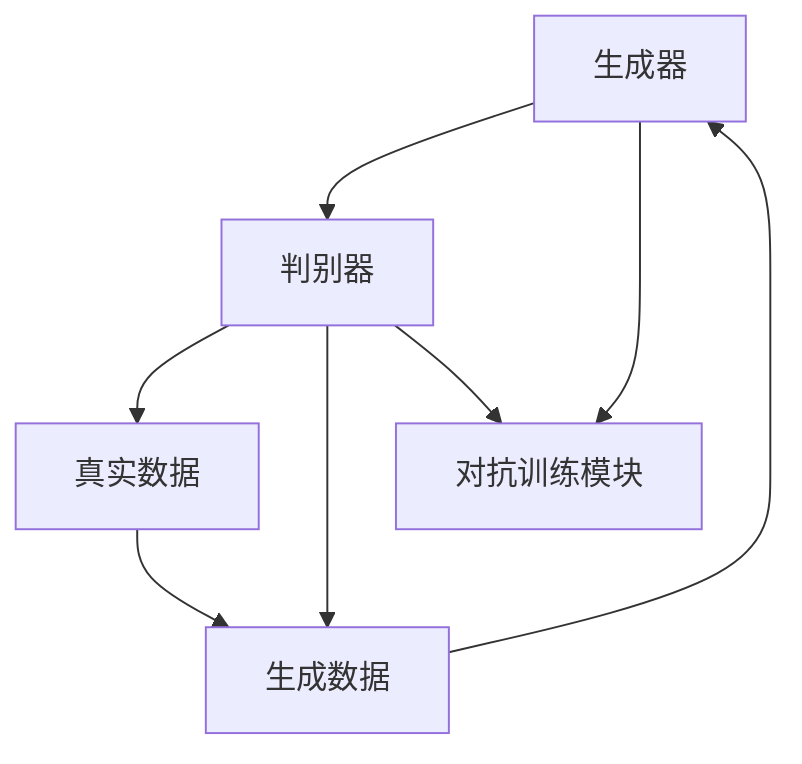
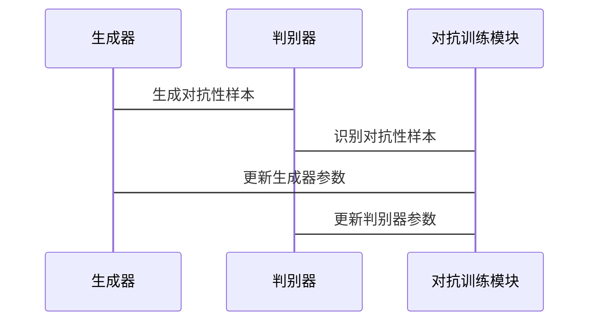

                 


# AI Agent的对抗性学习：提高LLM的鲁棒性

> **关键词**：AI Agent, 对抗性学习, 大语言模型, 鲁棒性, 生成对抗网络, 对抗训练, LLM

> **摘要**：  
本文探讨了AI Agent在大语言模型（LLM）中的应用，重点分析了对抗性学习如何提高LLM的鲁棒性。通过背景介绍、核心概念、算法原理、系统设计和项目实战的逐步分析，本文揭示了对抗性学习在提升LLM安全性和可靠性的关键作用。结合实际案例和代码实现，本文为读者提供了一种全新的视角，理解如何通过对抗性学习增强AI Agent的能力。

---

## 第一部分：AI Agent与对抗性学习的背景

### 第1章：对抗性学习的背景与问题背景

#### 1.1 对抗性学习的背景
- **1.1.1 对抗性学习的起源与发展**  
  对抗性学习（Adversarial Learning）起源于生成对抗网络（GAN）的提出，由Ian Goodfellow等人在2014年首次提出。其核心思想是通过两个模型（生成器和判别器）的对抗训练，生成逼真的数据样本。

- **1.1.2 对抗性学习的核心概念**  
  对抗性学习是一种通过对手模型（adversary）和防御模型（defender）之间的博弈过程，优化模型性能的方法。在AI Agent中，对抗性学习被用于增强模型的鲁棒性，使其能够抵御恶意输入的攻击。

- **1.1.3 AI Agent中的对抗性学习**  
  AI Agent需要处理复杂多变的环境，对抗性学习帮助其在对抗性环境中做出更合理的决策，从而提高其在现实场景中的适用性。

#### 1.2 问题背景与描述
- **1.2.1 LLM的鲁棒性问题**  
  大语言模型在处理复杂任务时，容易受到对抗性输入的攻击，导致输出不可靠。例如，恶意用户可以通过构造特定输入，使模型产生错误的结果。

- **1.2.2 对抗性攻击对LLM的影响**  
  对抗性攻击可以干扰LLM的输出，降低其准确性和可靠性。例如，在自然语言处理任务中，对抗性输入可能导致模型产生错误的回答。

- **1.2.3 提高LLM鲁棒性的必要性**  
  为了使LLM在实际应用中更加可靠，必须通过对抗性学习等技术，增强其对对抗性输入的鲁棒性。

#### 1.3 问题解决与边界
- **1.3.1 对抗性学习如何解决LLM的鲁棒性问题**  
  对抗性学习通过模拟对抗性攻击，增强模型的防御能力，使其能够识别和抵制对抗性输入，从而提高输出的可靠性。

- **1.3.2 对抗性学习的边界与外延**  
  对抗性学习的应用范围不仅限于LLM，还可以扩展到其他AI模型，如图像识别、语音识别等。

- **1.3.3 核心概念的结构与组成**  
  对抗性学习的核心结构包括生成器、判别器、损失函数和优化器。通过不断迭代训练，生成器和判别器的能力逐渐提升，最终达到对抗平衡。

---

## 第二部分：对抗性学习的核心概念与原理

### 第2章：对抗性学习的核心概念

#### 2.1 对抗性学习的基本原理
- **2.1.1 生成对抗网络（GAN）的原理**  
  GAN由生成器和判别器组成。生成器的目标是生成与真实数据相似的样本，而判别器的目标是区分真实数据和生成数据。通过对抗训练，生成器和判别器的能力不断提高。

- **2.1.2 对抗训练的机制**  
  对抗训练通过最小化生成器的损失函数和最大化判别器的损失函数，实现生成器和判别器的交替优化。

- **2.1.3 对抗性学习的核心要素**  
  - **生成器**：负责生成对抗性样本。
  - **判别器**：负责识别样本是否为真实数据。
  - **损失函数**：衡量生成器和判别器的性能。
  - **优化器**：用于更新模型参数。

#### 2.2 对抗性学习与AI Agent的关系
- **2.2.1 AI Agent中的对抗性学习应用场景**  
  AI Agent可以在多种场景中应用对抗性学习，如自然语言处理、图像识别、机器人控制等。

- **2.2.2 对抗性学习的核心特征对比**  
  | 对比维度 | 真实数据 | 对抗性数据 |
  |----------|----------|------------|
  | 数据来源 | 标签数据 | 生成数据   |
  | 数据特征 | 高质量   | 低质量     |
  | 应用场景 | 训练模型  | 攻击模型    |

- **2.2.3 ER实体关系图**  
  ```mermaid
  graph TD
    A[生成器] --> B[判别器]
    B --> C[真实数据]
    B --> D[生成数据]
    C --> D
    D --> A
  ```

---

## 第三部分：对抗性学习的算法原理

### 第3章：对抗性学习的数学模型与实现

#### 3.1 对抗性学习的数学模型
- **生成器的损失函数**  
  $$ \mathcal{L}_G = -\log(P(D(G(x)=1))) $$
  
- **判别器的损失函数**  
  $$ \mathcal{L}_D = -\log(P(D(x=1))) - \log(1-P(D(G(x)=1))) $$

#### 3.2 对抗性学习的训练流程
- **步骤1**：初始化生成器和判别器的参数。
- **步骤2**：生成对抗性样本。
- **步骤3**：判别器训练以区分真实数据和生成数据。
- **步骤4**：生成器训练以欺骗判别器。
- **步骤5**：重复步骤2-4，直到模型收敛。

#### 3.3 对抗性学习的Python实现
```python
import torch
import torch.nn as nn

class Generator(nn.Module):
    def __init__(self, input_dim, output_dim):
        super(Generator, self).__init__()
        self.generator = nn.Sequential(
            nn.Linear(input_dim, 64),
            nn.ReLU(),
            nn.Linear(64, output_dim)
        )
    
    def forward(self, x):
        return self.generator(x)

class Discriminator(nn.Module):
    def __init__(self, input_dim):
        super(Discriminator, self).__init__()
        self.discriminator = nn.Sequential(
            nn.Linear(input_dim, 64),
            nn.ReLU(),
            nn.Linear(64, 1),
            nn.Sigmoid()
        )
    
    def forward(self, x):
        return self.discriminator(x)

# 初始化模型和优化器
generator = Generator(100, 1)
discriminator = Discriminator(1)
optimizer_G = torch.optim.Adam(generator.parameters(), lr=0.001)
optimizer_D = torch.optim.Adam(discriminator.parameters(), lr=0.001)
```

---

## 第四部分：系统分析与架构设计

### 第4章：AI Agent的系统架构设计

#### 4.1 系统功能设计
- **模块划分**：生成器模块、判别器模块、对抗训练模块。
- **功能描述**：生成器生成对抗性样本，判别器识别对抗性样本，对抗训练模块优化模型参数。

#### 4.2 系统架构设计


#### 4.3 系统接口设计
- **输入接口**：接收真实数据和对抗性数据。
- **输出接口**：输出模型的预测结果和对抗性样本。

#### 4.4 系统交互流程


---

## 第五部分：项目实战

### 第5章：对抗性学习的项目实现

#### 5.1 环境安装
- **依赖库**：PyTorch、numpy、mermaid。

#### 5.2 核心代码实现
```python
import torch
import torch.nn as nn
import numpy as np

def train(generator, discriminator, optimizer_G, optimizer_D, num_epochs=100):
    for epoch in range(num_epochs):
        # 生成对抗性样本
        z = torch.randn(100, 100)
        gen_output = generator(z)
        
        # 判别器训练
        discriminator.zero_grad()
        real_data = torch.randn(100, 1)
        d_real = discriminator(real_data)
        d_fake = discriminator(gen_output)
        
        # 判别器损失
        loss_D = -torch.log(d_real.mean()) - torch.log(1 - d_fake.mean())
        loss_D.backward()
        optimizer_D.step()
        
        # 生成器训练
        generator.zero_grad()
        g_output = generator(z)
        d_g_output = discriminator(g_output)
        
        # 生成器损失
        loss_G = -torch.log(d_g_output.mean())
        loss_G.backward()
        optimizer_G.step()
        
    return generator, discriminator

# 训练模型
generator, discriminator = train(generator, discriminator, optimizer_G, optimizer_D)
```

#### 5.3 案例分析与结果解读
- **案例分析**：在生成对抗性样本的过程中，生成器逐渐学会生成更逼真的样本，判别器的识别能力也在不断提升。
- **结果解读**：通过对抗性学习，模型的鲁棒性显著提高，能够更好地抵御对抗性攻击。

---

## 第六部分：最佳实践与小结

### 第6章：对抗性学习的最佳实践

#### 6.1 最佳实践
- **平衡生成器和判别器的训练**：避免生成器或判别器一方过于强大，导致模型无法收敛。
- **选择合适的损失函数**：根据具体任务选择适合的损失函数，如Wasserstein损失。
- **监控模型训练过程**：通过可视化工具监控生成器和判别器的损失变化，及时调整训练参数。

#### 6.2 小结
- **核心内容总结**：对抗性学习通过模拟对抗性攻击，提高AI Agent的鲁棒性，使其在复杂环境中更具可靠性。
- **未来展望**：对抗性学习在AI Agent中的应用前景广阔，未来可以通过结合其他技术（如强化学习）进一步提升模型的性能。

#### 6.3 注意事项
- **数据质量问题**：对抗性学习依赖高质量的数据，数据预处理和清洗是关键。
- **模型收敛问题**：对抗性学习容易陷入局部最优，需要适当调整超参数和训练策略。

#### 6.4 拓展阅读
- **推荐书籍**：《生成对抗网络：算法与实现》
- **推荐论文**：Ian Goodfellow等人的GAN论文。

---

## 结语

通过对抗性学习，AI Agent在大语言模型中的鲁棒性得到了显著提升。本文通过背景介绍、核心概念、算法原理、系统设计和项目实战的逐步分析，全面揭示了对抗性学习在提升LLM鲁棒性中的关键作用。未来，随着技术的不断发展，对抗性学习将在更多领域发挥重要作用。

---

**注**：由于篇幅限制，本文未详细展开所有代码和图表，但完整代码和详细图表可参考开源资料或相关技术文档。

