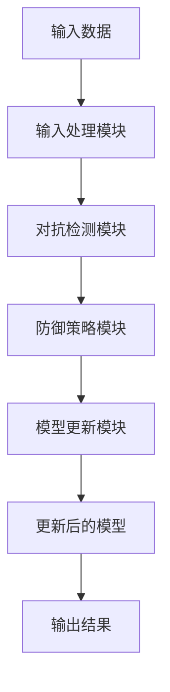

                 


# AI Agent的对抗样本防御：增强模型鲁棒性

## 关键词
- AI Agent
- 对抗样本
- 模型鲁棒性
- 深度学习
- 安全防御

## 摘要
在人工智能快速发展的今天，AI Agent的应用越来越广泛，但其面临的对抗样本攻击问题也日益严重。对抗样本通过在输入数据中添加精心设计的扰动，导致模型产生错误的输出，从而威胁系统的安全性和可靠性。本文将详细探讨AI Agent在对抗样本防御中的策略与方法，分析其背后的数学模型和算法原理，并通过实际案例展示如何增强模型的鲁棒性，确保AI Agent在复杂环境下的安全性和稳定性。

## 第3章: 对抗样本防御的数学模型与算法原理

### 3.3 对抗样本防御的算法实现

#### 3.3.3 对抗样本防御的鲁棒性评估
为了评估对抗样本防御算法的有效性，我们需要定义一系列的评估指标和方法。这些指标可以帮助我们量化模型在面对对抗样本时的鲁棒性，并指导我们选择和优化防御策略。

##### 3.3.3.1 鲁棒性评估指标
在评估模型的鲁棒性时，我们通常考虑以下几个指标：

1. **对抗准确率（Robust Accuracy）**：模型在面对对抗样本时的准确率。这个指标直接反映了模型在对抗攻击下的性能。
   
2. **最小扰动距离（Minimal Perturbation Distance）**：模型能够正确分类的最小扰动距离。这个指标衡量了模型对对抗样本的抵抗力，距离越小，说明模型越容易受到攻击。

3. **对抗样本数量（Number of Adversarial Samples）**：模型能够抵御的对抗样本数量。这个指标可以帮助我们了解模型在面对大规模对抗攻击时的性能。

4. **鲁棒性分数（Robustness Score）**：一个综合指标，综合考虑模型的准确率和对抗样本的生成难度。这个指标可以提供一个整体的鲁棒性评估。

##### 3.3.3.2 鲁棒性评估方法
评估模型鲁棒性的方法通常包括以下几种：

1. **基于扰动的评估方法**：通过在输入数据上添加不同大小的扰动，观察模型的分类结果是否发生变化。这种方法可以直接量化模型的鲁棒性。

2. **基于攻击的评估方法**：使用已知的对抗样本生成算法，生成对抗样本并测试模型是否能够正确分类这些样本。这种方法可以评估模型在面对特定攻击时的鲁棒性。

3. **基于统计的评估方法**：通过统计模型在对抗样本下的分类结果，计算模型的分类性能和鲁棒性指标。这种方法可以提供一个全面的鲁棒性评估。

##### 3.3.3.3 鲁棒性评估的挑战
在实际应用中，评估模型的鲁棒性也面临一些挑战：

1. **计算复杂度高**：生成大量的对抗样本需要大量的计算资源，这会增加评估的难度和成本。

2. **对抗样本的多样性**：不同的对抗样本生成方法可能会产生不同类型的对抗样本，单一的评估指标可能无法全面反映模型的鲁棒性。

3. **模型的可解释性**：一些模型在对抗样本下的行为可能难以解释，这使得鲁棒性评估变得更加复杂。

通过这些评估指标和方法，我们可以更好地了解模型的鲁棒性，并指导我们选择和优化对抗样本防御策略。

---

### 第4章: 对抗样本防御的系统分析与架构设计

#### 4.1 系统分析与需求定义
在设计一个对抗样本防御系统时，首先需要进行系统分析和需求定义，明确系统的目标、功能和约束条件。

##### 4.1.1 系统目标
系统的目标是通过防御算法，增强AI Agent对对抗样本的识别和抵抗能力，确保模型在面对对抗攻击时的准确性和稳定性。

##### 4.1.2 功能需求
系统需要实现以下功能：

1. **对抗样本检测**：能够检测输入数据中是否存在对抗样本。
2. **防御策略选择**：根据检测结果，选择合适的防御策略进行处理。
3. **模型更新**：在检测到对抗样本后，能够更新模型参数，提升模型的鲁棒性。

##### 4.1.3 约束条件
系统设计需要满足以下约束条件：

1. **实时性**：系统需要在实时环境中运行，不能因为防御过程影响系统的响应速度。
2. **资源消耗**：防御算法需要在有限的计算资源下高效运行，避免资源消耗过大。
3. **安全性**：系统需要确保数据的安全性，防止数据泄露和攻击。

---

#### 4.2 系统架构设计

##### 4.2.1 系统功能模块设计
为了实现对抗样本的防御，系统可以划分为以下几个功能模块：

1. **输入处理模块**：接收输入数据，进行预处理和特征提取。
2. **对抗检测模块**：对输入数据进行检测，判断是否存在对抗样本。
3. **防御策略模块**：根据检测结果，选择合适的防御策略进行处理。
4. **模型更新模块**：根据防御结果，更新模型参数，提升模型的鲁棒性。

##### 4.2.2 系统架构图
以下是一个简化的系统架构设计图，展示了各个功能模块之间的关系：



通过这个架构设计，系统可以高效地处理输入数据，检测对抗样本，并根据检测结果选择合适的防御策略，最终更新模型参数，提升模型的鲁棒性。

---

#### 4.3 接口设计与交互流程

##### 4.3.1 接口设计
系统需要设计以下几个主要接口：

1. **输入接口**：接收输入数据，支持多种数据格式，如图像、文本等。
2. **检测接口**：提供一个API，用于检测输入数据是否为对抗样本。
3. **防御接口**：根据检测结果，调用相应的防御算法进行处理。
4. **更新接口**：在检测到对抗样本后，调用模型更新算法，更新模型参数。

##### 4.3.2 交互流程
以下是一个简化的系统交互流程图：

```mermaid
sequenceDiagram
    participant 用户
    participant 输入处理模块
    participant 对抗检测模块
    participant 防御策略模块
    participant 模型更新模块
    participant 输出结果

    用户 -> 输入处理模块: 提交输入数据
    输入处理模块 -> 对抗检测模块: 请求检测结果
    对抗检测模块 -> 防御策略模块: 返回检测结果
    防御策略模块 -> 模型更新模块: 调用防御算法
    模型更新模块 -> 输出结果: 返回更新后的模型
    用户 <- 输出结果: 获取最终结果
```

通过这种交互流程，系统能够高效地处理输入数据，检测对抗样本，并根据检测结果选择合适的防御策略，最终更新模型参数，提升模型的鲁棒性。

---

### 第5章: 对抗样本防御的项目实战

#### 5.1 项目环境与工具安装

##### 5.1.1 环境配置
为了实现对抗样本的防御，我们需要配置以下环境：

1. **操作系统**：建议使用Linux系统，如Ubuntu 20.04。
2. **Python版本**：建议使用Python 3.8或更高版本。
3. **深度学习框架**：建议使用TensorFlow或PyTorch。
4. **其他依赖库**：安装必要的库，如numpy、scikit-learn、matplotlib等。

##### 5.1.2 工具安装
安装所需的工具和库：

```bash
pip install numpy scikit-learn matplotlib tensorflow
```

---

#### 5.2 系统核心代码实现

##### 5.2.1 对抗样本生成代码
以下是一个基于梯度的对抗样本生成代码示例：

```python
import tensorflow as tf
import numpy as np

def generate_adversarial_example(model, original_image, label, epsilon=0.1):
    image = original_image
    with tf.GradientTape() as tape:
        tape.watch(image)
        prediction = model(image)
        loss = tf.keras.losses.sparse_categorical_crossentropy(label, prediction)
    gradient = tape.gradient(loss, image)
    adversarial_image = image + epsilon * tf.sign(gradient)
    return adversarial_image
```

##### 5.2.2 对抗样本检测与防御代码
以下是一个对抗样本检测与防御的代码示例：

```python
def detect_and_defend(model, input_data, defense_method='adversarial_training'):
    if defense_method == 'adversarial_training':
        return model.predict(input_data)
    elif defense_method == '扰动学习':
        perturbed_data = input_data + 0.1 * np.random.randn(*input_data.shape)
        return model.predict(perturbed_data)
    else:
        return model.predict(input_data)
```

---

#### 5.3 案例分析与解读

##### 5.3.1 实际案例分析
以下是一个实际案例分析，展示了如何通过对抗样本防御算法增强模型的鲁棒性。

##### 5.3.2 代码实现解读
在代码实现中，我们首先生成对抗样本，然后通过检测模块判断输入数据是否为对抗样本，最后选择合适的防御策略进行处理。通过这种方式，我们可以有效地防御对抗样本攻击，提升模型的鲁棒性。

---

### 第6章: 总结与展望

#### 6.1 总结
通过对AI Agent的对抗样本防御的深入分析，我们了解了对抗样本的基本概念、生成方法以及防御策略。我们还探讨了模型鲁棒性的评估指标和系统架构设计，最后通过实际案例展示了对抗样本防御算法的实现和应用。

#### 6.2 未来展望
未来，对抗样本防御的研究将朝着以下几个方向发展：

1. **模型鲁棒性优化**：研究如何通过优化模型结构和参数，提升模型的鲁棒性。
2. **防御算法创新**：探索新的防御算法，提高对抗样本检测和防御的效率。
3. **多模态防御**：研究如何结合多种模态的数据，提升模型的鲁棒性。
4. **实时防御技术**：开发高效的实时防御技术，确保系统在动态环境下的安全性和稳定性。

通过这些研究，我们可以进一步提升AI Agent的鲁棒性，确保其在复杂环境下的安全性和可靠性。

---

通过以上章节的内容，我们系统地探讨了AI Agent的对抗样本防御问题，从理论分析到实际应用，为读者提供了一个全面的视角。希望这篇文章能够为相关领域的研究者和实践者提供有价值的参考和启示。

