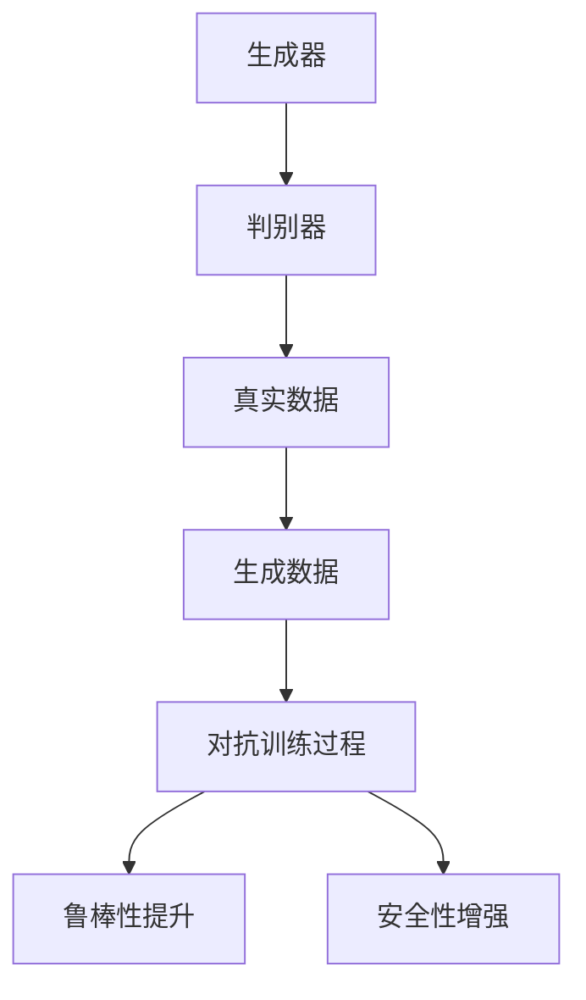
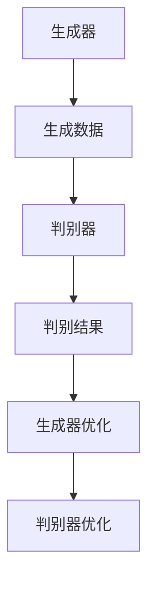
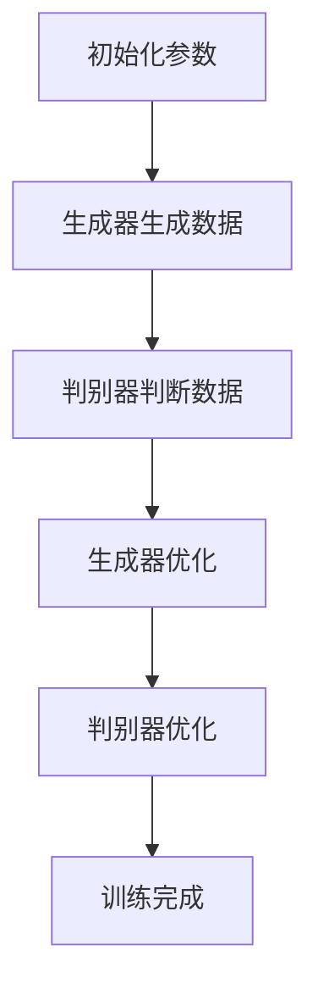

                 


# AI Agent的对抗训练：增强LLM的鲁棒性与安全性

**关键词：** AI Agent, 对抗训练, 大语言模型, 鲁棒性, 安全性, 机器学习, 对抗攻击

**摘要：**  
本文探讨了AI Agent在大语言模型（LLM）中的应用，特别是通过对抗训练来增强其鲁棒性和安全性。文章从基本概念入手，详细分析了对抗训练的核心原理、数学模型和算法实现，结合系统架构设计和项目实战，展示了对抗训练在提升LLM性能中的实际应用。此外，文章还讨论了对抗训练的安全评估方法，为读者提供了全面的理解和实践指南。

---

# 第1章: AI Agent与对抗训练的背景介绍

## 1.1 AI Agent的基本概念

### 1.1.1 AI Agent的定义与特点
AI Agent是一种智能体，能够感知环境、自主决策并执行任务。其特点包括：
- **自主性：** 能够独立决策，无需外部干预。
- **反应性：** 能够实时响应环境变化。
- **目标导向：** 以特定目标为导向，优化行为。
- **学习能力：** 能通过经验改进性能。

### 1.1.2 大语言模型（LLM）的基本原理
LLM通过深度神经网络处理大量文本数据，生成自然语言文本。其核心是Transformer架构，利用自注意力机制捕捉上下文信息。

### 1.1.3 AI Agent在LLM中的应用
AI Agent作为LLM的增强模块，能够提高模型的交互能力和适应性，特别是在复杂场景中的应用。

## 1.2 对抗训练的基本概念
### 1.2.1 对抗训练的定义
对抗训练是一种机器学习方法，通过两个模型（生成器和判别器）的对抗训练，优化生成器生成逼真数据的能力。

### 1.2.2 对抗训练的核心思想
通过对抗过程，生成器和判别器互相博弈，最终达到生成高质量数据的目的。

### 1.2.3 对抗训练在AI Agent中的作用
通过对抗训练，AI Agent能够更好地识别和防御对抗攻击，提升其鲁棒性和安全性。

## 1.3 LLM的鲁棒性与安全性问题
### 1.3.1 LLM的潜在安全风险
- **对抗攻击：** 黑客利用对抗样本攻击模型，导致错误输出。
- **隐私泄露：** 模型可能泄露训练数据中的敏感信息。
- **滥用风险：** 恶意用户可能利用模型进行非法活动。

### 1.3.2 对抗攻击对LLM的影响
对抗攻击可能导致LLM输出错误结果，威胁模型的可靠性和安全性。

### 1.3.3 对抗训练的必要性
通过对抗训练，可以增强模型的鲁棒性，使其在面对对抗攻击时保持稳定。

## 1.4 对抗训练的背景与现状
### 1.4.1 对抗训练的发展历程
从GAN到当前的对抗训练方法，技术不断进步，应用范围也在扩大。

### 1.4.2 当前对抗训练的研究热点
- **模型鲁棒性：** 提升模型对对抗攻击的抵抗能力。
- **安全性：** 确保模型在对抗环境中的安全使用。
- **高效性：** 提高对抗训练的效率和效果。

### 1.4.3 对抗训练在AI Agent中的应用前景
对抗训练将在提升AI Agent的智能性和安全性方面发挥重要作用。

## 1.5 本章小结
本章介绍了AI Agent和对抗训练的基本概念，分析了对抗训练在LLM中的重要性，并为后续章节奠定了基础。

---

# 第2章: 对抗训练的核心概念与联系

## 2.1 对抗训练的核心原理
### 2.1.1 对抗训练的基本模型
对抗训练通常由生成器和判别器组成，生成器生成数据，判别器判断数据是否真实。

### 2.1.2 对抗训练的目标函数
目标函数定义了生成器和判别器的损失函数，通过优化目标函数实现模型训练。

### 2.1.3 对抗训练的优化过程
通过交替优化生成器和判别器，逐步提升生成器生成高质量数据的能力。

## 2.2 对抗训练与AI Agent的关系
### 2.2.1 对抗训练如何增强AI Agent的鲁棒性
通过对抗训练，AI Agent能够识别和防御对抗攻击，提高模型的鲁棒性。

### 2.2.2 对抗训练如何提升AI Agent的安全性
对抗训练使AI Agent能够抵抗对抗攻击，确保模型的安全性。

### 2.2.3 对抗训练对AI Agent性能的双向影响
对抗训练可能对模型性能产生正向或负向影响，需要平衡生成器和判别器的能力。

## 2.3 对抗训练的核心概念对比
### 2.3.1 对抗训练与传统安全技术的对比
对抗训练是一种主动防御方法，而传统安全技术通常是被动防御。

### 2.3.2 对抗训练与强化学习的对比
强化学习通过奖励机制优化策略，而对抗训练通过博弈优化生成器和判别器。

### 2.3.3 对抗训练与生成对抗网络（GAN）的对比
GAN是一种特定的对抗训练模型，而对抗训练是更广泛的概念。

## 2.4 对抗训练的ER实体关系图


## 2.5 本章小结
本章分析了对抗训练的核心原理，探讨了对抗训练与AI Agent的关系，并通过对比和实体关系图进一步加深了理解。

---

# 第3章: 对抗训练的数学模型与算法原理

## 3.1 对抗训练

### 3.1.1 对抗训练的基本流程
1. 初始化生成器和判别器的参数。
2. 交替优化生成器和判别器，直到收敛。

### 3.1.2 对抗训练的数学模型
生成器的目标是最小化判别器的损失，判别器的目标是最大化真实数据与生成数据的区分度。

### 3.1.3 对抗训练的优化算法
通常使用梯度下降法优化生成器和判别器的参数。

### 3.1.4 对抗训练的损失函数
判别器的损失函数：
$$ L_d = -\mathbb{E}[\log(D(x))] - \mathbb{E}[\log(1 - D(G(z)))] $$
生成器的损失函数：
$$ L_g = -\mathbb{E}[\log(D(G(z)))] $$

### 3.1.5 对抗训练的实现步骤
1. 生成一批假数据。
2. 判别器判断数据是否为真实数据。
3. 生成器优化生成数据，使其更难被判别器识别。
4. 判别器优化参数，提高识别能力。

### 3.1.6 对抗训练的代码实现
```python
import torch
import torch.nn as nn

# 定义生成器和判别器
class Generator(nn.Module):
    def __init__(self, input_dim, output_dim):
        super(Generator, self).__init__()
        self.fc = nn.Linear(input_dim, output_dim)

    def forward(self, x):
        return torch.sigmoid(self.fc(x))

class Discriminator(nn.Module):
    def __init__(self, input_dim, output_dim):
        super(Discriminator, self).__init__()
        self.fc = nn.Linear(input_dim, output_dim)

    def forward(self, x):
        return torch.sigmoid(self.fc(x))

# 初始化模型
input_dim = 100
output_dim = 1
generator = Generator(input_dim, output_dim)
discriminator = Discriminator(input_dim, output_dim)

# 定义损失函数和优化器
criterion = nn.BCELoss()
generator_optimizer = torch.optim.Adam(generator.parameters(), lr=0.001)
discriminator_optimizer = torch.optim.Adam(discriminator.parameters(), lr=0.001)

# 训练过程
for epoch in range(num_epochs):
    # 生成假数据
    z = torch.randn(batch_size, input_dim)
    gen_output = generator(z)
    
    # 判别器训练
    discriminator.zero_grad()
    real_data = torch.randn(batch_size, input_dim)
    real_output = discriminator(real_data)
    gen_data_output = discriminator(gen_output)
    
    d_loss = criterion(real_output, torch.ones_like(real_output)) + criterion(gen_data_output, torch.zeros_like(gen_data_output))
    d_loss.backward()
    discriminator_optimizer.step()
    
    # 生成器训练
    generator.zero_grad()
    gen_loss = criterion(gen_data_output, torch.ones_like(gen_data_output))
    gen_loss.backward()
    generator_optimizer.step()
```

### 3.1.7 对抗训练的流程图


### 3.1.8 对抗训练的数学公式总结
生成器的目标函数：
$$ L_g = -\mathbb{E}[\log(D(G(z)))] $$
判别器的目标函数：
$$ L_d = -\mathbb{E}[\log(D(x)) + \log(1 - D(G(z)))] $$

## 3.2 对抗训练的数学模型
### 3.2.1 对抗训练的数学推导
通过优化生成器和判别器的目标函数，可以得到生成器和判别器的最优解。

### 3.2.2 对抗训练的数学证明
通过拉格朗日乘数法，可以证明对抗训练的最优解是生成器和判别器的纳什均衡点。

### 3.2.3 对抗训练的数学公式
生成器和判别器的损失函数如上所述，通过交替优化，可以得到最优参数。

## 3.3 对抗训练的算法实现
### 3.3.1 对抗训练的算法步骤
1. 初始化生成器和判别器的参数。
2. 生成一批假数据。
3. 判别器判断数据是否为真实数据。
4. 生成器优化生成数据，使其更难被判别器识别。
5. 判别器优化参数，提高识别能力。

### 3.3.2 对抗训练的代码实现
如上所示，通过PyTorch实现对抗训练的生成器和判别器。

### 3.3.3 对抗训练的算法流程图


## 3.4 对抗训练的数学模型和代码实现的对比分析
通过对比分析，可以发现数学模型和代码实现的对应关系，进一步理解对抗训练的实现细节。

## 3.5 本章小结
本章详细分析了对抗训练的数学模型和算法实现，为后续章节的系统架构设计和项目实战奠定了基础。

---

# 第4章: 对抗训练的系统架构设计

## 4.1 系统模块划分
### 4.1.1 生成器模块
负责生成对抗数据，提升模型的鲁棒性。

### 4.1.2 判别器模块
负责判断数据的真实性和对抗性，增强模型的安全性。

### 4.1.3 对抗训练模块
通过交替优化生成器和判别器，提升模型的对抗能力。

## 4.2 系统功能设计
### 4.2.1 系统功能模块化设计
- 数据生成模块：生成真实数据和对抗数据。
- 判别器模块：判断数据的真实性和对抗性。
- 生成器模块：生成对抗数据，提升模型的鲁棒性。

### 4.2.2 系统功能流程设计
1. 生成器生成对抗数据。
2. 判别器判断数据的真实性和对抗性。
3. 对抗训练模块优化生成器和判别器的参数。

### 4.2.3 系统功能流程图


## 4.3 系统架构设计
### 4.3.1 系统架构概述
系统由生成器、判别器和对抗训练模块组成，通过模块化设计实现功能分离。

### 4.3.2 系统架构图


### 4.3.3 系统接口设计
- 生成器接口：生成对抗数据。
- 判别器接口：判断数据的真实性和对抗性。
- 对抗训练接口：优化生成器和判别器的参数。

### 4.3.4 系统交互设计


## 4.4 系统架构设计的优缺点
### 4.4.1 优点
- 功能模块化，便于维护和扩展。
- 生成器和判别器独立优化，提高训练效率。

### 4.4.2 缺点
- 系统复杂度增加，可能影响性能。
- 需要协调生成器和判别器的训练过程。

## 4.5 本章小结
本章详细分析了对抗训练的系统架构设计，为后续章节的项目实战奠定了基础。

---

# 第5章: 对抗训练的项目实战

## 5.1 环境搭建
### 5.1.1 系统环境要求
- 操作系统：Windows 10或更高版本，Linux Ubuntu 18.04或更高版本。
- Python版本：Python 3.8或更高版本。
- 依赖库：PyTorch、numpy、matplotlib。

### 5.1.2 安装依赖
使用pip安装所需的依赖库：
```bash
pip install torch numpy matplotlib
```

## 5.2 代码实现
### 5.2.1 生成器和判别器的实现
如上所述，使用PyTorch实现生成器和判别器。

### 5.2.2 对抗训练的实现
通过交替优化生成器和判别器，实现对抗训练。

### 5.2.3 训练过程中的损失函数和优化器
定义损失函数和优化器，初始化生成器和判别器的参数。

## 5.3 案例分析
### 5.3.1 案例背景
假设我们有一个生成器和判别器的对抗训练任务，目标是生成高质量的数据，使其难以被判别器识别。

### 5.3.2 训练过程
通过交替优化生成器和判别器，逐步提升生成器生成高质量数据的能力。

### 5.3.3 训练结果
生成器能够生成高质量数据，判别器难以区分生成数据和真实数据。

## 5.4 实际案例分析
### 5.4.1 案例背景
通过具体案例展示对抗训练的实际应用，如生成对抗文本数据。

### 5.4.2 训练过程
详细分析训练过程中的损失函数变化和模型参数优化。

### 5.4.3 训练结果
展示生成器生成的对抗数据和判别器的识别结果。

## 5.5 项目实战总结
### 5.5.1 实战经验总结
对抗训练的关键在于生成器和判别器的优化过程，需要平衡两者的性能。

### 5.5.2 实战中遇到的问题及解决方案
- **问题：** 判别器过快收敛，生成器无法生成高质量数据。
- **解决方案：** 使用更复杂的网络结构或调整优化器的学习率。

### 5.5.3 实战中的注意事项
- **注意：** 生成器和判别器的训练比例需要平衡。
- **注意：** 对抗训练可能需要大量的计算资源，需要优化训练策略。

## 5.6 本章小结
本章通过具体案例展示了对抗训练的项目实战过程，为读者提供了实际操作的经验。

---

# 第6章: 对抗训练的安全评估

## 6.1 对抗训练的安全评估指标
### 6.1.1 安全评估指标
- **准确率：** 模型在对抗环境中的准确率。
- **鲁棒性：** 模型对对抗攻击的抵抗能力。
- **安全性：** 模型在对抗环境中的安全性能。

### 6.1.2 安全评估指标的计算方法
通过测试模型在对抗攻击下的表现，计算准确率和鲁棒性指标。

## 6.2 对抗训练的安全评估方法
### 6.2.1 基于生成器的评估方法
评估生成器生成对抗数据的能力，判断其对模型的影响。

### 6.2.2 基于判别器的评估方法
评估判别器对对抗数据的识别能力，判断其对模型的保护效果。

### 6.2.3 综合评估方法
结合生成器和判别器的评估结果，综合判断对抗训练的安全性。

## 6.3 对抗训练的安全评估挑战
### 6.3.1 安全评估的复杂性
对抗训练的安全评估需要综合考虑生成器和判别器的性能。

### 6.3.2 安全评估的不确定性
对抗训练的安全性受到生成器和判别器的动态博弈影响，具有不确定性。

### 6.3.3 安全评估的局限性
现有的安全评估方法可能无法全面覆盖所有对抗场景。

## 6.4 对抗训练的安全评估应对策略
### 6.4.1 提高生成器的生成能力
通过改进生成器的网络结构，增强其生成高质量数据的能力。

### 6.4.2 提高判别器的识别能力
通过优化判别器的网络结构，增强其对对抗数据的识别能力。

### 6.4.3 综合优化策略
平衡生成器和判别器的能力，制定合理的优化策略，提升模型的安全性。

## 6.5 本章小结
本章分析了对抗训练的安全评估指标和方法，探讨了安全评估的挑战，并提出了应对策略。

---

# 第7章: 总结与展望

## 7.1 总结
本文系统地介绍了AI Agent的对抗训练，分析了对抗训练的核心原理和数学模型，探讨了系统的架构设计和项目实战，最后总结了对抗训练的安全评估方法。

## 7.2 展望
未来的研究方向包括：
- **模型优化：** 进一步优化生成器和判别器的网络结构，提升对抗训练的效果。
- **安全性提升：** 研究新的安全评估方法，提高对抗训练的安全性。
- **应用拓展：** 将对抗训练应用于更多领域，如图像识别、自然语言处理等。

## 7.3 本章小结
总结全文，展望未来的研究方向。

---

# 参考文献
（此处列出相关的参考文献）

---

通过以上结构和内容安排，文章系统地介绍了AI Agent的对抗训练，从理论到实践，为读者提供了全面的知识和实用的指导。

