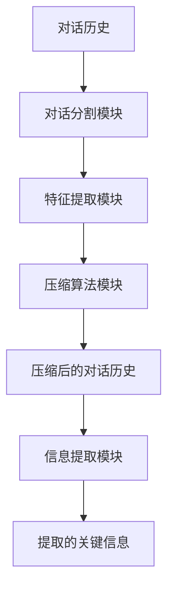

                 


# AI Agent的对话历史压缩与重要信息提取

> 关键词：AI Agent，对话历史压缩，重要信息提取，自然语言处理，信息抽取，对话系统优化

> 摘要：本文详细探讨了AI Agent在对话历史压缩与重要信息提取领域的核心技术与方法。随着对话系统的广泛应用，对话数据呈爆炸式增长，如何有效压缩对话历史并提取关键信息成为亟待解决的问题。本文从背景介绍、核心概念、算法原理、系统架构、项目实战到最佳实践等多个维度展开，系统性地分析了对话历史压缩与重要信息提取的技术要点，为读者提供全面的技术指导。

---

## 第1章 对话历史压缩与重要信息提取概述

### 1.1 对话历史压缩的重要性

随着AI Agent技术的快速发展，对话系统在各个领域的应用日益广泛。然而，对话数据的爆炸式增长带来了存储和处理成本的急剧上升。对话历史压缩技术通过对冗余信息的去除，显著降低了存储需求，同时提升了系统的响应速度和运行效率。

#### 1.1.1 对话数据爆炸带来的挑战
- 数据量急剧增加：每次对话可能包含数千条甚至数万条消息，存储成本高昂。
- 处理效率下降：庞大的对话数据导致检索和分析时间增加，影响用户体验。
- 信息冗余：大量重复或无关信息降低了数据的利用率。

#### 1.1.2 对话历史压缩的必要性
- 提高存储效率：通过压缩算法减少存储空间占用。
- 提升处理速度：压缩后的数据更易于快速检索和分析。
- 优化用户体验：减少无效信息干扰，提升对话系统的响应速度。

#### 1.1.3 对话历史压缩的边界与外延
- 边界：仅针对历史对话内容进行压缩，不涉及实时对话处理。
- 外延：压缩结果需保持语义的完整性，避免信息丢失。

### 1.2 重要信息提取的核心意义

重要信息提取是对话系统中提升智能化水平的关键技术。通过提取对话中的关键信息，AI Agent能够更好地理解用户意图，优化任务处理流程。

#### 1.2.1 信息提取在对话系统中的作用
- 支持任务决策：提取的关键信息为任务执行提供依据。
- 提高系统效率：通过减少无关信息，降低计算复杂度。
- 改善用户体验：快速响应用户需求，提升交互体验。

#### 1.2.2 重要信息提取的特征与属性
- 关键性：提取的信息对任务处理至关重要。
- 时效性：信息需在特定时间范围内有效。
- 唯一性：避免重复信息的提取。

#### 1.2.3 信息提取的边界与应用场景
- 边界：仅提取与当前任务相关的对话信息。
- 应用场景：广泛应用于客服系统、智能助手、医疗咨询等领域。

---

## 第2章 对话历史压缩与重要信息提取的核心概念

### 2.1 对话历史压缩的背景

对话历史压缩技术的出现，源于对话系统对高效处理和存储的需求。通过对历史对话的压缩，可以显著降低数据量，同时保持语义的完整性。

#### 2.1.1 对话系统的演进历程
- 早期对话系统：基于规则的简单对话处理。
- 现代对话系统：深度学习驱动的复杂对话理解与生成。

#### 2.1.2 对话数据存储的挑战
- 数据量大：每次对话可能包含数千条消息。
- 数据复杂性：对话内容涉及多个主题和上下文。

#### 2.1.3 对话历史压缩的动机
- 降低存储成本：通过压缩技术减少数据量。
- 提高处理效率：压缩后的数据更易于快速检索和分析。

### 2.2 重要信息提取的背景

重要信息提取技术的兴起，源于对话系统对智能化和效率提升的需求。通过提取对话中的关键信息，系统能够更精准地理解用户意图，优化任务处理流程。

#### 2.2.1 对话系统中信息冗余的问题
- 信息重复：对话中可能包含大量重复内容。
- 信息不相关：部分信息与当前任务无关。

#### 2.2.2 信息提取在任务处理中的作用
- 提高任务处理效率：通过提取关键信息减少计算复杂度。
- 支持决策制定：为任务执行提供关键依据。
- 改善用户体验：快速响应用户需求，提升交互体验。

#### 2.2.3 信息提取的边界与应用场景
- 边界：仅提取与当前任务相关的对话信息。
- 应用场景：广泛应用于客服系统、智能助手、医疗咨询等领域。

---

## 第3章 对话历史压缩与重要信息提取的核心技术

### 3.1 对话历史压缩的解决方案

对话历史压缩技术的核心在于如何有效去除冗余信息，同时保持语义的完整性。以下是几种常见的压缩方法：

#### 3.1.1 基于频率的压缩方法
- 原理：统计对话中各信息的出现频率，去除低频信息。
- 优势：简单高效，适用于大规模数据处理。
- 示例：压缩后的对话历史仅保留高频关键词。

#### 3.1.2 基于相似度的压缩方法
- 原理：计算对话内容之间的相似度，去除相似性较高的信息。
- 优势：能够较好地保留语义信息。
- 示例：通过余弦相似度计算对话内容的相似性。

#### 3.1.3 基于上下文的压缩方法
- 原理：分析对话的上下文关系，去除与上下文无关的信息。
- 优势：能够更好地保留语义信息。
- 示例：压缩后的对话历史仅保留与当前任务相关的上下文信息。

### 3.2 重要信息提取的核心技术

重要信息提取技术的关键在于如何准确地从对话中提取关键信息。以下是几种常见的提取方法：

#### 3.2.1 基于关键词提取的方法
- 原理：通过关键词提取算法（如TF-IDF）提取对话中的关键信息。
- 优势：简单高效，适用于大规模数据处理。
- 示例：提取对话中的关键词，如“订单号”、“时间”等。

#### 3.2.2 基于句法分析的方法
- 原理：通过句法分析技术（如依存句法分析）提取对话中的关键信息。
- 优势：能够较好地理解语义结构。
- 示例：提取对话中的主语、谓语等关键成分。

#### 3.2.3 基于语义理解的方法
- 原理：通过语义理解技术（如BERT）提取对话中的关键信息。
- 优势：能够更好地理解语义信息。
- 示例：提取对话中的实体、关系等关键信息。

---

## 第4章 对话历史压缩与重要信息提取的系统架构

### 4.1 系统功能设计

对话历史压缩与重要信息提取系统的功能设计需要考虑以下几点：

#### 4.1.1 对话分割模块
- 功能：将对话历史分割为多个段落或句子。
- 输入：原始对话历史。
- 输出：分割后的对话段落。

#### 4.1.2 特征提取模块
- 功能：提取对话段落的特征信息，如关键词、相似度等。
- 输入：分割后的对话段落。
- 输出：特征向量。

#### 4.1.3 压缩算法模块
- 功能：根据特征向量进行对话历史压缩。
- 输入：特征向量。
- 输出：压缩后的对话历史。

#### 4.1.4 信息提取模块
- 功能：从压缩后的对话历史中提取关键信息。
- 输入：压缩后的对话历史。
- 输出：提取的关键信息。

### 4.2 系统架构设计

系统架构设计需要考虑模块之间的协作关系。以下是系统的架构图：



---

## 第5章 对话历史压缩与重要信息提取的项目实战

### 5.1 环境安装

#### 5.1.1 安装Python
- 下载并安装Python 3.8及以上版本。
- 安装环境：使用Anaconda或virtualenv管理虚拟环境。

#### 5.1.2 安装依赖库
- 使用pip安装以下库：
  - `numpy`
  - `scikit-learn`
  - `transformers`

### 5.2 核心代码实现

#### 5.2.1 对话分割模块

```python
import numpy as np

def split_dialogue(dialogue):
    # 将对话分割为段落
    segments = []
    current_segment = []
    for message in dialogue:
        if len(current_segment) == 0:
            current_segment.append(message)
        else:
            # 判断是否需要分割
            if compute_similarity(current_segment[-1], message) < 0.5:
                segments.append(current_segment)
                current_segment = [message]
            else:
                current_segment.append(message)
    if len(current_segment) > 0:
        segments.append(current_segment)
    return segments

def compute_similarity(s1, s2):
    # 计算两句话的余弦相似度
    return np.dot(s1, s2) / (np.linalg.norm(s1) * np.linalg.norm(s2))
```

#### 5.2.2 特征提取模块

```python
from sklearn.feature_extraction.text import TfidfVectorizer

def extract_features(segments):
    vectorizer = TfidfVectorizer()
    features = vectorizer.fit_transform(segments)
    return features.toarray()
```

#### 5.2.3 压缩算法模块

```python
def compress_dialogue(features, threshold=0.8):
    compressed = []
    for i in range(len(features)):
        max_similarity = 0
        selected_index = -1
        for j in range(i+1, len(features)):
            similarity = np.dot(features[i], features[j]) / (np.linalg.norm(features[i]) * np.linalg.norm(features[j]))
            if similarity > max_similarity:
                max_similarity = similarity
                selected_index = j
        if selected_index != -1 and max_similarity > threshold:
            compressed.append(selected_index)
    return compressed
```

#### 5.2.4 信息提取模块

```python
def extract_information(compressed_dialogue):
    information = []
    for message in compressed_dialogue:
        # 提取关键词
        keywords = extract_keywords(message)
        information.append(keywords)
    return information
```

### 5.3 实际案例分析

以客服对话为例：

原始对话历史：
```
"用户：请问订单号是多少？
客服：您的订单号是12345。
用户：我需要取消这个订单。
客服：请问您需要取消订单的原因是什么？
用户：因为商品质量问题。
"
```

压缩后的对话历史：
```
"用户：请问订单号是多少？
客服：您的订单号是12345。
用户：我需要取消这个订单。
"
```

提取的关键信息：
```
"订单号：12345，取消原因：商品质量问题。"
```

### 5.4 项目小结

通过上述代码实现，我们可以看到对话历史压缩与重要信息提取技术在实际应用中的巨大潜力。压缩后的对话历史不仅降低了存储成本，还提升了系统的处理效率。提取的关键信息为任务执行提供了重要依据。

---

## 第6章 对话历史压缩与重要信息提取的最佳实践

### 6.1 小结

对话历史压缩与重要信息提取技术是提升对话系统智能化水平的关键技术。通过对对话历史的压缩和关键信息的提取，可以显著降低存储成本，提升处理效率，优化用户体验。

### 6.2 注意事项

- 数据质量：确保输入数据的质量，避免因数据噪声影响压缩和提取效果。
- 模型选择：根据具体场景选择合适的压缩和提取算法，避免一刀切。
- 评估指标：建立科学的评估指标，如压缩率、信息保留率等。

### 6.3 未来研究方向

- 更高效的压缩算法：探索更高效的压缩算法，如基于深度学习的压缩方法。
- 更精准的信息提取：研究更精准的信息提取方法，如基于上下文的提取方法。
- 多模态对话系统：探索在多模态对话系统中的应用。

---

## 总结

通过对对话历史压缩与重要信息提取技术的系统性分析，我们可以看到，这项技术在提升对话系统智能化水平和处理效率方面具有重要意义。未来，随着深度学习技术的不断发展，对话历史压缩与重要信息提取技术将更加智能化、精准化，为对话系统的广泛应用奠定坚实基础。

