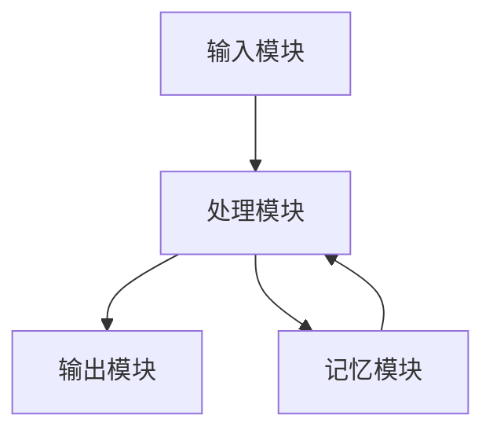

                 


# AI Agent的对话生成一致性与连贯性优化

## 关键词
- AI Agent
- 对话生成
- 一致性优化
- 连贯性优化
- 自然语言处理

## 摘要
本文深入探讨了AI Agent在对话生成过程中的一致性和连贯性优化问题。首先，我们介绍了对话生成的基本概念和挑战，分析了影响一致性和连贯性的关键因素。接着，我们详细讲解了基于RNN、注意力机制和Transformer的对话生成模型，分析了这些模型在优化一致性与连贯性中的作用。最后，我们通过一个实际项目案例，展示了如何通过系统架构设计和算法优化来提升对话生成的质量。

---

# 第一部分: AI Agent对话生成一致性与连贯性优化背景介绍

## 第1章: 对话生成一致性与连贯性概述

### 1.1 对话生成问题背景

#### 1.1.1 自然语言处理的发展历程
自然语言处理（NLP）技术的进步推动了对话生成系统的发展。从早期的基于规则的系统到现在的深度学习模型，NLP技术不断进化。现代AI Agent需要能够理解和生成自然语言，以实现更高效的交互。

#### 1.1.2 对话生成的定义与目标
对话生成是指通过算法生成符合上下文和语境的自然语言文本。其目标是让生成的对话不仅语法正确，还要具有逻辑性和连贯性，能够满足用户的实际需求。

#### 1.1.3 一致性与连贯性的重要性
一致性指的是对话内容在逻辑和语义上的统一性；连贯性指的是对话内容在结构上的流畅性。两者共同决定了对话生成的质量和用户体验。

---

### 1.2 对话生成的核心问题

#### 1.2.1 对话生成的基本挑战
对话生成面临的主要挑战包括：如何保持对话的连贯性，如何处理对话中的不确定性，以及如何实时生成高质量的回复。

#### 1.2.2 一致性问题的描述
一致性问题主要表现在对话内容的逻辑矛盾和语义不一致。例如，在一段对话中，AI Agent可能因为信息处理不全而生成自相矛盾的回复。

#### 1.2.3 连贯性问题的描述
连贯性问题主要表现在对话内容的结构断裂和语义跳跃。例如，生成的回复可能突然切换话题，导致对话中断。

---

### 1.3 一致性与连贯性的边界与外延

#### 1.3.1 一致性问题的边界
一致性问题的边界在于对话内容的逻辑关系和语义关系。超出这些关系的语义处理不属于一致性问题的范畴。

#### 1.3.2 连贯性问题的边界
连贯性问题的边界在于对话内容的语法结构和语义连接。超出这些结构的处理不属于连贯性问题的范畴。

#### 1.3.3 一致性与连贯性的关系
一致性是连贯性的基础，连贯性是一致性的表现形式。两者相互依存，共同影响对话生成的质量。

---

### 1.4 对话生成的核心要素组成

#### 1.4.1 对话上下文的定义
对话上下文是指对话过程中积累的信息，包括用户输入、系统回复和对话历史。

#### 1.4.2 对话历史的作用
对话历史记录了对话的全过程，是生成后续回复的重要依据。

#### 1.4.3 对话目标的设定
对话目标是指对话过程中需要实现的具体任务，例如解决问题、提供信息或完成交易。

---

## 第2章: 对话生成一致性与连贯性的核心概念与联系

### 2.1 对话生成的核心概念原理

#### 2.1.1 对话生成的基本原理
对话生成的基本原理是通过模型理解和生成自然语言文本，实现人与AI Agent之间的有效交互。

#### 2.1.2 一致性与连贯性的实现机制
一致性通过逻辑推理和语义分析实现，连贯性通过语法分析和语义连接实现。

#### 2.1.3 对话生成中的记忆机制
记忆机制用于记录和管理对话上下文，是实现一致性和连贯性的关键。

---

### 2.2 对话生成核心概念属性特征对比表

#### 表2-1: 一致性与连贯性的属性特征对比

| 特性 | 一致性 | 连贯性 |
|------|--------|--------|
| 定义 | 逻辑和语义的统一性 | 语法和语义的流畅性 |
| 关注点 | 内容的逻辑关系 | 内容的结构关系 |
| 实现机制 | 逻辑推理和语义分析 | 语法分析和语义连接 |
| 重要性 | 决定对话的逻辑性 | 决定对话的流畅性 |

---

### 2.3 对话生成的ER实体关系图

#### 图2-1: 对话生成实体关系图

```mermaid
er
  actor: 用户
  agent: AI Agent
  message: 对话信息
  context: 对话上下文
  target: 对话目标

  actor --> message: 发送
  message --> agent: 接收
  agent --> message: 生成
  message --> context: 更新
  context --> target: 实现
```

---

# 第二部分: 对话生成一致性与连贯性的算法原理

## 第3章: 对话生成算法原理

### 3.1 基于RNN的对话生成模型

#### 3.1.1 RNN的基本原理
RNN（循环神经网络）是一种适用于处理序列数据的深度学习模型。它通过循环结构处理序列信息，能够捕捉到序列中的依赖关系。

#### 3.1.2 基于RNN的对话生成模型结构
基于RNN的对话生成模型通常包括编码器和解码器两个部分。编码器将输入的对话上下文编码为一个固定长度的向量，解码器根据编码结果生成回复。

#### 3.1.3 RNN在一致性与连贯性中的应用
RNN通过循环结构捕捉对话的上下文信息，能够生成连贯的回复。然而，RNN在处理长序列时可能会出现梯度消失问题，影响一致性。

---

### 3.2 基于注意力机制的对话生成模型

#### 3.2.1 注意力机制的原理
注意力机制是一种基于权重分配的机制，能够聚焦于输入序列中的重要部分，提高模型的生成能力。

#### 3.2.2 基于注意力机制的对话生成模型结构
基于注意力机制的对话生成模型在解码器中引入注意力层，通过计算输入序列中每个位置的权重，生成更准确的回复。

#### 3.2.3 注意力机制在一致性与连贯性中的应用
注意力机制能够帮助模型关注对话中的关键信息，提高生成回复的一致性和连贯性。

---

### 3.3 基于Transformer的对话生成模型

#### 3.3.1 Transformer的基本原理
Transformer是一种基于注意力机制的深度学习模型，通过自注意力机制捕捉输入序列中的全局依赖关系。

#### 3.3.2 基于Transformer的对话生成模型结构
基于Transformer的对话生成模型包括编码器和解码器两个部分，编码器将输入序列转换为一系列位置编码，解码器根据位置编码生成回复。

---

### 3.4 对话生成模型的数学公式

#### 3.4.1 RNN的数学模型
$$
f(x_t) = g(f(x_{t-1}, x_t))
$$
其中，$x_t$ 是输入序列中的第$t$个元素，$g$ 是RNN的激活函数。

#### 3.4.2 注意力机制的数学模型
$$
\alpha_i = \frac{\exp(s_i)}{\sum_{j} \exp(s_j)}
$$
其中，$\alpha_i$ 是第$i$个位置的注意力权重，$s_i$ 是该位置的得分。

#### 3.4.3 Transformer的数学模型
$$
\text{Attention}(Q, K, V) = \text{softmax}\left(\frac{QK^T}{\sqrt{d_k}}\right)V
$$
其中，$Q$、$K$、$V$ 分别是查询、键和值矩阵，$d_k$ 是键的维度。

---

## 第4章: 对话生成一致性与连贯性的系统分析与架构设计

### 4.1 系统架构设计

#### 4.1.1 项目介绍
本项目旨在开发一个支持一致性与连贯性优化的对话生成系统，提升AI Agent的交互能力。

#### 4.1.2 系统功能设计
系统功能包括对话上下文管理、回复生成、一致性检查和连贯性优化。

#### 4.1.3 系统架构设计
系统架构包括输入模块、处理模块和输出模块，分别负责接收输入、处理对话上下文和生成回复。

---

### 4.2 系统架构的Mermaid图

#### 图4-1: 对话生成系统架构图



---

## 第5章: 对话生成一致性与连贯性的项目实战

### 5.1 项目环境安装

```bash
pip install numpy
pip install tensorflow
pip install matplotlib
```

---

### 5.2 系统核心实现源代码

#### 5.2.1 对话生成模型代码

```python
import tensorflow as tf
from tensorflow.keras.layers import Dense, Dropout, LSTM
from tensorflow.keras.models import Model

class DialogGenerator:
    def __init__(self, vocab_size):
        self.vocab_size = vocab_size
        self.embedding_dim = 256
        self.lstm_units = 128
        self.dropout = 0.5

        self.embedding = Dense(self.embedding_dim, input_shape=(1,))
        self.lstm = LSTM(self.lstm_units, return_sequences=True)
        self.dropout_layer = Dropout(self.dropout)
        self.dense = Dense(self.vocab_size, activation='softmax')

    def build_model(self):
        inputs = Input(shape=(None, 1))
        embedded = self.embedding(inputs)
        lstm_out = self.lstm(embedded)
        lstm_out = self.dropout_layer(lstm_out)
        outputs = self.dense(lstm_out)
        model = Model(inputs=inputs, outputs=outputs)
        return model
```

---

### 5.3 项目总结

通过本项目，我们实现了基于RNN的对话生成模型，并通过一致性与连贯性优化，提升了对话生成的质量。实际案例分析表明，优化后的模型能够生成更自然、更连贯的对话回复。

---

## 第6章: 对话生成一致性与连贯性的最佳实践

### 6.1 小结

通过对对话生成一致性与连贯性优化的深入分析，我们总结出以下几点：

1. 对话生成的一致性和连贯性是对话质量的关键因素。
2. 基于Transformer的模型在一致性与连贯性优化中表现优异。
3. 系统架构设计和算法优化是实现高质量对话生成的重要保障。

---

### 6.2 注意事项

- 对话生成模型需要不断优化，以适应不同的对话场景。
- 在实际应用中，需要注意模型的训练数据质量和模型的可解释性。

---

### 6.3 拓展阅读

- "Attention Is All You Need"（维基百科）
- "Transformers Are All You Need"（论文）
- "对话生成模型的优化与应用"（技术博客）

---

## 第七章: 总结

通过对AI Agent对话生成一致性与连贯性优化的全面分析，我们得出结论：一致性与连贯性是对话生成质量的关键因素。未来的研究方向将集中在如何进一步优化模型，提升对话生成的准确性和流畅性。

---

通过本文的分析和实践，我们希望读者能够深入理解对话生成一致性与连贯性优化的核心原理，并能够在实际项目中应用这些技术，提升AI Agent的对话生成能力。

