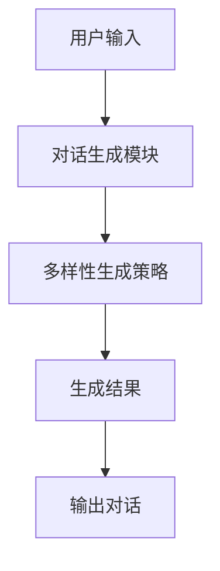
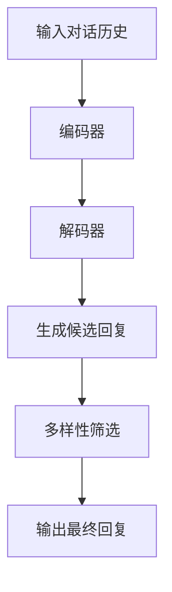

                 


# AI Agent的对话生成多样性：避免单调回复

> 关键词：AI Agent, 对话生成, 多样性, 单调回复, 生成式模型, 注意力机制, 变体生成

> 摘要：本文深入探讨了AI Agent对话生成中避免单调回复的问题，从背景概念、算法原理到系统架构和项目实战，详细分析了生成式AI Agent的工作原理、多样性生成的实现方法，并结合实际案例和代码示例，提供了一套完整的解决方案。通过对比分析、流程图和数学公式，本文为读者提供了清晰的技术路线和实践指导，帮助开发者提升AI对话系统的用户体验。

---

# 第一部分: AI Agent对话生成的背景与概念

## 第1章: AI Agent的基本概念与背景

### 1.1 AI Agent的定义与特点
- **1.1.1 AI Agent的定义**
  AI Agent（人工智能代理）是指能够感知环境并采取行动以实现特定目标的智能实体。它能够通过学习和推理，自主决策并执行任务。
- **1.1.2 AI Agent的核心特点**
  - **自主性**：能够在没有外部干预的情况下自主运行。
  - **反应性**：能够实时感知环境并做出响应。
  - **目标导向性**：所有行为都围绕实现特定目标展开。
  - **学习能力**：通过数据和经验不断优化自身性能。
- **1.1.3 AI Agent的应用场景**
  AI Agent广泛应用于聊天机器人、智能助手、推荐系统、自动驾驶等领域。

### 1.2 对话生成的背景与挑战
- **1.2.1 对话生成的定义与作用**
  对话生成是AI Agent的核心功能之一，指系统根据输入的文本生成自然、连贯的回复。
- **1.2.2 对话生成的常见挑战**
  - **上下文理解**：如何准确捕捉对话的上下文信息。
  - **语义多样性**：如何生成多样的表达方式，避免重复。
  - **用户意图识别**：如何准确识别用户的深层需求。
- **1.2.3 当前对话生成技术的现状与不足**
  当前主流的生成式模型（如GPT系列）在生成多样性方面表现出色，但在上下文理解和语境适应方面仍有不足。

### 1.3 问题背景与问题描述
- **1.3.1 单调回复的定义与表现**
  单调回复指AI Agent在对话中反复使用相似的表达方式，导致用户体验单调乏味。
- **1.3.2 单调回复对用户体验的影响**
  - **降低用户满意度**：用户可能对重复的回复感到厌倦。
  - **削弱信任感**：用户可能认为系统缺乏智能性。
  - **限制应用场景**：在需要多样化表达的场景中，单调回复会显得不够自然。
- **1.3.3 如何避免单调回复的问题解决思路**
  通过引入多样性生成策略、优化模型训练数据和改进生成机制，可以有效避免单调回复。

### 1.4 问题的边界与外延
- **1.4.1 单调回复的边界条件**
  单调回复主要在封闭领域（如客服、助手）中表现明显，而在开放领域（如创作）中可能受到更多限制。
- **1.4.2 对话生成多样性的范围与限制**
  多样性生成需要在保证语义正确的前提下进行，过度追求多样性可能导致语义混乱。
- **1.4.3 相关概念的对比与区分**
  - **生成式模型 vs 检索式模型**：生成式模型通过训练生成新内容，检索式模型基于已有数据进行匹配。
  - **多样性生成 vs 单一样本生成**：前者注重生成多种可能的回复，后者注重生成单一最优回复。
  - **AI Agent vs 传统对话系统**：AI Agent具有更强的自主性和适应性。

### 1.5 核心概念与结构
- **1.5.1 对话生成的核心要素**
  - **输入处理**：解析用户的输入并提取关键信息。
  - **生成策略**：决定生成回复的方式和内容。
  - **输出优化**：对生成的回复进行润色和调整。
- **1.5.2 AI Agent的结构与功能**
  - **感知层**：负责接收和处理用户输入。
  - **决策层**：基于感知层的信息做出生成决策。
  - **执行层**：生成回复并输出。
- **1.5.3 多样性生成的机制与流程**
  - **输入分析**：解析用户的意图和情感。
  - **生成策略选择**：根据上下文选择合适的生成方式。
  - **回复优化**：调整生成的回复以适应语境。

---

## 第2章: AI Agent对话生成的核心概念与联系

### 2.1 生成式AI Agent的原理
- **2.1.1 生成式AI Agent的基本原理**
  生成式AI Agent基于大规模预训练模型（如GPT），通过解码器生成自然语言文本。
- **2.1.2 基于Transformer的生成模型**
  Transformer模型通过自注意力机制捕捉文本中的长距离依赖关系，从而实现高效的生成。
- **2.1.3 对话生成的流程与关键步骤**
  1. 输入处理：解析用户的输入并提取关键信息。
  2. 上下文构建：维护对话历史以确保生成的连贯性。
  3. 回复生成：基于上下文生成多样化的回复。
  4. 输出优化：调整生成的回复以适应语境。

### 2.2 核心概念的属性特征对比
- **2.2.1 对比分析表：生成式模型与检索式模型**
  | 特性               | 生成式模型             | 检索式模型             |
  |--------------------|-----------------------|-----------------------|
  | 数据需求           | 需要大量训练数据       | 依赖预存知识库         |
  | 灵活性             | 高，可以生成新内容     | 低，只能匹配现有内容   |
  | 计算资源           | 高，需要大量计算资源   | 较低                  |
- **2.2.2 对比分析表：多样性生成与单一样本生成**
  | 特性               | 多样性生成             | 单一样本生成           |
  |--------------------|-----------------------|-----------------------|
  | 回复数量           | 多个                   | 单个                  |
  | 生成时间           | 较长                  | 较短                  |
  | 语义一致性         | 可能降低               | 较高                  |
- **2.2.3 对比分析表：不同AI Agent的对话风格**
  | 特性               | 传统聊天机器人         | 基于GPT的生成式AI Agent |
  |--------------------|-----------------------|-----------------------|
  | 自然度             | 较低                  | 较高                  |
  | 多样性             | 有限                  | 较高                  |
  | 适应性             | 较差                  | 较好                  |

### 2.3 ER实体关系图与流程图


---

## 第3章: AI Agent对话生成的算法原理

### 3.1 生成式AI Agent的基本算法
- **3.1.1 Transformer模型的基本结构**
  Transformer由编码器和解码器组成，编码器负责将输入序列映射为一个固定长度的向量，解码器负责根据编码器的输出生成目标序列。
- **3.1.2 解码器的生成机制**
  解码器通过自注意力机制捕捉输入序列中的长距离依赖关系，并逐步生成目标序列。
- **3.1.3 注意力机制的作用**
  注意力机制能够聚焦输入序列中重要的部分，从而提高生成的准确性和相关性。

### 3.2 多样性生成的算法实现
- **3.2.1 基于温度的采样方法**
  温度采样通过调整生成过程的随机性来控制多样性。温度值越高，生成的回复越多样化。
  $$\text{概率分布} = \text{softmax}(\log p(y|x)/\text{temperature})$$
- **3.2.2 基于Top-k采样的方法**
  Top-k采样通过选择概率最高的k个候选取样，从而在保证语义正确性的同时增加多样性。
- **3.2.3 基于核外的生成策略**
  核外生成策略通过引入外部知识库来丰富生成内容，从而提高多样性。

### 3.3 算法流程图


### 3.4 数学模型与公式
- **3.4.1 Transformer模型的数学公式**
  $$\text{Encoder}(x) = \text{LayerNorm}(x + \text{MultiHead}(\text{Q}(x)\text{K}(x)\text{V}(x)))$$
  $$\text{Decoder}(y, \text{Encoder}(x)) = \text{LayerNorm}(y + \text{MultiHead}(\text{Q}(y)\text{K}(\text{Encoder}(x))\text{V}(\text{Encoder}(x))))$$
- **3.4.2 注意力机制的数学公式**
  $$\text{Attention}(Q, K, V) = \text{softmax}\left(\frac{QK^T}{\sqrt{d_k}}\right)V$$
- **3.4.3 温度采样的数学公式**
  $$\text{概率分布} = \text{softmax}(\log p(y|x)/\text{temperature})$$

---

## 第4章: AI Agent对话生成的系统分析与架构设计

### 4.1 问题场景介绍
AI Agent对话生成系统需要在多种场景下工作，包括客服支持、教育辅助、娱乐互动等。每个场景对生成回复的多样性、准确性和响应速度都有不同的要求。

### 4.2 项目介绍
本项目旨在设计和实现一个基于生成式模型的AI对话系统，重点解决对话生成中的单调回复问题。通过引入多样性生成策略，提升用户体验。

### 4.3 系统功能设计
- **4.3.1 领域模型设计**
  ```mermaid
  classDiagram
      class 用户输入 {
          String inputText;
          void setInput(String text);
          String getInput();
      }
      class 对话生成模块 {
          void generateResponse(String input);
          String getResponse();
      }
      class 多样性生成策略 {
          void applyStrategy(List<String> candidates);
          String selectBestResponse();
      }
      用户输入 --> 对话生成模块
      对话生成模块 --> 多样性生成策略
  ```

- **4.3.2 系统架构设计**
  ```mermaid
  architecture
      客户端 --> 对话生成模块
      对话生成模块 --> 多样性生成策略
      多样性生成策略 --> 回答数据库
      多样性生成策略 --> 预训练模型
  ```

- **4.3.3 系统交互设计**
  ```mermaid
  sequenceDiagram
      用户 --> 客户端: 发送输入
      客户端 --> 对话生成模块: 请求生成回复
      对话生成模块 --> 多样性生成策略: 获取候选回复
      多样性生成策略 --> 预训练模型: 生成回复
      多样性生成策略 --> 回答数据库: 查询相关回复
      多样性生成策略 --> 客户端: 返回最终回复
  ```

### 4.4 系统接口设计
- **输入接口**：用户输入文本，系统解析并传递给生成模块。
- **输出接口**：系统返回生成的回复，用户接收并进行下一步操作。

---

## 第5章: AI Agent对话生成的项目实战

### 5.1 环境安装
- **Python 3.8 或更高版本**
- **TensorFlow或PyTorch框架**
- **预训练模型（如GPT）**

### 5.2 系统核心实现源代码
```python
import torch
import torch.nn as nn
import torch.nn.functional as F

class TransformerDecoder(nn.Module):
    def __init__(self, vocab_size, d_model=512, n_head=8, d_ff=2048):
        super(TransformerDecoder, self).__init__()
        self.embedding = nn.Embedding(vocab_size, d_model)
        self.decode_layers = nn.ModuleList([
            nn.TransformerDecoderLayer(d_model, n_head, d_ff) for _ in range(3)
        ])
        self.generator = nn.Linear(d_model, vocab_size)

    def forward(self, x, memory):
        x = self.embedding(x)
        for layer in self.decode_layers:
            x = layer(x, memory)
        return self.generator(x).log_softmax(dim=-1)

class DiversityGenerationStrategy:
    def __init__(self, model, temperature=1.0, top_k=5):
        self.model = model
        self.temperature = temperature
        self.top_k = top_k

    def generate(self, input_seq, max_length=50):
        with torch.no_grad():
            outputs = []
            input = input_seq
            for _ in range(max_length):
                logits = self.model(input, memory).squeeze(1)
                logits = logits / self.temperature
                top_k_logits = logits.topk(self.top_k)[1]
                input = top_k_logits
                outputs.append(top_k_logits)
            return outputs

# 示例使用
model = TransformerDecoder(vocab_size=10000)
strategy = DiversityGenerationStrategy(model)
input_seq = torch.randint(0, 10000, (1, 5))
output = strategy.generate(input_seq, max_length=10)
```

### 5.3 代码应用解读与分析
- **代码结构**：代码实现了基于Transformer的解码器和多样性生成策略。解码器负责生成候选回复，多样性生成策略负责从候选回复中选择最优的回复。
- **核心功能**：通过调整温度和Top-k参数，可以在生成过程中控制多样性和准确性。

### 5.4 案例分析
假设用户输入“今天天气怎么样？”，系统通过解析输入并调用生成策略生成多样化的回复，如“今天天气晴朗，适合外出。”、“天气很好，记得带伞哦。”等。

### 5.5 项目小结
通过引入多样性生成策略和优化生成过程，可以有效避免单调回复，提升用户体验。

---

## 第6章: AI Agent对话生成的最佳实践

### 6.1 关键技术总结
- **模型优化**：选择合适的预训练模型，并进行微调以适应特定场景。
- **多样性生成**：合理使用温度和Top-k采样方法，平衡多样性和准确性。
- **上下文管理**：维护对话历史，确保生成的回复连贯一致。

### 6.2 开发注意事项
- **数据质量**：确保训练数据多样化且覆盖广泛。
- **性能优化**：在生成过程中减少计算开销。
- **用户体验**：通过A/B测试优化回复的多样性和流畅性。

### 6.3 未来研究方向
- **多模态生成**：结合视觉和听觉信息，提升生成的多样性和自然度。
- **实时反馈机制**：根据用户反馈动态调整生成策略。
- **跨语言支持**：实现多语言对话生成，扩大应用范围。

### 6.4 小结
通过本文的分析和实践，我们可以看到，AI Agent对话生成的多样性和准确性可以通过合理的算法设计和系统优化来实现。未来的挑战在于如何在保证语义正确的前提下，进一步提升生成内容的多样性和自然度。

---

## 第7章: 总结与展望

### 7.1 总结
本文从背景概念、算法原理到系统设计和项目实战，全面探讨了AI Agent对话生成中避免单调回复的问题。通过引入多样性生成策略和优化生成过程，可以有效提升用户体验。

### 7.2 展望
未来的研究可以进一步探索多模态生成、实时反馈机制和跨语言支持，以实现更智能、更自然的对话生成。

---

# 结语
通过本文的详细分析和实践，我们希望能够为读者提供一个清晰的技术路线和实践指导，帮助开发者更好地理解和实现AI Agent的对话生成功能，避免单调回复，提升用户体验。

