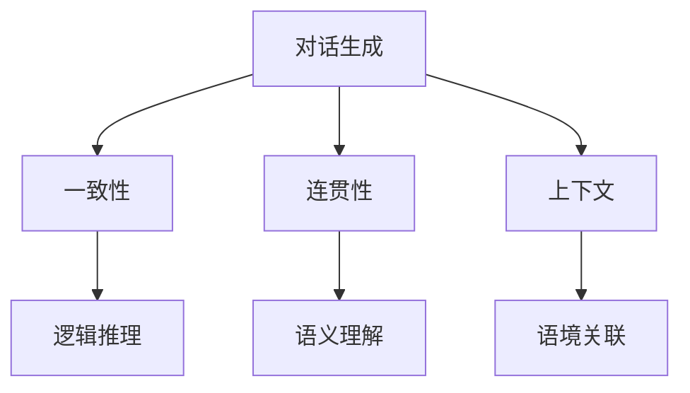
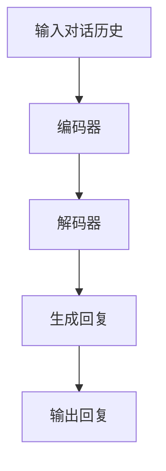
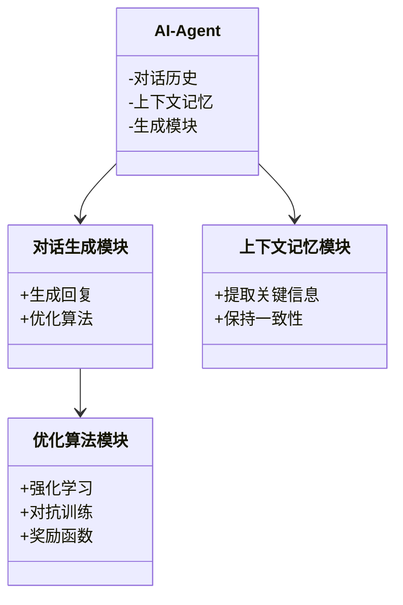

                 


# AI Agent的对话生成的一致性与连贯性优化

## 关键词：AI Agent, 对话生成, 一致性, 连贯性, 自然语言处理, 强化学习, 对抗训练

## 摘要：本文将深入探讨AI Agent在对话生成中的一致性和连贯性优化问题。通过分析对话生成的核心概念，介绍一致性与连贯性问题的表现形式及影响，结合算法原理和系统设计，提出优化策略。本文旨在帮助读者理解如何通过上下文理解、语义分析和逻辑推理等技术手段，提升AI Agent对话生成的自然性和流畅性。

---

## 第1章: AI Agent的概述

### 1.1 AI Agent的基本概念

#### 1.1.1 什么是AI Agent

AI Agent（人工智能代理）是指能够感知环境、执行任务并做出决策的智能实体。在对话生成领域，AI Agent通常以自然语言处理技术为基础，通过理解用户输入、生成回复并保持对话的连贯性，模拟人类对话的交互方式。

#### 1.1.2 AI Agent的核心特点

- **智能性**：AI Agent能够理解和生成自然语言，具备一定的语义理解和推理能力。
- **自主性**：AI Agent可以在没有外部干预的情况下，独立完成对话生成任务。
- **交互性**：AI Agent能够通过对话与用户进行实时交互，提供个性化服务。
- **适应性**：AI Agent能够根据对话上下文动态调整生成内容，以保持对话的一致性和连贯性。

#### 1.1.3 AI Agent的应用场景

AI Agent在多个领域有广泛应用，如智能客服、虚拟助手、智能音箱等。在这些场景中，AI Agent需要与用户进行高效、自然的对话交互，因此对话生成的质量直接影响用户体验。

---

### 1.2 对话生成的基本原理

#### 1.2.1 对话生成的定义

对话生成是指AI Agent根据当前对话上下文，生成符合语法规则和语义要求的回复。其核心目标是让生成的回复既符合上下文，又能准确传达信息。

#### 1.2.2 对话生成的关键技术

- **自然语言处理（NLP）**：通过对文本进行分词、句法分析和语义理解，提取对话上下文的关键信息。
- **序列生成模型**：基于序列到序列（seq2seq）的神经网络模型，如Transformer，生成连贯的对话回复。
- **上下文记忆机制**：通过记忆模块保存对话历史信息，确保生成的回复与上下文一致。

#### 1.2.3 对话生成的挑战与目标

- **挑战**：对话生成需要处理歧义、上下文依赖性强、生成回复的多样性和不确定性等问题。
- **目标**：生成符合上下文、语义准确、语法规范且自然流畅的对话回复。

---

## 第2章: 对话生成的一致性与连贯性问题

### 2.1 一致性问题

#### 2.1.1 一致性问题的定义

一致性问题是指生成的对话回复在内容、语义和逻辑上与对话历史保持一致，避免出现前后矛盾或信息冲突。

#### 2.1.2 一致性问题的表现形式

- **信息矛盾**：生成的回复与之前的信息相矛盾，例如在对话中提到“我今天没时间”，但后续回复却提到“我有空参加聚会”。
- **主题偏离**：生成的回复偏离当前对话的主题，导致对话逻辑混乱。
- **上下文忽略**：生成的回复未充分考虑对话历史中的关键信息，导致回复内容不连贯。

#### 2.1.3 一致性问题的影响

一致性问题会导致对话体验下降，用户可能认为AI Agent的回答不够专业或不够智能，从而降低用户满意度和信任度。

---

### 2.2 连贯性问题

#### 2.2.1 连贯性问题的定义

连贯性问题是指生成的对话回复在逻辑、语义和语境上环环相扣，确保对话的流畅性和自然性。

#### 2.2.2 连贯性问题的表现形式

- **逻辑跳跃**：生成的回复缺乏逻辑联系，例如从“我今天很忙”突然转到“我最喜欢的颜色是蓝色”。
- **语义断裂**：生成的回复在语义上缺乏衔接，导致对话中断或难以理解。
- **语境缺失**：生成的回复未充分考虑当前对话的语境，导致回复内容与当前对话不相关。

#### 2.2.3 连贯性问题的影响

连贯性问题会降低对话的自然性和流畅性，用户可能感到对话缺乏逻辑性或不连贯，从而影响用户体验。

---

## 第3章: AI Agent对话生成的核心概念与联系

### 3.1 核心概念原理

#### 3.1.1 对话生成的上下文理解

AI Agent需要通过上下文理解模块，提取对话历史中的关键信息，确保生成的回复与当前对话内容保持一致。

#### 3.1.2 对话生成的语义理解

语义理解模块通过分析对话内容，理解用户的意图和情感倾向，生成符合用户需求的回复。

#### 3.1.3 对话生成的逻辑推理

逻辑推理模块通过对对话历史的分析，推理出下一步的回复内容，确保对话的连贯性和一致性。

### 3.2 概念属性特征对比表格

| 概念       | 属性       | 特征                                                                 |
|------------|------------|----------------------------------------------------------------------|
| 对话生成    | 一致性     | 前后一致、逻辑一致、信息一致                                         |
|            | 连贯性     | 环环相扣、逻辑连贯、语义连贯                                         |
|            | 上下文     | 相关性、一致性、动态性                                                 |

### 3.3 ER实体关系图



---

## 第4章: 对话生成的算法原理

### 4.1 基于Transformer的对话生成模型

#### 4.1.1 Transformer模型的基本结构

Transformer模型由编码器和解码器组成，编码器负责将输入序列编码为一个向量，解码器根据编码结果生成输出序列。

#### 4.1.2 对话生成的解码过程

解码器通过自注意力机制和位置编码，逐步生成对话回复，确保生成的回复与输入序列保持一致。

#### 4.1.3 基于注意力机制的改进

通过引入多头注意力机制，模型可以更好地捕捉对话历史中的关键信息，提升对话生成的一致性和连贯性。

### 4.2 对话生成的优化算法

#### 4.2.1 基于强化学习的优化

通过引入强化学习，模型可以通过奖励机制，优化生成的回复，提升对话的一致性和连贯性。

#### 4.2.2 基于对抗训练的优化

通过对抗训练，生成模型和判别模型相互对抗，提升生成回复的质量和一致性。

#### 4.2.3 基于奖励函数的优化

通过设计合适的奖励函数，模型可以更有效地优化生成回复，确保对话的一致性和连贯性。

### 4.3 算法流程图



---

## 第5章: 系统分析与架构设计方案

### 5.1 项目背景

本项目旨在通过优化AI Agent的对话生成算法，提升对话的一致性和连贯性，提供更流畅的用户体验。

### 5.2 系统功能设计

#### 5.2.1 系统功能模型



#### 5.2.2 系统架构设计


---

## 第6章: 项目实战

### 6.1 环境安装

需要安装以下环境和工具：

- Python 3.8+
- TensorFlow或PyTorch
- transformers库
- mermaid CLI

### 6.2 系统核心实现源代码

```python
import torch
from transformers import AutoModelForSeq2Seq, AutoTokenizer

class DialogGenerator:
    def __init__(self, model_name):
        self.model = AutoModelForSeq2Seq.from_pretrained(model_name)
        self.tokenizer = AutoTokenizer.from_pretrained(model_name)
    
    def generate(self, input_text):
        inputs = self.tokenizer.encode(input_text, return_tensors="pt")
        outputs = self.model.generate(inputs, max_length=50)
        return self.tokenizer.decode(outputs[0], skip_special_tokens=True)
```

### 6.3 代码应用解读与分析

上述代码实现了一个基于预训练模型的对话生成器，通过编码器和解码器生成连贯的对话回复。

---

## 第7章: 总结与优化策略

### 7.1 总结

本文深入探讨了AI Agent在对话生成中的一致性和连贯性优化问题，结合算法原理和系统设计，提出了优化策略。

### 7.2 优化策略

- **算法优化**：进一步优化强化学习和对抗训练算法，提升生成回复的质量。
- **系统优化**：通过改进上下文记忆模块，提升对话生成的一致性和连贯性。
- **用户体验优化**：通过引入用户反馈机制，进一步优化对话生成算法。

### 7.3 注意事项

- 对话生成算法的优化需要结合具体场景，避免过度优化导致性能下降。
- 在实际应用中，需要考虑模型的计算资源消耗和响应速度。

### 7.4 拓展阅读

- Transformer模型的改进与应用
- 强化学习在对话生成中的应用
- 对抗训练在自然语言处理中的应用

---

通过以上内容，读者可以全面了解AI Agent对话生成的一致性和连贯性优化问题，并掌握相关的算法和系统设计方法。

